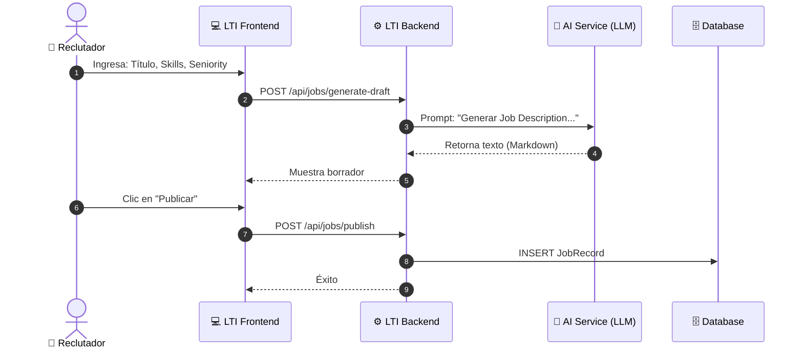
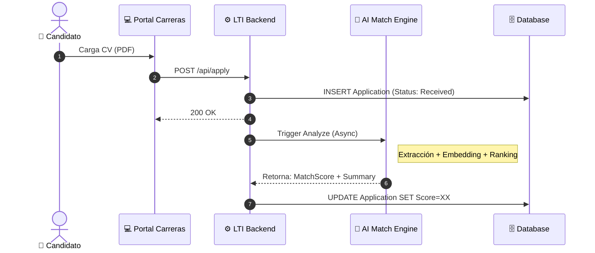
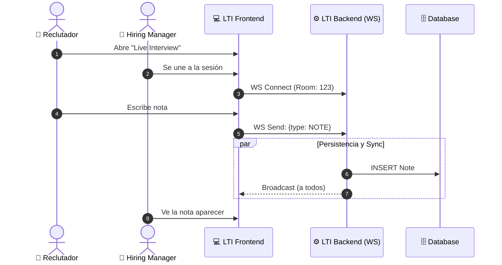
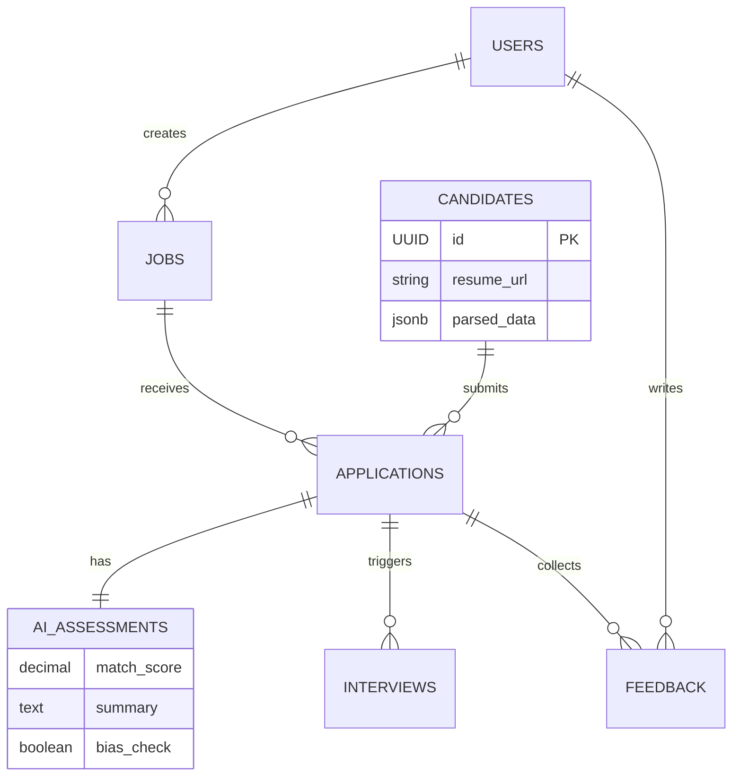
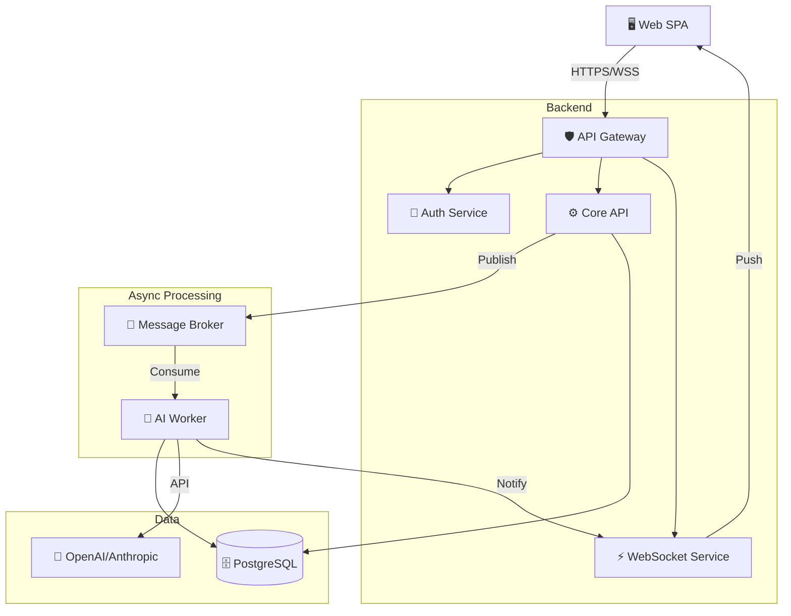
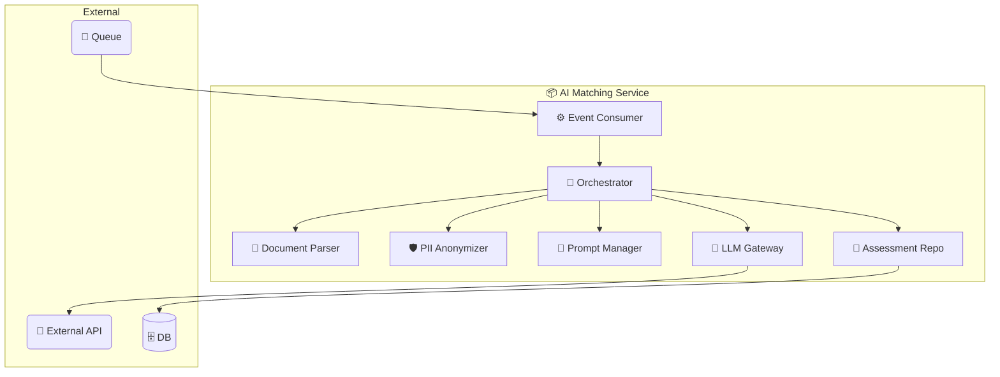

# LTI (Live Talent Intelligence) - Documentación de Diseño

## 1. Descripción del Producto y Valor Añadido

**LTI** es un Sistema Operativo de Talento de próxima generación diseñado para transformar el reclutamiento de un proceso administrativo a una ventaja estratégica competitiva. Utiliza una arquitectura "AI-First" y colaboración en tiempo real para eliminar la fricción entre departamentos.

**Valor Añadido y Ventajas Competitivas:**
* **Centralización Radical:** Todo el ciclo de vida ocurre en la plataforma, eliminando emails y hojas de cálculo.
* **Colaboración Síncrona:** "Talent War Room" permite a reclutadores y managers evaluar y votar candidatos en vivo (estilo Google Docs).
* **Arquitectura "AI-First":** La IA no es un plugin; es el núcleo que gestiona el screening, agenda entrevistas y redacta feedback.
* **Equidad Algorítmica:** Motores de búsqueda semántica con "Bias Shield" para reducir sesgos inconscientes.
* **Experiencia Transparente:** Portales de estado en tiempo real para candidatos.

---

## 2. Funcionalidades Principales

1.  **Talent War Room:** Espacio de trabajo compartido para evaluación de perfiles en tiempo real con chat y votación en vivo.
2.  **LTI Autopilot:** Agentes autónomos que negocian calendarios y redactan correos de rechazo o feedback personalizados.
3.  **Smart-Rank con Bias Shield:** Matching semántico (no por keywords) que oculta datos sensibles (nombre, foto) en fases iniciales.
4.  **Generador de Ofertas Dinámico:** Creación, negociación y firma legal de ofertas dentro de la plataforma.
5.  **Predictive Hiring Health:** Analítica que predice cuellos de botella y tiempos de contratación futuros.

---

## 3. Lean Canvas

| Sección | Detalle |
| :--- | :--- |
| **Problema** | • Contratación lenta y burocrática. • Silos de comunicación entre HR y Managers. • Tareas manuales repetitivas. • Mala experiencia del candidato. |
| **Segmentos** | • Startups High-Growth (Series A/B). • Empresas Mid-Market (50-500 empleados). • Agencias de Reclutamiento. |
| **Propuesta de Valor** | **"Contrata al mejor talento en la mitad de tiempo, juntos."** Colaboración en tiempo real + Automatización de IA ética. |
| **Solución** | • SaaS ATS Colaborativo. • IA Integrada (Screening/Scheduling). • Mobile First para managers. |
| **Canales** | • Marketing de Contenidos (Hiring Culture). • Ventas Directas B2B. • Marketplaces (Slack/Teams). |
| **Ingresos** | • Suscripción SaaS B2B (por usuario/vacante). • Freemium para pequeñas empresas. • Enterprise (Custom). |
| **Costos** | • Desarrollo e Infraestructura Cloud (AWS/Azure). • Consumo de APIs LLM (OpenAI). • CAC (Ventas y Marketing). |
| **Métricas Clave** | • Time-to-Hire. • NPS (Recruiter & Candidate). • Automation Rate. |
| **Ventaja Injusta** | • Algoritmo de "Cultural Fit" basado en retención. • UX de consumo masivo (cero curva de aprendizaje). |

---

## 4. Casos de Uso Principales

### Caso 1: Publicación de Oferta con "Generative AI"
El reclutador ingresa parámetros básicos y el sistema genera una Job Description optimizada, permitiendo refinamiento antes de publicar.

### Caso 2: Smart-Rank (Filtrado Automático)
El sistema recibe el CV, lo procesa asíncronamente con IA para extraer entidades y compararlas semánticamente con la vacante, generando un score de compatibilidad.

### Caso 3: Entrevista Colaborativa (War Room)
Reclutador y Manager comparten una sesión en vivo donde las notas y calificaciones se sincronizan instantáneamente mediante WebSockets.

---

## 5. Modelo de Datos

### Entidades Principales

- **Users:** (Reclutadores, Managers, Admins).
- **Jobs:** Vacantes con descripciones enriquecidas.
- **Candidates:** Perfiles con metadatos parseados (JSONB).
- **Applications:** Tabla transaccional (Candidato <-> Vacante).
- **AI_Assessments:** Resultados del análisis de IA (Score, Summary).
- **Interviews:** Eventos de calendario.
- **Feedback:** Evaluaciones colaborativas.

### Diagrama Entidad-Relación (ERD)

---

## 6. Diseño del Sistema (Alto Nivel)

Arquitectura: Microservicios Orientados a Eventos. Se utiliza un bus de mensajes para desacoplar las tareas pesadas de IA (OCR, Embeddings) de la experiencia de usuario, y WebSockets para la colaboración en tiempo real.

---

## 7. Diagrama C4: Componente (AI Matching Engine)

Zoom-in al funcionamiento interno del worker de IA, mostrando el flujo de tuberías y filtros para procesar candidatos.

