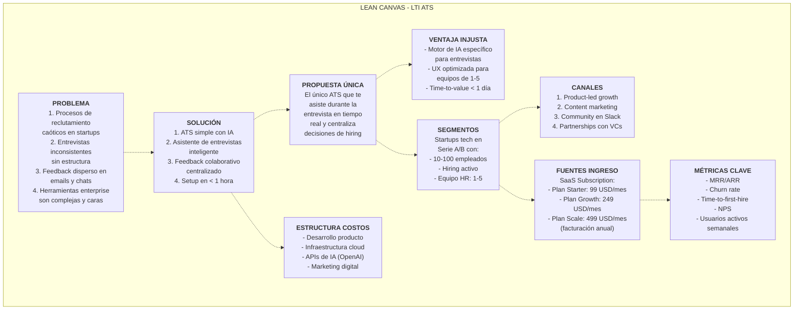
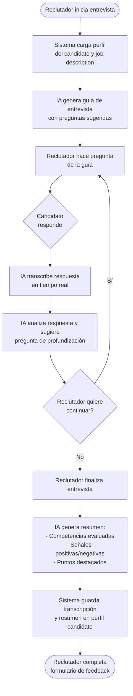
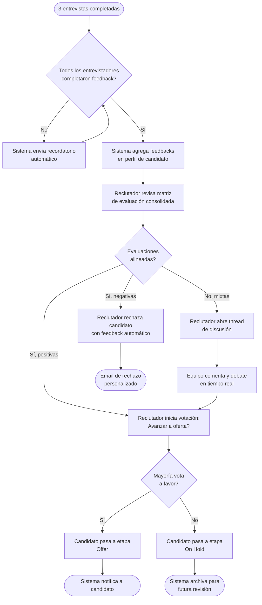
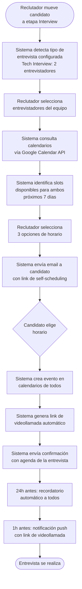
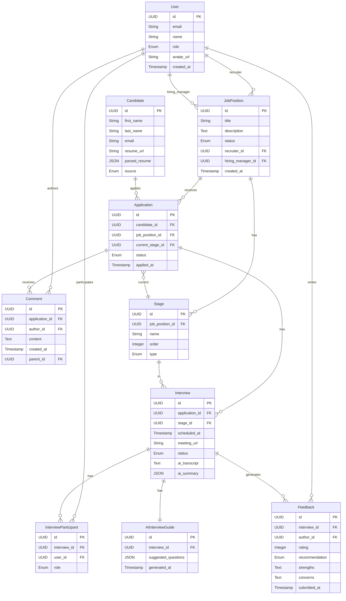
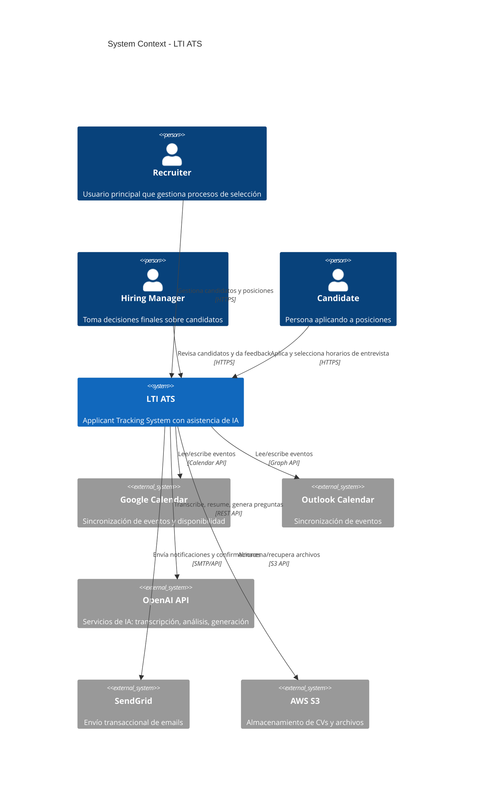
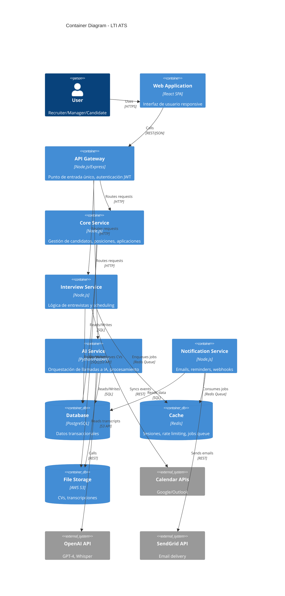
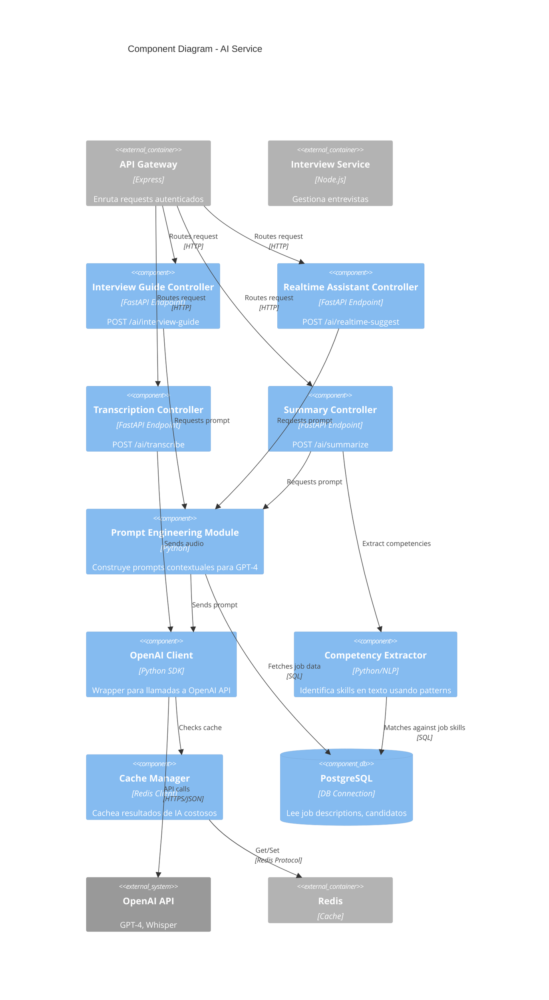
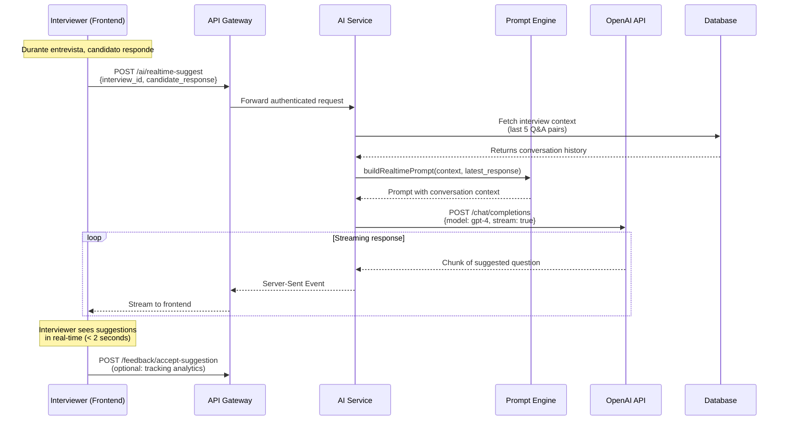

# LTI - Applicant Tracking System

## 1. Resumen ejecutivo

LTI es un ATS diseñado específicamente para **startups en fase de crecimiento** con equipos de reclutamiento pequeños (1-5 personas). El producto combina la simplicidad operativa que necesitan equipos ágiles con capacidades avanzadas de IA para asistencia en entrevistas.

### Propuesta de valor

- **Reducción del tiempo de contratación en 40%** mediante automatización inteligente de tareas repetitivas y asistencia de IA durante entrevistas.
- **Decisiones de contratación más objetivas** gracias al sistema de feedback colaborativo estructurado.
- **Onboarding en menos de 1 hora** - diseñado para equipos que no tienen tiempo para configuraciones complejas.

### Ventajas competitivas

1. **IA Interview Assistant**: Primer ATS que asiste activamente durante la entrevista con preguntas contextuales y captura automática de notas.
2. **Colaboración sin fricción**: Sistema de feedback que elimina emails y hojas de cálculo, diseñado para decisiones rápidas.
3. **Precio accesible para startups**: Modelo SaaS simple sin costos ocultos ni barreras de entrada.

---

## 2. Funciones principales

### Gestión de candidatos
- Pipeline visual personalizable por posición con drag & drop.
- Perfiles de candidatos unificados (CV parseado + historial de interacciones).
- Importación masiva de CVs con parsing automático.
- Búsqueda y filtrado avanzado por skills, experiencia, educación.

### Gestión de posiciones
- Creación y publicación de ofertas de trabajo.
- Estados del proceso de selección configurables por posición.
- Asignación de responsables (reclutador + hiring manager).

### Asistencia de IA en entrevistas
- **Generación de guías de entrevista** basadas en la descripción del puesto.
- **Asistente en tiempo real** que sugiere preguntas de profundización según respuestas del candidato.
- **Transcripción y resumen automático** de entrevistas.
- **Extracción de competencias evaluadas** y señales positivas/negativas.

### Sistema de feedback colaborativo
- Formularios de evaluación post-entrevista estructurados.
- Matriz de comparación de candidatos.
- Comentarios y conversaciones por candidato.
- Sistema de votación para decisiones finales.

### Programación de entrevistas
- Integración bidireccional con Google Calendar y Outlook.
- Disponibilidad automática de entrevistadores.
- Envío automático de invitaciones con enlaces de videollamada.
- Recordatorios automáticos.

### Reportes y analytics
- Métricas clave: tiempo de contratación, tasa de conversión por etapa, fuentes de candidatos.
- Dashboard ejecutivo con estado de todas las posiciones activas.

---

## 3. Lean Canvas



### Explicación del modelo

**Problema**: Startups con equipos pequeños sufren procesos de reclutamiento desorganizados. Las herramientas enterprise (Greenhouse, Lever) son sobredimensionadas y caras. Las entrevistas carecen de estructura y el feedback se pierde en emails.

**Solución**: ATS ligero con IA integrada que asiste durante entrevistas, centraliza feedback y permite setup rápido sin consultores.

**Propuesta única**: Ningún ATS actual asiste en tiempo real durante la entrevista. LTI combina simplicidad operativa con IA contextual.

**Segmentos**: Startups tech (Serie A/B) con crecimiento activo que necesitan contratar rápido pero no tienen procesos maduros de HR.

**Canales**: Crecimiento liderado por producto (freemium/trial), contenido educativo sobre hiring, y partnerships con VCs que recomiendan a sus portfolio companies.

**Ingresos**: Modelo SaaS con tres tiers según volumen de contratación y features avanzados (analytics, integraciones enterprise).

**Métricas**: Foco en retención (churn), adopción real (usuarios activos) y value delivery (reducción tiempo de contratación).

---

## 4. Casos de uso principales

### Caso de uso 1: Conducir entrevista con asistencia de IA

**Descripción**: Un reclutador realiza una entrevista técnica con un candidato a desarrollador senior. Durante la conversación, el AI Interview Assistant sugiere preguntas de profundización, toma notas automáticamente y genera un resumen estructurado al finalizar.

**Actores**: Reclutador, Candidato, Sistema de IA

**Flujo**:



**Valor**: Reduce tiempo de preparación de entrevistas en 80%, elimina toma manual de notas, y estandariza evaluaciones.

---

### Caso de uso 2: Toma de decisión colaborativa sobre candidato

**Descripción**: Después de que 3 personas entrevistan a un candidato (reclutador, tech lead, founder), el equipo necesita decidir si avanzar a oferta. El sistema centraliza todos los feedbacks y facilita la decisión.

**Actores**: Reclutador, Hiring Manager, Entrevistadores, Sistema

**Flujo**:



**Valor**: Elimina emails de "qué te pareció X candidato", reduce tiempo de decisión de días a horas, y documenta el razonamiento.

---

### Caso de uso 3: Programar entrevista con sincronización de calendarios

**Descripción**: Un reclutador necesita agendar una entrevista técnica con disponibilidad de 2 entrevistadores internos y el candidato. El sistema encuentra slots compatibles automáticamente.

**Actores**: Reclutador, Candidato, Entrevistadores, Integración de Calendario

**Flujo**:



**Valor**: Reduce emails de coordinación de 8-12 a cero, elimina scheduling de 2 días a 2 minutos, y previene no-shows con recordatorios.

---

## 5. Modelo de datos

### Entidades principales

#### **User**
- `id`: UUID (PK)
- `email`: String (unique)
- `name`: String
- `role`: Enum (Admin, Recruiter, Hiring Manager, Interviewer)
- `avatar_url`: String (nullable)
- `created_at`: Timestamp
- `last_login`: Timestamp

#### **JobPosition**
- `id`: UUID (PK)
- `title`: String
- `description`: Text
- `department`: String
- `employment_type`: Enum (Full-time, Part-time, Contract)
- `seniority`: Enum (Junior, Mid, Senior, Lead)
- `status`: Enum (Draft, Active, Paused, Closed)
- `recruiter_id`: UUID (FK → User)
- `hiring_manager_id`: UUID (FK → User)
- `created_at`: Timestamp
- `closed_at`: Timestamp (nullable)

#### **Candidate**
- `id`: UUID (PK)
- `first_name`: String
- `last_name`: String
- `email`: String (unique)
- `phone`: String (nullable)
- `linkedin_url`: String (nullable)
- `resume_url`: String
- `parsed_resume`: JSON (skills, experience, education)
- `source`: Enum (LinkedIn, Referral, Direct, Agency)
- `created_at`: Timestamp

#### **Application**
- `id`: UUID (PK)
- `candidate_id`: UUID (FK → Candidate)
- `job_position_id`: UUID (FK → JobPosition)
- `current_stage_id`: UUID (FK → Stage)
- `applied_at`: Timestamp
- `last_activity`: Timestamp
- `status`: Enum (Active, Hired, Rejected, Withdrawn)

#### **Stage**
- `id`: UUID (PK)
- `job_position_id`: UUID (FK → JobPosition)
- `name`: String (ej: "Phone Screen", "Technical", "Final")
- `order`: Integer
- `type`: Enum (Review, Interview, Assignment, Offer)

#### **Interview**
- `id`: UUID (PK)
- `application_id`: UUID (FK → Application)
- `stage_id`: UUID (FK → Stage)
- `scheduled_at`: Timestamp
- `duration_minutes`: Integer
- `meeting_url`: String (nullable)
- `calendar_event_id`: String (ID externo de Google Calendar)
- `status`: Enum (Scheduled, Completed, Cancelled, No-show)
- `ai_transcript`: Text (nullable)
- `ai_summary`: JSON (nullable)

#### **InterviewParticipant**
- `id`: UUID (PK)
- `interview_id`: UUID (FK → Interview)
- `user_id`: UUID (FK → User)
- `role`: Enum (Interviewer, Observer)

#### **Feedback**
- `id`: UUID (PK)
- `interview_id`: UUID (FK → Interview)
- `author_id`: UUID (FK → User)
- `rating`: Integer (1-5)
- `recommendation`: Enum (Strong Yes, Yes, Maybe, No, Strong No)
- `strengths`: Text
- `concerns`: Text
- `notes`: Text
- `submitted_at`: Timestamp

#### **Comment**
- `id`: UUID (PK)
- `application_id`: UUID (FK → Application)
- `author_id`: UUID (FK → User)
- `content`: Text
- `created_at`: Timestamp
- `parent_id`: UUID (FK → Comment, nullable, para threads)

#### **AIInterviewGuide**
- `id`: UUID (PK)
- `interview_id`: UUID (FK → Interview)
- `suggested_questions`: JSON (array de objetos con pregunta y contexto)
- `generated_at`: Timestamp

### Diagrama Entidad-Relación



---

## 6. Diseño del sistema (Arquitectura general)

### Visión de alto nivel

LTI sigue una arquitectura de **microservicios ligera** con separación clara entre frontend, backend API, servicios de IA, y integraciones externas. El sistema está diseñado para escalar horizontalmente y prioriza la modularidad.

### Principios arquitectónicos

1. **API-first**: Toda funcionalidad expuesta vía REST API documentada.
2. **Event-driven para async**: Notificaciones, emails y procesamiento de IA mediante eventos.
3. **Stateless services**: Permite scaling horizontal sin complejidad.
4. **External AI providers**: Uso de OpenAI API en lugar de modelos propios (MVP).

### Diagrama C4 - Nivel 1 (Contexto del Sistema)



### Diagrama C4 - Nivel 2 (Contenedores)



### Descripción de contenedores

**Web Application (React SPA)**:
- Interfaz de usuario moderna con React + TypeScript.
- Tailwind CSS para estilos, React Query para state management.
- WebSocket connection para updates en tiempo real (comentarios, notificaciones).

**API Gateway**:
- Autenticación JWT con refresh tokens.
- Rate limiting y validación de requests.
- Routing a microservicios internos.

**Core Service**:
- CRUD de entidades principales: Users, Candidates, Applications, JobPositions.
- Lógica de negocio para pipeline de candidatos.
- Parsing de CVs usando librerías especializadas.

**Interview Service**:
- Scheduling de entrevistas con integración de calendarios.
- Gestión de disponibilidad y conflicts.
- Generación de links de videollamada (Google Meet via API).

**AI Service**:
- Orquestación de llamadas a OpenAI (GPT-4 para generación, Whisper para transcripción).
- Generación de guías de entrevista basadas en job description.
- Análisis de transcripciones para extracción de competencias.
- Resúmenes automáticos de entrevistas.

**Notification Service**:
- Worker que procesa cola de eventos (Redis Queue).
- Templates de emails transaccionales.
- Recordatorios automáticos 24h y 1h antes de entrevistas.

**Database (PostgreSQL)**:
- Almacenamiento relacional para entidades del dominio.
- Índices optimizados para queries frecuentes (búsqueda de candidatos).

**Cache (Redis)**:
- Sesiones de usuario.
- Job queue para tareas asíncronas.
- Rate limiting data.

---

## 7. Profundización: AI Service

### Responsabilidad

El **AI Service** es el componente diferenciador de LTI. Su función principal es **asistir en tiempo real durante entrevistas** y **generar insights automáticos** para reducir carga cognitiva de reclutadores.

### Funcionalidades clave

1. **Generación de guías de entrevista**: Basado en job description y perfil del candidato, genera preguntas estructuradas por competencia.
2. **Transcripción en tiempo real**: Convierte audio de entrevista a texto usando Whisper API.
3. **Sugerencias contextuales**: Analiza respuestas del candidato y sugiere follow-up questions.
4. **Resumen automático**: Al finalizar, genera reporte estructurado con competencias evaluadas, señales positivas/negativas, y recomendaciones.
5. **Extracción de competencias**: Identifica skills técnicos y soft skills mencionados durante la entrevista.

### Diagrama C4 - Nivel 3 (Componentes del AI Service)



### Descripción de componentes

#### **Interview Guide Controller**
- **Input**: `interview_id`, opcionalmente `focus_areas` (ej: "leadership", "system design")
- **Output**: JSON con array de preguntas categorizadas por competencia
- **Lógica**:
  1. Obtiene job description y perfil del candidato de DB.
  2. Construye prompt usando Prompt Engine.
  3. Llama a GPT-4 para generar 8-12 preguntas estructuradas.
  4. Cachea resultado por 24h (las guías no cambian frecuentemente).

#### **Realtime Assistant Controller**
- **Input**: `interview_id`, `candidate_last_response` (texto transcrito)
- **Output**: JSON con 2-3 follow-up questions sugeridas
- **Lógica**:
  1. Recupera contexto de la conversación actual (últimas 5 preguntas/respuestas).
  2. Analiza respuesta con GPT-4 identificando señales de profundización.
  3. Genera preguntas de follow-up contextuales.
  4. **Streaming response** para baja latencia (Server-Sent Events).

#### **Transcription Controller**
- **Input**: Audio file (upload) o audio stream (WebSocket)
- **Output**: Texto transcrito con timestamps
- **Lógica**:
  1. Valida formato de audio (MP3, WAV, WebM).
  2. Envía a Whisper API de OpenAI.
  3. Procesa response y segmenta por speaker si es posible (usando diarization básico).
  4. Retorna JSON con array de segments: `{speaker, text, timestamp}`.

#### **Summary Controller**
- **Input**: `interview_id`
- **Output**: JSON con estructura:
  ```json
  {
    "overall_impression": "string",
    "competencies_evaluated": [
      {"name": "Problem Solving", "rating": 4, "evidence": "..."}
    ],
    "strengths": ["..."],
    "concerns": ["..."],
    "recommendation": "Yes | Maybe | No",
    "key_quotes": ["..."]
  }
  ```
- **Lógica**:
  1. Obtiene transcripción completa de la entrevista.
  2. Extrae competencias con Competency Extractor.
  3. Construye prompt de análisis con job description como referencia.
  4. GPT-4 genera resumen estructurado.
  5. Almacena resultado en `Interview.ai_summary` (JSON column).

#### **Prompt Engineering Module**
- Centraliza construcción de prompts para consistencia.
- Usa templates con variables: `{job_title}`, `{candidate_name}`, `{years_experience}`, etc.
- Implementa few-shot examples para mejorar calidad de outputs.
- Ejemplo de template para guía:
  ```
  You are an expert technical interviewer hiring for a {job_title} position.

  Job Description:
  {job_description}

  Candidate Background:
  {candidate_summary}

  Generate 10 interview questions that:
  1. Assess core competencies: {required_skills}
  2. Are behavior-based (STAR format)
  3. Include follow-up probes
  4. Range from technical to cultural fit

  Format as JSON array with: question, competency, difficulty_level
  ```

#### **OpenAI Client**
- Wrapper robusto con retry logic (exponential backoff).
- Manejo de rate limits de OpenAI API.
- Logging de uso para tracking de costos.
- Fallback a cache si API está caída (para queries repetitivas).

#### **Competency Extractor**
- Usa regex patterns + keyword matching para identificar skills técnicos en transcripciones.
- Database de 500+ skills comunes en tech (ej: "React", "Kubernetes", "agile methodology").
- Scoring basado en frecuencia y contexto de mención.
- Output: `[{skill: "React", mentions: 3, context: "Used React hooks extensively"}]`

#### **Cache Manager**
- Cachea resultados costosos:
  - Interview guides (TTL: 24h)
  - Summaries ya generados (no expiración)
  - Transcripciones procesadas (TTL: 7 días)
- Key structure: `ai:{type}:{entity_id}` (ej: `ai:guide:interview-123`)
- Reduce costos de OpenAI API en 30-40% para queries repetidas.

### Flujo de datos ejemplo: Asistencia en tiempo real



### Consideraciones de escalabilidad

- **Async processing**: Summaries y transcripciones largas se procesan en background jobs.
- **Rate limiting**: Max 10 requests/min por interview para proteger costos de OpenAI.
- **Cost optimization**: Usar GPT-3.5-turbo para tareas simples (follow-up suggestions), GPT-4 solo para generation y summaries.
- **Monitoring**: Track tokens consumidos, latencia de OpenAI, y cache hit rate.

### Seguridad y privacidad

- Transcripciones encriptadas en reposo (S3 encryption).
- No se almacenan conversaciones indefinidamente: TTL de 90 días después de cierre de posición.
- Candidatos pueden solicitar eliminación de datos (GDPR compliance).
- No se entrena modelo custom con datos de clientes (uso de OpenAI API directamente).

---

## Conclusión

LTI está diseñado para ser el **ATS más eficiente para startups en crecimiento**, combinando simplicidad operativa con asistencia de IA avanzada. El MVP se enfoca en:

1. **Reducir fricción** en procesos de reclutamiento caóticos.
2. **Asistir activamente** durante entrevistas con IA contextual.
3. **Centralizar decisiones** mediante feedback colaborativo.
4. **Integrar calendarios** para eliminar coordinación manual.

La arquitectura modular permite iterar rápidamente en funcionalidades de IA mientras se mantiene un core sólido de gestión de candidatos. El modelo SaaS de suscripción asegura predictibilidad de ingresos y alineación de incentivos (más contrataciones exitosas = mayor retención).

**Next steps para desarrollo**:
1. Implementar Core Service + Database schema (semanas 1-2)
2. Integración básica con Google Calendar (semana 3)
3. MVP de AI Service con generación de guías (semana 4)
4. Frontend con pipeline visual y perfiles de candidatos (semanas 5-6)
5. Beta privada con 5 startups para feedback (semana 7)
