# LTI - Applicant Tracking System del Futuro
## Diseño de Sistema Completo


---

## 1. Descripción del Software LTI

### Visión
LTI (Leading Talent Intelligence) es el ATS del futuro que revoluciona el reclutamiento mediante inteligencia artificial, automatización inteligente y colaboración en tiempo real.

### Valor Añadido
- **IA Predictiva**: Análisis de compatibilidad candidato-puesto en tiempo real
- **Automatización Inteligente**: Screening automático con aprendizaje continuo
- **Colaboración Avanzada**: Workspace compartido con managers y stakeholders
- **Analytics Predictivo**: Insights sobre éxito de contrataciones y retención

### Ventajas Competitivas
1. **AI-First Approach**: IA integrada en cada proceso, no como add-on
2. **Real-time Collaboration**: Colaboración síncrona entre todos los stakeholders
3. **Predictive Analytics**: Anticipación de necesidades de talento
4. **Seamless Integration**: Conectividad nativa con sistemas empresariales
5. **Candidate Experience**: Journey personalizado y transparente

---

## 2. Funciones Principales del Sistema

### Core Functions
1. **Gestión de Vacantes**
   - Creación inteligente de job descriptions
   - Distribución automática en múltiples canales
   - Tracking de performance por canal

2. **Screening Inteligente**
   - Análisis automático de CVs con IA
   - Matching score en tiempo real
   - Pre-screening automatizado

3. **Pipeline Management**
   - Visualización avanzada del funnel
   - Predicción de conversiones
   - Optimización automática de procesos

4. **Collaboration Hub**
   - Workspace compartido por vacante
   - Comunicación integrada
   - Decision-making colaborativo

5. **Analytics & Reporting**
   - Dashboards predictivos
   - KPIs automáticos
   - Insights de mejora continua

### AI-Powered Features
- **Smart Matching**: IA que aprende de decisiones previas
- **Bias Detection**: Identificación automática de sesgos
- **Predictive Hiring**: Anticipación de necesidades
- **Automated Scheduling**: Coordinación inteligente de entrevistas

---

## 3. Lean Canvas (Visual)

```
┌─────────────────────────────────────────────────────────────┐
│                    LEAN CANVAS - LTI                        │
├─────────────────────────────────────────────────────────────┤
│ PROBLEMA                        │ SOLUCIÓN                  │
│ • Procesos de reclutamiento     │ • ATS con IA integrada    │
│   lentos y manuales             │ • Automatización          │
│ • Falta de colaboración         │   inteligente             │
│   entre stakeholders            │ • Workspace colaborativo  │
│ • Decisiones basadas en         │ • Analytics predictivo    │
│   intuición, no datos           │ • IA para matching        │
├─────────────────────────────────────────────────────────────┤
│ PROPUESTA DE VALOR              │ CANALES                   │
│ "El ATS que piensa como un      │ • SaaS B2B                │
│  reclutador experto"            │ • Freemium → Premium      │
│ • 50% más rápido en hiring      │ • Referral program        │
│ • 30% mejor quality of hire     │ • Content marketing       │
│ • 100% transparencia            │ • Sales direct            │
├─────────────────────────────────────────────────────────────┤
│ SEGMENTOS DE CLIENTES           │ FUENTES DE INGRESOS       │
│ • Startups (10-100 empleados)   │ • Subscription SaaS       │
│ • Scale-ups (100-1000)          │ • Tier pricing            │
│ • Enterprise (1000+)            │ • Implementation fees     │
│ • HR Agencies                   │ • Training & Support      │
│ • Recruiters independientes     │ • API access              │
├─────────────────────────────────────────────────────────────┤
│ COSTOS ESTRUCTURALES            │ RECURSOS CLAVE            │
│ • Desarrollo de IA/ML           │ • Equipo de IA/ML         │
│ • Infraestructura cloud         │ • Data scientists         │
│ • Sales & Marketing             │ • HR domain experts       │
│ • Customer Success              │ • Cloud infrastructure    │
│ • Legal & Compliance            │ • AI/ML models            │
├─────────────────────────────────────────────────────────────┤
│ ACTIVIDADES CLAVE               │ ASOCIACIONES CLAVE        │
│ • Desarrollo continuo de IA     │ • Job boards (Indeed,     │
│ • Data collection & training    │   LinkedIn)               │
│ • Customer onboarding           │ • HRIS providers          │
│ • Product iteration             │ • Background check        │
│ • Compliance management         │   services                │
│                                 │ • Assessment platforms    │
└─────────────────────────────────────────────────────────────┘
```

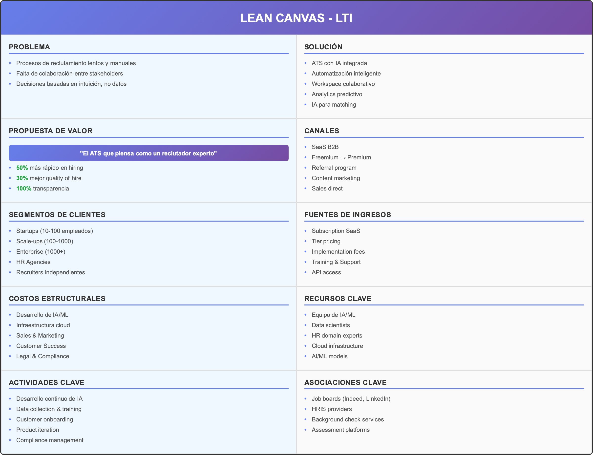

---

## 4. Casos de Uso Principales

### Caso de Uso 1: Creación y Publicación Inteligente de Vacante

**Actor Principal**: HR Manager / Recruiter  
**Objetivo**: Crear y publicar una vacante optimizada con IA

**Flujo Principal**:
1. HR Manager inicia creación de vacante
2. Sistema sugiere job description basada en historial
3. IA analiza y optimiza requisitos
4. Sistema distribuye automáticamente en canales relevantes
5. Tracking automático de performance por canal

**Diagrama (PlantUML Use Case):**
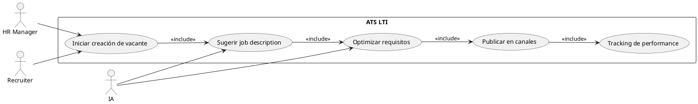

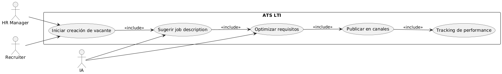

### Caso de Uso 2: Screening Inteligente de Candidatos

**Actor Principal**: AI System + Recruiter  
**Objetivo**: Evaluar automáticamente candidatos y priorizar los mejores

**Flujo Principal**:
1. Candidato aplica a vacante
2. IA analiza CV y genera matching score
3. Sistema categoriza candidato (A/B/C)
4. Recruiter recibe lista priorizada
5. Sistema programa entrevistas automáticamente

**Diagrama (PlantUML Use Case):**
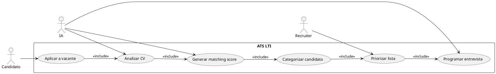

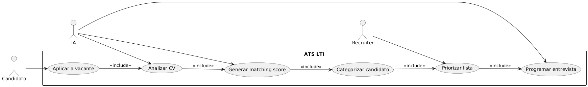

### Caso de Uso 3: Colaboración en Tiempo Real

**Actor Principal**: Hiring Team (Recruiter, Hiring Manager, Stakeholders)  
**Objetivo**: Tomar decisiones colaborativas sobre candidatos

**Flujo Principal**:
1. Recruiter comparte candidato con equipo
2. Stakeholders evalúan en workspace compartido
3. Sistema agrega feedback y scores
4. IA sugiere decisión basada en criterios
5. Decisión final se registra y notifica

**Diagrama (PlantUML Use Case):**
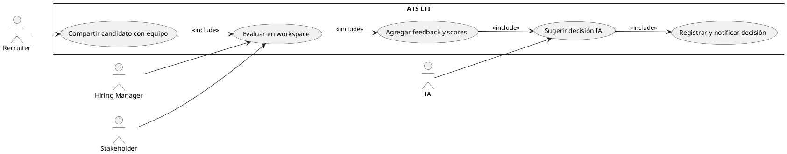

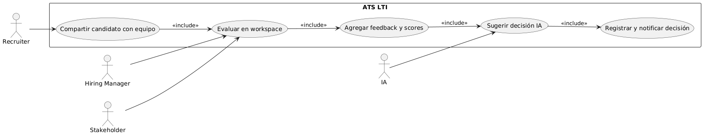

---

## 5. Modelo de Datos

### Entidades Principales

#### 1. User
- **id** (UUID, PK)
- **email** (String, unique)
- **password_hash** (String)
- **first_name** (String)
- **last_name** (String)
- **role** (Enum: RECRUITER, HIRING_MANAGER, ADMIN, CANDIDATE)
- **company_id** (UUID, FK)
- **created_at** (Timestamp)
- **updated_at** (Timestamp)

#### 2. Company
- **id** (UUID, PK)
- **name** (String)
- **industry** (String)
- **size** (Enum: STARTUP, SCALEUP, ENTERPRISE)
- **subscription_plan** (Enum: FREEMIUM, BASIC, PREMIUM, ENTERPRISE)
- **created_at** (Timestamp)

#### 3. Job
- **id** (UUID, PK)
- **title** (String)
- **description** (Text)
- **requirements** (JSON)
- **location** (String)
- **salary_range** (JSON)
- **status** (Enum: DRAFT, PUBLISHED, CLOSED, FILLED)
- **company_id** (UUID, FK)
- **hiring_manager_id** (UUID, FK)
- **ai_optimized_description** (Text)
- **created_at** (Timestamp)
- **published_at** (Timestamp)

#### 4. Candidate
- **id** (UUID, PK)
- **email** (String)
- **first_name** (String)
- **last_name** (String)
- **phone** (String)
- **location** (String)
- **experience_years** (Integer)
- **current_company** (String)
- **linkedin_url** (String)
- **created_at** (Timestamp)

#### 5. Application
- **id** (UUID, PK)
- **candidate_id** (UUID, FK)
- **job_id** (UUID, FK)
- **status** (Enum: APPLIED, SCREENING, INTERVIEW, OFFER, HIRED, REJECTED)
- **ai_matching_score** (Float)
- **ai_category** (Enum: A, B, C)
- **applied_at** (Timestamp)
- **updated_at** (Timestamp)

#### 6. Resume
- **id** (UUID, PK)
- **candidate_id** (UUID, FK)
- **file_url** (String)
- **ai_extracted_data** (JSON)
- **skills** (JSON)
- **experience** (JSON)
- **education** (JSON)
- **uploaded_at** (Timestamp)

#### 7. Interview
- **id** (UUID, PK)
- **application_id** (UUID, FK)
- **interviewer_id** (UUID, FK)
- **type** (Enum: PHONE, VIDEO, ONSITE, TECHNICAL)
- **status** (Enum: SCHEDULED, COMPLETED, CANCELLED)
- **scheduled_at** (Timestamp)
- **duration_minutes** (Integer)
- **feedback** (Text)
- **score** (Integer)

#### 8. Collaboration
- **id** (UUID, PK)
- **application_id** (UUID, FK)
- **user_id** (UUID, FK)
- **feedback** (Text)
- **score** (Integer)
- **recommendation** (Enum: HIRE, MAYBE, REJECT)
- **created_at** (Timestamp)

#### 9. AI_Model
- **id** (UUID, PK)
- **name** (String)
- **version** (String)
- **type** (Enum: MATCHING, SCREENING, PREDICTIVE)
- **performance_metrics** (JSON)
- **last_trained** (Timestamp)
- **is_active** (Boolean)

### Relaciones (PlantUML ERD)

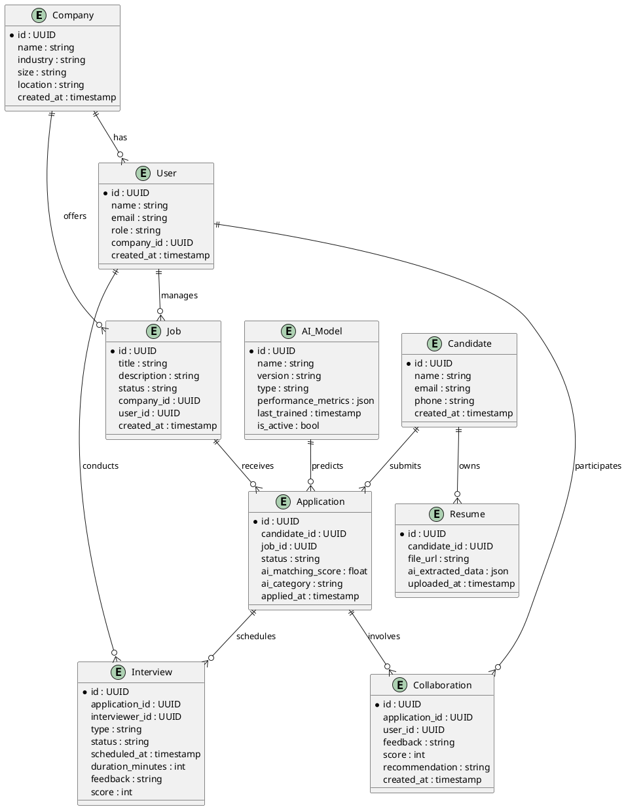


---

## 6. Diseño del Sistema a Alto Nivel

### Arquitectura General (PlantUML)

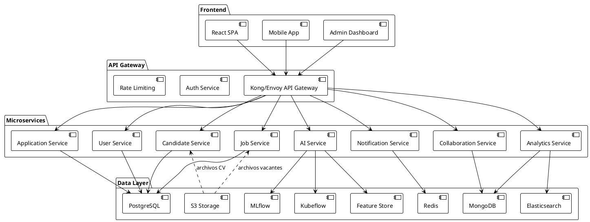

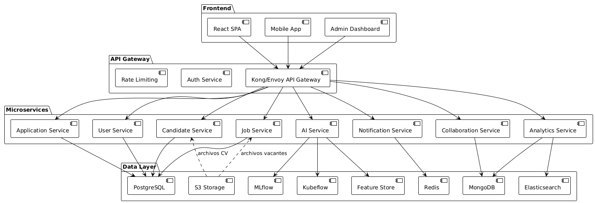

---

## 7. Diagrama C4 - Componente AI Service (PlantUML)

```plantuml
@startuml
!define C4P https://raw.githubusercontent.com/plantuml-stdlib/C4-PlantUML/master
!includeurl C4P/C4_Context.puml
!includeurl C4P/C4_Container.puml

LAYOUT_WITH_LEGEND()

' AI Service Containers
Container_Boundary(ai, "AI Service") {
  Container(api, "API Layer", "REST API", "Expone endpoints de IA")
  Container(match, "Matching API", "REST API", "Matching de candidatos")
  Container(screen, "Screening API", "REST API", "Screening de CVs")
  Container(pred, "Predictive API", "REST API", "Predicción de hiring")
  Container(pipe, "ML Pipeline", "Pipeline ML", "Orquestación de modelos")
  Container(feat, "Feature Extraction", "Python Service", "Extracción de features")
  Container(train, "Model Training", "Python Service", "Entrenamiento de modelos")
  Container(predeng, "Prediction Engine", "Python Service", "Inferencia de modelos")
  Container(data, "Data Layer", "DB/Storage", "Almacenamiento de datos IA")
  Container(fstore, "Feature Store", "DB", "Features persistentes")
  Container(mreg, "Model Registry", "DB", "Registro de modelos")
  Container(tdstore, "Training Data Store", "DB", "Datos de entrenamiento")
}

Rel(api, match, "Llama")
Rel(api, screen, "Llama")
Rel(api, pred, "Llama")
Rel(match, pipe, "Orquesta")
Rel(screen, pipe, "Orquesta")
Rel(pred, pipe, "Orquesta")
Rel(pipe, feat, "Usa")
Rel(pipe, train, "Usa")
Rel(pipe, predeng, "Usa")
Rel(feat, fstore, "Lee/Escribe")
Rel(train, mreg, "Registra")
Rel(predeng, fstore, "Lee")
Rel(data, fstore, "Accede")
Rel(data, mreg, "Accede")
Rel(data, tdstore, "Accede")
@enduml
```

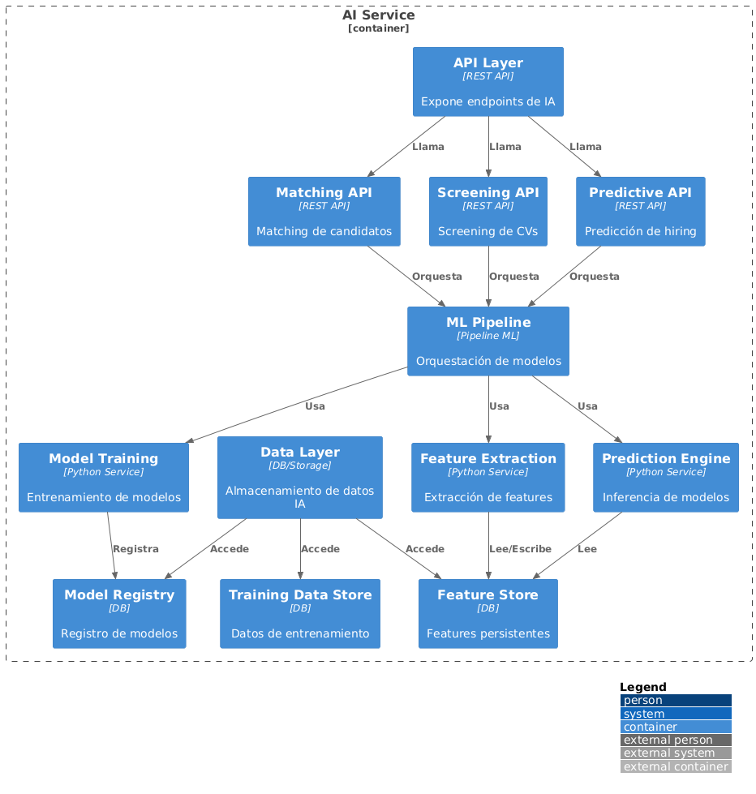

---

## 8. User Journey

La sección "User Journey" describe el recorrido típico de un usuario clave (por ejemplo, un recruiter) a través del sistema LTI ATS, desde la creación de una vacante hasta la contratación y cierre del proceso. Este diagrama ayuda a visualizar los pasos, actores y emociones involucradas en la experiencia de usuario, facilitando la identificación de oportunidades de mejora y puntos críticos en el flujo.

**Diagrama (Mermaid Journey):**
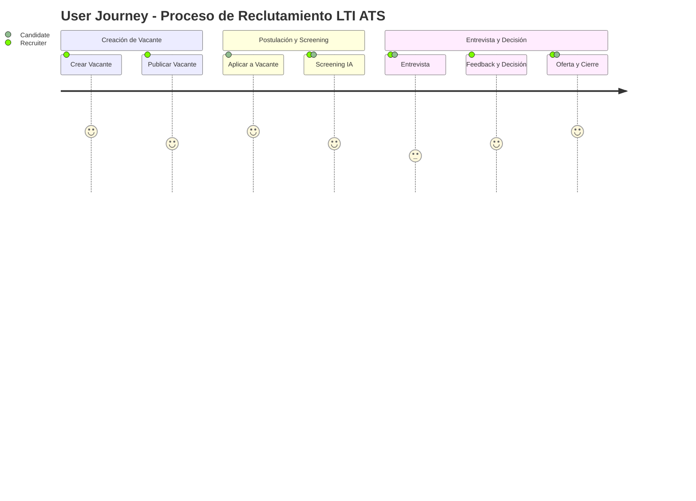

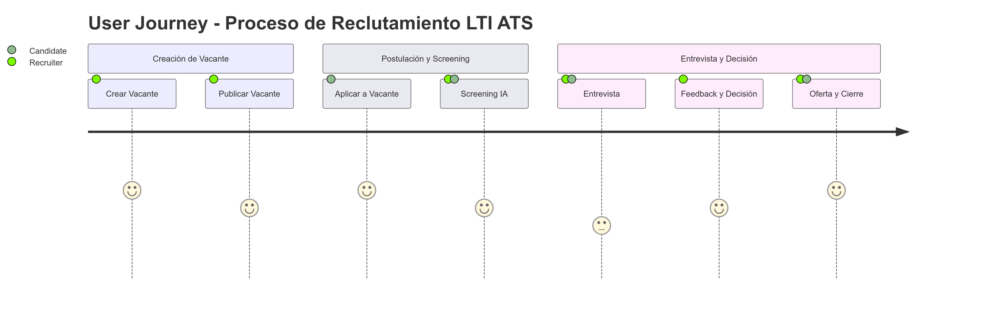

---

## Conclusión

LTI representa el futuro del ATS con una arquitectura moderna, IA integrada y enfoque en colaboración. El sistema está diseñado para escalar desde startups hasta empresas globales, proporcionando valor diferencial en cada etapa del proceso de reclutamiento.

### Próximos Pasos

1. **MVP Development**: Implementar casos de uso core
2. **AI Model Training**: Desarrollar modelos iniciales
3. **Beta Testing**: Validar con early adopters
4. **Enterprise Features**: Compliance y integraciones
5. **Global Expansion**: Multi-idioma y localización

---

*Documento preparado para presentación al equipo de desarrollo*
