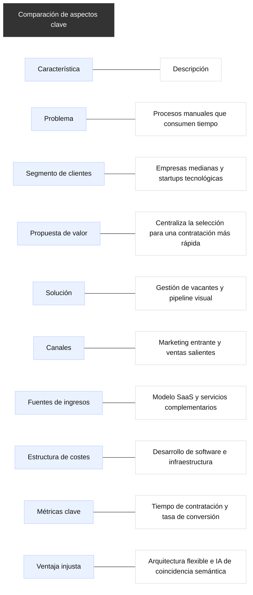
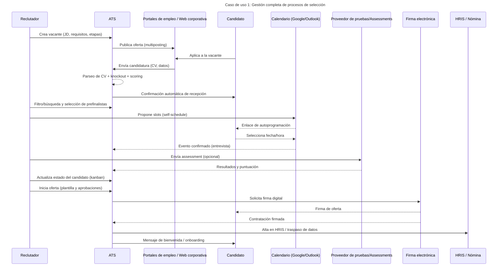
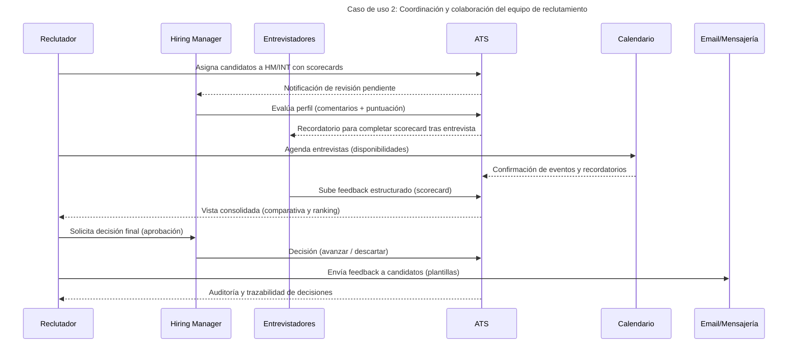
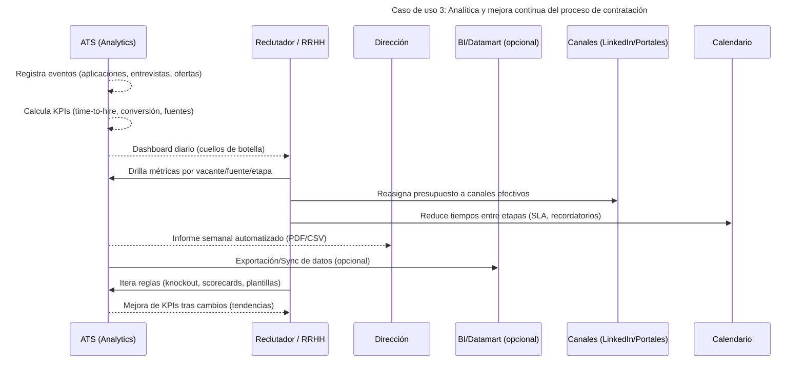
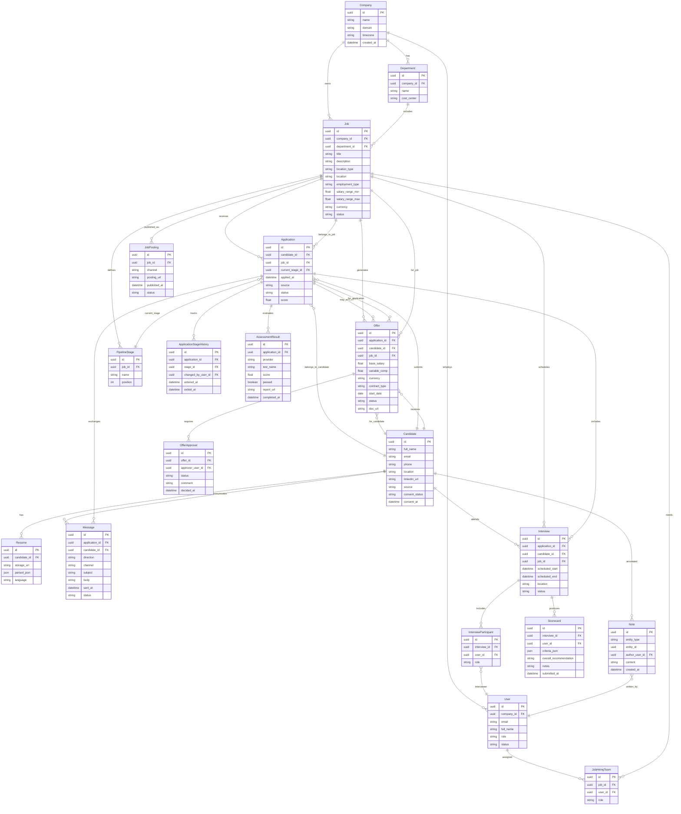
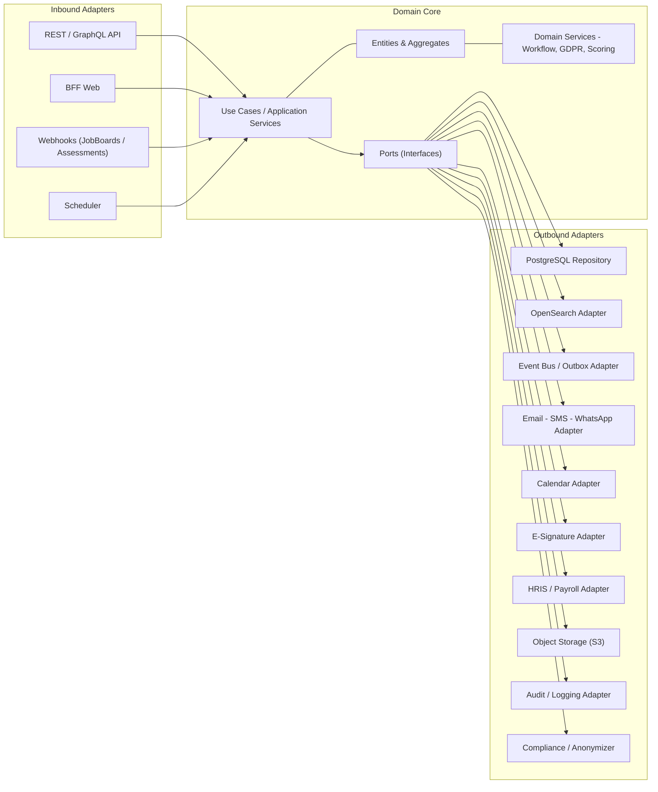
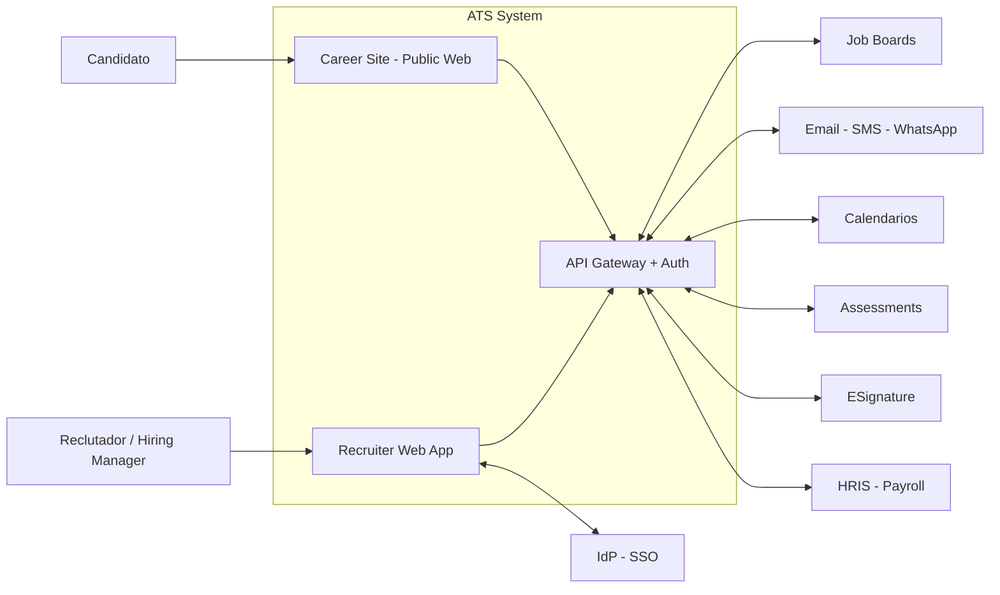
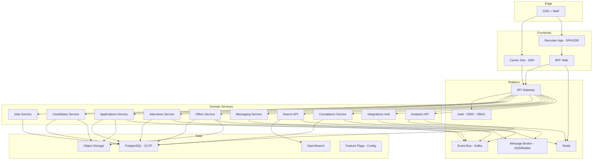
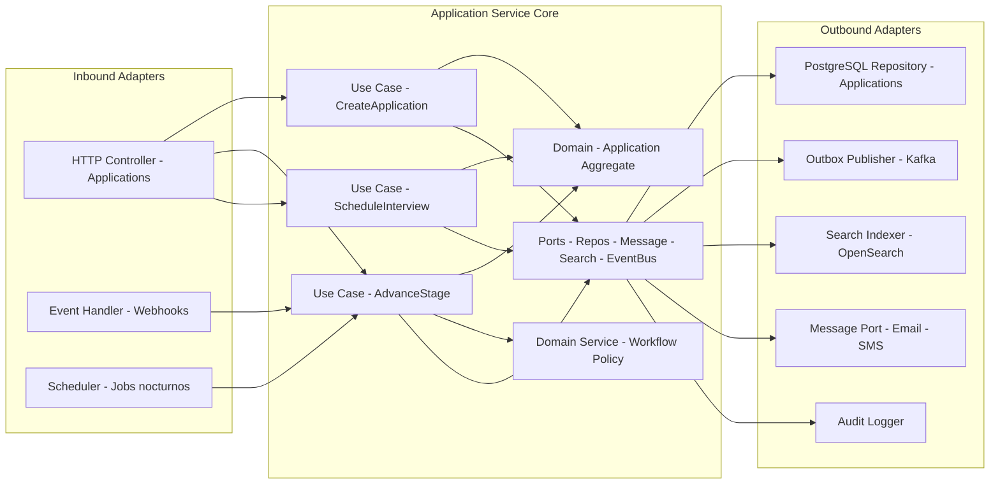
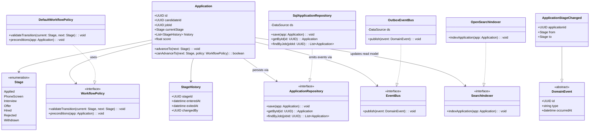

# 🧠 Applicant Tracking System (ATS)

## 📋 Descripción general

El **Applicant Tracking System (ATS)** es un software diseñado para **digitalizar, automatizar y optimizar el proceso completo de selección de personal**.  
Permite **centralizar candidaturas**, **coordinar al equipo de reclutamiento** y ofrecer una **experiencia fluida** tanto para el candidato como para el personal de recursos humanos.

---

### 🎯 Valor añadido

El sistema transforma un proceso manual y disperso en un **flujo de trabajo unificado, transparente y medible**, eliminando tareas repetitivas y errores humanos.  
Además, ofrece **automatizaciones inteligentes** que reducen el tiempo de contratación, mejoran la calidad de los candidatos y garantizan el **cumplimiento normativo (GDPR)**.

---

### 🏆 Ventajas competitivas

- **Automatización avanzada:** reduce más del 60% del tiempo administrativo del reclutador.  
- **Pipeline visual e intuitivo:** seguimiento en tiempo real de cada candidato y etapa.  
- **Matching inteligente:** priorización automática de perfiles según requisitos definidos.  
- **Integraciones nativas:** conexión con portales de empleo, calendarios, correo y software de RRHH.  
- **Cumplimiento legal garantizado:** consentimiento y retención de datos conforme a la normativa europea.  
- **Analítica en tiempo real:** métricas e informes automáticos sobre fuentes, tiempos y conversiones.  

---

## ⚙️ Funciones principales

### 🧩 1. Gestión de ofertas y vacantes
- Creación, edición y publicación de ofertas en múltiples canales (web, portales, redes).  
- Control del estado de cada vacante y gestión del presupuesto de publicación.  
- Plantillas y etiquetado por departamento, ubicación o tipo de contrato.  

### 📥 2. Captura y centralización de candidaturas
- Recolección automática de CVs y solicitudes desde diferentes fuentes.  
- Eliminación de duplicados y normalización de datos.  
- Importación de perfiles desde LinkedIn u otras plataformas.  

### 🔄 3. Pipeline de selección visual
- Vista tipo **kanban** con etapas personalizables (Aplicado → Entrevista → Oferta → Contratado).  
- Movimiento sencillo de candidatos por arrastre.  
- Automatización de acciones (envío de emails, recordatorios, avisos).  

### ✉️ 4. Comunicación con candidatos
- Bandeja de entrada integrada para correo y mensajes.  
- Plantillas y secuencias automatizadas de comunicación.  
- Confirmaciones, recordatorios y feedback automatizados.  

### 🧑‍🤝‍🧑 5. Colaboración con hiring managers
- Comentarios internos, puntuaciones y **scorecards compartidas**.  
- Flujo de aprobación de ofertas y contratación digital.  
- Historial completo de interacciones y decisiones.  

### 🧾 6. Cumplimiento legal (GDPR)
- Solicitud y almacenamiento del consentimiento.  
- Eliminación o anonimización automática de datos caducados.  
- Registro de accesos y auditorías.  

### 📊 7. Analítica y reporting
- Métricas clave: tiempo medio de contratación, fuentes más efectivas, conversión por etapa.  
- Dashboards personalizables y exportación a CSV o Excel.  
- Detección automática de cuellos de botella.  

### 🧠 8. IA y recomendaciones (opcional)
- Ranking de candidatos según adecuación al puesto.  
- Análisis semántico de CVs y descripciones.  
- Sugerencias de mejora en redacción de ofertas y proceso de selección.  

---

## 🚀 Beneficios para el equipo de RRHH

- Reducción del **time-to-hire** hasta un **50%**.  
- Mejora de la **calidad y consistencia** en las contrataciones.  
- Mayor **coordinación entre departamentos**.  
- Mejora notable en la **experiencia del candidato** y la **imagen de marca empleadora**.  

---

💡 *Este sistema convierte la gestión de talento en un proceso ágil, medible y centrado en las personas.*

## 📊 Lean Canvas para entender el modelo de negocio

## 📝 Casos de uso

### 🔄 Caso de uso 1: Gestión completa de procesos de selección

### 🤝 Caso de uso 2: Coordinación y colaboración del equipo de reclutamiento

### 📈 Caso de uso 3: Analítica y mejora continua del proceso de contratación

## 🗄️ Modelo de datos

## 🏗️ Arquitectura

### ⚙️ Objetivos arquitectónicos

- **Escalabilidad:** servicios stateless detrás de un API Gateway, colas para picos, caches para lecturas calientes, búsqueda externa.
- **Seguridad & Cumplimiento:** OIDC/OAuth2, RBAC multi-tenant, cifrado en tránsito/reposo, WAF, rate-limit, auditoría y retención GDPR.
- **Mantenibilidad:** límites claros por dominio (Jobs, Candidatos, Aplicaciones, Entrevistas, Ofertas, Mensajería, Integraciones), contratos estables, BFF para UI, feature flags.
- **Observabilidad:** tracing (OpenTelemetry), logs centralizados, métricas de negocio (time-to-hire, conversiones) y técnicas (p95, saturación).

### 🧩 Macro-componentes

#### Frontends

- Career Site (público) con CDN y SSR/ISR.
- Recruiter App (privado) SPA/SSR con BFF.
- BFF (Backend For Frontend): adapta APIs a vistas, agrega datos, aplica caché de corta vida.

#### Servicios de dominio (microservicios o módulos)

- Jobs Service (vacantes & pipeline stages)
- Candidates Service (candidatos, CV parsing)
- Applications Service (candidaturas, stage history)
- Interviews Service (agenda, entrevistadores)
- Messaging Service (email/SMS/WhatsApp, plantillas)
- Assessments Service (tests externos)
- Offers Service (ofertas, aprobaciones, e-signature)
- Search Service (búsqueda full-text/semántica)
- Compliance Service (consent, data retention, anonimización)
- Integrations Hub (job boards, calendario, HRIS, firma)

#### Infra/Plataforma

- API Gateway + AuthN/AuthZ (OIDC/JWT/RBAC)
- Message Broker (RabbitMQ/SQS/PubSub) y Event Bus (Kafka) para eventos de dominio
- Cache (Redis), Object Storage (S3), DB (PostgreSQL principal + réplicas), Search (OpenSearch/ES)
- Scheduler/Workers (jobs asíncronos), CDN, WAF
- Observabilidad (Prometheus + Grafana, ELK/Opensearch Dashboards, Jaeger/Tempo)

### 🔄 Patrones de comunicación

- **Sincrono:** REST/JSON (o gRPC) entre BFF ↔ servicios; API externas con webhooks cuando las haya.
- **Asíncrono:** eventos de dominio (p.ej. ApplicationStageChanged, OfferSigned) en Event Bus; colas para tareas (envíos, parsing CV, sincronizaciones, anonimización).
- **CQRS ligera:** para lecturas complejas (dashboards) usando materialized views/caches.

### 🔌 Integraciones externas

- Portales de empleo (LinkedIn/Indeed/InfoJobs): multiposting + webhook/ingest.
- Correo/SMS/WhatsApp (SendGrid/SES/Twilio): saliente y tracking.
- Calendario (Google/Outlook): disponibilidad, invitaciones, recordatorios.
- Assessments (HackerRank/SHL): envío y recogida de resultados.
- Firma electrónica (DocuSign/Adobe): ofertas y contratos.
- HRIS/Payroll (Factorial/Personio): alta de contratado.
- SSO/IdP (AzureAD/Okta/Google): OIDC + SCIM (opcional).

### 🔒 Seguridad y multi-tenancy

- Aislamiento por tenant: company_id + filtros RLS (si DB lo permite) y separación lógica de secretos; opción de BYOK/KMS.
- AuthN con OIDC, AuthZ con RBAC/ABAC por recurso (job/candidate/application).
- Auditoría de cambios y accesos; retención/anonimización por políticas.

### 🚀 DevOps/Entrega

- CI/CD (tests, SAST/DAST, migraciones), IaC (Terraform), blue/green o canary con feature flags.
- Backups y restore probados; migraciones idempotentes (Liquibase/Flyway).

### 🏛️ Patrón de diseño (Arquitectura hexagonal)

### 📐 Diagramas C4

#### C4-1: Contexto (vista de alto nivel)

#### C4-2: Contenedores (macro distribución)

#### C4-3: Componentes (dentro del Applications Service)

#### C4-4: Código (clases e interfaces del dominio y adapters)

