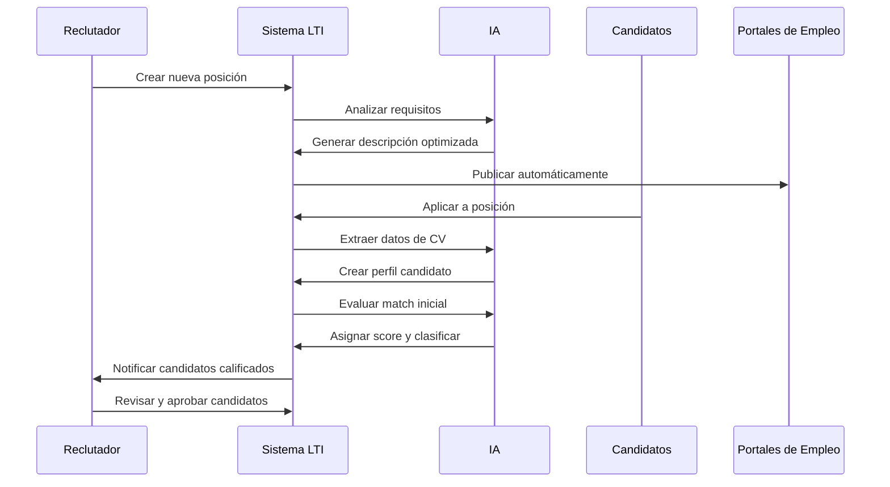
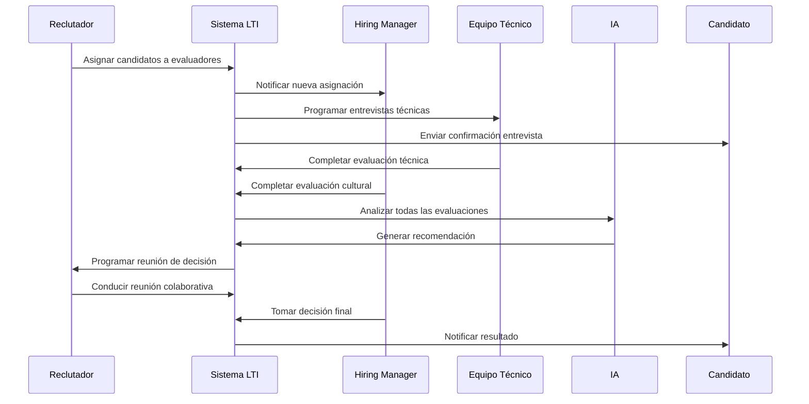
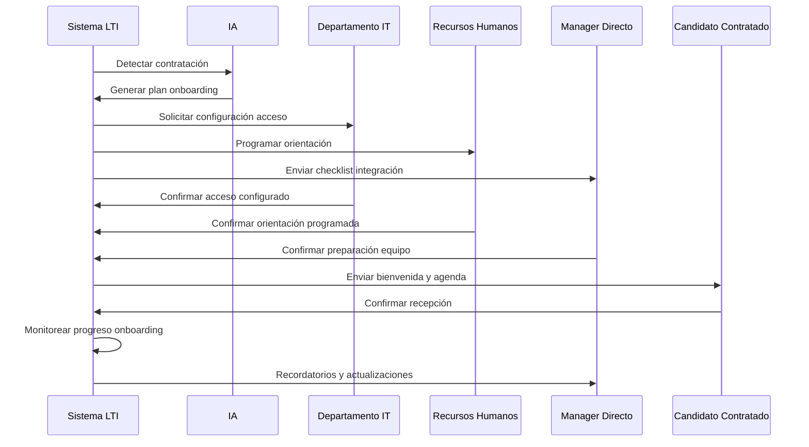
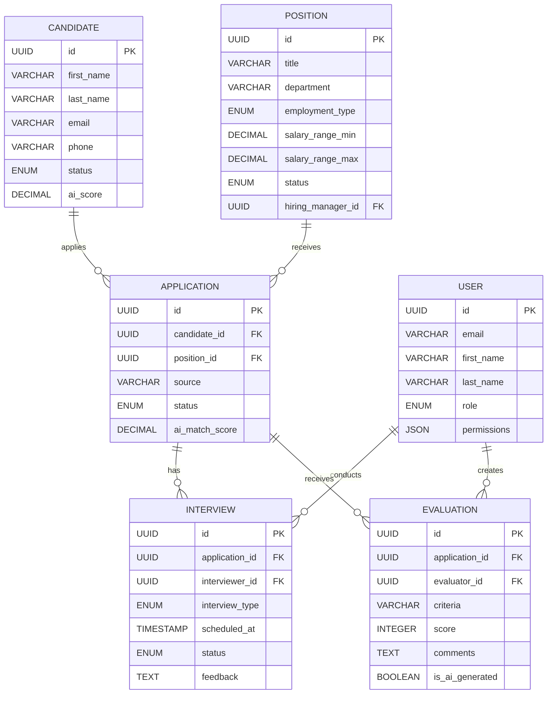
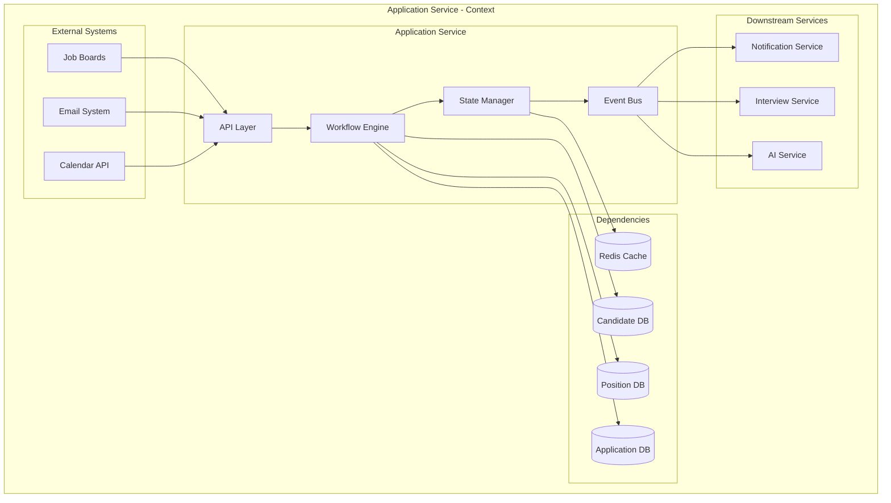
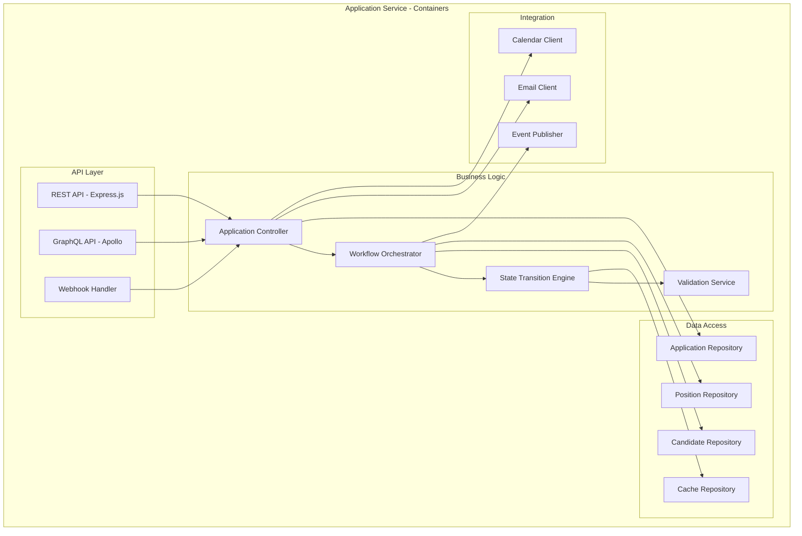
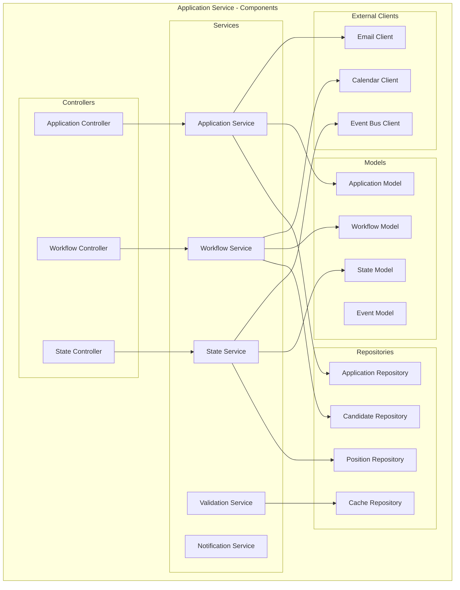

# LTI ATS - Sistema de Seguimiento de Candidatos

## Descripción del Producto

LTI ATS es una plataforma SaaS innovadora diseñada para optimizar el proceso de reclutamiento y selección de personal. El sistema combina automatización inteligente, colaboración en tiempo real y asistencia por IA para maximizar la eficiencia del equipo de reclutamiento y mejorar la calidad de las contrataciones.

**Propuesta de Valor:** Reducir el tiempo de contratación en un 40% mientras mejora la calidad de las candidaturas mediante IA predictiva y flujos de trabajo optimizados.

## Funciones Principales

### Gestión de Candidatos
- **Perfiles Inteligentes**: Creación automática de perfiles con extracción de datos de CV
- **Pipeline Visual**: Seguimiento visual del estado de candidatos con drag & drop
- **Evaluación por IA**: Scoring automático de candidatos basado en match con el puesto
- **Comunicación Integrada**: Email y SMS automatizados con templates personalizables

### Colaboración y Workflow
- **Dashboard Colaborativo**: Vista compartida para managers y reclutadores
- **Comentarios y Feedback**: Sistema de anotaciones y evaluaciones en tiempo real
- **Aprobaciones Automatizadas**: Flujos de aprobación configurables por puesto
- **Calendario Integrado**: Programación automática de entrevistas

### Automatización e IA
- **Matching Inteligente**: IA que sugiere candidatos ideales para cada posición
- **Screening Automático**: Evaluación inicial automatizada de candidatos
- **Predictive Analytics**: Análisis predictivo de éxito de candidatos
- **Chatbot de Candidatos**: Asistente IA para responder preguntas frecuentes

### Analytics y Reportes
- **Métricas en Tiempo Real**: KPIs de reclutamiento actualizados automáticamente
- **Reportes Personalizables**: Dashboards configurables por equipo
- **Análisis de Eficiencia**: Identificación de cuellos de botella en el proceso
- **ROI de Reclutamiento**: Medición del retorno de inversión por canal

## Lean Canvas

```mermaid
graph TD
    subgraph "LTI ATS - Lean Canvas"
        subgraph "Problem"
            P1[Problema 1: Proceso de reclutamiento lento y manual]
            P2[Problema 2: Falta de colaboración entre stakeholders]
            P3[Problema 3: Pérdida de candidatos calificados]
            P4[Problema 4: Difícil medición de efectividad]
        end
        
        subgraph "Solution"
            S1[Solución 1: Automatización con IA y flujos optimizados]
            S2[Solución 2: Plataforma colaborativa en tiempo real]
            S3[Solución 3: Matching inteligente y seguimiento proactivo]
            S4[Solución 4: Analytics avanzados y métricas claras]
        end
        
        subgraph "Key Metrics"
            M1[Tiempo promedio de contratación]
            M2[Calidad de candidatos contratados]
            M3[Retención post-contratación]
            M4[ROI por canal de reclutamiento]
        end
        
        subgraph "Unique Value Proposition"
            UVP[Reduce tiempo de contratación 40% con IA predictiva y colaboración en tiempo real]
        end
        
        subgraph "Unfair Advantage"
            UA[Algoritmos de IA entrenados con datos de reclutamiento exitoso]
        end
        
        subgraph "Channels"
            C1[Referencias de clientes existentes]
            C2[Marketing digital y contenido]
            C3[Partnerships con consultoras]
            C4[Eventos de recursos humanos]
        end
        
        subgraph "Customer Segments"
            CS1[Startups en crecimiento (50-200 empleados)]
            CS2[Empresas de tecnología]
            CS3[Consultoras de reclutamiento]
            CS4[Departamentos de HR de empresas medianas]
        end
        
        subgraph "Cost Structure"
            COST1[Desarrollo y mantenimiento de IA]
            COST2[Infraestructura cloud]
            COST3[Equipo de soporte]
            COST4[Marketing y ventas]
        end
        
        subgraph "Revenue Streams"
            R1[Suscripciones mensuales por usuario]
            R2[Implementación y onboarding]
            R3[Servicios de consultoría]
            R4[Integraciones premium]
        end
    end
```

## Casos de Uso Clave

### Caso de Uso 1: Publicación y Recepción de Candidaturas

**Descripción:** El reclutador publica una nueva posición y el sistema automatiza la recepción, evaluación inicial y clasificación de candidatos.

**Actores:** Reclutador, Sistema de IA, Candidatos

**Flujo Principal:**
1. Reclutador crea nueva posición con requisitos detallados
2. Sistema publica automáticamente en múltiples canales
3. Candidatos aplican a través de portal o email
4. IA extrae información de CVs y crea perfiles
5. Sistema evalúa match inicial y asigna score
6. Candidatos calificados se mueven al pipeline
7. Reclutador recibe notificaciones de candidatos prometedores



### Caso de Uso 2: Evaluación Colaborativa de Candidatos

**Descripción:** Múltiples stakeholders evalúan candidatos de forma colaborativa, compartiendo feedback y tomando decisiones conjuntas.

**Actores:** Reclutador, Hiring Manager, Equipo Técnico, Candidato

**Flujo Principal:**
1. Reclutador asigna candidatos a evaluadores
2. Sistema programa entrevistas automáticamente
3. Evaluadores realizan entrevistas y completan formularios
4. IA analiza feedback y genera recomendaciones
5. Sistema facilita reunión de decisión
6. Hiring Manager toma decisión final
7. Sistema notifica resultado al candidato



### Caso de Uso 3: Onboarding Automatizado

**Descripción:** Una vez contratado, el sistema automatiza el proceso de onboarding, coordinando con múltiples departamentos.

**Actores:** Candidato Contratado, HR, IT, Manager Directo

**Flujo Principal:**
1. Sistema detecta candidato contratado
2. IA genera plan de onboarding personalizado
3. Sistema coordina tareas entre departamentos
4. IT configura acceso y equipamiento
5. HR programa sesiones de orientación
6. Manager recibe checklist de integración
7. Sistema monitorea progreso y envía recordatorios



## Modelo de Datos

### Entidades Principales

#### Candidate (Candidato)
```sql
CREATE TABLE candidates (
    id UUID PRIMARY KEY,
    first_name VARCHAR(100) NOT NULL,
    last_name VARCHAR(100) NOT NULL,
    email VARCHAR(255) UNIQUE NOT NULL,
    phone VARCHAR(20),
    linkedin_url VARCHAR(255),
    current_position VARCHAR(200),
    years_experience INTEGER,
    location VARCHAR(200),
    salary_expectation DECIMAL(10,2),
    availability_date DATE,
    status ENUM('new', 'screening', 'interviewing', 'evaluating', 'offered', 'hired', 'rejected'),
    ai_score DECIMAL(3,2),
    created_at TIMESTAMP DEFAULT CURRENT_TIMESTAMP,
    updated_at TIMESTAMP DEFAULT CURRENT_TIMESTAMP
);
```

#### Position (Posición)
```sql
CREATE TABLE positions (
    id UUID PRIMARY KEY,
    title VARCHAR(200) NOT NULL,
    department VARCHAR(100),
    location VARCHAR(200),
    employment_type ENUM('full_time', 'part_time', 'contract', 'internship'),
    salary_range_min DECIMAL(10,2),
    salary_range_max DECIMAL(10,2),
    description TEXT,
    requirements TEXT,
    responsibilities TEXT,
    status ENUM('draft', 'published', 'closed', 'archived'),
    hiring_manager_id UUID REFERENCES users(id),
    created_at TIMESTAMP DEFAULT CURRENT_TIMESTAMP,
    updated_at TIMESTAMP DEFAULT CURRENT_TIMESTAMP
);
```

#### Application (Aplicación)
```sql
CREATE TABLE applications (
    id UUID PRIMARY KEY,
    candidate_id UUID REFERENCES candidates(id),
    position_id UUID REFERENCES positions(id),
    source VARCHAR(100),
    resume_url VARCHAR(500),
    cover_letter TEXT,
    status ENUM('applied', 'screening', 'interview_scheduled', 'interviewed', 'evaluating', 'offered', 'accepted', 'rejected'),
    ai_match_score DECIMAL(3,2),
    created_at TIMESTAMP DEFAULT CURRENT_TIMESTAMP,
    updated_at TIMESTAMP DEFAULT CURRENT_TIMESTAMP
);
```

#### User (Usuario)
```sql
CREATE TABLE users (
    id UUID PRIMARY KEY,
    email VARCHAR(255) UNIQUE NOT NULL,
    first_name VARCHAR(100) NOT NULL,
    last_name VARCHAR(100) NOT NULL,
    role ENUM('admin', 'recruiter', 'hiring_manager', 'interviewer'),
    department VARCHAR(100),
    permissions JSON,
    is_active BOOLEAN DEFAULT TRUE,
    created_at TIMESTAMP DEFAULT CURRENT_TIMESTAMP,
    updated_at TIMESTAMP DEFAULT CURRENT_TIMESTAMP
);
```

#### Interview (Entrevista)
```sql
CREATE TABLE interviews (
    id UUID PRIMARY KEY,
    application_id UUID REFERENCES applications(id),
    interviewer_id UUID REFERENCES users(id),
    interview_type ENUM('phone', 'video', 'onsite', 'technical'),
    scheduled_at TIMESTAMP,
    duration_minutes INTEGER,
    status ENUM('scheduled', 'completed', 'cancelled', 'rescheduled'),
    feedback TEXT,
    rating INTEGER CHECK (rating >= 1 AND rating <= 5),
    created_at TIMESTAMP DEFAULT CURRENT_TIMESTAMP,
    updated_at TIMESTAMP DEFAULT CURRENT_TIMESTAMP
);
```

#### Evaluation (Evaluación)
```sql
CREATE TABLE evaluations (
    id UUID PRIMARY KEY,
    application_id UUID REFERENCES applications(id),
    evaluator_id UUID REFERENCES users(id),
    criteria VARCHAR(100),
    score INTEGER CHECK (score >= 1 AND score <= 10),
    comments TEXT,
    is_ai_generated BOOLEAN DEFAULT FALSE,
    created_at TIMESTAMP DEFAULT CURRENT_TIMESTAMP
);
```

### Relaciones del Modelo



## Diseño del Sistema a Alto Nivel

### Arquitectura General

LTI ATS utiliza una arquitectura de microservicios moderna basada en contenedores, con separación clara de responsabilidades y escalabilidad horizontal.

```mermaid
graph TB
    subgraph "Frontend Layer"
        Web[Web App - React/Next.js]
        Mobile[Mobile App - React Native]
    end
    
    subgraph "API Gateway"
        Gateway[API Gateway - Kong]
        Auth[Authentication Service]
        RateLimit[Rate Limiting]
    end
    
    subgraph "Microservices"
        CandidateService[Candidate Service]
        PositionService[Position Service]
        ApplicationService[Application Service]
        InterviewService[Interview Service]
        NotificationService[Notification Service]
        FileService[File Service]
    end
    
    subgraph "AI/ML Services"
        AIService[AI Matching Service]
        ScreeningService[Screening Service]
        AnalyticsService[Analytics Service]
    end
    
    subgraph "Data Layer"
        PostgreSQL[(PostgreSQL)]
        Redis[(Redis Cache)]
        Elasticsearch[(Elasticsearch)]
        S3[(AWS S3)]
    end
    
    subgraph "External Integrations"
        EmailProvider[Email Provider]
        SMSService[SMS Service]
        CalendarAPI[Calendar API]
        JobBoards[Job Boards API]
    end
    
    Web --> Gateway
    Mobile --> Gateway
    Gateway --> Auth
    Gateway --> CandidateService
    Gateway --> PositionService
    Gateway --> ApplicationService
    Gateway --> InterviewService
    Gateway --> AIService
    
    CandidateService --> PostgreSQL
    PositionService --> PostgreSQL
    ApplicationService --> PostgreSQL
    InterviewService --> PostgreSQL
    
    AIService --> Elasticsearch
    ScreeningService --> Elasticsearch
    AnalyticsService --> PostgreSQL
    
    NotificationService --> EmailProvider
    NotificationService --> SMSService
    FileService --> S3
    
    ApplicationService --> Redis
    InterviewService --> Redis
```



### Componentes del Sistema

#### 1. API Gateway
- **Responsabilidad**: Enrutamiento, autenticación, rate limiting
- **Tecnología**: Kong Gateway
- **Funciones**: Load balancing, SSL termination, request/response transformation

#### 2. Microservicios Core
- **Candidate Service**: Gestión de perfiles y datos de candidatos
- **Position Service**: Gestión de posiciones y requisitos
- **Application Service**: Pipeline de aplicaciones y workflow
- **Interview Service**: Programación y gestión de entrevistas
- **Notification Service**: Comunicaciones automatizadas
- **File Service**: Gestión de documentos y CVs

#### 3. Servicios de IA/ML
- **AI Matching Service**: Algoritmos de matching candidato-posición
- **Screening Service**: Evaluación automática inicial
- **Analytics Service**: Métricas y reportes avanzados

#### 4. Capa de Datos
- **PostgreSQL**: Base de datos principal (ACID compliance)
- **Redis**: Cache y sesiones
- **Elasticsearch**: Búsqueda y análisis de texto
- **AWS S3**: Almacenamiento de archivos

## Diagrama C4 - Componente Principal: Application Service

### Contexto del Componente

El Application Service es el núcleo del sistema ATS, responsable de gestionar el pipeline completo de aplicaciones desde la recepción hasta la contratación.



### Contenedores del Componente



### Componentes del Application Service



### Código del Componente

```typescript
// Application Service - Core Implementation

interface Application {
    id: string;
    candidateId: string;
    positionId: string;
    status: ApplicationStatus;
    aiMatchScore: number;
    createdAt: Date;
    updatedAt: Date;
}

enum ApplicationStatus {
    APPLIED = 'applied',
    SCREENING = 'screening',
    INTERVIEW_SCHEDULED = 'interview_scheduled',
    INTERVIEWED = 'interviewed',
    EVALUATING = 'evaluating',
    OFFERED = 'offered',
    ACCEPTED = 'accepted',
    REJECTED = 'rejected'
}

class ApplicationService {
    constructor(
        private applicationRepo: ApplicationRepository,
        private workflowService: WorkflowService,
        private notificationService: NotificationService,
        private aiService: AIService
    ) {}

    async createApplication(candidateId: string, positionId: string): Promise<Application> {
        // Validar candidato y posición
        const candidate = await this.candidateRepo.findById(candidateId);
        const position = await this.positionRepo.findById(positionId);
        
        // Evaluar match con IA
        const aiScore = await this.aiService.evaluateMatch(candidate, position);
        
        // Crear aplicación
        const application = await this.applicationRepo.create({
            candidateId,
            positionId,
            status: ApplicationStatus.APPLIED,
            aiMatchScore: aiScore
        });
        
        // Iniciar workflow
        await this.workflowService.startWorkflow(application.id);
        
        // Notificar stakeholders
        await this.notificationService.notifyNewApplication(application);
        
        return application;
    }

    async updateApplicationStatus(
        applicationId: string, 
        newStatus: ApplicationStatus,
        userId: string
    ): Promise<Application> {
        const application = await this.applicationRepo.findById(applicationId);
        
        // Validar transición de estado
        const isValidTransition = this.validateStateTransition(
            application.status, 
            newStatus
        );
        
        if (!isValidTransition) {
            throw new Error('Invalid state transition');
        }
        
        // Actualizar estado
        const updatedApplication = await this.applicationRepo.updateStatus(
            applicationId, 
            newStatus
        );
        
        // Ejecutar acciones del workflow
        await this.workflowService.executeWorkflowActions(
            applicationId, 
            newStatus, 
            userId
        );
        
        // Publicar evento
        await this.eventBus.publish('application.status.changed', {
            applicationId,
            oldStatus: application.status,
            newStatus,
            userId
        });
        
        return updatedApplication;
    }

    private validateStateTransition(
        currentStatus: ApplicationStatus, 
        newStatus: ApplicationStatus
    ): boolean {
        const validTransitions = {
            [ApplicationStatus.APPLIED]: [
                ApplicationStatus.SCREENING,
                ApplicationStatus.REJECTED
            ],
            [ApplicationStatus.SCREENING]: [
                ApplicationStatus.INTERVIEW_SCHEDULED,
                ApplicationStatus.REJECTED
            ],
            [ApplicationStatus.INTERVIEW_SCHEDULED]: [
                ApplicationStatus.INTERVIEWED,
                ApplicationStatus.REJECTED
            ],
            [ApplicationStatus.INTERVIEWED]: [
                ApplicationStatus.EVALUATING,
                ApplicationStatus.REJECTED
            ],
            [ApplicationStatus.EVALUATING]: [
                ApplicationStatus.OFFERED,
                ApplicationStatus.REJECTED
            ],
            [ApplicationStatus.OFFERED]: [
                ApplicationStatus.ACCEPTED,
                ApplicationStatus.REJECTED
            ]
        };
        
        return validTransitions[currentStatus]?.includes(newStatus) || false;
    }
}
```

Este diseño proporciona una base sólida para un sistema ATS moderno, escalable y centrado en la eficiencia del equipo de reclutamiento, con capacidades avanzadas de IA y colaboración en tiempo real. 