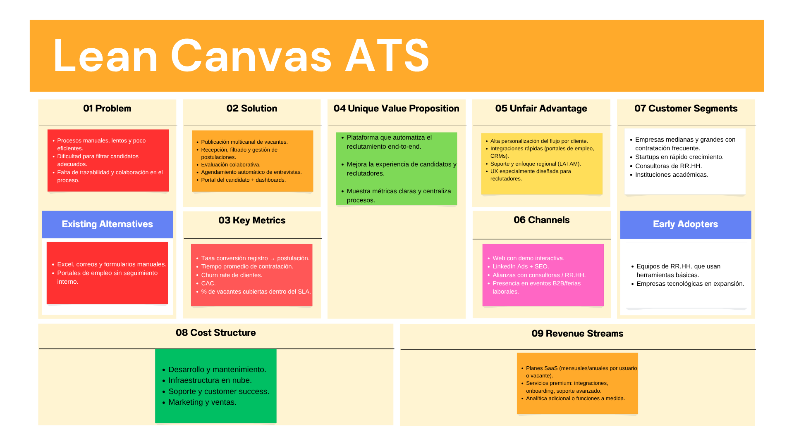
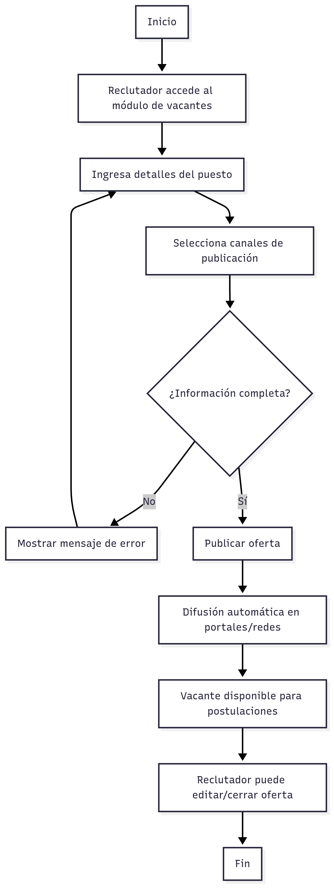
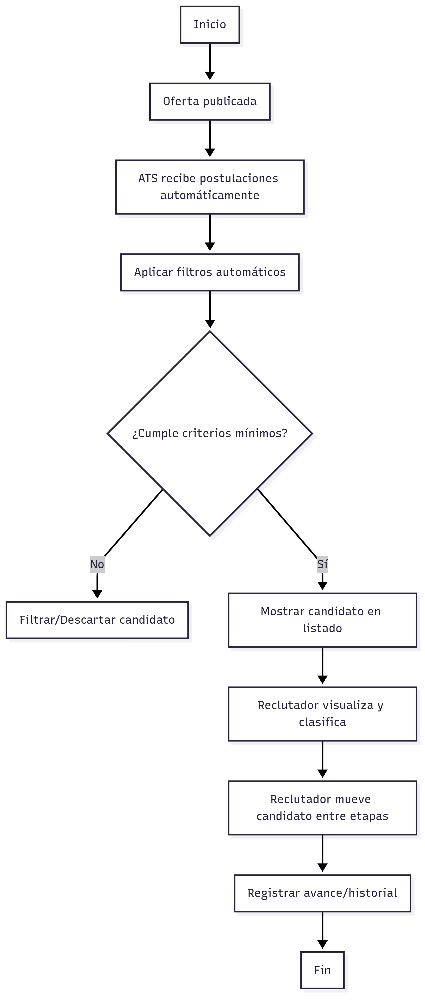
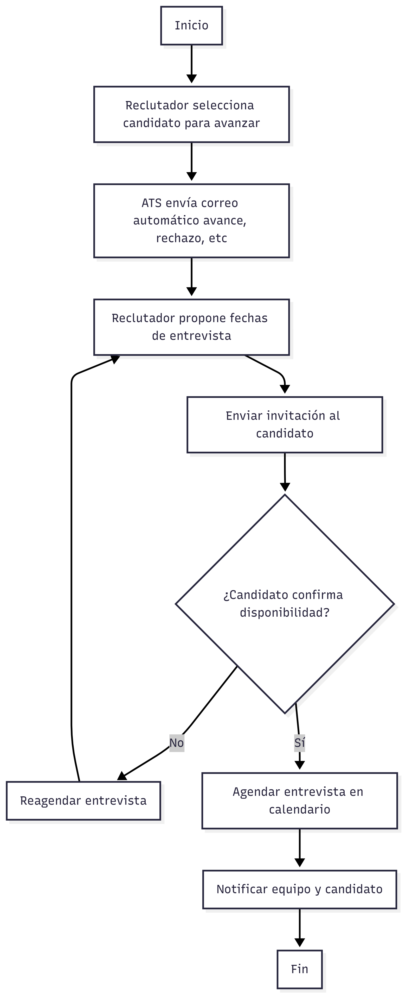
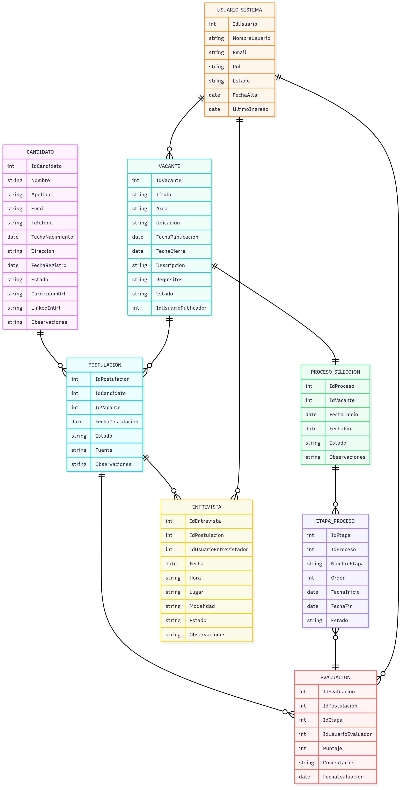
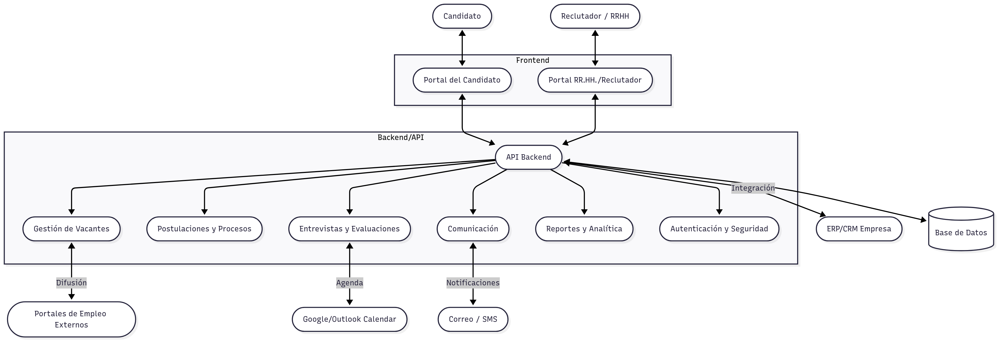
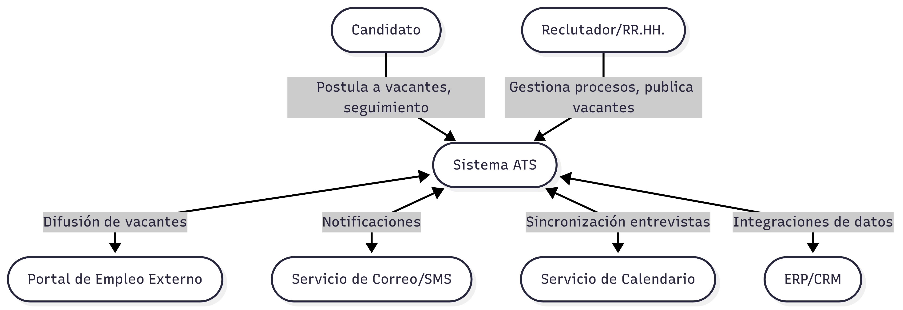
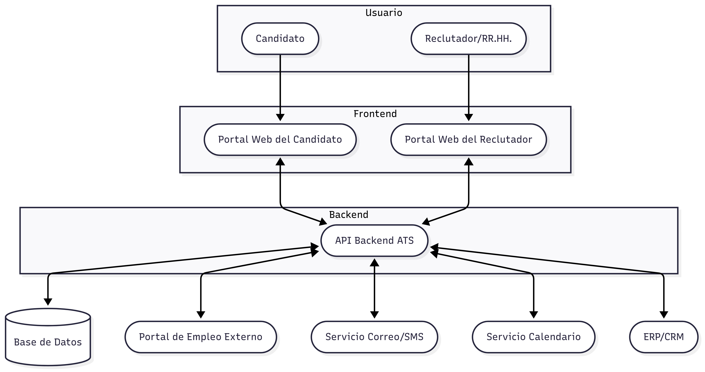
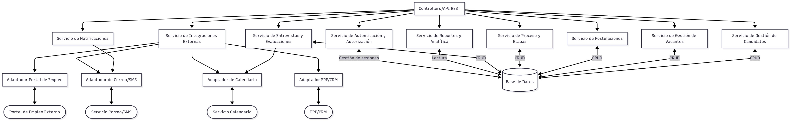
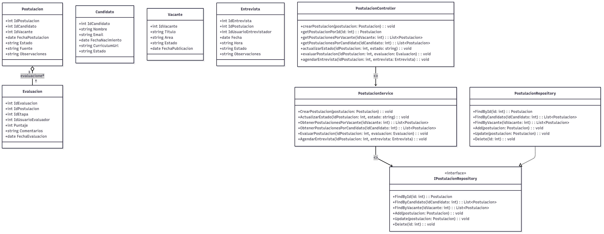

# Descripción General del Software:
    Un ATS (Applicant Tracking System) es un software diseñado para gestionar, automatizar y optimizar todo el proceso de reclutamiento de talento en una organización. Desde la publicación de ofertas laborales hasta la contratación final, centraliza la información de los candidatos y facilita la colaboración entre reclutadores, entrevistadores y jefes de área.

# Valor añadido: 
    
- Centralización del proceso de selección: Todo el flujo de reclutamiento en un solo lugar, reduciendo errores y duplicidades.

- Ahorro de tiempo: Automatiza tareas repetitivas como el filtrado inicial de CVs, agendamiento de entrevistas y notificaciones.

- Mejora en la calidad de contrataciones: Permite un seguimiento más riguroso y colaborativo de los candidatos, lo que eleva el nivel de las decisiones.

- Experiencia positiva para el candidato: Proporciona una postulación ágil, transparente y profesional.

- Trazabilidad y métricas del proceso: Permite identificar cuellos de botella y optimizar continuamente la estrategia de atracción de talento.

# Ventajas competitivas

- Reducción del tiempo de contratación (Time-to-Hire): Automatización y filtros avanzados reducen drásticamente el ciclo de selección.

- Aumento de la productividad del equipo de RR.HH.: Permite a los reclutadores enfocarse en tareas de alto valor (entrevistas, evaluación).

- Acceso a talento más calificado: Mejora el alcance de las ofertas y el matching entre perfil y puesto.

- Escalabilidad: Ideal tanto para startups como grandes empresas que gestionan múltiples vacantes simultáneamente.

- Mejor cumplimiento normativo: Permite una gestión adecuada de los datos personales conforme a normativas como GDPR o la Ley 19.628 en Chile.

- Toma de decisiones basada en datos: KPIs e informes en tiempo real sobre desempeño del proceso y canales de atracción.

# Funciones Principales de un Sistema ATS (Applicant Tracking System)

## 1. Creación y Publicación de Ofertas Laborales
- Permite crear vacantes con formularios estructurados.
- Publicación automática en portales de empleo, redes sociales, y sitio web corporativo.
- Gestión de fechas de apertura y cierre de postulaciones.

## 2. Recepción y Gestión de Postulaciones
- Captura de CVs desde distintos canales.
- Registro automático de candidatos en la base de datos.
- Validación de requisitos mínimos automáticamente (palabras clave, experiencia, etc.).

## 3. Seguimiento del Proceso de Selección
- Definición de etapas personalizadas (screening, entrevista, pruebas, etc.).
- Asignación de evaluadores y responsables por etapa.
- Visualización de avance de cada candidato (pipeline de reclutamiento).

## 4. Evaluación y Comparación de Candidatos
- Formulario de evaluación por competencias o criterios definidos.
- Puntajes, comentarios y recomendaciones de entrevistadores.
- Comparación directa entre candidatos para un mismo cargo.

## 5. Agendamiento de Entrevistas y Pruebas
- Integración con calendarios (Google, Outlook).
- Envío automático de invitaciones y recordatorios.
- Gestión de disponibilidad tanto del equipo como del candidato.

## 6. Comunicación con los Candidatos
- Plantillas de correos automatizados (recibido, avance, rechazo, oferta).
- Historial de comunicaciones por candidato.
- Portal del postulante para seguimiento de estado.

## 7. Gestión Documental
- Almacenamiento seguro de CVs, certificados, portafolios y documentos legales.
- Acceso por permisos (reclutadores, gerencias, etc.).
- Descarga y visualización rápida en el navegador.

## 8. Reportes y Analítica
- KPIs del proceso: tiempo de contratación, tasa de abandono, fuentes más efectivas.
- Exportación a Excel, PDF o dashboards embebidos.
- Filtros por fecha, cargo, área, canal de atracción, etc.

## 9. Gestión de Permisos y Seguridad
- Roles configurables: administrador, reclutador, observador.
- Accesos diferenciados según confidencialidad del cargo.
- Cumplimiento de normativas de protección de datos personales.

## 10. Base de Datos de Talento
- Repositorio histórico de todos los postulantes.
- Búsqueda avanzada por habilidades, experiencia o palabras clave.
- Reutilización de perfiles para futuras vacantes.

# Diagrama Lean Canvas

# Casos de Uso Principales – Sistema ATS

---

## Caso de Uso 1: Publicación y Gestión de Ofertas Laborales

**Actor Principal:**  
Reclutador

**Descripción:**  
El reclutador puede crear, publicar, editar y cerrar ofertas laborales. El sistema permite difundir automáticamente las vacantes en diferentes portales y redes desde una interfaz centralizada.

**Precondiciones:**  
- El usuario debe estar autenticado con permisos de reclutador.
- Deben existir portales externos configurados para la publicación.

**Flujo Principal:**
1. El reclutador accede al módulo de creación de vacantes.
2. Ingresa los detalles del puesto (nombre, requisitos, salario, etc.).
3. Selecciona los canales de publicación (portales, redes, web).
4. Publica la oferta.
5. El sistema difunde automáticamente la oferta y la deja disponible para postulaciones.
6. El reclutador puede editar o cerrar la vacante según el avance del proceso.

**Postcondiciones:**  
- La oferta queda publicada y visible en los canales seleccionados.
- El reclutador puede ver el estado y rendimiento de la oferta.

**Excepciones:**  
- Si falta información obligatoria, el sistema no permite publicar.
- Si un canal externo no responde, se muestra advertencia y la publicación sigue en los demás.

---
**Pseudocódigo Mermaid Diagrama caso de uso 1**
flowchart TD
    A[Inicio] --> B[Reclutador accede al módulo de vacantes]
    B --> C[Ingresa detalles del puesto]
    C --> D[Selecciona canales de publicación]
    D --> E{¿Información completa?}
    E -- No --> F[Mostrar mensaje de error]
    F --> C
    E -- Sí --> G[Publicar oferta]
    G --> H[Difusión automática en portales/redes]
    H --> I[Vacante disponible para postulaciones]
    I --> J[Reclutador puede editar/cerrar oferta]
    J --> K[Fin]

## Caso de Uso 2: Recepción, Filtro y Seguimiento de Postulantes

**Actor Principal:**  
Reclutador

**Descripción:**  
El sistema recibe postulaciones desde diferentes fuentes, aplica filtros automáticos, permite visualizar y clasificar a los candidatos, y hacer seguimiento de cada uno durante las etapas del proceso.

**Precondiciones:**  
- Debe existir al menos una oferta laboral publicada.
- El sistema debe estar conectado a los portales configurados.

**Flujo Principal:**
1. El sistema recibe postulaciones automáticamente.
2. Clasifica a los candidatos según los filtros configurados (palabras clave, experiencia, etc.).
3. El reclutador visualiza el listado y puede ver el detalle de cada candidato.
4. El reclutador mueve a los candidatos entre etapas (preselección, entrevista, pruebas, etc.).
5. Se registra el historial y avance de cada postulante.

**Postcondiciones:**  
- Todos los candidatos quedan registrados con su avance.
- Los filtros y clasificaciones están guardados.

**Excepciones:**  
- Si hay error en la recepción desde un portal externo, el sistema notifica al reclutador.
- Si un candidato no cumple criterios mínimos, se puede filtrar automáticamente.

---
**Pseudocódigo Mermaid Diagrama caso de uso 2**
flowchart TD
    A[Inicio] --> B[Oferta publicada]
    B --> C[ATS recibe postulaciones automáticamente]
    C --> D[Aplicar filtros automáticos]
    D --> E{¿Cumple criterios mínimos?}
    E -- No --> F[Filtrar/Descartar candidato]
    E -- Sí --> G[Mostrar candidato en listado]
    G --> H[Reclutador visualiza y clasifica]
    H --> I[Reclutador mueve candidato entre etapas]
    I --> J[Registrar avance/historial]
    J --> K[Fin]

## Caso de Uso 3: Automatización de Comunicación y Agendamiento de Entrevistas

**Actor Principal:**  
Reclutador

**Descripción:**  
El sistema envía notificaciones automáticas a los candidatos y permite agendar entrevistas integrando calendarios del equipo y los postulantes.

**Precondiciones:**  
- El candidato debe estar registrado en una etapa válida del proceso.
- El sistema debe tener configurado el servicio de correo y calendario.

**Flujo Principal:**
1. El reclutador selecciona al candidato para avanzar de etapa.
2. El sistema envía automáticamente un correo de notificación al candidato avance, rechazo, solicitud de documentos, etc.
3. El reclutador puede proponer fechas para entrevistas.
4. El candidato recibe invitación y confirma disponibilidad.
5. El sistema agenda la entrevista en el calendario correspondiente.

**Postcondiciones:**  
- El candidato es notificado del avance y tiene agendada la entrevista.
- El equipo de RR.HH. tiene registro en el calendario y el sistema.

**Excepciones:**  
- Si falla el envío de correo, el sistema notifica al reclutador.
- Si el candidato no confirma la cita, se puede reagendar.

---
**Pseudocódigo Mermaid Diagrama caso de uso 3**
flowchart TD
    A[Inicio] --> B[Reclutador selecciona candidato para avanzar]
    B --> C[ATS envía correo automático avance, rechazo, etc.]
    C --> D[Reclutador propone fechas de entrevista]
    D --> E[Enviar invitación al candidato]
    E --> F{¿Candidato confirma disponibilidad?}
    F -- No --> G[Reagendar entrevista]
    G --> D
    F -- Sí --> H[Agendar entrevista en calendario]
    H --> I[Notificar equipo y candidato]
    I --> J[Fin]

# Modelo de datos formato mermaid

erDiagram

CANDIDATO {
    int IdCandidato
    string Nombre
    string Apellido
    string Email
    string Telefono
    date FechaNacimiento
    string Direccion
    date FechaRegistro
    string Estado
    string CurriculumUrl
    string LinkedInUrl
    string Observaciones
}

VACANTE {
    int IdVacante
    string Titulo
    string Area
    string Ubicacion
    date FechaPublicacion
    date FechaCierre
    string Descripcion
    string Requisitos
    string Estado
    int IdUsuarioPublicador
}

USUARIO_SISTEMA {
    int IdUsuario
    string NombreUsuario
    string Email
    string Rol
    string Estado
    date FechaAlta
    date UltimoIngreso
}

POSTULACION {
    int IdPostulacion
    int IdCandidato
    int IdVacante
    date FechaPostulacion
    string Estado
    string Fuente
    string Observaciones
}

PROCESO_SELECCION {
    int IdProceso
    int IdVacante
    date FechaInicio
    date FechaFin
    string Estado
    string Observaciones
}

ETAPA_PROCESO {
    int IdEtapa
    int IdProceso
    string NombreEtapa
    int Orden
    date FechaInicio
    date FechaFin
    string Estado
}

EVALUACION {
    int IdEvaluacion
    int IdPostulacion
    int IdEtapa
    int IdUsuarioEvaluador
    int Puntaje
    string Comentarios
    date FechaEvaluacion
}

ENTREVISTA {
    int IdEntrevista
    int IdPostulacion
    int IdUsuarioEntrevistador
    date Fecha
    string Hora
    string Lugar
    string Modalidad
    string Estado
    string Observaciones
}

CANDIDATO ||--o{ POSTULACION: ""
VACANTE ||--o{ POSTULACION: ""
VACANTE ||--|| PROCESO_SELECCION: ""
PROCESO_SELECCION ||--o{ ETAPA_PROCESO: ""
POSTULACION ||--o{ EVALUACION: ""
ETAPA_PROCESO }o--|| EVALUACION: ""
POSTULACION ||--o{ ENTREVISTA: ""
USUARIO_SISTEMA ||--o{ ENTREVISTA: ""
USUARIO_SISTEMA ||--o{ EVALUACION: ""
USUARIO_SISTEMA ||--o{ VACANTE: ""

# Diseño del sistema a alto nivel

# Diseño de Arquitectura de Alto Nivel – Sistema ATS

## Componentes principales del sistema

1. **Portal del Candidato**
   - Permite a los postulantes registrarse, postular a vacantes, subir CV y hacer seguimiento a sus postulaciones.
   - Interactúa con la API para enviar y consultar información de postulaciones.

2. **Portal de RR.HH. / Reclutadores**
   - Dashboard para publicar vacantes, visualizar candidatos, gestionar procesos de selección y agendar entrevistas.
   - Permite la gestión colaborativa de evaluaciones y estados.

3. **Módulo de Gestión de Vacantes**
   - Administra la creación, edición, publicación y cierre de vacantes.
   - Se integra con portales de empleo externos para difusión.

4. **Módulo de Postulaciones y Procesos**
   - Orquesta la recepción, clasificación, avance y tracking de postulaciones en los distintos procesos y etapas.
   - Integra lógica de filtros automáticos y trazabilidad.

5. **Módulo de Entrevistas y Evaluaciones**
   - Agenda entrevistas, notifica a candidatos y entrevistadores, almacena resultados y evaluaciones.

6. **Módulo de Comunicación**
   - Envía notificaciones automáticas (email, SMS) a candidatos y usuarios internos.
   - Gestiona plantillas y seguimiento de la comunicación.

7. **Módulo de Reportes y Analítica**
   - KPIs, dashboards y exportación de informes para seguimiento de procesos y desempeño del equipo.

8. **Autenticación y Seguridad**
   - Control de acceso, gestión de roles y protección de datos personales conforme a la normativa.

9. **API Backend**
   - Orquesta la lógica de negocio y sirve de punto central para la comunicación entre frontend, integraciones externas y base de datos.

10. **Base de Datos**
    - Persiste toda la información del sistema: usuarios, candidatos, vacantes, procesos, evaluaciones, etc.

11. **Integraciones Externas**
    - Portal de empleo (ej: LinkedIn, Computrabajo, Laborum), correo electrónico, calendarios (Google/Outlook), y ERP o CRM de la empresa.

---

## Tecnologías y plataformas principales sugeridas

- **Frontend:** React, Angular o Vue.js (web); Flutter o React Native (móvil, opcional)
- **Backend/API:** .NET Core, Node.js, Python (Django/Flask)
- **Base de datos:** PostgreSQL, SQL Server o MySQL
- **Notificaciones y correo:** SendGrid, Twilio, servicios SMTP
- **Autenticación:** OAuth2, JWT, integración SSO (SAML/OpenID)
- **Infraestructura:** Cloud (Azure, AWS, GCP), Docker, CI/CD
- **Integraciones externas:** APIs REST/SOAP, webhooks

---

## Diagrama de arquitectura general (Mermaid)

flowchart TD
  %% Actores
  Candidato([Candidato])
  RRHH([Reclutador / RRHH])
  PortalEmpleo([Portales de Empleo Externos])
  Correo([Correo / SMS])
  Calendario([Google/Outlook Calendar])
  ERP([ERP/CRM Empresa])
  
  %% Frontend
  subgraph Frontend
    PortalCandidato([Portal del Candidato])
    PortalRRHH([Portal RR.HH./Reclutador])
  end
  
  %% Backend y módulos
  subgraph Backend/API
    APICore([API Backend])
    ModVacantes([Gestión de Vacantes])
    ModPostulaciones([Postulaciones y Procesos])
    ModEntrevistas([Entrevistas y Evaluaciones])
    ModComunicacion([Comunicación])
    ModReportes([Reportes y Analítica])
    Auth([Autenticación y Seguridad])
  end

  %% Base de datos
  DB[(Base de Datos)]
  
  %% Relación de usuarios con el sistema
  Candidato <--> PortalCandidato
  RRHH <--> PortalRRHH
  
  PortalCandidato <--> APICore
  PortalRRHH <--> APICore
  
  %% Backend orquestando módulos
  APICore --> ModVacantes
  APICore --> ModPostulaciones
  APICore --> ModEntrevistas
  APICore --> ModComunicacion
  APICore --> ModReportes
  APICore --> Auth
  APICore <--> DB
  
  %% Integraciones externas
  ModVacantes <-->|Difusión| PortalEmpleo
  ModComunicacion <-->|Notificaciones| Correo
  ModEntrevistas <-->|Agenda| Calendario
  APICore <-->|Integración| ERP

## Diagrama C4

El modelo C4 permite describir un sistema en diferentes niveles de abstracción, desde el contexto general hasta los detalles internos.
Para un ATS (Applicant Tracking System) típico, la arquitectura es:

- Contexto: Describe los actores (usuarios y sistemas externos) y cómo interactúan con el sistema ATS.

- Contenedores: Muestra la estructura tecnológica principal: frontend, backend/API, base de datos, servicios externos, etc.

- Componentes (en profundidad backend): Detalla los módulos internos del backend (controladores, servicios, repositorios, integraciones), sus responsabilidades y relaciones.

**Diagrama de Contexto (C4 – Level 1)(Mermaid)**
graph TB
    UserCandidato([Candidato])
    UserRRHH([Reclutador/RR.HH.])
    ATS([Sistema ATS])
    ExtJobBoard([Portal de Empleo Externo])
    ExtMail([Servicio de Correo/SMS])
    ExtCalendar([Servicio de Calendario])
    ExtERP([ERP/CRM])
    
    UserCandidato -->|Postula a vacantes, seguimiento| ATS
    UserRRHH -->|Gestiona procesos, publica vacantes| ATS
    ATS <-->|Difusión de vacantes| ExtJobBoard
    ATS <-->|Notificaciones| ExtMail
    ATS <-->|Sincronización entrevistas| ExtCalendar
    ATS <-->|Integraciones de datos| ExtERP

**Diagrama de Contenedores (C4 – Level 2)(Mermaid)**
flowchart TB
    subgraph Usuario
        UserCandidato([Candidato])
        UserRRHH([Reclutador/RR.HH.])
    end

    subgraph Frontend
        PortalCandidato([Portal Web del Candidato])
        PortalRRHH([Portal Web del Reclutador])
    end

    subgraph Backend
        API([API Backend ATS])
    end

    DB[(Base de Datos)]
    ExtJobBoard([Portal de Empleo Externo])
    ExtMail([Servicio Correo/SMS])
    ExtCalendar([Servicio Calendario])
    ExtERP([ERP/CRM])
    
    UserCandidato --> PortalCandidato
    UserRRHH --> PortalRRHH
    PortalCandidato <--> API
    PortalRRHH <--> API
    API <--> DB
    API <--> ExtJobBoard
    API <--> ExtMail
    API <--> ExtCalendar
    API <--> ExtERP

**Diagrama de Componentes Backend (C4 – Level 3)(Mermaid)**
flowchart TD
    APIController[Controllers/API REST]
    AuthService[Servicio de Autenticación y Autorización]
    CandidateService[Servicio de Gestión de Candidatos]
    VacancyService[Servicio de Gestión de Vacantes]
    ApplicationService[Servicio de Postulaciones]
    SelectionService[Servicio de Proceso y Etapas]
    InterviewService[Servicio de Entrevistas y Evaluaciones]
    NotificationService[Servicio de Notificaciones]
    ReportingService[Servicio de Reportes y Analítica]
    IntegrationService[Servicio de Integraciones Externas]
    JobBoardAdapter[Adaptador Portal de Empleo]
    MailAdapter[Adaptador de Correo/SMS]
    CalendarAdapter[Adaptador de Calendario]
    ERPAdapter[Adaptador ERP/CRM]
    DB[(Base de Datos)]
    
    APIController --> AuthService
    APIController --> CandidateService
    APIController --> VacancyService
    APIController --> ApplicationService
    APIController --> SelectionService
    APIController --> InterviewService
    APIController --> NotificationService
    APIController --> ReportingService
    APIController --> IntegrationService
    
    CandidateService <-->|CRUD| DB
    VacancyService <-->|CRUD| DB
    ApplicationService <-->|CRUD| DB
    SelectionService <-->|CRUD| DB
    InterviewService <-->|CRUD| DB
    ReportingService <-->|Lectura| DB
    
    NotificationService --> MailAdapter
    InterviewService --> CalendarAdapter
    IntegrationService --> JobBoardAdapter
    IntegrationService --> ERPAdapter
    IntegrationService --> MailAdapter
    IntegrationService --> CalendarAdapter

    AuthService <-->|Gestión de sesiones| DB

    JobBoardAdapter <--> ExtJobBoard([Portal de Empleo Externo])
    MailAdapter <--> ExtMail([Servicio Correo/SMS])
    CalendarAdapter <--> ExtCalendar([Servicio Calendario])
    ERPAdapter <--> ExtERP([ERP/CRM])

**Diagrama de Código (C4 – Level 4)(Mermaid)**
classDiagram
    %% Modelos de Dominio
    class Postulacion {
        +int IdPostulacion
        +int IdCandidato
        +int IdVacante
        +date FechaPostulacion
        +string Estado
        +string Fuente
        +string Observaciones
    }
    class Candidato {
        +int IdCandidato
        +string Nombre
        +string Email
        +date FechaNacimiento
        +string CurriculumUrl
        +string Estado
    }
    class Vacante {
        +int IdVacante
        +string Titulo
        +string Area
        +string Estado
        +date FechaPublicacion
    }
    class Evaluacion {
        +int IdEvaluacion
        +int IdPostulacion
        +int IdEtapa
        +int IdUsuarioEvaluador
        +int Puntaje
        +string Comentarios
        +date FechaEvaluacion
    }
    class Entrevista {
        +int IdEntrevista
        +int IdPostulacion
        +int IdUsuarioEntrevistador
        +date Fecha
        +string Hora
        +string Estado
        +string Observaciones
    }

    %% Interfaces y servicios
    class IPostulacionRepository {
        <<interface>>
        +FindById(id: int): Postulacion
        +FindByCandidato(idCandidato: int): List~Postulacion~
        +FindByVacante(idVacante: int): List~Postulacion~
        +Add(postulacion: Postulacion): void
        +Update(postulacion: Postulacion): void
        +Delete(id: int): void
    }
    class PostulacionService {
        +CrearPostulacion(postulacion: Postulacion): void
        +ActualizarEstado(idPostulacion: int, estado: string): void
        +ObtenerPostulacionesPorVacante(idVacante: int): List~Postulacion~
        +ObtenerPostulacionesPorCandidato(idCandidato: int): List~Postulacion~
        +EvaluarPostulacion(idPostulacion: int, evaluacion: Evaluacion): void
        +AgendarEntrevista(idPostulacion: int, entrevista: Entrevista): void
    }
    class PostulacionRepository {
        +FindById(id: int): Postulacion
        +FindByCandidato(idCandidato: int): List~Postulacion~
        +FindByVacante(idVacante: int): List~Postulacion~
        +Add(postulacion: Postulacion): void
        +Update(postulacion: Postulacion): void
        +Delete(id: int): void
    }

    %% Controlador/API
    class PostulacionController {
        +POST /postulaciones
        +GET /postulaciones/{id}
        +GET /vacantes/{idVacante}/postulaciones
        +GET /candidatos/{idCandidato}/postulaciones
        +PUT /postulaciones/{id}/estado
        +POST /postulaciones/{id}/evaluacion
        +POST /postulaciones/{id}/entrevista
    }

    %% Relaciones
    PostulacionService --> IPostulacionRepository : <<usa>>
    PostulacionRepository ..|> IPostulacionRepository
    PostulacionController --> PostulacionService : <<llama>>
    Postulacion "1" o-- "*" Evaluacion : evaluaciones
    Postulacion "1" o-- "*" Entrevista : entrevistas
    Postulacion "*" --> "1" Candidato : candidato
    Postulacion "*" --> "1" Vacante : vacante

