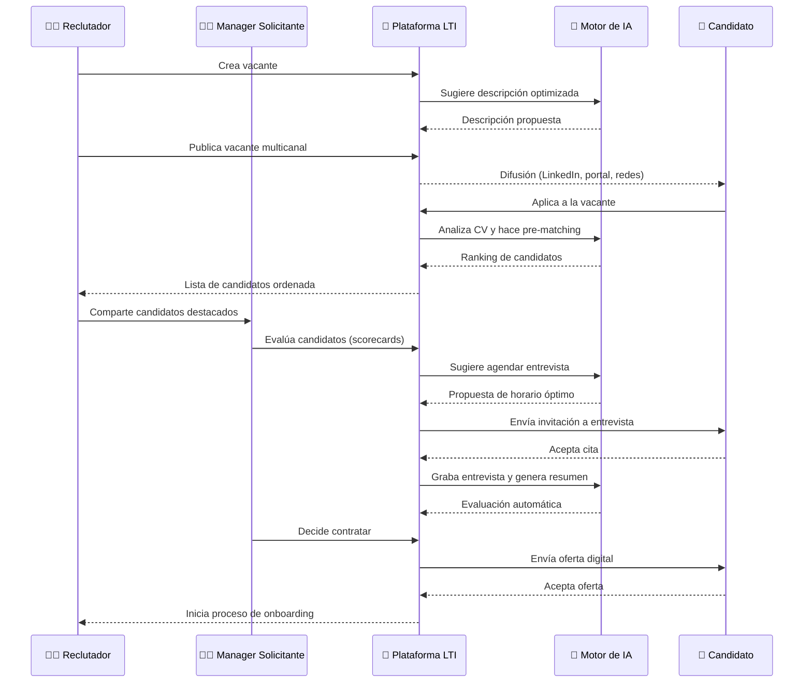
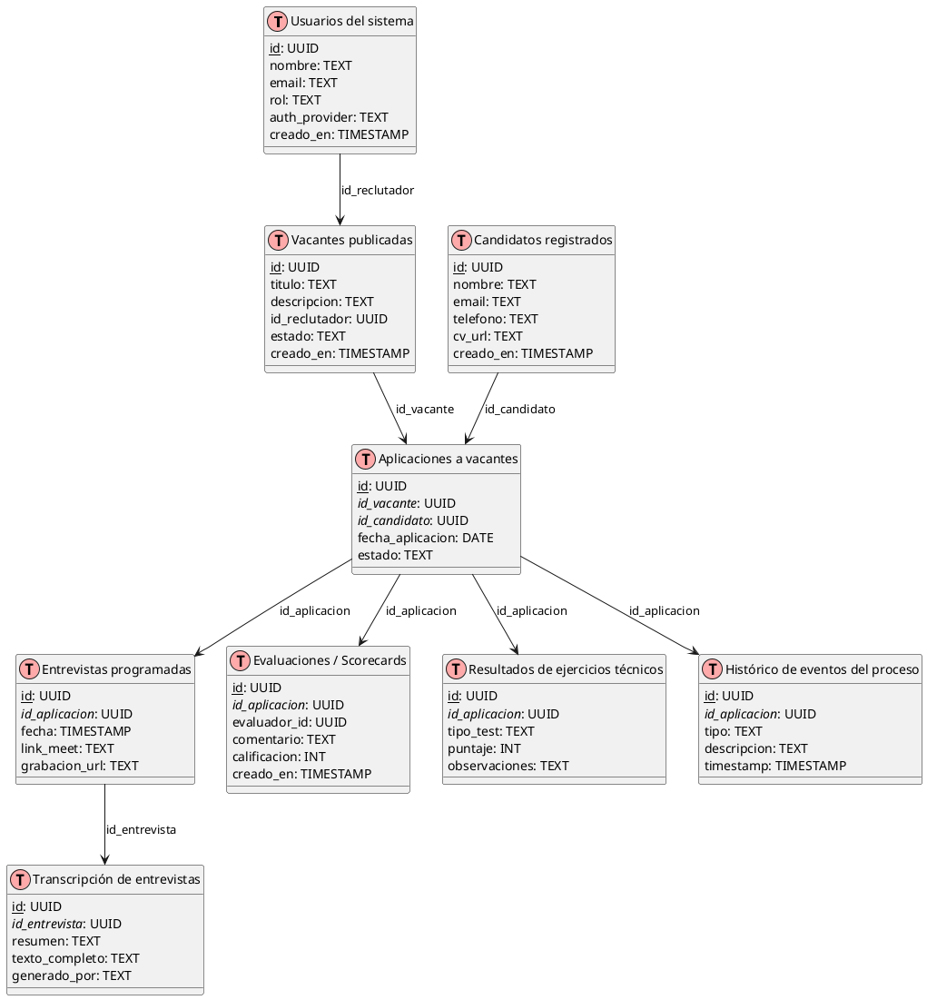

## ✅ Lean Talent Intelligence, aka LTI

**LTI** es una plataforma de gestión completa del proceso de selección y atracción de talento, diseñada para empresas que buscan eficiencia, colaboración y agilidad en sus procesos de reclutamiento. Impulsada por IA y automatizaciones, LTI reduce los tiempos de contratación, mejora la experiencia de los candidatos y facilita la toma de decisiones basada en datos.

### 🚀 Valor añadido

- Automatización de tareas repetitivas que consumen tiempo a los equipos de Capital Humano (RH).
- IA que sugiere mejoras en las descripciones de vacantes y realiza prefiltrado inteligente.
- Matching de candidatos basado en competencias técnicas y soft skills.
- Reducción del time-to-hire y mejora de la calidad de las contrataciones.
- Mejora de la colaboración entre reclutadores, managers de contratación y áreas solicitantes de la vacante.
- Experiencia fluida y moderna para candidatos, compatible con dispositivos móviles.

### 🏆 Ventajas competitivas

- 💬 **Colaboración en tiempo real** entre recruiters y líderes de equipo desde la plataforma, integraciones con Slack, Teams, WhatsApp
- 📊 **Dashboard y analíticas** Balance Score Card, con métricas de atracción y calidad de candidatos.
- 🤖 **Asistente de IA integrado** para sugerencias de candidatos, clasificación y predicción de éxito.
- 🔄 **Automatizaciones** para agendado y grabacion de entrevistas, recordatorios y envío de feedback
- 🌐 **Publicación multicanal** en sitios de empleo, redes sociales y sitio web corporativo.
- 🔐 **Cumplimiento normativo** con leyes de protección de datos como LFPDPPP.
- 🎯 **Aplicación de Ejercicios** Evalua el seniority con testing adecuado para cada perfil, evaluación automática y feedback de mejora a candidatos

## 🧩 Lean Canvas - LTI

| **Problemas**                                                                                                                                                                         | **Segmentos de clientes**                                                                                           |
| ------------------------------------------------------------------------------------------------------------------------------------------------------------------------------------- | ------------------------------------------------------------------------------------------------------------------- |
| - Procesos de contratación lentos y manuales. <br> - Dificultad para filtrar y evaluar grandes volúmenes de candidatos. <br> - Falta de colaboración entre RH y áreas con la vacante. | - Startups en crecimiento. <br> - Empresas medianas y tecnológicas. <br> - Consultoras y agencias de reclutamiento. |

| **Propuesta de valor**                                                                                                   | **Solución**                                                                                                                                                                                                                       |
| ------------------------------------------------------------------------------------------------------------------------ | ---------------------------------------------------------------------------------------------------------------------------------------------------------------------------------------------------------------------------------- |
| - Automatización + IA = mayor eficiencia. <br> - Colaboración en tiempo real. <br> - Matching inteligente de candidatos. | - ATS con pipeline visual, esquema SaaS Cloud. <br> - IA para redactar, filtrar y predecir el éxito de candidatos. <br> - Scorecards colaborativos y automatización de entrevistas, agente avatar entrevistador y transcripciones. |

| **Métricas clave**                                                                                                                                                                  | **Ventaja competitiva**                                                                                                                                      |
| ----------------------------------------------------------------------------------------------------------------------------------------------------------------------------------- | ------------------------------------------------------------------------------------------------------------------------------------------------------------ |
| - Tiempo medio de contratación. <br> - % de entrevistas agendadas automáticamente. <br> - Ratio de conversión de candidatos a contratados. <br> - Tasa de satisfacción de managers. | - IA nativa, no integrada como plugin. <br> - UX intuitiva y mobile-first. <br> - Alto grado de personalización. <br> - Privacidad y cumplimiento normativo. |

| **Canales**                                                                                                                                   | **Estructura de costos**                                                                                                                        |
| --------------------------------------------------------------------------------------------------------------------------------------------- | ----------------------------------------------------------------------------------------------------------------------------------------------- |
| - Sitio web corporativo. <br> - LinkedIn & marketing en redes. <br> - Alianzas con consultoras de RRHH. <br> - Webinars y eventos de HR Tech. | - Infraestructura cloud. <br> - Soporte, mantenimiento, licencias de software. <br> - Equipo de desarrollo continuo. <br> - Marketing y ventas. |

| **Flujo de ingresos**                                                                                                                                                                             |
| ------------------------------------------------------------------------------------------------------------------------------------------------------------------------------------------------- |
| - Suscripción mensual o anual por empresa. <br> - Planes según número de vacantes activas o usuarios. <br> - Servicios premium (IA avanzada, onboarding digital, integraciones, seniority tests). |

## 🔁 Diagrama de Secuencia – Proceso de Selección en LTI

## 🤖 Interacción con IA – ChatGPT (Modelo GPT-4o)

### 🧾 Prompt enviado a ChatGPT:

> **"En base al archivo markdown del sistema LTI ATS, con el avance al momento, el cual te anexo, crea el diagrama de secuencia en formato mermaid, y también dame el texto del mermaid para agregarlo e integrarlo al archivo maestro markdown el cual debo documentar y entregar como un archivo único."**

Lo que se tenia al momento es la descripcion del proyecto y el Lean Canvas. Es decir el texto hasta esta seccion que estas viendo.

---

### 💬 Respuesta generada por ChatGPT (Modelo GPT-4o):

Con base en la descripción funcional y el flujo natural de un sistema ATS, se generó el siguiente **diagrama de secuencia en formato Mermaid**, que representa el proceso desde la creación de una vacante hasta la contratación del candidato, incorporando automatización e IA como componentes clave de LTI.

> ⚠️ **Nota importante para visualizar los diagramas Mermaid y PlantUML**
> Si estás abriendo este archivo `.md` fuera de GitHub (por ejemplo, en Visual Studio Code), es posible que los diagramas no se muestren automáticamente.
>
> Para una visualización adecuada, se recomienda instalar las extensiónes:
> 👉 [Mermaid Preview - Visual Studio Marketplace](https://marketplace.visualstudio.com/items?itemName=vstirbu.vscode-mermaid-preview)
> 👉 [PlantUML Preview - Visual Studio Marketplace](https://marketplace.visualstudio.com/items?itemName=jebbs.plantuml)
>
> Para el caso de PlantUML, asegurate de utilizar el render en modo servidor:
> Abre la Paleta de Comando, en MAC: Presiona ⇧ + ⌘ + P (Shift + Comando + P)
> Y Escribe lo siguiente:
>
> ```yaml
> Preferences: Open Settings (JSON)
> ```

> ```json
> {
>   "plantuml.render": "PlantUMLServer",
>   "plantuml.server": "https://www.plantuml.com/plantuml",
>   "plantuml.previewAutoUpdate": true,
>   "plantuml.exportFormat": "png"
> }
> ```

> Esto permitirá ver correctamente todos los diagramas integrados en el archivo sin necesidad de exportarlos manualmente.



## 🧠 Interacción con IA – ChatGPT (Modelo GPT-4o)

### 🧾 Prompt enviado a ChatGPT:

> **"Con base al archivo y descripción del proyecto LTI de ATS, el cual te anexo, diseña el diagrama C4 utilizando PlantUML."**

---

### 💬 Respuesta generada por ChatGPT (Modelo GPT-4o):

Se generó un **Diagrama C4 de Nivel 1 (Contexto)** usando PlantUML, que representa al sistema **LTI - Lean Talent Intelligence** y su interacción con los actores principales y sistemas externos.

A continuación se incluye el código fuente generado por la IA y posteriormente, la imagen exportada en formato `.png`.

---

### 📄 Código PlantUML generado

```plantuml
@startuml LTI_Context
!includeurl https://raw.githubusercontent.com/plantuml-stdlib/C4-PlantUML/master/C4_Context.puml

' Definir sistema
System_Boundary(s1, "LTI - Lean Talent Intelligence") {
    System(lti, "Plataforma LTI", "ATS con IA y automatización de procesos de reclutamiento")
}

' Actores externos
Person(recruiter, "Usuario RH", "Publica vacantes y gestiona el proceso de selección")
Person(manager, "Hiring Manager", "Evalúa candidatos y aprueba contrataciones")
Person(candidate, "Candidato", "Aplica a vacantes y realiza entrevistas")
System_Ext(jobBoards, "Bolsas de trabajo", "LinkedIn, OCC, Indeed, etc.")
System_Ext(messaging, "Canales de comunicación", "Slack, Teams, WhatsApp")

' Relaciones
recruiter -> lti : Crea vacantes y administra candidatos
manager -> lti : Evalúa perfiles y decide contrataciones
candidate -> lti : Aplica a vacantes, responde tests y entrevistas
lti -> jobBoards : Publicación multicanal automática
lti -> messaging : Envío de notificaciones y colaboración
@enduml
```

## 🧠 Interacción con IA – ChatGPT (Modelo GPT-4o)

### 🧾 Prompt enviado a ChatGPT:

> **"Crea ahora el C4 Nivel 2 (Contenedores) en PlantUML para describir la arquitectura interna de LTI, por ejemplo, frontend, backend, motor de IA, base de datos, y los que consideres necesario, si tienes dudas para realizar el trabajo pregúntame."**

Se respondió a las siguientes preguntas técnicas para construir el modelo con precisión:

1. El motor de IA vive como servicio independiente.
2. El frontend será desarrollado en React.
3. El sistema usará autenticación propia, con opción a login mediante Google y LinkedIn.
4. Se utilizará PostgreSQL como base de datos relacional principal.
5. Las entrevistas se realizarán con Google Meet, y su grabación/transcripción será almacenada en MinIO vía automatización con Zapier.

Además:

- El backend estará desarrollado en **Node.js + Express**.
- Las notificaciones internas se harán por **correo y Slack**, y hacia candidatos por **correo y WhatsApp (opcional)**.
- Se contará con un **data warehouse** alojado en servicios de Amazon Web Services.
- Para el Diagrama de Plant UML, Usar Rel con el parámetro position para forzar la colocación relativa entre contenedores y que no se vea una sola linea con todos los contenedores.

---

### 💬 Respuesta generada por ChatGPT (Modelo GPT-4o):

A continuación se presenta el **Diagrama C4 de Nivel 2 (Contenedores)** del sistema **LTI - Lean Talent Intelligence**, modelado en PlantUML, que muestra su arquitectura interna distribuida:

---

### 📄 Código PlantUML generado

```plantuml
@startuml LTI_Containers
!includeurl https://raw.githubusercontent.com/plantuml-stdlib/C4-PlantUML/master/C4_Container.puml

Person(recruiter, "Usuario RH", "Gestiona vacantes y candidatos")
Person(manager, "Hiring Manager", "Evalúa y aprueba candidatos")
Person(candidate, "Candidato", "Aplica a vacantes y responde entrevistas")

System_Boundary(s1, "LTI - Lean Talent Intelligence") {

  Container(webapp, "Web App", "React", "Interfaz principal para todos los usuarios")
  Container(auth, "Servicio de Autenticación", "OAuth + JWT", "Login nativo, Google y LinkedIn")
  Container(api, "API Backend", "Node.js + Express", "Lógica de negocio y servicios REST")
  Container(ai, "Motor de IA", "Python + FastAPI", "Clasificación de CVs, matching, análisis de entrevistas")
  Container(db, "Base de Datos Principal", "PostgreSQL", "Datos transaccionales")
  Container(blob, "Storage de Documentos", "S3 / MinIO", "CVs, transcripciones, contratos")
  Container(dw, "Data Warehouse", "Amazon Redshift / Athena", "Dashboards y KPIs")
  Container(notify, "Notificaciones", "Correo, Slack, WhatsApp", "Comunicación con usuarios")
}

System_Ext(linkedin, "LinkedIn / OCC", "Bolsas de empleo")
System_Ext(comm, "Slack / WhatsApp", "Mensajería")
System_Ext(googleauth, "Google Identity", "Proveedor de autenticación federada")
System_Ext(meet, "Google Meet", "Entrevistas")
System_Ext(zapier, "Zapier", "Automatización: Meet → Storage")

' Relaciones visibles y forzando posición para distribución vertical
recruiter -> webapp : Crea vacantes
manager -> webapp : Evalúa candidatos
candidate -> webapp : Aplica

webapp --> auth : Solicita login
auth --> googleauth : OAuth externo
webapp --> api : Llama servicios REST

api --> db : Lee/escribe datos
api --> ai : Solicita predicción / análisis
api --> blob : Guarda/lee archivos
api --> dw : Envía datos analíticos
api --> notify : Envia mensajes
api --> linkedin : Publica vacantes

ai --> blob : Guarda transcripción
zapier --> blob : Carga grabaciones
meet --> zapier : Dispara proceso

notify --> comm : Slack / WhatsApp

' DISTRIBUCIÓN FORZADA
Rel(webapp, api, "↓", "Backend", "down")
Rel(api, db, "↓", "DB Relacional", "down")
Rel(api, ai, "right", "Motor IA", "right")
Rel(api, blob, "right", "Archivos", "right")
Rel(api, notify, "left", "Mensajería", "left")
Rel(api, dw, "down", "Analytics", "down")
@enduml

```

## 🧠 Interacción con IA – ChatGPT (Modelo GPT-4o)

### 🧾 Prompt enviado a ChatGPT:

> **"Vamos a hacer el C3 del contenedor de notificaciones, proporcióname el código en formato PlantUML. Usa Rel(..., ..., 'down') y 'right' para forzar la distribución visual. Pregúntame lo que consideres necesario si tienes duda para hacer tu trabajo."**

Se respondieron los siguientes puntos clave:

- El log de notificaciones se guarda en una base de datos **No Relacional** tipo MongoDB, usando **Amazon DocumentDB**.
- **SlackAdapter** se comunica mediante API oficial.
- **WhatsAppAdapter** se conecta con candidatos vía **Twilio API**.

---

### 💬 Respuesta generada por ChatGPT (Modelo GPT-4o):

A continuación se presenta el **Diagrama C4 – Nivel 3** del **Servicio de Notificaciones**, representando sus componentes internos, sus responsabilidades y relaciones entre ellos. Se utiliza distribución explícita de elementos para mejorar la legibilidad visual del sistema.

---

### 📄 Código PlantUML generado

```plantuml
@startuml LTI_Notifications
!includeurl https://raw.githubusercontent.com/plantuml-stdlib/C4-PlantUML/master/C4_Component.puml

Container(notify, "Servicio de Notificaciones", "Node.js", "Envía alertas a usuarios por correo, Slack y WhatsApp")

' Componentes internos
Component(dispatcher, "Dispatcher", "Core", "Orquesta el envío según evento y canal")
Component(scheduler, "Scheduler", "Programador", "Administra recordatorios y tareas programadas")
Component(template, "Template Engine", "Motor de plantillas", "Genera mensajes personalizados por canal")

Component(email, "CorreoInterno", "Email Sender", "Envía notificaciones a RH, managers y candidatos")
Component(slack, "SlackAdapter", "Slack API", "Envía mensajes a canales o usuarios vía API")
Component(whatsapp, "WhatsAppAdapter", "Twilio API", "Mensajes a candidatos a través de Twilio")

Component(logs, "LogStore", "Amazon DocumentDB", "Registra todos los intentos de notificación (éxito/error)")

' Relaciones internas y layout forzado
Rel(notify, dispatcher, "↓", "Enrutador principal", "down")
Rel(dispatcher, template, "right", "Solicita cuerpo del mensaje")
Rel(dispatcher, scheduler, "down", "Encola recordatorios")
Rel(dispatcher, email, "right", "Envía correo")
Rel(dispatcher, slack, "down", "Notifica vía Slack API")
Rel(dispatcher, whatsapp, "right", "Envía WhatsApp vía Twilio")
Rel(dispatcher, logs, "down", "Guarda evento en DocumentDB")

@enduml
```

## 🧠 Interacción con IA – ChatGPT (Modelo GPT-4o)

### 🧾 Prompt enviado a ChatGPT:

> **"Por último y para finalizar dame un diagrama ERD entidad relación de la base de datos principal de PostgreSQL, para el sistema LTI, ATS, en base al avance que tengo en archivo markdown que te anexo. Acomoda todo para un layout más claro. Pregúntame lo que necesites para hacer mejor tu trabajo."**

---

### 💬 Respuesta generada por ChatGPT (Modelo GPT-4o):

A continuación se presenta el **Diagrama Entidad-Relación (ERD)** de la base de datos principal del sistema **LTI (Lean Talent Intelligence)** en PostgreSQL. El modelo fue elaborado con base en las funcionalidades descritas en el documento y siguiendo las buenas prácticas de normalización.

---

### 📄 Código PlantUML generado


