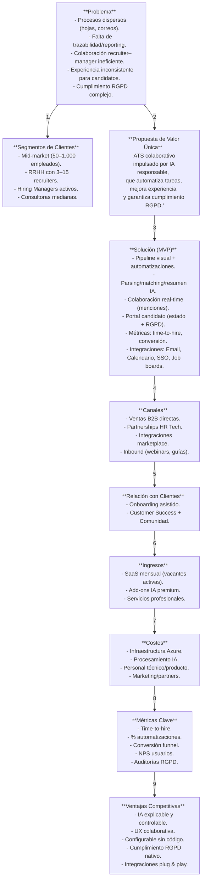
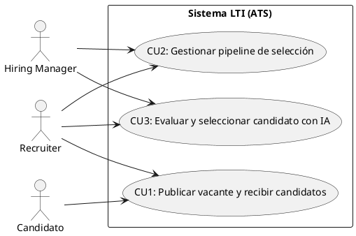
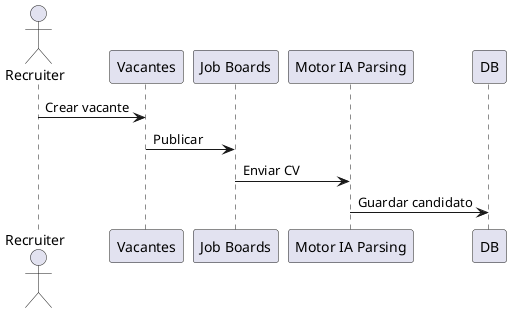
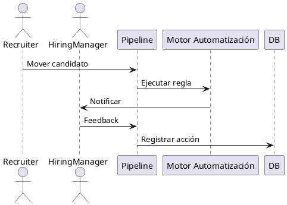
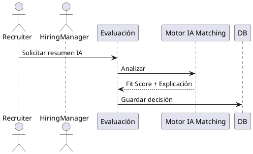
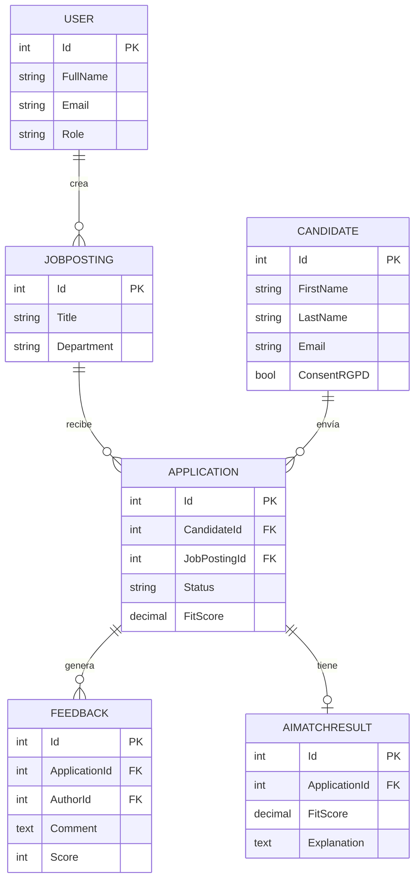
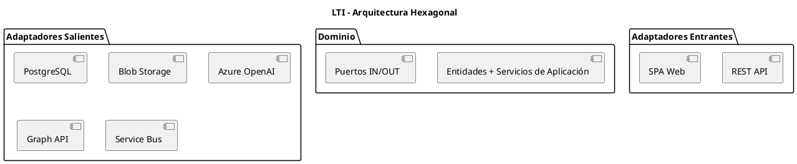
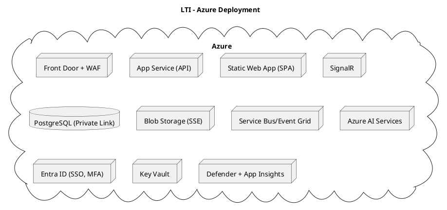

# 🧩 LTI-FJLTT.md  
### Sistema ATS — *Larga Cola de Talento e Integración*  
**Máster AI4Devs — Práctica de Diseño de Sistemas**

---

## 01️⃣ Lean Canvas — *Visión general del producto*

### 🧠 Explicación y Decisiones

El Lean Canvas define la estrategia inicial del ATS **LTI (Larga Cola de Talento e Integración)**.  
Su propósito es priorizar problemas, soluciones y ventajas competitivas para el segmento B2B mid-market.  
El objetivo central es reducir la carga operativa de los recruiters, mejorar la colaboración con los hiring managers y automatizar tareas repetitivas mediante IA responsable.  

El MVP se centrará en parsing y matching IA, flujo visual de pipeline, colaboración en tiempo real y cumplimiento RGPD.  
La diferenciación se logra con una UX moderna, automatizaciones simples y explicabilidad IA nativa.  
El modelo SaaS por vacantes activas reduce fricción comercial y facilita escalado por cliente.  
Azure se selecciona por su integración con ecosistemas empresariales y servicios gestionados de seguridad (Entra ID, Key Vault, Defender).



---

## 02️⃣ Casos de Uso Principales

### 🎯 Explicación General

Los tres casos de uso cubren el flujo completo del ATS: publicación de vacantes, gestión del pipeline y evaluación con IA.  
Se eligieron por su valor demostrable en el MVP y su trazabilidad hacia los objetivos del Lean Canvas (eficiencia, colaboración e IA responsable).



#### CU1 - Publicar vacante y recibir candidatos

Permite crear vacantes y conectar con fuentes externas. Incluye parsing IA y deduplicación.


#### CU2 - Gestionar pipeline de selección

Control visual del estado de candidatos, colaboración recruiter–manager y automatizaciones.


#### CU3 - Evaluar y seleccionar candidato con IA

Genera resumen IA, fit score y explicación transparente.


---

## 03️⃣ Modelo de Datos

### 🧱 Explicación del diseño

Basado en los casos CU1–CU3, se estructura en torno a la entidad `Application`, que conecta candidatos y vacantes.  
El modelo sigue principios de normalización, auditabilidad y RGPD.  
Se incluyen tablas para IA (resultados y resúmenes), pipeline y automatizaciones.


---

## 04️⃣ Arquitectura a Alto Nivel (Hexagonal + Azure + SOLID)

### 🧠 Explicación General

Se implementa **Arquitectura Hexagonal** siguiendo **principios SOLID**.  
El dominio queda desacoplado de infraestructura gracias a puertos y adaptadores.  
Azure provee seguridad, escalabilidad y observabilidad integrada.



### ☁️ Despliegue en Azure (con seguridad)



#### Principales componentes de seguridad Azure
- **Entra ID** para SSO y MFA.  
- **Key Vault** para secretos y Managed Identity.  
- **Private Link / RBAC / DDoS Protection**.  
- **Defender for Cloud + App Insights** para observabilidad y postura de seguridad.

---

## 05️⃣ C4 - Motor de Evaluación/Matching IA

### 🧩 Explicación General

El servicio IA calcula **fit score** candidato–vacante y genera **resúmenes explicables**.  
Está desacoplado del Core ATS y diseñado para trazabilidad, portabilidad y control de costes.

#### C4-Context
```plantuml
@startuml
Person(recruiter, "Recruiter")
System(ats, "Core ATS")
System(aimatch, "Motor IA Evaluación/Matching")
System_Ext(azureai, "Azure OpenAI")

recruiter -> ats : Usa
ats -> aimatch : Solicita fit/resumen
aimatch -> azureai : Inferencias
@enduml
```

#### C4-Container
```plantuml
@startuml
Container(api, "API Core", "ASP.NET")
ContainerDb(pg, "PostgreSQL", "Azure Database")
Container_Boundary(ai, "Servicio IA") {
 Container(orch, "AI Orchestrator", "Worker Service")
 Container(redis, "Redis", "Cache embeddings")
 ContainerDb(pgvec, "pgvector", "Vector Store")
 Container(adapter, "Model Adapter", "Azure OpenAI")
}
api -> orch
orch -> adapter
orch -> pgvec
@enduml
```

#### C4-Component
```plantuml
@startuml
Container_Boundary(ai, "Servicio IA") {
 Component(ing, "Extractor Features")
 Component(embed, "Embedding Generator")
 Component(match, "Matching Engine")
 Component(exp, "Explicador")
 Component(guard, "Guardrails")
 Component(tel, "Telemetry")
}
ing -> embed
embed -> match
match -> exp
exp -> tel
@enduml
```

#### Consideraciones
- **Guardrails**: redacción PII, límites, auditoría.  
- **Telemetría ML**: precisión@K, drift, coste/inferencia.  
- **pgvector + Redis** para búsqueda semántica eficiente.  
- **Portabilidad IA** mediante adaptadores.  
- **Ejecución** on-demand y batch asíncrona vía Service Bus.

---

## ✅ Resumen Ejecutivo
1. ATS **colaborativo e inteligente** con IA explicable.  
2. **Hexagonal**, **SOLID**, **Azure-first**.  
3. **RGPD by design** y seguridad gestionada.  
4. **Casos CU1–CU3** = flujo completo del reclutamiento.  
5. **Modelo de datos** centrado en Application.  
6. **Arquitectura** modular, escalable y auditable.  
7. **Motor IA** portable, medible y ético.  
8. **Telemetría** y métricas integradas.  
9. **Cumplimiento** con RGPD/privacidad.  
10. **Preparado** para multi-tenant y evolución futura.

---

## ❓Cuestiones Abiertas
1. Umbrales de fit score globales o por tenant.  
2. Uso de Cognitive Search desde MVP.  
3. Retención de embeddings alineada a RGPD.  
4. SLA de latencia IA (<2s).  
5. Aprendizaje continuo de ponderaciones.
