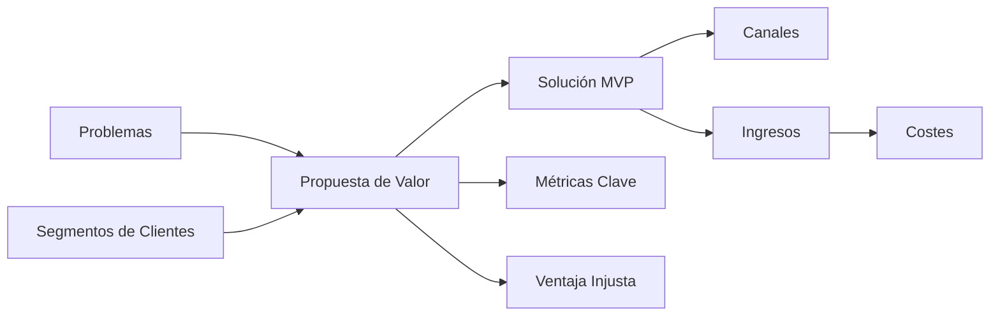
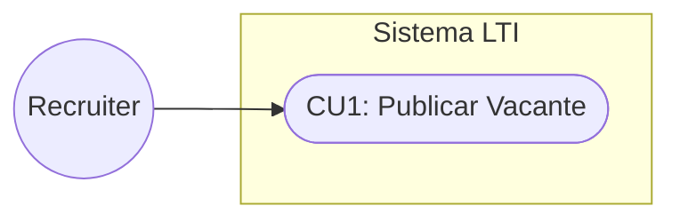
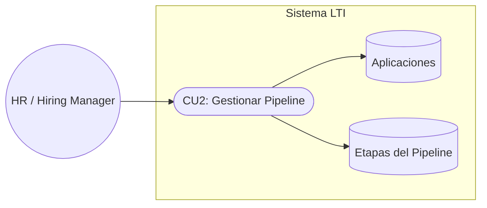
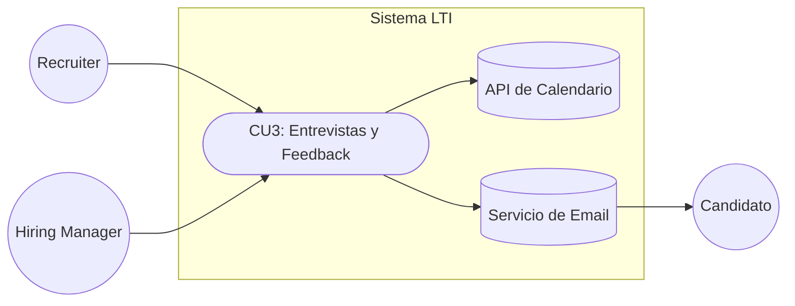
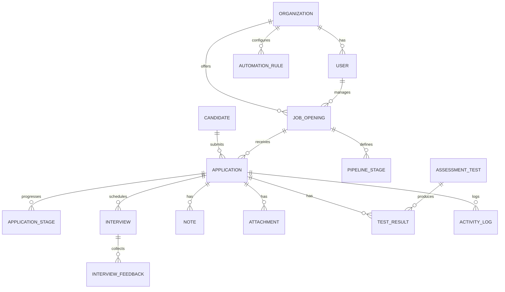
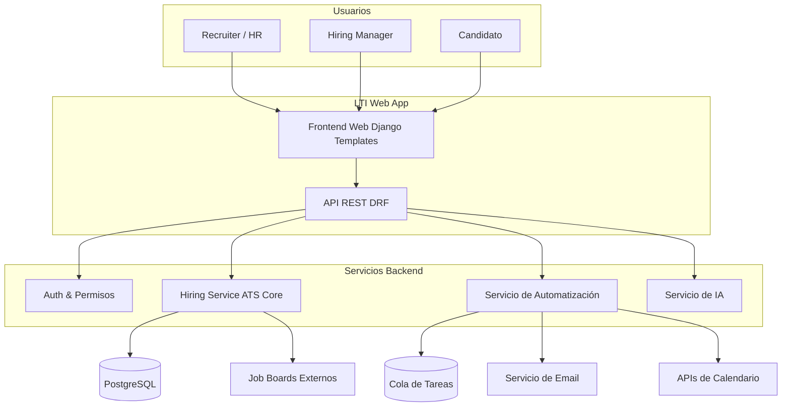
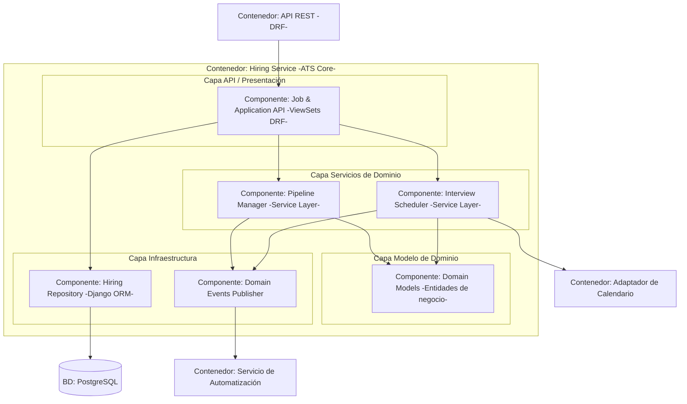

links: 
tags: 
_____
**Documento inicial – Diseño, análisis y arquitectura (MVP)**

# **1. Visión General del Producto**

## **1.1 ¿Qué es LTI?**

**LTI** es un Applicant Tracking System (ATS) moderno diseñado para mejorar radicalmente la eficiencia con la que las empresas gestionan sus procesos de reclutamiento.

Permite:
- Crear vacantes
- Publicarlas en múltiples canales
- Recibir candidatos
- Gestionar pipelines visuales
- Automatizar tareas
- Programar entrevistas
- Registrar evaluaciones
- Contratar candidatos

LTI está pensado para ser:
- **Multi-tenant** desde el diseño
- **Modular**, fácil de escalar
- **Asistido por IA**, con automatizaciones inteligentes
- **Basado en OpenSpec**, asegurando consistencia entre modelo, API y base de datos

## **1.2 Valor Añadido y Ventajas Competitivas**

- **Automatización avanzada**
    - Envío automático de emails
    - Movimiento de candidatos entre etapas
    - Activación de pruebas
    - Alertas internas por condiciones
    
- **Colaboración en tiempo real**
    - Comentarios en candidatos
    - Menciones a usuarios
    - Scorecards compartidos
    
- **IA integrada**
    - Redacción de descripciones de puesto
    - Parser inteligente de CV
    - Ranking de candidatos
    - Sugerencias de preguntas de entrevista
    
- **Visibilidad total del proceso**
    - KPIs del embudo de talento
    - Medición de time-to-hire
    - Origen de candidatos y efectividad
    
- **Configurabilidad fácil**
    - Pipelines por vacante
    - Campos personalizados
    - Reglas de automatización editables

# **2. Lean Canvas de LTI**

## **2.1 Tabla Lean Canvas**

| **Bloque**                | **Contenido**                                                                |
| ------------------------- | ---------------------------------------------------------------------------- |
| **Problemas**             | Procesos dispersos, falta de métricas, tareas manuales repetitivas.          |
| **Segmentos de Clientes** | Startups, PYMES, empresas medianas, agencias de reclutamiento.               |
| **Propuesta de Valor**    | “Contratar más rápido y mejor con automatización + IA + experiencia simple.” |
| **Solución**              | Gestión de vacantes, pipeline visual, entrevistas, IA y automatizaciones.    |
| **Canales**               | SaaS, partners HR, contenido, demos, webinars.                               |
| **Ingresos**              | Suscripción mensual + escalado por número de vacantes activas.               |
| **Costes**                | Infraestructura, desarrollo, soporte, marketing.                             |
| **Métricas Clave**        | Churn, adopción de funciones, time-to-hire, clientes activos.                |
| **Ventaja Injusta**       | OpenSpec + IA → arquitectura sólida y rápida evolución del producto.         |

## **2.2 Lean Canvas (Diagrama estándar)**

# **3. Casos de Uso Principales**

Los tres flujos esenciales del MVP:
1. **CU1 – Publicar nueva vacante**
2. **CU2 – Gestionar pipeline de candidatos**
3. **CU3 – Programar entrevistas y registrar feedback**

## **3.1 CU1 – Publicar una Nueva Vacante**
  
### **Descripción**
**Actor principal:** Recruiter / HR
**Objetivo:** Crear y publicar una vacante con un pipeline definido.

**Flujo principal:**
1. El recruiter selecciona “Crear vacante”.
2. Completa título, ubicación, requisitos, salario y modalidad.
3. Define el pipeline (etapas) asociado a la vacante.
4. Guarda y publica la vacante en la página de empleos.
5. (Opcional) Comparte el enlace en redes o job boards.
  
### **Diagrama CU1 (estándar)**

## **3.2 CU2 – Gestionar el Pipeline de Candidatos**
### **Descripción**
  
**Actores:** Recruiter / Hiring Manager
**Objetivo:** Visualizar y mover candidatos entre etapas del pipeline.

**Flujo principal:**
1. El usuario abre la vista de pipeline de una vacante.
2. Visualiza las columnas (Aplicado, Screening, Entrevista, Oferta, Contratado…).
3. Arrastra candidatos entre columnas o usa acciones rápidas.
4. Marca candidatos como descartados o talento futuro.
5. Se disparan automatizaciones (emails, tareas) según reglas.

### **Diagrama CU2 (estándar)**

## **3.3 CU3 – Programar Entrevistas y Registrar Feedback**
### **Descripción**
  
**Actor principal:** Recruiter
**Actores secundarios:** Hiring Manager, Candidato

**Objetivo:** Programar entrevistas sincronizadas con calendario y registrar feedback mediante scorecards.
  
**Flujo principal:**
1. El recruiter selecciona un candidato en una etapa de entrevista.
2. Elige “Programar entrevista” y define tipo, duración y entrevistadores.
3. El sistema consulta disponibilidad en calendarios conectados.
4. Se selecciona un horario y se envían invitaciones por email.
5. Tras la entrevista, cada entrevistador registra su scorecard.
6. El sistema calcula un score global y lo asocia a la aplicación.

### **Diagrama CU3 (estándar)**

# **4. Modelo de Datos**
  
## **4.1 Diagrama ER (Entidad–Relación)**

## **4.2 Entidades y atributos principales**

  

> Tipos indicativos (luego se mapean a tipos concretos en PostgreSQL).

### **ORGANIZATION**
- id : UUID
- name : string
- slug : string
- timezone : string
- plan_type : enum (free, standard, enterprise)
- created_at : datetime
- updated_at : datetime
### **USER**
- id : UUID
- organization_id : UUID (FK → ORGANIZATION)
- email : string
- full_name : string
- role : enum (admin, recruiter, hiring_manager, viewer)
- is_active : boolean
- created_at : datetime

### **CANDIDATE**
- id : UUID
- full_name : string
- email : string
- phone : string
- location : string
- linkedin_url : string
- source : enum (job_board, referral, internal, other)
- resume_url : string
- created_at : datetime
### **JOB_OPENING**
- id : UUID
- organization_id : UUID (FK)
- owner_id : UUID (FK → USER)
- title : string
- department : string
- location : string
- employment_type : enum (full_time, part_time, contractor, internship)
- salary_range_min : numeric
- salary_range_max : numeric
- description : text
- status : enum (draft, open, paused, closed)
- published_url : string
- created_at : datetime
- updated_at : datetime

### **APPLICATION**
- id : UUID
- job_opening_id : UUID (FK → JOB_OPENING)
- candidate_id : UUID (FK → CANDIDATE)
- status : enum (applied, in_process, offer, hired, rejected)
- current_stage_id : UUID (FK → PIPELINE_STAGE)
- source_detail : string
- applied_at : datetime
- decision_at : datetime

### **PIPELINE_STAGE**
- id : UUID
- job_opening_id : UUID (FK → JOB_OPENING)
- name : string
- order_index : integer
- stage_type : enum (applied, screening, interview, offer, hired, rejected)

### **APPLICATION_STAGE**
- id : UUID
- application_id : UUID (FK → APPLICATION)
- pipeline_stage_id : UUID (FK → PIPELINE_STAGE)
- entered_at : datetime
- exited_at : datetime
- outcome : enum (passed, failed, skipped, in_progress)

### **INTERVIEW**
- id : UUID
- application_id : UUID (FK → APPLICATION)
- scheduled_by_id : UUID (FK → USER)
- type : enum (online, onsite, phone)
- scheduled_start : datetime
- scheduled_end : datetime
- location : string
- status : enum (scheduled, completed, cancelled)
- external_event_id : string

### **INTERVIEW_FEEDBACK**
- id : UUID
- interview_id : UUID (FK → INTERVIEW)
- reviewer_id : UUID (FK → USER)
- score_overall : integer
- scores_breakdown : json
- comments : text
- recommendation : enum (strongly_yes, yes, neutral, no, strongly_no)
- created_at : datetime

# **5. Diseño del Sistema a Alto Nivel**
  
## **5.1 Descripción de la arquitectura**
  
Componentes principales:

1. **Web Frontend (Django Templates)**
    - Interfaces para HR, recruiters y candidatos.
    - Componentes interactivos (pipeline tipo kanban).
    
2. **API Backend (Django REST Framework)**
    - Endpoints para vacantes, candidatos, aplicaciones, entrevistas, etc.
    - Aplica autenticación, autorización y validaciones.
    
3. **Hiring Service (ATS Core)**
    - Implementa la lógica de negocio para pipelines, aplicaciones y entrevistas.
    - Emite eventos cuando cambian estados relevantes (por ejemplo, aplicación movida de etapa).
    
4. **Servicio de Automatización**
    - Evalúa reglas configuradas por la organización.
    - Dispara acciones: enviar email, mover de etapa, crear tareas internas.
    
5. **Servicio de IA**
    - Parser de CV y extracción de skills.
    - Ranking de candidatos.
    - Generación de descripciones de puesto y mensajes.
    
6. **Base de Datos PostgreSQL**
    - Almacena entidades de dominio en modo multi-tenant.
    
7. **Integraciones Externas**
    - Calendarios (Google/Microsoft).
    - Servicios de email transaccional.
    - Portales de empleo externos.
    
## **5.2 Diagrama de Arquitectura (estándar)**

# **6. Diagrama de Componentes tipo C4 (vista interna de Hiring Service) – Versión estándar**

## **6.1 Descripción del componente**
  
Responsabilidades del Hiring Service:
- Gestionar entidades de dominio: JobOpening, Candidate, Application, PipelineStage, Interview, InterviewFeedback.
- Aplicar reglas de negocio (qué etapas son válidas, restricciones de estado, etc.).
- Coordinar la programación de entrevistas junto con el adaptador de calendario.
- Publicar eventos hacia el Servicio de Automatización cuando cambian estados clave.
  

## **6.2 Diagrama de componentes (tipo C4 )**

# **7. Próximos pasos sugeridos**
- Convertir estos casos de uso en **user stories** con criterios de aceptación.
- Definir la especificación completa en **OpenSpec** para alinear modelo, API y BD.
- Priorizar el backlog del MVP (sprints iniciales).
- Diseñar mockups de UI para: vista de pipeline, detalle de vacante y detalle de candidato.

---
Created on: 2025-11-17 at 18:02

