# **LTI — Applicant Tracking System de Nueva Generación**

## 🚀 Elevator Pitch
LTI es un Applicant Tracking System (ATS) impulsado por inteligencia artificial que automatiza cada etapa del proceso de contratación —desde la publicación hasta la oferta—, optimizando la colaboración entre reclutadores y managers en tiempo real y reduciendo drásticamente el *time-to-hire*.  
Diseñado para equipos modernos de HR, LTI convierte el proceso de selección en una experiencia ágil, colaborativa y basada en datos.

---

## 💡 Ventajas Competitivas (ordenadas por impacto)

1. **Automatización inteligente de workflows**  
   Reglas configurables que ejecutan acciones automáticas (filtrar, mover candidatos, notificar, asignar entrevistas) reduciendo tareas repetitivas hasta un 60%.

2. **Asistencia de IA en cada fase del pipeline**  
   Screening inteligente, ranking de candidatos, resúmenes de CV, detección de *bias*, generación de descripciones de puestos y mensajes de oferta personalizados.

3. **Colaboración en tiempo real entre HR y managers**  
   Comentarios, evaluaciones y aprobaciones sincronizadas al instante; interfaz compartida con roles y permisos dinámicos.

4. **Analítica avanzada y dashboards interactivos**  
   Métricas visuales sobre embudos de contratación, fuentes de candidatos, productividad de reclutadores y diversidad.

5. **Integraciones nativas y extensibilidad**  
   Integraciones directas con LinkedIn, Indeed, Slack, Google Calendar, Microsoft Teams y APIs abiertas para HRIS/CRM externos.

6. **Experiencia del candidato optimizada (CX)**  
   Portal responsive, notificaciones automáticas, tests en línea y seguimiento transparente del estado de la aplicación.

7. **Cumplimiento normativo y *bias check* integrado**  
   Control de privacidad (GDPR), trazabilidad de evaluaciones y alertas automáticas ante posibles sesgos o incumplimientos.

---

## 🧩 Funciones Principales

### **1. Publicación**
- Creación y aprobación colaborativa de ofertas.  
- Multiposting automático en portales, redes y web corporativa.  
- Generación asistida de descripciones de puesto mediante IA.

### **2. Sourcing**
- Ingesta automática desde bolsas externas y referidos.  
- Detección de duplicados y consolidación de perfiles.  
- Enriquecimiento de datos del candidato con IA (social, skills, seniority).

### **3. Screening**
- Ranking inteligente basado en criterios configurables y modelos ML.  
- Filtros por knockout questions y scorecards personalizadas.  
- Chatbot inicial de preselección (opcional).  
- Resúmenes automáticos de CVs largos.

### **4. Entrevistas**
- Agenda inteligente con sincronización de calendarios y zonas horarias.  
- Panel colaborativo de entrevistadores.  
- Feedback guiado y evaluaciones automáticas por IA.  
- Seguimiento de status (scheduled, done, no-show, canceled).

### **5. Ofertas**
- Generación automática de ofertas y contratos.  
- Aprobación y firma digital integrada.  
- Asistente IA para redactar correos y negociaciones personalizadas.  
- Seguimiento de aceptación y alertas de caducidad.

### **6. Cumplimiento**
- Gestión de consentimientos (GDPR, EEO).  
- Control de versiones y logs de decisiones.  
- Detección de sesgos y alertas éticas en IA.

### **7. Analítica**
- Paneles en tiempo real: *time-to-hire*, *conversion per stage*, *drop-off rate*.  
- Desglose por fuente, rol, recruiter y diversidad.  
- Alertas automáticas ante cuellos de botella.

### **8. Integraciones**
- HRIS (BambooHR, Personio, Workday).  
- Slack / Teams (notificaciones y feedback).  
- Google Workspace / Microsoft 365 (calendarios y contactos).  
- API REST y Webhooks para extensibilidad.

---

## 📈 Métricas Clave

### **North Star Metric**
> **Time-to-hire efficiency ratio** = (Contrataciones completadas / Horas totales invertidas por HR)  
> Mide la eficiencia global del sistema para cerrar vacantes con menor esfuerzo operativo.

### **Métricas de Producto y Operación**
1. **Time-to-fill**: días promedio desde publicación a contratación.  
2. **Automation Coverage (%)**: % de tareas realizadas automáticamente.  
3. **Screening Accuracy**: correlación entre ranking IA y contratación final.  
4. **Candidate Satisfaction Score (CSAT)**: feedback del candidato post-proceso.  
5. **Recruiter Productivity Index**: ratio de candidatos gestionados por reclutador/día.  
6. **Hiring Manager Engagement**: % de feedbacks entregados dentro del SLA.  
7. **Pipeline Conversion Rate**: porcentaje de avance entre etapas.  
8. **Offer Acceptance Rate**: % de ofertas aceptadas sobre enviadas.

---

### 🧭 Supuestos de diseño inicial
- LTI está dirigido a **departamentos de RRHH de medianas empresas (100–1.000 empleados)**.  
- Mercado objetivo: **Europa y Latinoamérica**.  
- Modelo de negocio: **SaaS B2B con planes por usuario y módulo IA Premium**.  
- Integración prevista con **Google Workspace y Slack** en la primera versión (MVP).

---

# **Lean Canvas — LTI ATS**

**Problema**  
- [x] Los equipos de RRHH invierten demasiado tiempo en tareas manuales de filtrado, seguimiento y comunicación.  
- [x] La colaboración entre reclutadores y managers es lenta y fragmentada, con múltiples herramientas no integradas.  
- [x] Los procesos de selección carecen de analítica clara, lo que impide optimizar tiempos, fuentes y calidad de contratación.  

---

**Segmentos de clientes**  
- [x] HR/Recruiters en medianas y grandes empresas  
- [x] Hiring Managers  
- [x] Talent Ops / People Analytics  
- [x] Startups en crecimiento con alto volumen de contratación  
- [x] Consultoras de reclutamiento con múltiples clientes  

---

**Propuesta de valor única**  
- [x] ATS inteligente que automatiza y conecta todo el proceso de contratación, integrando IA para ranking, screening y scheduling, y facilitando la colaboración en tiempo real entre HR y managers.  

---

**Solución (alto nivel)**  
- [x] Plataforma SaaS con módulos de publicación, sourcing, screening, entrevistas, ofertas, cumplimiento y analítica.  
- [x] Motor de automatización configurable que ejecuta acciones basadas en reglas.  
- [x] Asistentes de IA que generan descripciones, resumen CVs, clasifican candidatos y redactan ofertas.  
- [x] Integraciones nativas con Google, Microsoft, Slack, LinkedIn y HRIS.  

---

**Canales**  
- [x] Estrategia inbound: contenido y casos de éxito en HR Tech blogs.  
- [x] Marketplace de integraciones (Google Workspace, Slack, HRIS).  
- [x] Alianzas con consultoras de talento y SaaS partners.  
- [x] Campañas segmentadas en LinkedIn y ferias de empleo digital.  

---

**Flujo de ingresos**  
- [x] Suscripción por sede/usuario.  
- [x] Add-ons (AI Assist, Advanced Analytics, Compliance Suite).  
- [x] Tarifas por integración premium (LinkedIn, Workday, Personio).  
- [x] Servicios profesionales (configuración, formación y soporte ampliado).  

---

**Estructura de costes**  
- [x] Infraestructura cloud (AWS/GCP).  
- [x] APIs y modelos LLM (OpenAI, Anthropic o similares).  
- [x] Licencias de integraciones externas (calendarios, HRIS, job boards).  
- [x] Equipo de desarrollo, producto y soporte técnico.  
- [x] Marketing digital y ventas B2B.  

---

**Métricas clave**  
- [x] **Time-to-fill promedio**: días entre publicación y contratación.  
- [x] **Automation coverage (%)**: % de tareas automatizadas.  
- [x] **Screening accuracy**: correlación entre ranking IA y contratación final.  
- [x] **Candidate Satisfaction (CSAT)**: experiencia del candidato.  
- [x] **Hiring Manager Engagement**: % de feedbacks en SLA.  
- [x] **Offer Acceptance Rate**: % de ofertas aceptadas.  
- [x] **Net Promoter Score (HR)**: satisfacción de equipos internos.  

---

**Ventaja injusta**  
- [x] Integraciones nativas + IA especializada + UX colaborativa en vivo.  
- [x] Workflow engine propio y flexible para personalizar procesos sin código.  
- [x] Capacidad de IA contextual entrenada con datos de reclutamiento reales.  
- [x] Foco en experiencia compartida HR–Manager–Candidato en una sola interfaz.  

---

# **Casos de uso — ATS LTI**

## Supuestos generales
- La organización usa LTI en modalidad SaaS con autenticación OIDC.  
- Integraciones mínimas habilitadas para el MVP: Google/Microsoft Calendar, Slack/email, y al menos un job board (p. ej., LinkedIn/Indeed).  
- El **Workflow Engine** de LTI permite reglas sin código (aprobaciones, publicaciones, notificaciones).  
- Los **servicios de IA** trabajan con modelos terceros y devuelven *scores*, explicaciones y nivel de confianza.  
- El **módulo de Compliance** registra consentimientos (GDPR/EEO) y ejecuta chequeos de sesgo básicos (alertas, no decisiones automáticas).

---

## **1) Publicación de oferta e *Intake* con aprobación del Hiring Manager**

**Actor principal:** Recruiter  
**Actores secundarios:** Hiring Manager (HM), Workflow Engine, Job Boards/Website  

**Objetivo:** Crear una nueva oferta, completar el *intake* (requisitos y criterios), obtener la aprobación del HM y publicar multicanal.

**Precondiciones**
- Recruiter autenticado con permisos de creación de ofertas.  
- HM asignado al puesto.  
- Plantilla o descripción de rol disponible.  

**Postcondiciones**
- Oferta aprobada (estado `open`) y publicada en los canales seleccionados.  
- Registro de auditoría con aprobador, fecha y versión de la oferta.  
- *Intake* (requisitos/knockouts) guardado y asociado al *pipeline*.  

**Flujo principal**
1. Recruiter crea borrador de oferta con título, localización, modalidad y JD.  
2. Define requisitos, *knockout questions*, *scorecards* y fuentes de publicación.  
3. Envía a aprobación (dispara regla en **Workflow Engine**).  
4. HM recibe notificación, revisa y puede comentar.  
5. HM aprueba.  
6. LTI cambia estado a `open` y ejecuta **Multiposting** (job boards, web corporativa, redes).  
7. Se generan enlaces de seguimiento por canal.  
8. Se notifica a Recruiter y se registran los eventos en el log de auditoría.  

**Flujos alternos**
- A1. **HM rechaza con cambios** → La oferta vuelve a `draft`, se registran comentarios, el Recruiter edita y reenvía a aprobación.  
- A2. **Validación fallida** (faltan campos obligatorios) → El sistema muestra errores, no permite enviar a aprobación.  
- A3. **Fallo de integración con un job board** → Publica en los demás canales, marca el fallo y reintenta según política.  
- A4. **Vencimiento de aprobación** → Si el HM no responde en X días, se re-notifica y/o reasigna aprobador.  

**Diagrama (Mermaid — Secuencia)**  
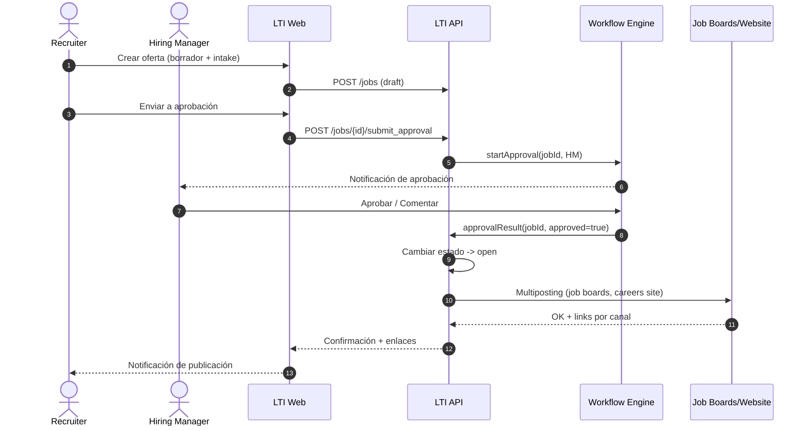

---

## **2) *Screening* asistido por IA con ranking automático y banderas de compliance**

**Actor principal:** Recruiter  
**Actores secundarios:** Servicio de IA, Módulo de Compliance, ATS Core  

**Objetivo:** Priorizar candidatos automáticamente, detectar duplicados e inconsistencias, y alertar posibles riesgos de sesgo o incumplimiento.  

**Precondiciones**
- Existen **aplicaciones recibidas** para la oferta.  
- *Intake* y criterios de *screening* definidos.  
- Consentimientos de privacidad registrados.  

**Postcondiciones**
- Lista de candidatos con **ranking**, *scores*, explicabilidad y nivel de confianza.  
- Banderas de compliance registradas (si las hay) y visibles en la UI.  
- Acciones automatizadas sugeridas (avanzar, solicitar info, descartar por knockout).  

**Flujo principal**
1. LTI consolida aplicaciones y ejecuta **deduplicación** (por email, hash CV, similitud).  
2. El Servicio de IA procesa CVs y formularios, calcula *scores* y genera resúmenes.  
3. El Módulo de Compliance evalúa *knockouts*, consentimientos y patrones de sesgo potencial.  
4. El Recruiter visualiza la lista **ordenada** y revisa explicaciones/flags.  
5. El Recruiter acepta sugerencias de acciones (avanzar, pedir prueba, descartar).  
6. El sistema aplica cambios de etapa, notifica y registra en el log.  

**Flujos alternos**
- B1. **Baja confianza del modelo** → Se muestra advertencia y se prioriza revisión humana.  
- B2. **Flag de sesgo/compliance** → Se bloquea decisión automática y se solicita confirmación con motivo.  
- B3. **Datos insuficientes/archivo corrupto** → Se pide al candidato reenvío de CV o completar datos.  
- B4. **Candidato duplicado** → Se fusionan perfiles y se preserva historial.  

**Diagrama (Mermaid — Secuencia)**  
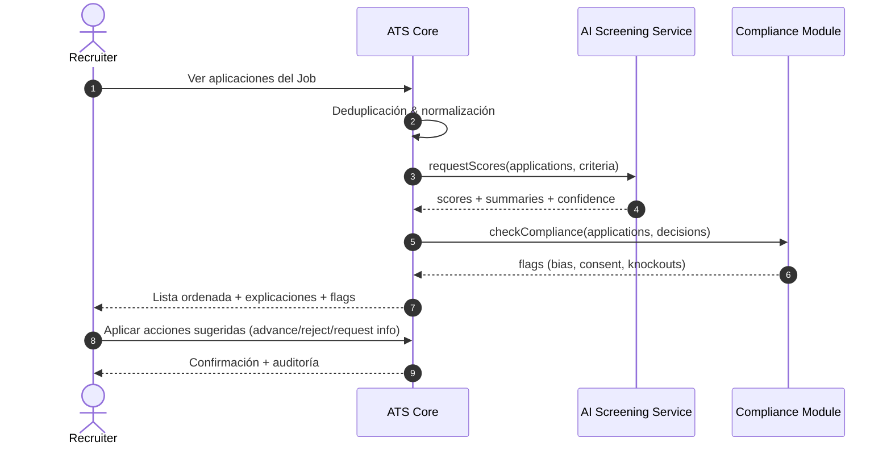

---

## **3) *Scheduling* inteligente de entrevistas con disponibilidad de panel**

**Actor principal:** Recruiter  
**Actores secundarios:** Panel de entrevistadores, Candidate, Integraciones de Calendario, Servicio de Notificaciones  

**Objetivo:** Agendar entrevistas optimizando disponibilidad (panel), zonas horarias, tipo de entrevista (virtual/presencial) y tiempos de ciclo.  

**Precondiciones**
- Candidato en etapa de entrevista.  
- Panel definido (entrevistadores y roles) con permisos de calendario.  
- Configurada la integración de calendarios y proveedor de videollamadas (si aplica).  

**Postcondiciones**
- Evento creado en calendarios del panel y del candidato (si comparte enlace).  
- Enlaces de videoconferencia y materiales adjuntos enviados.  
- Registro de la entrevista en LTI con estado `scheduled`.  

**Flujo principal**
1. Recruiter selecciona candidato y tipo de entrevista (panel/individual).  
2. LTI consulta **disponibilidad** del panel (Google/Microsoft).  
3. El sistema propone **slots óptimos** (quórum, huso horario, SLA).  
4. Recruiter confirma slot; LTI crea el evento y el **link de videollamada**.  
5. LTI envía invitaciones/calendarios y recordatorios (email/Slack).  
6. Se actualiza la aplicación con el evento y estado `scheduled`.  

**Flujos alternos**
- C1. **Conflictos sin quórum** → Proponer nuevas combinaciones o reemplazos configurados.  
- C2. **Candidato solicita reprogramar** → Se abre *reschedule* con nuevas ventanas de disponibilidad.  
- C3. **Fallo en proveedor de video** → Generar enlace alternativo o marcar presencial.  
- C4. **No-show** → Cambiar estado, notificar y permitir reprogramación automática según reglas.  

**Diagrama (Mermaid — Secuencia)**  
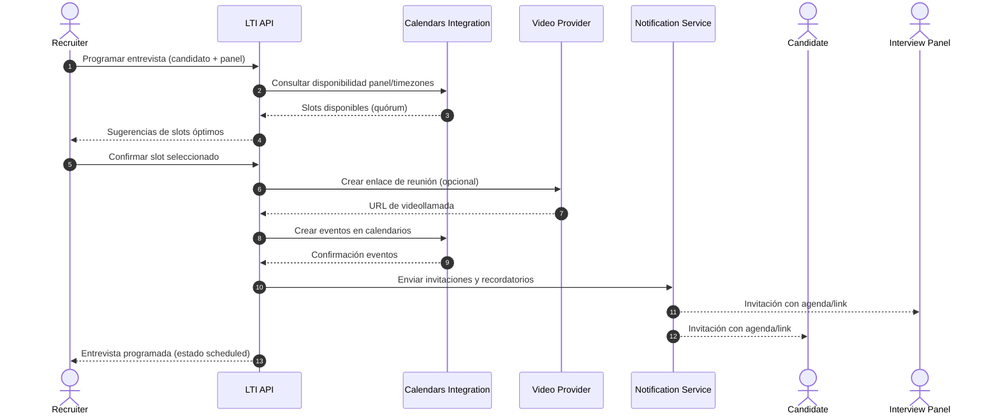

---

### **Notas finales**
- Cada caso registra **eventos de auditoría** (quién, cuándo, qué cambió).  
- Todas las acciones automatizadas requieren **reglas explícitas** y permiten *override* humano.  
- Para el MVP, el *scheduling* puede comenzar con un tipo de entrevista (virtual) y un proveedor de video.  

---

# **ERD inicial — ATS LTI (PostgreSQL)**

A continuación se presentan las **definiciones de entidades** con tipos PostgreSQL y comentarios útiles, seguidas de un **ERD en Mermaid** (`erDiagram`).

---

## **Convenciones de tipos (PostgreSQL)**
- `uuid` → Claves primarias y foráneas.  
- `text`, `varchar(n)` → Cadenas de texto.  
- `int`, `numeric(p,s)` → Números enteros y decimales.  
- `boolean` → Valores lógicos.  
- `timestamptz` → Fecha y hora con zona.  
- `jsonb` → Datos semi-estructurados (config, payloads, etc.).  
- `text[]` → Arrays de texto.

---

## **Definiciones de entidades**

### **Organization**
- `id uuid PK` — Identificador único de la organización.  
- `name text` — Nombre o razón social.  
- `created_at timestamptz` — Fecha de alta en el sistema.  
- `plan text` — Tipo de plan o suscripción.  
**COMMENT:** Agrupa todos los recursos (usuarios, jobs, reglas, tags, etc.).

---

### **User**
- `id uuid PK`  
- `org_id uuid FK -> Organization.id`  
- `email text UNIQUE`  
- `full_name text`  
- `status text` — `active|invited|disabled`  
- `created_at timestamptz`  
**COMMENT:** Representa a recruiters, hiring managers y administradores.

---

### **Role**
- `id uuid PK`  
- `name text UNIQUE` — `recruiter|hiring_manager|admin|interviewer`  
- `description text`  
**COMMENT:** Catálogo de roles de autorización.

---

### **UserRole** (tabla puente N:M)
- `user_id uuid FK -> User.id PK`  
- `role_id uuid FK -> Role.id PK`  
- `org_id uuid FK -> Organization.id`  
**COMMENT:** Un usuario puede tener múltiples roles dentro de la organización.

---

### **Job**
- `id uuid PK`  
- `org_id uuid FK -> Organization.id`  
- `title text`  
- `status text` — `draft|open|paused|closed`  
- `description text`  
- `location text`  
- `employment_type text` — `full_time|contractor|intern|part_time`  
- `created_by uuid FK -> User.id`  
- `approved_by uuid FK -> User.id`  
- `approved_at timestamptz`  
- `created_at timestamptz`  
**COMMENT:** Oferta de empleo con flujo de aprobación y publicación multicanal.

---

### **Stage**
- `id uuid PK`  
- `job_id uuid FK -> Job.id`  
- `name text`  
- `position int`  
**COMMENT:** Etapas configurables por oferta (pipeline).

---

### **Source**
- `id uuid PK`  
- `name text UNIQUE` — `linkedin|indeed|referral|careers`  
- `metadata jsonb`  
**COMMENT:** Catálogo de fuentes de candidatos.

---

### **Candidate**
- `id uuid PK`  
- `org_id uuid FK -> Organization.id`  
- `full_name text`  
- `email text`  
- `phone text`  
- `headline text`  
- `location text`  
- `consent_at timestamptz`  
- `created_at timestamptz`  
**COMMENT:** Perfil consolidado del candidato.

---

### **Application**
- `id uuid PK`  
- `job_id uuid FK -> Job.id`  
- `candidate_id uuid FK -> Candidate.id`  
- `source_id uuid FK -> Source.id`  
- `current_stage_id uuid FK -> Stage.id`  
- `score numeric(5,2)`  
- `status text` — `active|withdrawn|rejected|hired`  
- `created_at timestamptz`  
**COMMENT:** Candidatura a un Job; track del candidato en ese pipeline.

---

### **Interview**
- `id uuid PK`  
- `application_id uuid FK -> Application.id`  
- `scheduled_start timestamptz`  
- `scheduled_end timestamptz`  
- `location text`  
- `status text` — `scheduled|done|no_show|canceled`  
- `created_at timestamptz`  
**COMMENT:** Evento de entrevista asociado a una Application.

---

### **InterviewPanel** (tabla puente N:M)
- `interview_id uuid FK -> Interview.id PK`  
- `user_id uuid FK -> User.id PK`  
- `role text` — `interviewer|shadow|hm`  
**COMMENT:** Define el panel de entrevistadores por entrevista.

---

### **Feedback**
- `id uuid PK`  
- `interview_id uuid FK -> Interview.id`  
- `reviewer_id uuid FK -> User.id`  
- `rating int` — Escala 1–5.  
- `notes text`  
- `created_at timestamptz`  
**COMMENT:** Evaluación de entrevista por cada revisor.

---

### **Offer**
- `id uuid PK`  
- `application_id uuid FK -> Application.id`  
- `status text` — `draft|sent|accepted|declined|expired`  
- `salary_min int`  
- `salary_max int`  
- `currency text`  
- `payload jsonb`  
- `created_at timestamptz`  
**COMMENT:** Propuesta de oferta al candidato.

---

### **AutomationRule**
- `id uuid PK`  
- `org_id uuid FK -> Organization.id`  
- `name text`  
- `trigger jsonb`  
- `condition jsonb`  
- `action jsonb`  
- `enabled boolean`  
- `created_at timestamptz`  
**COMMENT:** Motor de automatización declarativa sin código.

---

### **Tag**
- `id uuid PK`  
- `org_id uuid FK -> Organization.id`  
- `name text`  
- `kind text` — `candidate|job|application|generic`  
**COMMENT:** Taxonomía ligera para segmentar y buscar.

---

### **Tagging**
- `id uuid PK`  
- `tag_id uuid FK -> Tag.id`  
- `entity_type text` — `candidate|job|application`  
- `entity_id uuid`  
- `created_at timestamptz`  
**COMMENT:** Asociación de tags a múltiples entidades (polimórfico).

---

### **Skill**
- `id uuid PK`  
- `org_id uuid FK -> Organization.id`  
- `name text`  
- `category text`  
**COMMENT:** Catálogo de habilidades.

---

### **CandidateSkill** (tabla puente N:M)
- `candidate_id uuid FK -> Candidate.id PK`  
- `skill_id uuid FK -> Skill.id PK`  
- `level int`  
- `evidence jsonb`  
**COMMENT:** Habilidades declaradas o verificadas del candidato.

---

### **Attachment**
- `id uuid PK`  
- `org_id uuid FK -> Organization.id`  
- `owner_type text` — `candidate|application|job|interview|offer`  
- `owner_id uuid`  
- `filename text`  
- `mime_type text`  
- `storage_url text`  
- `created_at timestamptz`  
**COMMENT:** Archivos asociados (CVs, JD, contratos).

---

### **EventLog**
- `id uuid PK`  
- `org_id uuid FK -> Organization.id`  
- `actor_user_id uuid FK -> User.id`  
- `entity_type text`  
- `entity_id uuid`  
- `event text`  
- `payload jsonb`  
- `created_at timestamptz`  
**COMMENT:** Registro inmutable de eventos y auditoría.

---

## **ERD en Mermaid**

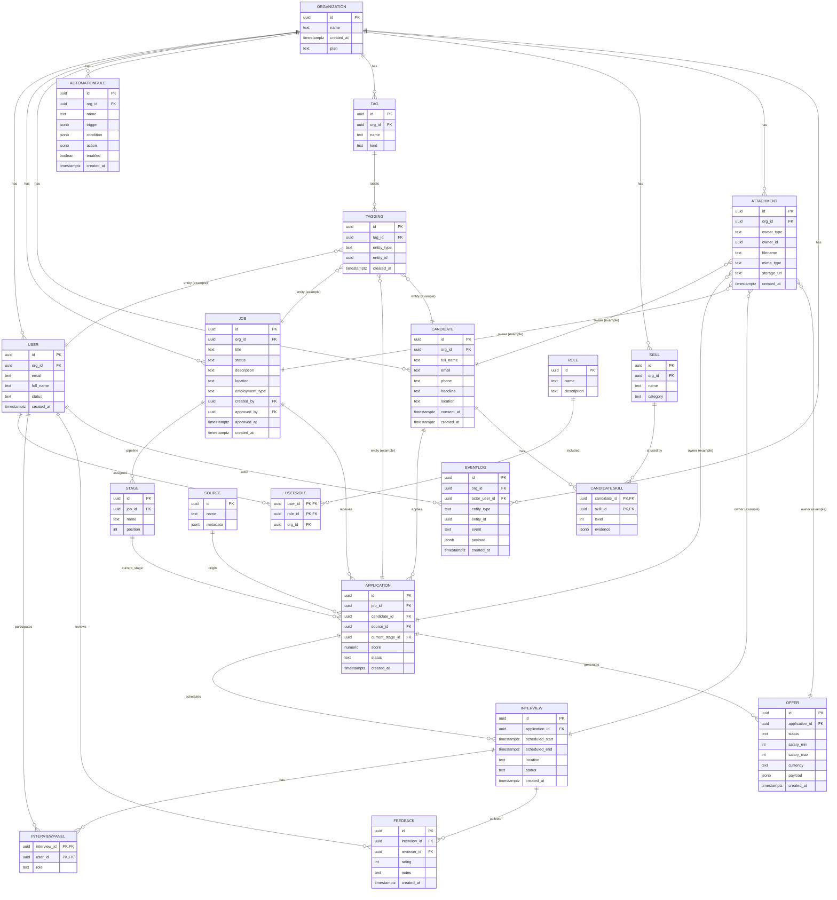

---

### **Notas de modelado**
- **Stages por Job** permiten pipelines personalizados por oferta.  
- **Application** enlaza `Candidate` y `Job` para trackear progreso.  
- **AutomationRule** usa `jsonb` para flexibilidad sin migraciones.  
- **Tagging** y **Attachment** son **polimórficos** (reutilizables).  
- **EventLog** centraliza auditoría y cumplimiento (trazabilidad completa).  

---

# **Diseño de alto nivel — LTI ATS (Cloud-Native)**

> Objetivo: proponer una arquitectura modular, escalable y auditable que acelere la contratación, habilite colaboración en tiempo real y use IA de forma responsable.

---

## **Vista global de la arquitectura**

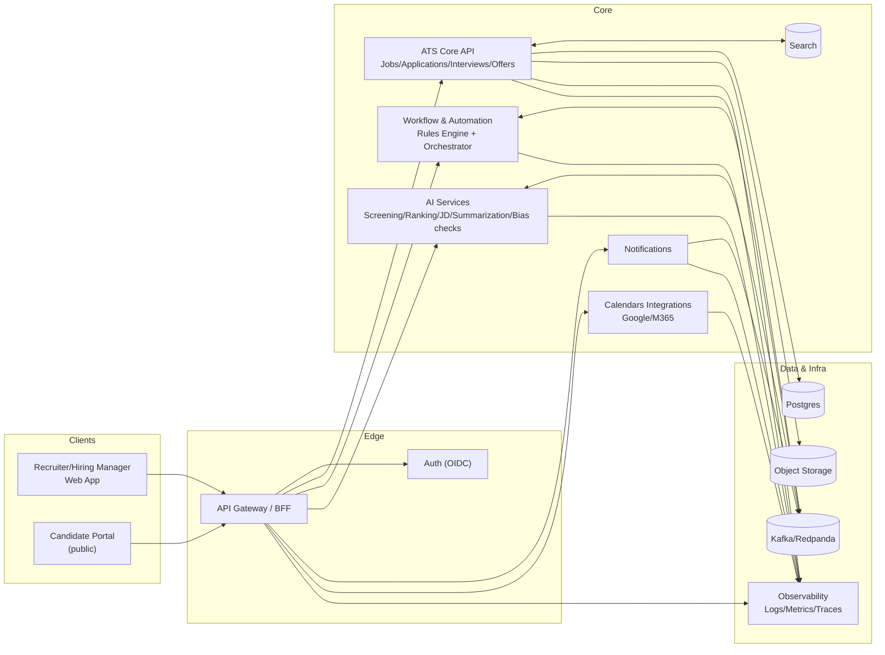

---

## **Componentes (responsabilidades y notas)**

### **1) Web App (Recruiter/HM & Candidate Portal)**
Aplicación SPA (React/Next) con dos superficies: portal público de candidatos (búsqueda, aplicación, seguimiento) y consola interna para HR/HM (pipeline, feedback, aprobaciones y reglas). Interacción en tiempo real (suscripciones o websockets) para comentarios y cambios de etapa. Accesibilidad y UX colaborativa como ventaja competitiva.

**Notas:** SSR/ISR para páginas públicas (SEO de ofertas). Feature flags, i18n y RBAC por rol/organización.

---

### **2) API Gateway / BFF**
Capa de agregación para adaptar payloads y minimizar *round-trips* desde la Web App. Expone endpoints orientados a casos de uso (e.g., `GET /pipeline`, `POST /jobs/{id}/approve`) y encapsula contratos hacia servicios internos.

**Notas:** Rate-limiting, caching corto, validación, anti-corruption layer y composición de respuestas.

---

### **3) Auth (OIDC)**
Federación con proveedores (Auth0/Keycloak/Azure AD). Tokens OIDC, refresh seguro y *scopes* por organización. Soporta “magic link” para candidatos y SSO para empresas.

**Notas:** MFA opcional, políticas de contraseña y cumplimiento GDPR.

---

### **4) ATS Core (Jobs/Applications/Interviews/Offers)**
Servicio transaccional que gestiona el dominio principal: ofertas, candidaturas, entrevistas, feedback y ofertas laborales. Implementa reglas de integridad, versionado ligero (auditoría) y expone APIs REST/gRPC a BFF y Workflow.

**Notas:** Modelado por agregados; search desacoplado y adjuntos externalizados en S3.

---

### **5) AI Services**
Servicios especializados: **screening/ranking** (scoring, explicabilidad y confianza), **JD generator**, **summarization** (CV/entrevistas) y **bias checks** (alertas, no decisiones automáticas). Interactúan con LLMs/embeddings gestionando *guardrails*, límites de coste y *prompt versioning*.

**Notas:** *Human-in-the-loop* obligatorio cuando la confianza es baja o hay flags de compliance.

---

### **6) Workflow & Automation (Rules Engine + Event Bus)**
Motor declarativo de reglas (triggers + condiciones + acciones) para automatizar: notificaciones, cambio de etapa, etiquetado, tareas de verificación, SLA de feedback, etc. Consume y produce eventos de negocio sobre **Kafka/Redpanda** para orquestar procesos de forma desacoplada.

**Notas:** Reglas versionadas, simulador de reglas en UI, *dead-letter queue* para fallos.

---

### **7) Notifications**
Unifica canales (email, Slack/Teams, push in-app). Plantillas personalizables con *context guards* (evitar datos sensibles). Reintentos con backoff y trazabilidad end-to-end.

**Notas:** Soporte de plantillas multilenguaje, ventanas horarias y digest.

---

### **8) Calendars Integrations (Google/M365)**
Consulta disponibilidad, genera *slots* óptimos (quórum, husos horarios), crea eventos y envía invitaciones. Abstrae diferencias de APIs y proveedores de videollamada (Meet/Teams/Zoom).

**Notas:** Manejo de permisos delegados, *reschedule* y *no-show*.

---

### **9) Search**
Índice para búsquedas rápidas (texto/skills/tags). Puede ser OpenSearch/PG trigram según volumen. Soporta filtros combinados (fuente, etapa, score, diversidad).

**Notas:** Estrategia de *near-real-time* index + *replay* desde el bus ante caídas.

---

### **10) S3 (Object Storage)**
Almacén de adjuntos (CV, JD, contratos) con *pre-signed URLs* y clasificación por tenant. Política de retención y borrado conforme a consentimientos.

**Notas:** Antivirus opcional; *content-type* y *checksum*.

---

### **11) Postgres**
Base transaccional: consistencia fuerte, ACID y facilidad de reporting básico. JSONB para reglas/atributos flexibles y vistas materializadas para analítica ligera.

**Notas:** Particionado por organización/fecha para escalabilidad y mantenimiento.

---

### **12) Kafka/Redpanda (Event Bus)**
Columna vertebral de eventos de negocio (`job.approved`, `application.scored`, `offer.sent`). Permite *fan-out* a AI, Workflow, Notifications y analítica sin acoplar al Core.

**Notas:** Esquemas versionados (Schema Registry), DLQ y *exactly-once* donde aplique.

---

### **13) Observability**
Trazas distribuidas (OpenTelemetry), logs estructurados y métricas (SLOs: *time-to-fill*, latencia de scoring, tasa de automatización). Tableros por dominio y *alerts* proactivas.

**Notas:** *Audit trail* separado del logging operativo.

---

## **Decisiones de arquitectura (por qué)**

- **Postgres**: modelo relacional claro, transaccionalidad (ACID) y extensión `jsonb` para flexibilidad; madurez operativa y ecosistema abundante.  
- **S3**: adjuntos binarios fuera de la base, *pre-signed URLs*, bajo coste, políticas de ciclo de vida y cifrado.  
- **Event Bus (Kafka/Redpanda)**: desacopla productores/consumidores, facilita reintentos y *replay*, y permite incorporar nuevos servicios (AI, analítica) sin tocar Core.  
- **BFF**: experiencia de UI optimizada, contratos estables hacia Front, reduciendo acoplamiento con servicios.  
- **AI como servicio separado**: escalado independiente, *guardrails* y costes controlados, además de cumplimiento (registro de prompts/respuestas).  
- **Workflow declarativo**: velocidad de cambio sin despliegues, simulación de impacto y auditoría de decisiones.

---

## **Flujos clave (end-to-end)**

### **1) Apply (candidato aplica)**
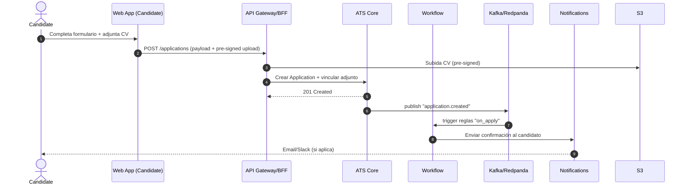

**Objetivo:** registrar candidatura, garantizar consentimiento, adjuntar CV y disparar automatizaciones iniciales (acknowledge, tag, asignación).

---

### **2) Screen (ranking asistido por IA + compliance)**
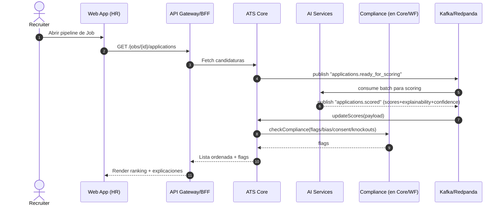

**Objetivo:** priorización con explicabilidad y control de riesgos de sesgo/consentimiento; *human-in-the-loop* para decisiones.

---

### **3) Schedule (entrevista con panel)**
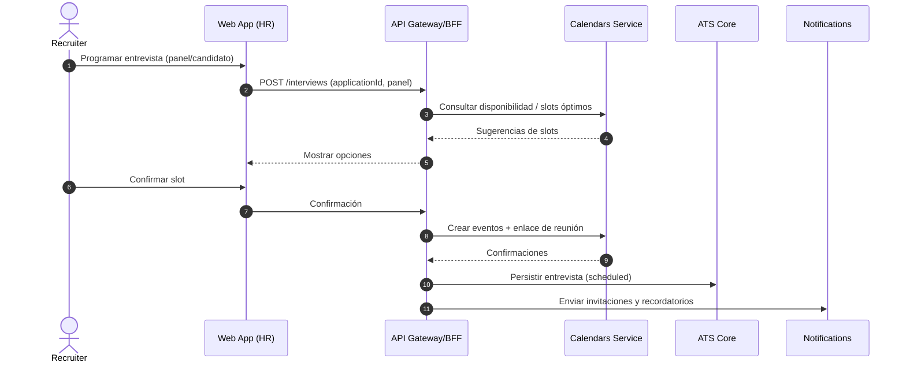

**Objetivo:** minimizar fricción de agenda, asegurar quórum y manejo de zonas horarias.

---

### **4) Offer (generación, aprobación y firma)**
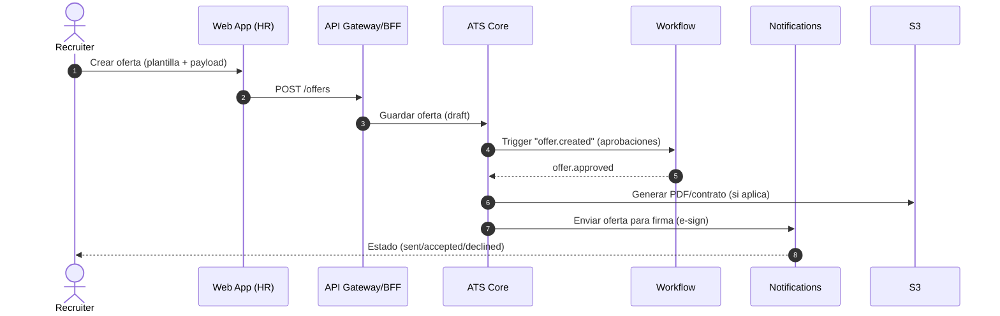

**Objetivo:** estandarizar ofertas, controlar aprobaciones y trazabilidad; facilitar e-sign y analítica de aceptación.

---

## **Riesgos y mitigaciones**

- **Sesgo algorítmico**: IA solo sugiere; bloqueo de decisiones automáticas ante *flags* de compliance; explicabilidad y revisión humana obligatoria.  
- **Protección de datos (GDPR/EEO)**: consentimiento explícito, retención limitada, *right-to-erasure* y *data minimization*; cifrado at-rest/in-transit.  
- **Acoplamiento entre servicios**: contratos versionados, bus de eventos y *anti-corruption layers*.  
- **Costes de IA**: *rate limits*, *batching*, *caching* semántico y presupuesto por organización.  
- **Disponibilidad de integraciones**: *circuit breakers*, reintentos con backoff y DLQ en BUS.  
- **Escalabilidad de consultas**: índices adecuados, *read replicas*, particionado por organización/fecha y *search* externo para queries pesadas.

---

## **No funcionales (SLOs de referencia)**

- **Latencia UI percibida:** < 200 ms en operaciones comunes.  
- **Disponibilidad:** ≥ 99.9% mensual del BFF/Core.  
- **RPO/RTO:** RPO ≤ 5 min, RTO ≤ 30 min (backups + infra as code).  
- **Seguridad:** OWASP ASVS, *secrets management*, *least privilege* y auditoría integral.

---

## **Roadmap técnico (MVP → +)**

1. **MVP:** Core + BFF + Auth + Postgres + S3 + Calendars (1 proveedor) + Notifications + AI (screening básico) + Workflow mínimo.  
2. **V1:** Search dedicado, reglas avanzadas, *bias checks* mejorados, panel colaborativo en vivo.  
3. **V2:** Analítica avanzada, *what-if* de reglas, *marketplace* de integraciones y evaluación técnica automatizada.  

---

# **Diagrama C4 — LTI ATS (Contexto, Contenedores y Componentes de Workflow & Automation)**

A continuación se presentan los diagramas **C1 (Contexto)** y **C2 (Contenedores)** resumidos para el sistema **LTI ATS**, y el **C3 detallado** del componente **Workflow & Automation Service**.  
Los diagramas usan la sintaxis **C4 de Mermaid**.

---

## **C1 — System Context (resumen)**

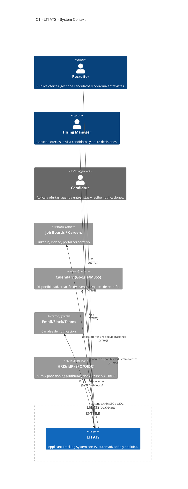

---

## **C2 — Container Diagram (resumen)**

```mermaid
C4Container
title C2 - LTI ATS - Containers

Person(recruiter, "Recruiter")
Person(hm, "Hiring Manager")
Person_Ext(candidate, "Candidate")

System_Boundary(lti, "LTI ATS") {
  Container(web, "Web App", "React/Next", "UI de Recruiter/HM y portal de Candidate. SSR/ISR para SEO en ofertas.")
  Container(bff, "API Gateway / BFF", "Node/FastAPI", "Agrega respuestas, valida, cachea corto y adapta contratos al front.")
  Container(auth, "Auth (OIDC)", "Auth0/Keycloak", "Federación, SSO, scopes por organización.")
  Container(core, "ATS Core API", "Service (REST/gRPC)", "Jobs, Applications, Interviews, Offers, Feedback.")
  Container(wf, "Workflow & Automation", "Service", "Rules engine + orquestación basada en eventos.")
  Container(ai, "AI Services", "Service", "Screening/Ranking, JD generator, Summarization, Bias checks.")
  Container(noti, "Notifications", "Service", "Email/Slack/Teams; plantillas y reintentos.")
  Container(cals, "Calendars Integrations", "Service", "Google/M365; disponibilidad y creación de eventos.")
  Container(search, "Search", "OpenSearch/PG trigram", "Búsquedas por texto/skills/tags.")
  ContainerDb(pg, "Postgres", "RDBMS", "Datos transaccionales y view materializadas.")
  Container(s3, "Object Storage", "S3", "CVs, ofertas PDF, adjuntos; pre-signed URLs.")
  ContainerQueue(bus, "Event Bus", "Kafka/Redpanda", "Eventos de negocio; fan-out y replays.")
  Container(obs, "Observability", "OTel + Logs/Metrics/Traces", "Dashboards, alertas y auditoría técnica.")
}

System_Ext(jobboards, "Job Boards / Careers", "")
System_Ext(calendars, "Calendars (Google/M365)", "")
System_Ext(comm, "Email/Slack/Teams", "")
System_Ext(hris, "HRIS/IdP (SSO/OIDC)", "")

Rel(recruiter, web, "Usa", "HTTPS")
Rel(hm, web, "Usa", "HTTPS")
Rel(candidate, web, "Usa", "HTTPS")

Rel(web, bff, "Solicita vistas y acciones", "HTTPS")
Rel(bff, auth, "Token OIDC", "OIDC")
Rel(bff, core, "Casos de uso core", "REST/gRPC")
Rel(bff, wf, "Reglas / simulación / ejecución", "REST/gRPC")
Rel(bff, ai, "Peticiones IA", "HTTP/gRPC")
Rel(bff, noti, "Envía notificaciones", "HTTP")
Rel(bff, cals, "Disponibilidad / eventos", "HTTP")
Rel(core, pg, "Lee/Escribe", "SQL")
Rel(core, s3, "Adjuntos", "SDK")
Rel(core, search, "Index/Query", "HTTP")
Rel(core, bus, "Publica eventos", "Kafka API")
Rel(wf, bus, "Consume/Produce", "Kafka API")
Rel(ai, bus, "Consume/Produce", "Kafka API")
Rel(noti, bus, "Consume", "Kafka API")
Rel(bff, obs, "Traza/Logs/Metrics", "OTel")
Rel(core, obs, "Traza/Logs/Metrics", "OTel")
Rel(wf, obs, "Traza/Logs/Metrics", "OTel")
Rel(ai, obs, "Traza/Logs/Metrics", "OTel")
Rel(noti, obs, "Traza/Logs/Metrics", "OTel")
Rel(cals, calendars, "APIs externas", "HTTP")
Rel(noti, comm, "Canales externos", "SMTP/Webhooks")
Rel(web, jobboards, "SEO/Links públicos (ofertas)", "HTTPS")
Rel(bff, hris, "SSO", "OIDC/SAML")
```

---

## **C3 — Component Diagram (detallado de Workflow & Automation Service)**

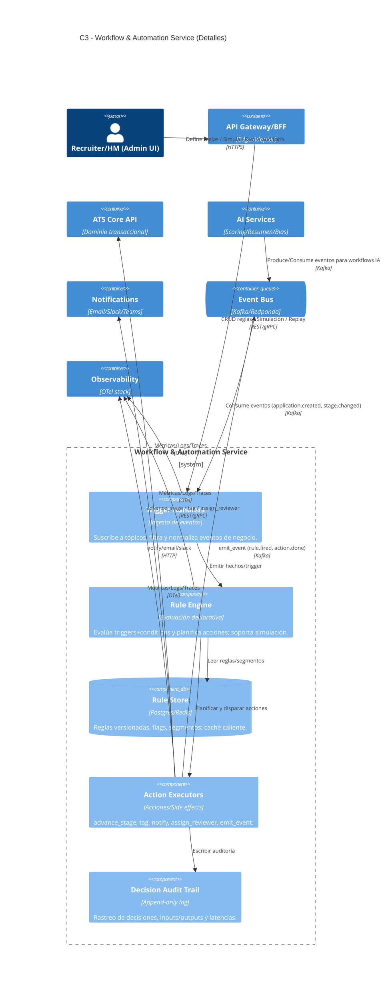
---

## **Resumen textual**

### **Visión general**
El **Workflow & Automation Service** es el cerebro operativo de **LTI ATS**.  
Recibe eventos desde el **Event Bus (Kafka/Redpanda)** —por ejemplo, `application.created`, `stage.changed`, `offer.sent`—, evalúa **reglas declarativas**, y ejecuta **acciones automáticas** de forma confiable y auditable.  
Su objetivo es reducir tareas manuales, garantizar SLA internos y asegurar consistencia del pipeline de selección.

---

### **Componentes principales**
- **Trigger Handlers**: suscriben a tópicos del bus, validan, transforman y normalizan los eventos antes de su evaluación.  
- **Rule Engine**: evalúa triggers y condiciones, accediendo a la **Rule Store**; soporta simulaciones (what-if) y versionado de reglas.  
- **Rule Store (Postgres/Redis)**: almacena reglas en formato declarativo (JSON/YAML), segmentos y *feature flags*; mantiene caché caliente para baja latencia.  
- **Action Executors**: ejecutan efectos sobre el sistema (`advance_stage`, `notify`, `assign_reviewer`, `emit_event`) con reintentos y manejo de errores.  
- **Decision Audit Trail**: log append-only que captura entrada, regla, acción, resultado y tiempo; esencial para cumplimiento y auditoría.  
- **Admin UI (en Web App)**: interfaz embebida para gestionar reglas, simular escenarios y revisar trazabilidad.  
- **Observability**: métricas, logs y trazas (OpenTelemetry) con paneles por regla, tiempos de ejecución y errores.

---

### **Flujo principal**
1. **Evento entrante** → Trigger Handler → Rule Engine (consulta Rule Store).  
2. **Evaluación** → Rule Engine genera plan de acciones.  
3. **Ejecución** → Action Executors ejecutan operaciones sobre Core, Notifications o Event Bus.  
4. **Auditoría** → se registra en Decision Trail y Observability.  
5. **Gestión** → Admin UI permite CRUD de reglas, simulaciones y replays.

---

### **Beneficios**
- **Desacoplamiento por eventos:** permite añadir automatizaciones sin modificar el Core.  
- **Velocidad de cambio:** políticas declarativas versionadas, sin necesidad de despliegue.  
- **Transparencia y cumplimiento:** decisiones explicables, auditadas y reversibles.  
- **Resiliencia:** backoff, DLQ, replay y *idempotency* en las acciones.

---

### **Riesgos y mitigaciones**
- **Reglas erróneas o bucles:** simulador de reglas, dry-run y *circuit breakers*.  
- **Efectos colaterales:** acciones idempotentes y límites por organización.  
- **Sesgo en automatizaciones IA:** revisión humana obligatoria ante *flags* críticos.  

---

> Con este diseño C4, el servicio de **Workflow & Automation** de LTI ATS queda definido como un componente modular, auditable y preparado para escalar, asegurando la trazabilidad y agilidad necesarias para un ATS moderno impulsado por IA.