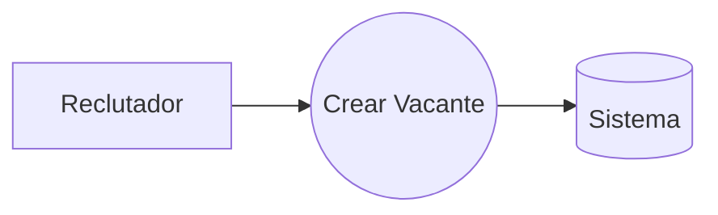
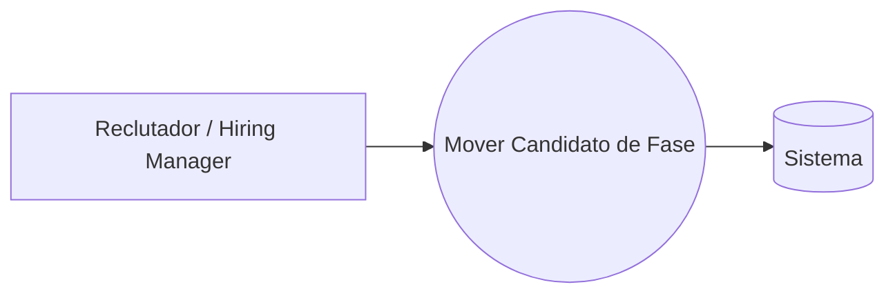
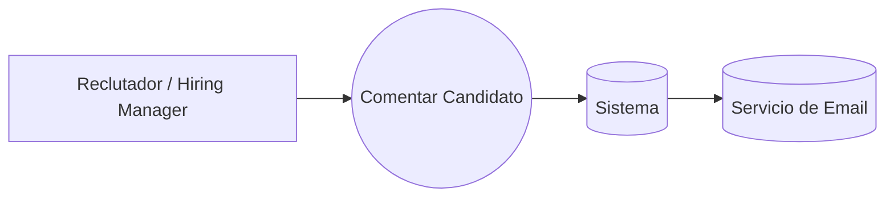
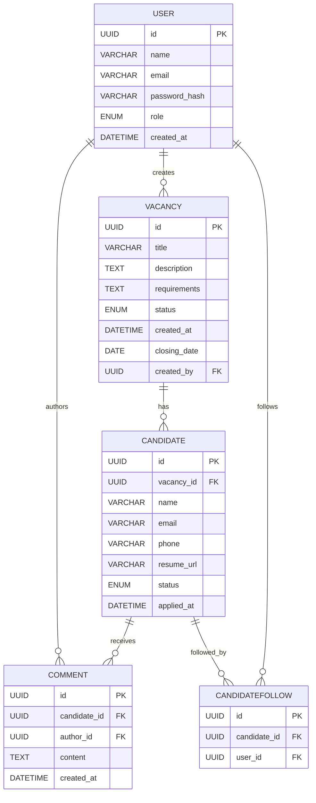
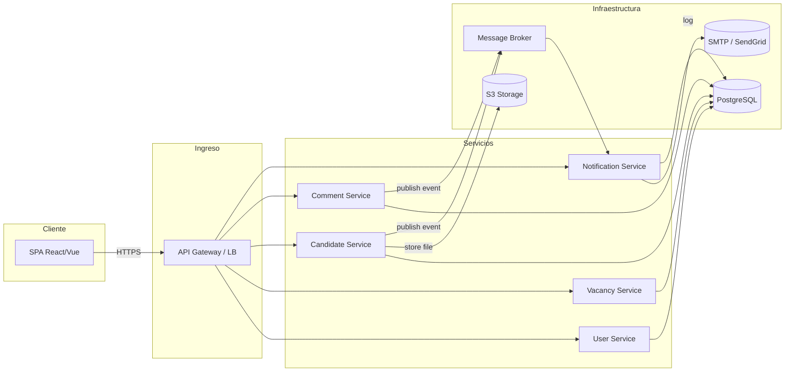

**Descripción breve del software LTI**

LTI ATS es una aplicación web ligera para gestionar procesos de selección de personal en su fase inicial. Su objetivo es ofrecer a equipos de RR. HH. un entorno único donde crear vacantes, organizar candidaturas y colaborar de forma sencilla, sin complejidad ni distracciones.

---

### Valor añadido

- **Rapidez de puesta en marcha**

  - Implementación clara y minimalista: en pocos días tendrás el sistema listo para trabajar.

- **Flujo simplificado**

  - Sólo tres fases de selección (“Recibido”, “En revisión”, “Contratado/Rechazado”), lo que facilita la adopción y evita sobrecarga de opciones.

- **Colaboración ligera**

  - Comentarios sobre candidatos con notificaciones por email; se eliminan chats y herramientas externas para centrarse en lo esencial.

- **Visión de datos inmediata**

  - Dashboard básico de número de candidaturas por fase y exportación a CSV para análisis rápido sin aprender otro software.

---

### Ventajas competitivas

1. **Enfoque MVP real**

   - A diferencia de otros ATS que lanzan muchas funcionalidades incompletas, LTI se centra en lo básico y resume el proceso en 1–2 meses de desarrollo.

2. **Curva de aprendizaje mínima**

   - Interfaz intuitiva y sin módulos prescindibles; el equipo de RR. HH. lo adopta en horas, no semanas.

3. **Ligero y rápido**

   - Arquitectura optimizada para velocidad, sin requerir integraciones ni configuraciones previas complejas.

4. **Flexibilidad para crecer**

   - Diseñado como base sólida: tras validar el MVP se podrán añadir automatizaciones, IA e integraciones con mínima reescritura.

## Con LTI ATS MVP, las empresas disponen de una herramienta enfocada en lo realmente útil para dar el primer gran paso en la digitalización de sus procesos de selección.

## Funciones principales del MVP de LTI ATS

A continuación se detallan las cinco funcionalidades esenciales que formarán parte de la primera versión (MVP) de LTI ATS:

### 1. Gestión de vacantes

- **Creación y edición de ofertas**: formulario sencillo para definir título, descripción, requisitos y fecha de cierre.
- **Publicación manual**: una vez creada, la vacante estará disponible en el portal interno de la empresa con un solo clic.

### 2. Pipeline de candidaturas

- **Embudo de tres fases**: “Recibido”, “En revisión” y “Contratado/Rechazado”.
- **Arrastrar y soltar**: interfaz drag & drop para mover candidatos entre las fases de forma intuitiva.

### 3. Ficha de candidato

- **Datos básicos**: nombre, email y teléfono.
- **CV adjunto**: subida de documento en PDF o Word.
- **Comentarios libres**: anotaciones de reclutadores y hiring managers sobre cada candidato.

### 4. Colaboración ligera

- **Comentarios por candidato**: cada usuario puede dejar observaciones que quedan registradas con autor y fecha.
- **Notificaciones por email**: alerta automática cuando se añade un comentario a un candidato que sigues.

### 5. Reporting básico

- **Dashboard de estado**: gráfico simple (barras o pastel) con el número de candidatos en cada fase del embudo.
- **Exportación a CSV**: descarga de la lista de candidatos y sus datos para análisis externo.

---

Este conjunto de funcionalidades garantiza que, en pocas semanas, un equipo de Recursos Humanos pueda gestionar de forma ordenada y colaborativa su proceso de selección, obteniendo visibilidad inmediata del avance de las vacantes y sin enfrentarse a la complejidad de herramientas demasiado amplias.
Aquí tienes el Lean Canvas para el MVP de LTI ATS, organizado en una cuadrícula de 3×3 para visualizar rápidamente el modelo de negocio:

| **Problema**                                            | **Solución**                                             | **Métricas Clave**                            |
| ------------------------------------------------------- | -------------------------------------------------------- | --------------------------------------------- |
| - Gestión dispersa de candidatos                        | - Pipeline simplificado de 3 fases                       | - Nº de vacantes creadas                      |
| - Colaboración ineficiente entre RRHH y hiring managers | - Drag & drop para mover candidatos                      | - % de candidatos que avanzan de fase         |
| - Falta de visibilidad inmediata del estado del proceso | - Comentarios por candidato con notificaciones por email | - Nº de comentarios y notificaciones enviados |

| **Propuesta de Valor Única**                                             | **Ventaja Competitiva**                                                   | **Canales**                                                                                       |
| ------------------------------------------------------------------------ | ------------------------------------------------------------------------- | ------------------------------------------------------------------------------------------------- |
| “MVP ligero y intuitivo para que equipos de RRHH adopten un ATS en días” | - Enfoque real en MVP: sólo lo esencial<br> - Curva de aprendizaje mínima | - Ventas directas a pymes<br> - Marketing de contenidos<br> - Referencias de clientes satisfechos |

| **Segmentos de Clientes**               | **Estructura de Costes**                      | **Flujos de Ingresos**            |
| --------------------------------------- | --------------------------------------------- | --------------------------------- |
| - PYMEs sin herramienta ATS consolidada | - Desarrollo y mantenimiento de la plataforma | - Suscripción mensual por usuario |
| - Equipos de RRHH con procesos manuales | - Hosting e infraestructuras cloud            | - Tarifa fija mensual por empresa |
| - Startups en fase de crecimiento       | - Soporte y atención al cliente               |                                   |

---

Este Lean Canvas te permitirá compartir de un vistazo el modelo de negocio de LTI ATS y servir de guía para medir hipótesis y validar prioridades en el MVP.

A continuación encontrarás la definición de los tres casos de uso principales del MVP de LTI ATS, cada uno con su diagrama UML en formato Mermaid.

---

## Caso de Uso 1: Crear Vacante

**Actor primario:** Reclutador
**Objetivo:** Dar de alta una nueva oferta de trabajo en el sistema.
**Precondición:** El reclutador está autenticado y tiene permiso para crear vacantes.
**Flujo principal:**

1. Reclutador accede al módulo “Vacantes”.
2. Selecciona “Nueva Vacante”.
3. Completa título, descripción, requisitos y fecha de cierre.
4. Hace clic en “Guardar”.
5. El sistema valida campos obligatorios y crea la vacante.
6. El sistema muestra confirmación y añade la vacante al listado.

**Postcondición:** La vacante queda registrada en el embudo con estado “Recibido”.



---

## Caso de Uso 2: Mover Candidato de Fase

**Actor primario:** Reclutador o Hiring Manager
**Objetivo:** Avanzar o retroceder un candidato en el embudo de selección.
**Precondición:** El candidato ya existe en la vacante y el actor tiene permiso de edición.
**Flujo principal:**

1. Actor abre la vacante y visualiza el embudo en “Recibido”.
2. Arrastra la tarjeta del candidato a la columna “En revisión” (o “Contratado/Rechazado”).
3. El sistema actualiza la fase del candidato.
4. El sistema confirma el cambio y vuelve a calcular métricas del dashboard.

**Postcondición:** El estado de la candidatura se actualiza y refleja en el reporting.



---

## Caso de Uso 3: Comentar Candidato

**Actor primario:** Reclutador o Hiring Manager
**Objetivo:** Añadir feedback o nota sobre un candidato para compartir contexto con el equipo.
**Precondición:** El actor está asignado a la vacante y tiene permisos de visualización/edición.
**Flujo principal:**

1. Actor abre la ficha del candidato.
2. Hace clic en “Añadir comentario”.
3. Escribe el texto y pulsa “Enviar”.
4. El sistema guarda el comentario junto con autor y timestamp.
5. Si hay usuarios “siguiendo” al candidato, el sistema envía un email de notificación.

**Postcondición:** El comentario queda visible en la ficha y las notificaciones se han disparado.



---

Estos tres flujos cubren el ciclo esencial del MVP: crear vacantes, gestionar el avance de candidatos y colaborar mediante comentarios.

## Modelo de Datos MVP de LTI ATS

A continuación se presentan las entidades, sus atributos (con tipo) y las relaciones principales que cubren el flujo del MVP.

---

### Entidades y Atributos

| **Entidad** | **Atributos**     |
| ----------- | ----------------- |
| **User**    | • `id` (UUID, PK) |

```
             | • `name` (VARCHAR)
             | • `email` (VARCHAR, UNIQUE)
             | • `password_hash` (VARCHAR)
             | • `role` (ENUM: `Recruiter`, `HiringManager`, `Admin`)
             | • `created_at` (DATETIME)                                                             |
```

\| **Vacancy** | • `id` (UUID, PK)
\| • `title` (VARCHAR)
\| • `description` (TEXT)
\| • `requirements` (TEXT)
\| • `status` (ENUM: `Open`, `Closed`)
\| • `created_at` (DATETIME)
\| • `closing_date` (DATE)
\| • `created_by` (UUID, FK → `User.id`) |
\| **Candidate** | • `id` (UUID, PK)
\| • `vacancy_id` (UUID, FK → `Vacancy.id`)
\| • `name` (VARCHAR)
\| • `email` (VARCHAR)
\| • `phone` (VARCHAR)
\| • `resume_url` (VARCHAR)
\| • `status` (ENUM: `Received`, `InReview`, `Hired`, `Rejected`)
\| • `applied_at` (DATETIME) |
\| **Comment** | • `id` (UUID, PK)
\| • `candidate_id` (UUID, FK → `Candidate.id`)
\| • `author_id` (UUID, FK → `User.id`)
\| • `content` (TEXT)
\| • `created_at` (DATETIME) |
\| **CandidateFollow** | • `id` (UUID, PK)
\| • `candidate_id` (UUID, FK → `Candidate.id`)
\| • `user_id` (UUID, FK → `User.id`) |

---

### Relaciones

- **User – Vacancy**
  – Un usuario (reclutador) **crea** muchas vacantes.
- **Vacancy – Candidate**
  – Una vacante tiene **muchos** candidatos.
- **Candidate – Comment**
  – Un candidato puede tener **muchos** comentarios.
- **User – Comment**
  – Un usuario es **autor** de muchos comentarios.
- **User – Candidate (Follow)**
  – Varios usuarios pueden **seguir** (CandidateFollow) a un candidato para recibir notificaciones.

---

### Diagrama ER (Mermaid)



Este modelo cubre todos los datos necesarios para gestionar vacantes, candidatos, comentarios y notificaciones de seguimiento en el MVP de LTI ATS.

---

## Diseño del sistema a alto nivel

La arquitectura del MVP de LTI ATS se basa en un patrón de **microservicios ligeros** con una capa de presentación desacoplada, permitiendo escalabilidad y despliegues independientes de cada módulo esencial. A continuación se describen los componentes principales:

1. **Cliente Web (SPA)**

   - Aplicación React o similar que consume APIs REST.
   - Gestiona la interfaz de usuario para vacantes, embudo de candidatos y comentarios.

2. **API Gateway / Load Balancer**

   - Punto de entrada único para todas las peticiones del cliente.
   - Enruta solicitudes a los microservicios correspondientes.
   - Maneja autenticación (JWT) y limitación de tasa.

3. **Microservicios**

   - **Service de Usuarios**: registro, autenticación, gestión de roles.
   - **Service de Vacantes**: CRUD de vacantes y estado.
   - **Service de Candidatos**: gestión de datos de candidatos y fases del embudo.
   - **Service de Comentarios**: almacenamiento de feedback, autoría y timestamps.
   - **Service de Notificaciones**: orquesta envíos de email al detectar nuevos comentarios o cambios de fase; se integra con un proveedor SMTP/SendGrid.

4. **Base de Datos**

   - **PostgreSQL**: almacena las entidades _User_, _Vacancy_, _Candidate_, _Comment_, _CandidateFollow_.
   - Se recomienda un esquema por servicio para escalabilidad futura (schema-per-service).

5. **Almacenamiento de Archivos**

   - **S3-compatible**: guarda los CVs y documentos (resume_url).
   - Referencias en la tabla _Candidate.resume_url_.

6. **Sistema de Colas / Events Bus**

   - **RabbitMQ** o **Kafka** ligero para desacoplar:

     - Eventos “CandidateMoved”, “CommentCreated” → disparan notificaciones.
     - Facilita añadir futuras integraciones (p. ej. Webhooks, motores de IA).

7. **Infraestructura y despliegue**

   - **Kubernetes** o servicios gestionados (EKS/GKE) para orquestación de contenedores.
   - **CI/CD** (GitHub Actions / GitLab CI) para tests y despliegues automáticos.
   - **Monitorización** con Prometheus + Grafana y logging centralizado (ELK/EFK).

---

### Diagrama de alto nivel (Mermaid)



Este esquema muestra cómo los componentes interactúan de forma desacoplada, garantizando que cada servicio pueda escalar o desplegarse de manera independiente y facilitando la futura incorporación de funcionalidades como IA, integraciones externas o workflows más complejos.

A continuación tienes la serie de diagramas C4 centrados en el **Candidate Service**, mostrando desde el contexto general hasta el detalle de sus componentes internos.

---

## Nivel 1: Contexto del sistema (C4 Context)

```mermaid
C4Context
    title Contexto de LTI ATS

    Person_Recruiter(recruiter, "Reclutador", "Usuario que crea vacantes y gestiona candidatos")
    Person_HM(hiringManager, "Hiring Manager", "Usuario que revisa y comenta candidatos")
    System_ExtEmail(emailSvc, "SMTP / SendGrid", "Servicio externo de envío de emails")

    System_Boundary(lti, "LTI ATS") {
      System(webApp, "SPA Web", "Interfaz web para RRHH y managers")
      System(apiGateway, "API Gateway", "Punto de entrada único a microservicios")
      System(candidateSvc, "Candidate Service", "Gestiona información y fases de candidatos")
    }

    recruiter --> webApp
    hiringManager --> webApp
    webApp --> apiGateway
    apiGateway --> candidateSvc
    candidateSvc --> emailSvc : “Enviar notificación”
```

---

## Nivel 2: Contenedores (C4 Container)

```mermaid
C4Container
    title Contenedores de LTI ATS

    System_Boundary(lti, "LTI ATS") {
      Container(webApp, "SPA Web", "React/Vue", "Interfaz para gestión de vacantes y candidatos")
      Container(apiGateway, "API Gateway", "Node.js / Nginx", "Autenticación, enrutamiento, rate-limit")
      Container(candidateSvc, "Candidate Service", "Go / Java / Node.js", "CRUD de candidatos y fases")
      Container(notificationSvc, "Notification Service", "Go / Node.js", "Orquesta envíos de emails")
      ContainerDb(db, "PostgreSQL", "Relacional", "Datos de usuarios, vacantes, candidatos, comentarios")
      Container(fs, "S3 Storage", "S3-compatible", "Almacena CVs y documentos")
      Container(mq, "Message Broker", "RabbitMQ/Kafka", "Eventos internos")
    }

    webApp        --> apiGateway : HTTPS/JSON
    apiGateway    --> candidateSvc : “GET/POST /candidates”
    apiGateway    --> notificationSvc : “POST /notifications”
    candidateSvc  --> db           : “SELECT/INSERT/UPDATE Candidate”
    candidateSvc  --> fs           : “PUT/GET resume files”
    candidateSvc  --> mq           : “publish CandidateMoved”
    notificationSvc --> mq         : “subscribe CommentCreated”
    notificationSvc --> db          : “SELECT CandidateFollow”
    notificationSvc --> emailSvc    : “SMTP / API call”
```

---

## Nivel 3: Componentes del **Candidate Service** (C4 Component)

```mermaid
C4Component
    title Componentes internos de Candidate Service

    Container(candidateSvc, "Candidate Service", "Go / Java / Node.js", "Gestiona el ciclo de vida de candidatos")

    Component(api, "Candidate API", "REST API", "Expone endpoints para CRUD y fases")
    Component(business, "Business Logic", "Go Package", "Valida reglas de negocio (fases válidas, permisos)")
    Component(repo, "Repository", "DB Layer", "Acceso a PostgreSQL para Candidate/CandidateFollow")
    Component(fileManager, "File Manager", "S3 Client", "Subida y descarga de CVs")
    Component(eventPublisher, "Event Publisher", "MQ Client", "Publica eventos (CandidateMoved)")

    api          --> business      : invoca lógica de negocio
    business     --> repo          : consulta/almacena datos
    business     --> fileManager   : gestiona archivos
    business     --> eventPublisher: emite eventos de estado
    repo         --> db            : operaciones SQL
    fileManager  --> fs            : llamadas S3
    eventPublisher --> mq          : publica mensaje
```

---

Con estos tres niveles tienes:

1. **Contexto**: quién usa el sistema y sus relaciones externas.
2. **Contenedores**: principales piezas desplegables y sus interacciones.
3. **Componentes**: detalle interno del Candidate Service, mostrando cómo se organiza su API, lógica, acceso a datos, gestión de archivos y publicación de eventos.
