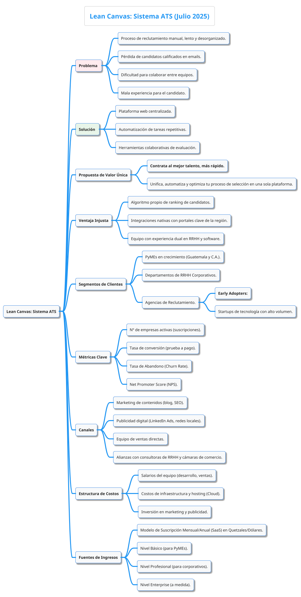
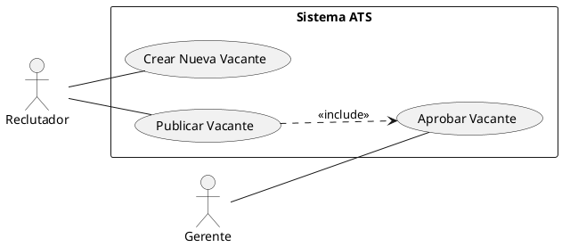
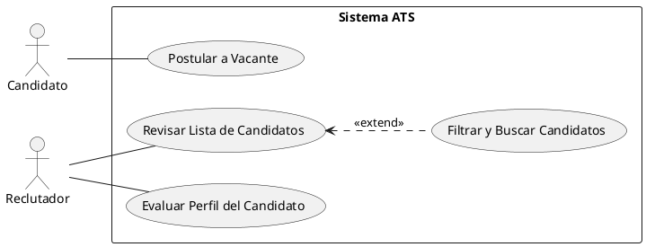
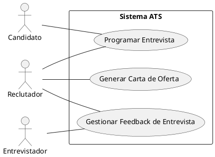
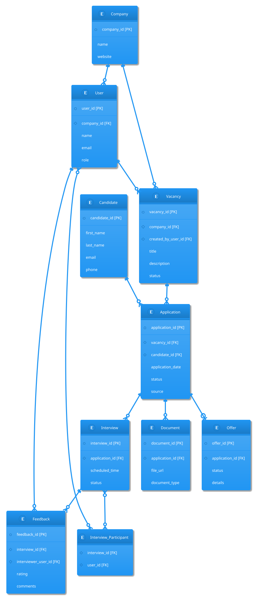
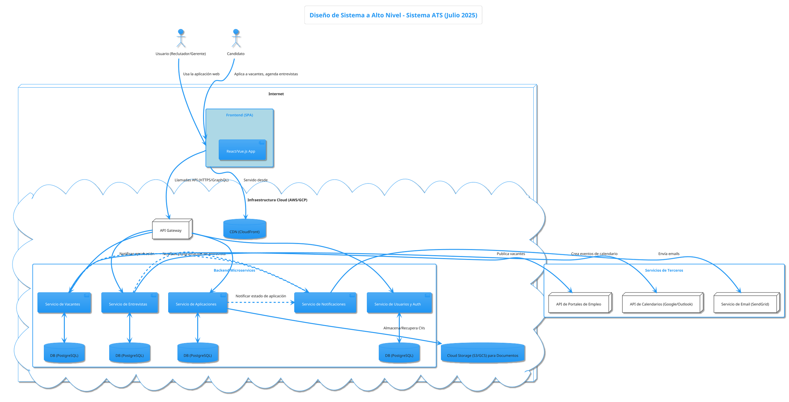

# Desarrollo de un Sistema ATS (Applicant Tracking System)

A continuación, se detalla la descripción, el valor añadido y las ventajas competitivas de un sistema ATS, tomando como referencia el ciclo de reclutamiento ilustrado.

---

## 1. ¿En qué consiste un Software ATS?

Un **Sistema de Seguimiento de Candidatos (ATS)** es una aplicación de software diseñada para automatizar y gestionar todo el proceso de reclutamiento y selección de personal. Su función principal es servir como una base de datos centralizada para toda la información relacionada con las vacantes y los postulantes.

El sistema abarca desde la **creación de la oferta de empleo** hasta la **contratación final del candidato**. El software gestiona la publicación de vacantes en múltiples plataformas (portales de empleo, redes sociales, web de la empresa), recibe y organiza las postulaciones, filtra automáticamente los currículums según palabras clave o requisitos predefinidos, coordina la realización de pruebas y la programación de entrevistas, y finalmente, gestiona el proceso de oferta y contratación.

En esencia, transforma un proceso manual y propenso a errores en un flujo de trabajo digital, organizado y eficiente.

---

## 2. Valor Añadido

El principal valor añadido de un ATS es la **optimización y centralización del proceso de reclutamiento**. Brinda una única fuente de verdad para reclutadores, gerentes de contratación y candidatos.

* **Automatización:** Elimina tareas repetitivas como la publicación manual de ofertas en diferentes sitios, la revisión inicial de cada CV y el envío de correos de seguimiento. Esto libera tiempo valioso para que los reclutadores se enfoquen en tareas estratégicas, como la entrevista y la selección de los mejores talentos.
* **Colaboración Mejorada:** Permite que todo el equipo de contratación (reclutadores, jefes de departamento, etc.) colabore en la misma plataforma. Pueden ver el estado de cada candidato, compartir notas, dar feedback y tomar decisiones de forma conjunta y transparente.
* **Experiencia del Candidato:** Mejora la comunicación con los postulantes al enviar notificaciones automáticas sobre el estado de su aplicación, creando una experiencia más profesional y positiva, incluso para quienes no son seleccionados.

---

## 3. Ventajas Competitivas

Implementar o desarrollar un ATS proporciona ventajas competitivas significativas para una empresa.

* **Reducción de Tiempo y Costos de Contratación:** Al automatizar gran parte del proceso, se reduce drásticamente el tiempo necesario para cubrir una vacante (time-to-hire). Esto se traduce en un ahorro de costos operativos y una menor pérdida de productividad por tener puestos sin cubrir.
* **Mejora en la Calidad de la Contratación:** El sistema permite filtrar y clasificar a los candidatos más calificados de manera objetiva y rápida, utilizando criterios específicos. Esto aumenta las probabilidades de encontrar al talento ideal y reduce el sesgo inconsciente en las primeras fases del proceso.
* **Base de Datos de Talento (Talent Pool):** Un ATS construye un repositorio de candidatos que se han postulado previamente. Si surge una nueva vacante, la empresa puede buscar primero en su propia base de datos de talento, agilizando futuras contrataciones sin necesidad de iniciar un nuevo proceso de búsqueda desde cero.
* **Cumplimiento y Analítica:** Facilita el cumplimiento de las normativas de protección de datos (como GDPR o leyes locales) al gestionar adecuadamente la información de los candidatos. Además, ofrece métricas y reportes clave (ej. tiempo promedio de contratación, efectividad de las fuentes de reclutamiento) que permiten tomar decisiones basadas en datos para optimizar la estrategia de adquisición de talento.

---

## 4. Explicación de las Funciones Principales

A continuación, se desglosan las funcionalidades clave que el sistema ATS debe poseer para cubrir eficientemente todo el ciclo de reclutamiento. Cada función corresponde a una etapa del proceso ilustrado.

---

### Módulo 1: Gestión de Vacantes

Corresponde a la fase **"Creating Jobs"**. Este es el punto de partida del proceso y debe ser robusto y flexible.

* **Creación de Puestos:** Formularios dinámicos para que los reclutadores y gerentes de contratación definan los detalles de una nueva vacante. Debe incluir campos como: título del puesto, descripción de responsabilidades, requisitos (habilidades, experiencia, educación), departamento, ubicación, tipo de contrato (tiempo completo, parcial, etc.) y salario (opcional/rango).
* **Plantillas de Empleo:** Permitir guardar descripciones de puestos comunes como plantillas para agilizar la creación de vacantes futuras similares.
* **Flujos de Aprobación:** Implementar un sistema donde una nueva vacante deba ser aprobada por uno o más gerentes antes de ser publicada. Esto asegura el control presupuestario y la alineación departamental.

---

### Módulo 2: Publicación y Difusión

Corresponde a la fase **"Jobs Published on Job Boards, Website, Social Media, etc."**. El objetivo es maximizar la visibilidad de la oferta.

* **Integración con Portales de Empleo (Job Boards):** Desarrollar APIs o conectores para publicar la vacante automáticamente en múltiples portales de empleo (LinkedIn, Indeed, portales locales, etc.) con un solo clic.
* **Página de Empleo Propia (Career Page):** Generar automáticamente una página de "Carreras" o "Trabaja con Nosotros" para el sitio web de la empresa. Esta página debe listar las vacantes activas y permitir la postulación directa. Debe ser personalizable para reflejar la marca de la empresa.
* **Difusión en Redes Sociales:** Facilitar la compartición de las vacantes en las redes sociales de la empresa con enlaces de seguimiento únicos para medir la efectividad de cada canal.

---

### Módulo 3: Recepción y Gestión de Aplicaciones

Corresponde a la fase **"Job Applications Received"**. Esta es la función central de agregación de datos.

* **Centralización de Candidatos:** El sistema debe capturar y unificar todas las aplicaciones recibidas desde los diferentes canales (portales, página de carreras, referidos, etc.) en una única base de datos.
* **Análisis de CVs (CV Parsing):** Implementar una herramienta que extraiga automáticamente la información clave de los currículums (nombre, contacto, experiencia laboral, habilidades, educación) y la ingrese en campos estructurados en el perfil del candidato. Esto estandariza la información y facilita las búsquedas.
* **Perfil Único del Candidato:** Cada postulante debe tener un perfil único que muestre su historial de aplicaciones, comunicaciones, notas del equipo, resultados de pruebas y estado actual en el proceso.

---

### Módulo 4: Filtrado y Evaluación de Candidatos

Corresponde a las fases **"Applications are Reviewed"** y **"Online Tests are Conducted"**. Aquí es donde la automatización aporta el mayor valor.

* **Filtros y Búsqueda Avanzada:** Permitir a los reclutadores buscar y filtrar candidatos usando múltiples criterios: palabras clave en el CV, años de experiencia, ubicación, habilidades específicas, etc.
* **Ranking y Puntuación Automática (Scoring):** Configurar reglas para que el sistema asigne una puntuación a los candidatos basada en qué tan bien su perfil coincide con los requisitos de la vacante. Esto permite priorizar a los más calificados.
* **Integración de Pruebas en Línea:** Conectar el ATS con plataformas de evaluación técnica, psicométrica o de habilidades. El sistema debería poder enviar las pruebas a los candidatos y recibir los resultados directamente en su perfil.

---

### Módulo 5: Coordinación de Entrevistas

Corresponde a la fase **"Interviews are Scheduled"**. El objetivo es simplificar la logística compleja de la programación.

* **Sincronización de Calendarios:** Integración con calendarios de Google, Outlook, etc., para que los reclutadores puedan ver la disponibilidad de los entrevistadores sin salir del ATS.
* **Autoprogramación para Candidatos:** Permitir que los candidatos seleccionados elijan un horario para la entrevista a partir de los espacios disponibles que el equipo de contratación ha definido.
* **Plantillas de Comunicación:** Crear plantillas de correo electrónico personalizables para invitar a entrevistas, enviar recordatorios y solicitar feedback a los entrevistadores.

---

### Módulo 6: Selección y Contratación

Corresponde a la fase **"Selected Applicants are Hired"**. Esta es la etapa final del flujo de trabajo.

* **Gestión de Ofertas:** Crear y enviar cartas de oferta formales a los candidatos seleccionados. El sistema debe registrar si la oferta fue aceptada, rechazada o está en negociación.
* **Flujo de Contratación (Onboarding):** Una vez que un candidato acepta la oferta, el sistema debe facilitar la transición de "candidato" a "empleado", potencialmente integrándose con el software de RRHH (HRIS) de la empresa para transferir sus datos y comenzar el proceso de incorporación.
* **Analítica y Reportes:** Generar informes sobre métricas clave del proceso: tiempo para contratar, costo por contratación, eficacia de las fuentes de reclutamiento, tasas de conversión en cada etapa del embudo, etc. Esto es crucial para la mejora continua.

---

## 4. Diagrama Lean Canvas del modelo de negocio

---



---

## 5. Casos de uso principales

A continuación se detallan los tres casos de uso más importantes del sistema, cada uno con su descripción y su diagrama correspondiente en formato PlantUML.

---

### Caso de Uso 1: Gestión de Publicación de Vacantes

* **Descripción:** Este caso de uso representa las acciones que realizan los usuarios internos para crear y publicar una nueva oferta de empleo. El reclutador inicia el proceso, el cual puede requerir la aprobación de un gerente antes de que el sistema la publique automáticamente en los portales seleccionados.
* **Actores:** Reclutador, Gerente.



### Caso de Uso 2: Gestión y Evaluación de Candidatos

* **Descripción:** Este caso de uso se centra en cómo el sistema maneja las postulaciones. Un candidato aplica a una vacante, y el Reclutador utiliza el sistema para filtrar, revisar perfiles y mover a los candidatos a través de las diferentes etapas iniciales del proceso de selección.
* **Actores:** Candidato, Reclutador.



### Caso de Uso 3: Coordinación de Entrevistas y Contratación

* **Descripción:** Este caso de uso cubre las etapas finales del proceso de reclutamiento. El Reclutador coordina las entrevistas involucrando a los entrevistadores y al candidato. Finalmente, gestiona la creación de la oferta de trabajo y registra la contratación en el sistema.
* **Actores:** Reclutador, Candidato, Entrevistador.



---

## 6. Modelo de datos

A continuación, se detalla el modelo de datos que da soporte a los casos de uso de publicación de vacantes, gestión de candidatos y coordinación de entrevistas. Se describen las entidades, sus atributos y las relaciones entre ellas.

---

### Entidades y Atributos

#### Caso de Uso 1: Gestión de Publicación de Vacantes

* **Company**: Representa a la empresa que utiliza el sistema.
    * `company_id` (PK, UUID): Identificador único de la empresa.
    * `name` (String): Nombre de la empresa.
    * `website` (String): Sitio web de la empresa.

* **User**: Almacena a los usuarios del sistema (Reclutadores, Gerentes).
    * `user_id` (PK, UUID): Identificador único del usuario.
    * `company_id` (FK): Empresa a la que pertenece el usuario.
    * `name` (String): Nombre completo del usuario.
    * `email` (String): Correo electrónico (único).
    * `role` (Enum): Rol del usuario ('RECRUITER', 'MANAGER', 'INTERVIEWER').

* **Vacancy**: Representa una oferta de trabajo.
    * `vacancy_id` (PK, UUID): Identificador único de la vacante.
    * `company_id` (FK): Empresa que publica la vacante.
    * `created_by_user_id` (FK): Usuario que creó la vacante.
    * `title` (String): Título del puesto.
    * `description` (Text): Descripción detallada del puesto.
    * `status` (Enum): Estado actual ('DRAFT', 'PENDING_APPROVAL', 'OPEN', 'CLOSED').

#### Caso de Uso 2: Gestión y Evaluación de Candidatos

* **Candidate**: Representa a una persona que se postula a una vacante.
    * `candidate_id` (PK, UUID): Identificador único del candidato.
    * `first_name` (String): Nombre del candidato.
    * `last_name` (String): Apellido del candidato.
    * `email` (String): Correo electrónico (único).
    * `phone` (String): Número de teléfono.

* **Application**: Es la postulación de un candidato a una vacante específica.
    * `application_id` (PK, UUID): Identificador único de la postulación.
    * `vacancy_id` (FK): Vacante a la que se postula.
    * `candidate_id` (FK): Candidato que se postula.
    * `application_date` (Timestamp): Fecha y hora de la postulación.
    * `status` (Enum): Estado en el proceso ('RECEIVED', 'PRESELECTED', 'INTERVIEW', 'REJECTED', 'HIRED').
    * `source` (String): Canal por el que llegó la postulación (ej. 'LinkedIn', 'Página de Carreras').

* **Document**: Almacena los archivos adjuntos a una postulación, como el CV.
    * `document_id` (PK, UUID): Identificador único del documento.
    * `application_id` (FK): Postulación a la que pertenece.
    * `file_url` (String): URL donde está almacenado el archivo.
    * `document_type` (Enum): Tipo de documento ('CV', 'COVER_LETTER').

#### Caso de Uso 3: Coordinación de Entrevistas y Contratación

* **Interview**: Representa una entrevista programada dentro de un proceso.
    * `interview_id` (PK, UUID): Identificador único de la entrevista.
    * `application_id` (FK): Postulación asociada a la entrevista.
    * `scheduled_time` (Timestamp): Fecha y hora programada.
    * `status` (Enum): Estado de la entrevista ('SCHEDULED', 'COMPLETED', 'CANCELED').

* **Interview_Participant**: Tabla intermedia para asignar uno o más entrevistadores a una entrevista.
    * `interview_id` (FK): Entrevista.
    * `user_id` (FK): Usuario (entrevistador) que participa.

* **Feedback**: Almacena los comentarios y la evaluación de un entrevistador sobre una entrevista.
    * `feedback_id` (PK, UUID): Identificador único del feedback.
    * `interview_id` (FK): Entrevista evaluada.
    * `interviewer_user_id` (FK): Usuario que da el feedback.
    * `rating` (Integer): Calificación (ej. de 1 a 5).
    * `comments` (Text): Comentarios detallados.

* **Offer**: Representa la oferta formal de trabajo enviada a un candidato.
    * `offer_id` (PK, UUID): Identificador único de la oferta.
    * `application_id` (FK): Postulación a la que se le hace la oferta.
    * `status` (Enum): Estado de la oferta ('SENT', 'ACCEPTED', 'REJECTED').
    * `details` (Text): Detalles de la oferta (salario, condiciones, etc.).

---

### Diagrama de Entidad-Relación (ERD)



---

## 6. Diseño del sistema a alto nivel

A continuación se presenta una arquitectura de alto nivel para el desarrollo del Sistema de Seguimiento de Candidatos (ATS). El diseño está basado en un enfoque moderno, escalable y nativo de la nube, utilizando microservicios.

---

### Explicación de la Arquitectura

Se propone una **arquitectura de microservicios** que divide el sistema en componentes independientes y enfocados en dominios de negocio específicos. Esto facilita el desarrollo, el despliegue y el mantenimiento a largo plazo.

1.  **Frontend (Aplicación Cliente):**
    * Será una **Single Page Application (SPA)** desarrollada con un framework moderno como **React** o **Vue.js**. Esto proporciona una experiencia de usuario fluida y rápida.
    * La aplicación se distribuirá a través de una **Red de Distribución de Contenidos (CDN)** como AWS CloudFront o Cloudflare, para garantizar una baja latencia para los usuarios en cualquier parte del mundo.

2.  **API Gateway:**
    * Actúa como el único punto de entrada para todas las solicitudes del frontend.
    * Se encarga de enrutar las peticiones al microservicio correspondiente, además de gestionar tareas transversales como la autenticación (validación de tokens JWT), el registro (logging) y la limitación de peticiones (rate limiting).

3.  **Backend (Microservicios):**
    * Cada servicio se ejecuta de forma independiente, tiene su propia base de datos y se comunica con otros servicios a través de APIs o un bus de mensajería asíncrono (como RabbitMQ o AWS SQS).
    * **Servicio de Usuarios y Auth:** Gestiona el registro, inicio de sesión (emitiendo tokens JWT) y los roles de los usuarios.
    * **Servicio de Vacantes:** Responsable de la creación, aprobación y publicación de las ofertas de empleo.
    * **Servicio de Aplicaciones:** Maneja todo lo relacionado con los candidatos y sus postulaciones.
    * **Servicio de Entrevistas:** Coordina la programación de entrevistas y la recolección de feedback.
    * **Servicio de Notificaciones:** Centraliza el envío de todas las comunicaciones por correo electrónico (bienvenidas, cambios de estado, recordatorios).

4.  **Persistencia de Datos:**
    * Cada microservicio tendrá su propia **base de datos PostgreSQL**, alojada en un servicio gestionado como **AWS RDS** o **Google Cloud SQL**. Esto asegura un bajo acoplamiento entre servicios.
    * Los archivos (como CVs y cartas de presentación) se almacenarán en un servicio de almacenamiento de objetos como **AWS S3** o **Google Cloud Storage** por su escalabilidad y costo-eficiencia.

5.  **Servicios de Terceros:**
    * El sistema se integrará con APIs externas para potenciar su funcionalidad: APIs de **portales de empleo** para la publicación automática, APIs de **calendarios** (Google, Outlook) para la programación de entrevistas y un **servicio de envío de correos** (SendGrid, Mailgun) para las notificaciones.

---

### Diagrama de Arquitectura

El siguiente diagrama muestra los componentes principales del sistema y cómo interactúan entre sí.



## 7. Modelo C4: Gestión de Publicación de Vacantes

A continuación, se presentan los diagramas del modelo C4 que describen el sistema desde diferentes niveles de abstracción para el caso de uso específico de la publicación de vacantes.

---

### Nivel 1: Diagrama de Contexto del Sistema

Este diagrama muestra una visión general del sistema ATS, sus usuarios y las interacciones con otros sistemas externos relevantes para este caso de uso.

```plantuml
@startuml
!include [https://raw.githubusercontent.com/plantuml-stdlib/C4-PlantUML/master/C4_Context.puml](https://raw.githubusercontent.com/plantuml-stdlib/C4-PlantUML/master/C4_Context.puml)

title Diagrama de Contexto del Sistema - ATS

LAYOUT_WITH_LEGEND()

Person(recruiter, "Reclutador / Gerente", "Crea, gestiona y aprueba vacantes a través del sistema.")
System(ats, "Sistema ATS", "Plataforma para automatizar y gestionar el ciclo de reclutamiento.")
System_Ext(job_boards, "Portales de Empleo", "Plataformas externas donde se publican las ofertas de trabajo (ej. LinkedIn, Indeed).")

Rel(recruiter, ats, "Usa")
Rel(ats, job_boards, "Publica vacantes aprobadas", "API (HTTPS)")

@enduml
```

### Nivel 2: Diagrama de Contenedores

Este diagrama descompone el "Sistema ATS" en sus principales contenedores (aplicaciones, bases de datos, etc.) que colaboran para cumplir con el caso de uso.

```plantuml
@startuml
!include [https://raw.githubusercontent.com/plantuml-stdlib/C4-PlantUML/master/C4_Container.puml](https://raw.githubusercontent.com/plantuml-stdlib/C4-PlantUML/master/C4_Container.puml)

title Diagrama de Contenedores - Gestión de Vacantes

Person(recruiter, "Reclutador / Gerente", "Crea y aprueba vacantes.")

System_Ext(job_boards, "Portales de Empleo", "API para publicar ofertas.")
System_Ext(email_service, "Servicio de Email", "API para enviar notificaciones (ej. SendGrid).")

System_Boundary(c1, "Sistema ATS") {
    Container(spa, "Aplicación Frontend (SPA)", "JavaScript, React/Vue", "Permite a los usuarios interactuar con el sistema.")
    Container(api_gateway, "API Gateway", "Nginx/Spring Cloud Gateway", "Punto de entrada único para todas las peticiones API.")
    
    Container(vacancy_service, "Servicio de Vacantes", "Java/Spring Boot", "Gestiona la lógica de creación, aprobación y publicación de vacantes.")
    ContainerDb(vacancy_db, "Base de Datos de Vacantes", "PostgreSQL", "Almacena la información de las vacantes.")

    Container(notification_service, "Servicio de Notificaciones", "Node.js/Express", "Gestiona el envío de emails y otras notificaciones.")
}

Rel(recruiter, spa, "Usa", "HTTPS")
Rel(spa, api_gateway, "Realiza llamadas API", "HTTPS")

Rel(api_gateway, vacancy_service, "Enruta peticiones a", "HTTPS")
Rel_Neighbor(vacancy_service, vacancy_db, "Lee y escribe en", "JDBC")
Rel(vacancy_service, notification_service, "Solicita envío de notificación de aprobación", "AMQP/HTTPS")
Rel(vacancy_service, job_boards, "Publica vacantes", "HTTPS")
Rel(notification_service, email_service, "Envía email", "HTTPS")

@enduml
```

### Nivel 3: Diagrama de Componentes

Este diagrama hace zoom en el "Servicio de Vacantes" para mostrar sus componentes internos principales y cómo se reparten las responsabilidades.

```plantuml
@startuml
!include [https://raw.githubusercontent.com/plantuml-stdlib/C4-PlantUML/master/C4_Component.puml](https://raw.githubusercontent.com/plantuml-stdlib/C4-PlantUML/master/C4_Component.puml)

title Diagrama de Componentes - Servicio de Vacantes

Container_Boundary(c1, "Servicio de Vacantes") {
    Component(vacancy_controller, "Vacancy Controller", "Spring Boot REST Controller", "Expone la API para gestionar vacantes (crear, aprobar, etc.).")
    Component(approval_logic, "Lógica de Aprobación", "Java Class", "Implementa el flujo y las reglas de negocio para aprobar una vacante.")
    Component(publication_logic, "Lógica de Publicación", "Java Class", "Implementa la lógica para conectarse y publicar en las APIs de los portales de empleo.")
    Component(repository, "Repositorio de Vacantes", "Spring Data JPA", "Proporciona una capa de abstracción para el acceso a la base de datos.")
}

System_Ext(job_boards, "Portales de Empleo", "Sistemas externos.")
SystemDb_Ext(vacancy_db, "Base de Datos de Vacantes", "Base de datos PostgreSQL.")
System_Ext(api_gateway, "API Gateway", "Punto de entrada de las peticiones.")
System_Ext(notification_service, "Servicio de Notificaciones", "Servicio para enviar notificaciones.")

Rel(api_gateway, vacancy_controller, "Envía peticiones HTTP")
Rel(vacancy_controller, approval_logic, "Usa")
Rel(vacancy_controller, publication_logic, "Usa")
Rel(approval_logic, repository, "Usa")
Rel(publication_logic, repository, "Usa")
Rel(publication_logic, job_boards, "Publica en", "API (HTTPS)")
Rel(approval_logic, notification_service, "Envía evento de 'Vacante Aprobada'", "AMQP/HTTPS")
Rel(repository, vacancy_db, "Lee y escribe usando", "JDBC")

@enduml
```