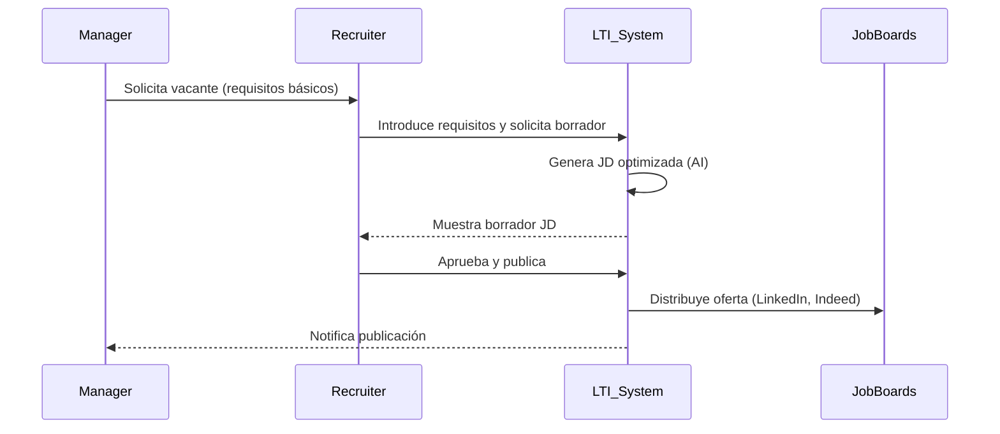
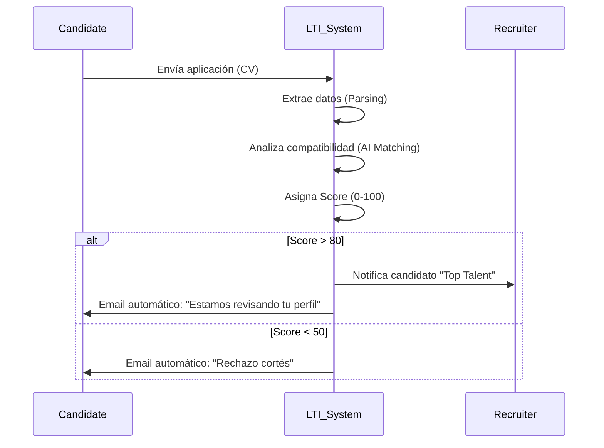
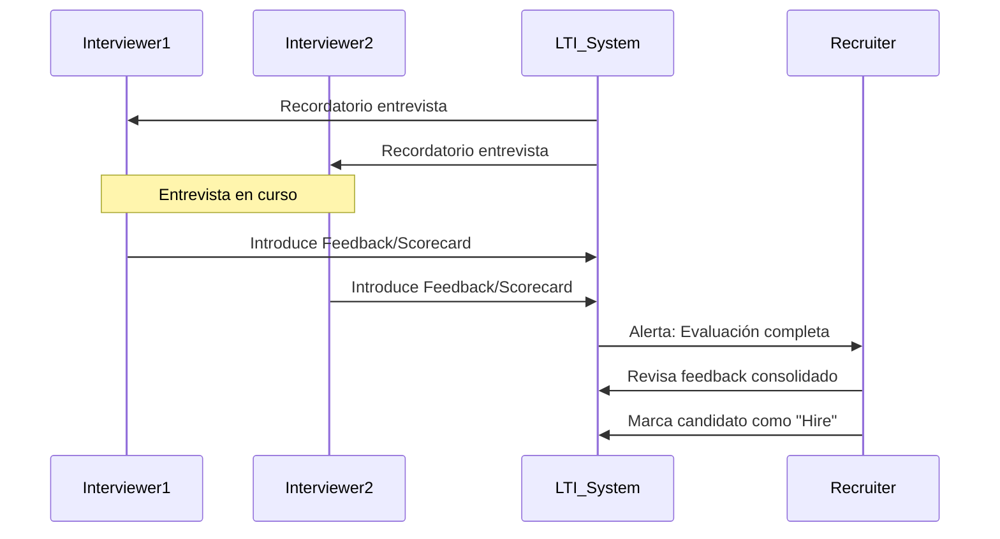
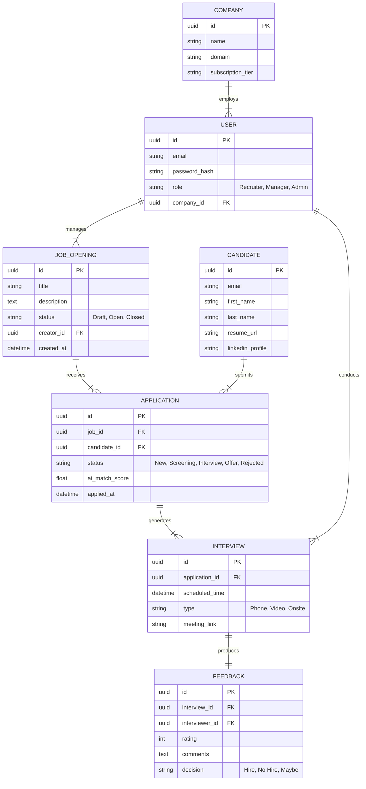

# LTI - Applicant Tracking System (ATS) del Futuro

## 1. Descripción del Producto

**LTI (Lead Talent Intelligence)** es un sistema de seguimiento de candidatos (ATS) de próxima generación diseñado para transformar el reclutamiento pasivo en una adquisición de talento proactiva y automatizada.

### Valor Añadido
A diferencia de los ATS tradicionales que actúan como meros repositorios de CVs, LTI actúa como un "copiloto de reclutamiento". Integra inteligencia artificial en el núcleo del proceso para eliminar tareas repetitivas y proporcionar insights profundos sobre los candidatos, permitiendo a los equipos de HR centrarse en la parte humana de la contratación: la cultura y la conexión.

### Ventajas Competitivas
*   **Colaboración en Tiempo Real:** Un sistema unificado tipo "tablero de control" donde reclutadores y managers interactúan en vivo (chat contextual, votaciones, feedback en vivo), eliminando cadenas de emails.
*   **Automatización "Human-in-the-loop":** Agentes de IA que gestionan el filtrado inicial, la programación de entrevistas y el feedback a candidatos, asegurando que ningún candidato se quede sin respuesta (Mejora de Employer Branding).
*   **Matching Semántico:** Búsqueda y recomendación de candidatos no por palabras clave, sino por compatibilidad de habilidades y cultura, utilizando LLMs.

## 2. Funciones Principales

1.  **AI Job Crafter:** Generación automática de descripciones de ofertas de trabajo optimizadas para SEO e inclusividad basándose en requisitos breves del manager.
2.  **Smart Screening & Ranking:** Análisis automático de CVs entrantes, asignando un "Score de Ajuste" y generando un resumen de por qué el candidato encaja o no.
3.  **Hub de Entrevistas Colaborativo:** Espacio donde los entrevistadores pueden tomar notas compartidas en tiempo real y rellenar scorecards durante la entrevista.
4.  **Auto-Scheduler:** Sistema inteligente que negocia automáticamente huecos en las agendas de múltiples entrevistadores y el candidato.
5.  **Analytics Predictivo:** Dashboards que no solo muestran lo que pasó, sino que predicen cuellos de botella en el pipeline de contratación (ej. "Tardarás 3 semanas más de lo previsto en cerrar esta posición").

## 3. Lean Canvas

| Sección | Detalle |
| :--- | :--- |
| **Problema** | 1. Procesos de contratación lentos e ineficientes.<br>2. Mala comunicación entre HR y Managers.<br>3. "Ghosting" a candidatos por falta de tiempo.<br>4. Sesgo en la selección manual. |
| **Segmentos de Clientes** | 1. Empresas tecnológicas de alto crecimiento (Scale-ups).<br>2. Departamentos de HR sobrecargados en grandes corporaciones.<br>3. Agencias de reclutamiento boutique. |
| **Propuesta de Valor Única** | El primer ATS que reduce el tiempo de contratación en un 40% mediante la colaboración en tiempo real y agentes de IA autónomos. |
| **Solución** | Plataforma SaaS con IA integrada para sourcing, filtrado y programación automática. |
| **Canales** | 1. Ventas directas B2B (LinkedIn, Email).<br>2. Content Marketing (Blog sobre HR Tech).<br>3. Integraciones en Marketplaces (Slack, Microsoft Teams). |
| **Flujos de Ingreso** | 1. Suscripción SaaS mensual/anual por usuario (recruiter).<br>2. Tier Enterprise para características avanzadas de IA y soporte dedicado. |
| **Estructura de Costes** | 1. Desarrollo de Software e infraestructura Cloud.<br>2. Costes de API de LLMs (OpenAI/Anthropic).<br>3. Ventas y Marketing. |
| **Métricas Clave** | 1. Time-to-Hire (Tiempo de contratación).<br>2. NPS de Candidatos y Managers.<br>3. Ahorro de horas administrativas por recruiter. |
| **Ventaja Injusta** | Algoritmo propietario de matching cultural y técnico entrenado con datos de éxito de contrataciones previas. |

## 4. Casos de Uso Principales

### Caso de Uso 1: Publicación de Oferta Asistida
El Hiring Manager solicita una vacante y el Recruiter utiliza la IA para generar y publicar la oferta.



### Caso de Uso 2: Filtrado Automático de Candidatos
Un candidato aplica y el sistema lo evalúa automáticamente.



### Caso de Uso 3: Evaluación Colaborativa
El equipo de contratación entrevista y decide sobre un candidato.



## 5. Modelo de Datos

Entidades principales del sistema.



## 6. Diseño del Sistema a Alto Nivel

El sistema sigue una arquitectura de **Microservicios** para permitir escalabilidad independiente de los módulos de IA (que consumen mucha CPU/GPU o latencia de red) y los módulos transaccionales.

### Componentes Clave:
1.  **API Gateway / BFF (Backend for Frontend):** Punto de entrada único, gestiona autenticación y ruteo.
2.  **Core Service (Go/Node.js):** Gestiona usuarios, ofertas, y el flujo de estado de las aplicaciones. Lógica de negocio principal.
3.  **Candidate Service (Node.js):** Gestión de perfiles de candidatos y parsing de CVs.
4.  **AI Matching Service (Python):** Servicio asíncrono que utiliza LLMs y bases de datos vectoriales para comparar CVs con ofertas.
5.  **Notification Service:** Gestión de emails, integraciones con Slack/Teams.
6.  **Scheduling Service:** Integración con Google Calendar/Outlook.

### Diagrama de Arquitectura

```mermaid
graph TD
    ClientWeb[Web Client React] --> API_Gateway
    ClientMobile[Mobile App] --> API_Gateway

    subgraph "LTI Cloud Infrastructure"
        API_Gateway[API Gateway] --> Auth[Auth Service (OAuth2)]
        API_Gateway --> Core[Core ATS Service]
        API_Gateway --> Candidate[Candidate Service]
        
        Core --> DB[(PostgreSQL Primary)]
        Candidate --> DB
        
        Core --> Broker[Message Broker (RabbitMQ/Kafka)]
        
        Broker --> AI_Service[AI Matching Service]
        Broker --> Notif[Notification Service]
        Broker --> Scheduler[Scheduler Service]
        
        AI_Service --> VectorDB[(Vector DB - Pinecone/Weaviate)]
        AI_Service --> LLM_API[External LLM API (OpenAI)]
        
        Scheduler --> Cal_API[Calendar Providers API]
        Notif --> Email_API[Email Providers (SendGrid)]
    end
```

## 7. Diagrama C4 - Componente: AI Matching Service

Profundizamos en el **AI Matching Service**, el corazón inteligente de LTI.

Este servicio es responsable de recibir un nuevo CV o una nueva Oferta, generar sus embeddings (representación vectorial) y calcular la similitud semántica.

**Contenedor:** Python (FastAPI/Flask)
**Responsabilidades:**
1.  Limpieza y extracción de texto de PDFs (CVs).
2.  Generación de Embeddings.
3.  Búsqueda vectorial.
4.  Generación de resúmenes con LLM.

```mermaid
C4Component
    title Component Diagram for AI Matching Service

    Container_Boundary(ai_service, "AI Matching Service") {
        Component(api_handler, "API Handler", "FastAPI", "Exposes REST endpoints for internal services")
        Component(text_processor, "Text Processor", "Python/LangChain", "Cleans and normalizes text from resumes/JDs")
        Component(embedding_engine, "Embedding Engine", "OpenAI Ada/HuggingFace", "Converts text to vector embeddings")
        Component(matcher, "Matching Logic", "Python/NumPy", "Calculates cosine similarity and ranks candidates")
        Component(llm_wrapper, "LLM Wrapper", "Python", "Generates natural language summaries/explanations")
    }

    Container(msg_queue, "Message Queue", "RabbitMQ", "Events: application_created, job_created")
    ContainerDb(vector_db, "Vector Database", "Pinecone/Milvus", "Stores candidate and job embeddings")
    System_Ext(llm_provider, "LLM Provider", "OpenAI API", "External AI Model")

    msg_queue -> api_handler : "Trigger analysis event"
    api_handler -> text_processor : "Process raw text"
    text_processor -> embedding_engine : "Get embeddings"
    embedding_engine -> llm_provider : "Request embeddings"
    embedding_engine -> vector_db : "Store/Query vectors"
    vector_db -> matcher : "Return similar vectors"
    matcher -> llm_wrapper : "Context for explanation"
    llm_wrapper -> llm_provider : "Generate summary"
    llm_wrapper -> api_handler : "Return result"
```
