### Tu misión es diseñar la primera versión del sistema, entregando los siguientes artefactos:

- ✅ **Descripción breve del software LTI**, valor añadido y ventajas competitivas.  

## Descripción del Software
LTS es un Applicant Tracking System (ATS) moderno diseñado para optimizar el proceso de reclutamiento mediante automatización inteligente, analítica integrada y una experiencia fluida tanto para candidatos como para equipos de recursos humanos.
Su propuesta de valor es reducir drásticamente el tiempo y esfuerzo necesarios para publicar vacantes, filtrar candidatos y coordinar entrevistas, centralizando todo el ciclo de contratación en una sola plataforma visual y colaborativa.

Ventajas competitivas:
- Arquitectura modular y API-first, que permite integrar fácilmente herramientas externas (LinkedIn, calendarios, pruebas técnicas, HRIS) y escalar sin fricciones.

- Analítica predictiva y automatización del flujo de selección, ofreciendo métricas en tiempo real y recomendaciones inteligentes para mejorar la calidad de contratación.

LTS redefine la eficiencia del reclutamiento moderno con un enfoque centrado en datos, colaboración y experiencia de usuario.

- ✅ **Explicación de las funciones principales.**  

## Funcionalidades Principales
1.
**Módulo / Funcionalidad:** Gestión de vacantes
Descripción breve: Permite crear, publicar y actualizar ofertas de empleo en múltiples canales (portal corporativo, redes, bolsas de trabajo) desde una sola interfaz.

2.
**Módulo / Funcionalidad:** Gestión de Candidatos
Descripción breve: Centraliza todos los perfiles aplicantes, con parsing automático de CVs y visualización de información relevante (skills, experiencia, fuente).

3.
**Módulo / Funcionalidad:** Pipeline de Selección
Descripción breve: Define etapas personalizables del proceso de reclutamiento (aplicación, entrevista, prueba técnica, oferta) con seguimiento visual y automatizaciones.

4.
**Módulo / Funcionalidad:** Evaluación y Feedback Colaborativo
Descripción breve: Facilita la evaluación de candidatos mediante scorecards, comentarios y calificaciones compartidas por los entrevistadores.

5.
**Módulo / Funcionalidad:** Programación de Entrevistas
Descripción breve: Sincroniza calendarios (Google/Microsoft), envía recordatorios automáticos y permite agendar entrevistas presenciales o virtuales.

6.
**Módulo / Funcionalidad:** Reportes y Analítica de Reclutamiento
Descripción breve: Muestra métricas clave (tiempo de contratación, tasa de conversión, fuente más efectiva) para optimizar decisiones de RRHH.

- ✅ **Añadir un diagrama Lean Canvas** para entender el modelo de negocio.  

## Diagrama Lean Canvas

```mermaid
graph TD
    A[Lean Canvas - LTS Applicant Tracking System]

    A --> B[1. Problema<br>- Procesos de reclutamiento dispersos<br>- Falta de visibilidad en el pipeline<br>- Tareas manuales que consumen tiempo]
    A --> C[2. Segmentos de Clientes<br>- Departamentos de RRHH de pymes y empresas medianas<br>- Consultoras de reclutamiento<br>- Startups en expansión]
    A --> D[3. Propuesta de Valor<br>- Centraliza todo el proceso de contratación<br>- Automatiza tareas repetitivas<br>- Ofrece analítica y predicciones en tiempo real]
    A --> E[4. Solución<br>- Plataforma modular con arquitectura API-first<br>- Dashboard visual y colaborativo<br>- Automatización de publicaciones y entrevistas]
    A --> F[5. Canales<br>- Plataforma web SaaS en la nube<br>- Integraciones con LinkedIn, Indeed y Glassdoor<br>- Marketing digital B2B y alianzas HR Tech]
    A --> G[6. Métricas Clave<br>- Tasa de conversión de candidatos a contratados<br>- Tiempo promedio de contratación<br>- Satisfacción del reclutador y del candidato]
    A --> H[7. Estructura de Costos<br>- Infraestructura en la nube y desarrollo continuo<br>- Marketing y soporte técnico<br>- Integraciones de terceros y servicios AI]
    A --> I[8. Fuentes de Ingreso<br>- Suscripción mensual por usuario o empresa<br>- Add-ons premium como análisis avanzado y parsing inteligente<br>- Servicios de integración personalizados]
    A --> J[9. Ventaja Injusta<br>- Motor de analítica predictiva propio<br>- Integración flexible con ecosistemas de recursos humanos<br>- Experiencia de usuario centrada en el candidato]
```

- ✅ **Descripción de los 3 casos de uso principales**, con el diagrama asociado a cada uno.  

## Diagramas de casos de uso:
🎯 Caso de Uso 1: Publicar una Vacante

Descripción:
El reclutador crea una nueva vacante ingresando el título, descripción, requisitos y nivel de experiencia.
El sistema permite publicar automáticamente la oferta en múltiples canales (portal corporativo, redes sociales, bolsas de trabajo).
El objetivo es ahorrar tiempo en la difusión de vacantes y centralizar la gestión de publicaciones.

Resultado esperado:
La vacante queda visible para los candidatos en los canales seleccionados y queda registrada en el pipeline de reclutamiento.

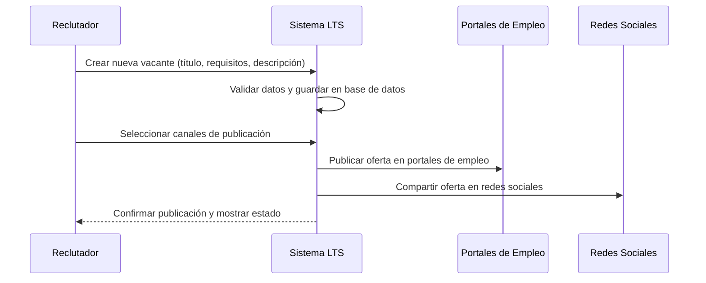

Actor principal: Reclutador
Objetivo: Crear y publicar una vacante en distintos canales (portal corporativo, redes sociales y bolsas de empleo).
Valor agregado: Centraliza la publicación y reduce el tiempo para abrir posiciones.

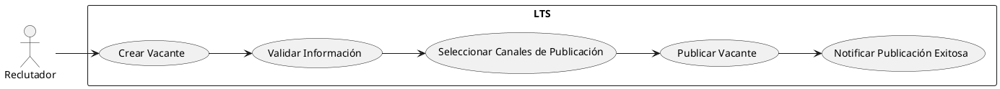

👤 Caso de Uso 2: Gestión de Candidatos y Pipeline

Descripción:
El reclutador revisa las postulaciones recibidas, visualiza los perfiles con parsing automático de CV y mueve al candidato entre las etapas del pipeline (por ejemplo: Aplicación → Entrevista Técnica → Oferta).
También puede dejar notas y puntuaciones colaborativas.

Resultado esperado:
El reclutador mantiene visibilidad total del estado de cada candidato y puede filtrar, evaluar o descartar postulaciones de forma ágil.

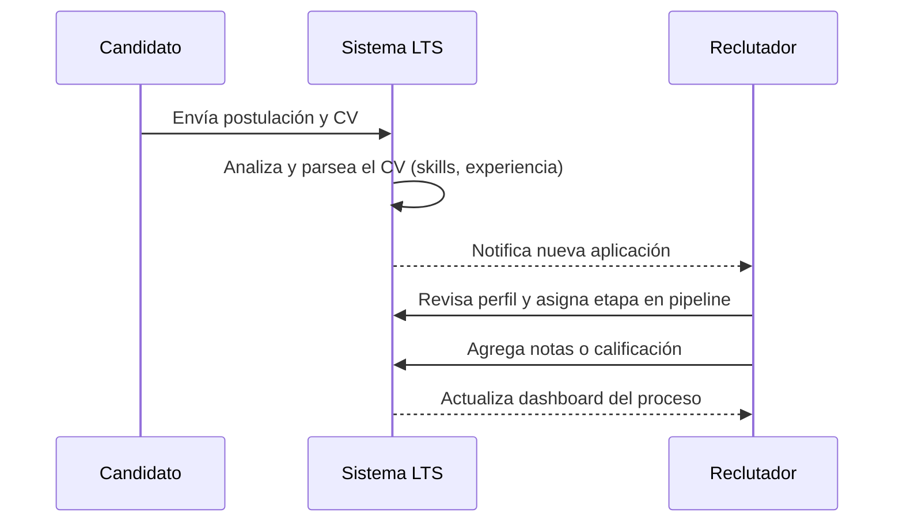
Actores: Candidato, Reclutador
Objetivo: Gestionar postulaciones, revisar CVs, clasificar candidatos y moverlos por las etapas del proceso.
Valor agregado: Mejora la trazabilidad y eficiencia en la selección de talento.

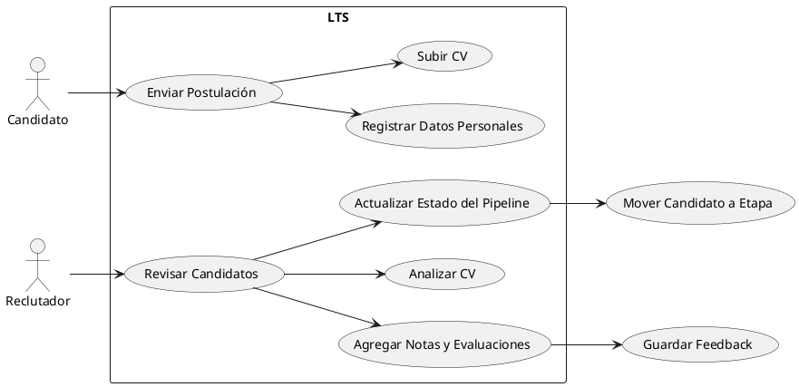

🗓️ Caso de Uso 3: Programar Entrevista

Descripción:
El reclutador selecciona a un candidato y agenda una entrevista en el calendario integrado (Google o Microsoft).
El sistema envía automáticamente invitaciones y recordatorios tanto al candidato como a los entrevistadores.
El objetivo es automatizar la coordinación y reducir los errores o tiempos muertos en la agenda.

Resultado esperado:
La entrevista queda confirmada en el calendario y registrada en la ficha del candidato.

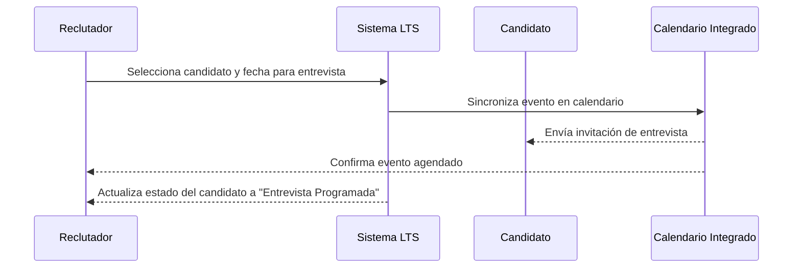

Actores: Reclutador, Candidato, Sistema de Calendario
Objetivo: Agendar entrevistas sincronizadas con herramientas externas (Google Calendar, Outlook, etc.) y notificar a los involucrados.
Valor agregado: Automatiza la coordinación de agendas y mantiene actualizado el estado del proceso.

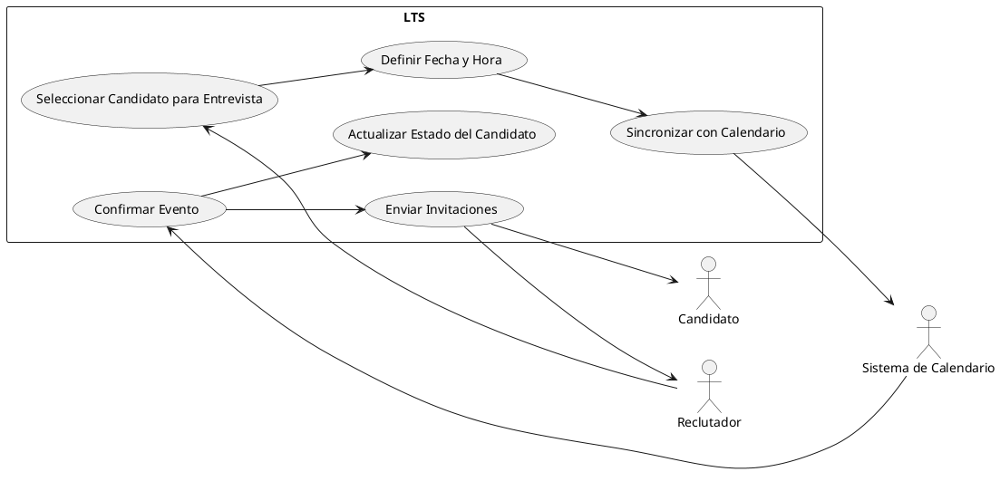

- ✅ **Modelo de datos** que cubra entidades, atributos (nombre y tipo) y relaciones.  

El modelo de datos de LTS está diseñado para soportar los procesos esenciales del ciclo de reclutamiento: publicación de vacantes, gestión de candidatos, seguimiento del pipeline y programación de entrevistas.
La estructura se compone de entidades principales como Job, Candidate, Application e Interview, que representan las etapas del flujo de contratación.
Además, incorpora componentes adicionales como PipelineStage, ApplicationStageHistory y Evaluation, los cuales permiten configurar y auditar el avance de los candidatos, así como centralizar la retroalimentación de los reclutadores.
El modelo equilibra simplicidad y extensibilidad, asegurando una base sólida para evolucionar hacia integraciones con canales externos de empleo, calendarios y sistemas de evaluación en futuras versiones del producto.

## Modelo de Datos

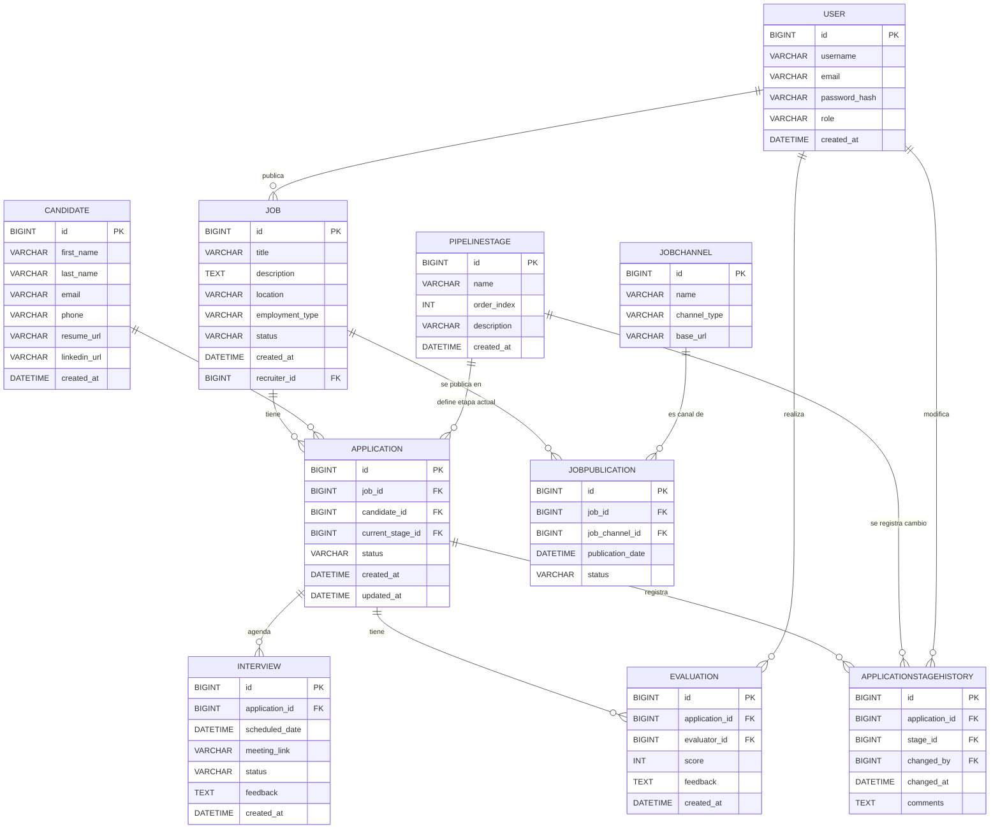

- ✅ **Diseño del sistema a alto nivel**, tanto explicado como diagrama adjunto.  
- ✅ **Diagrama C4** que llegue en profundidad a uno de los componentes del sistema, el que prefieras. 

## Diseño del Sistema a Alto Nivel

Patrón arquitectónico principal
Microservicios (API-first) con comunicación híbrida: REST para request/response y event-driven (mensajería) para integraciones asíncronas y procesos long-running.

Distribución de componentes clave:
- Frontend: SPA (React) que consume APIs públicas y viaja a través de un API Gateway (autenticado). Panels para Reclutadores, Hiring Managers y Candidate Career Site.

- Backend: Conjunto de microservicios alineados por dominio: JobService, CandidateService, ApplicationService, InterviewService, NotificationService, AnalyticsService, AuthService. Cada servicio es independiente, desplegable y con su propia persistencia lógica (base de datos compartida o schema por servicio).

- Persistencia: PostgreSQL como principal RDBMS; Redis para caching y locks; Elasticsearch para búsqueda / CV full-text; Object storage (S3/MinIO) para CVs y assets.

- Infra y mensajes: Kafka o RabbitMQ para eventos del dominio (candidate.applied, interview.scheduled). CI/CD, observabilidad (Prometheus + Grafana), tracing (OpenTelemetry), logging centralizado (ELK).

- Servicios externos: Job Boards (LinkedIn/Indeed), Email/SMS providers, Calendar providers (Google/Outlook), Assessment providers, SSO / Identity Provider.

Patrones de comunicación clave:
- Synchronous REST/JSON para CRUD y workflows de usuario (frontend ↔ API Gateway ↔ microservicios).

- Asynchronous events por Kafka/RabbitMQ para notificaciones, sincronizaciones y procesamientos (parseo CV, scoring, analytics).

- Back-channel: Webhooks para job boards y assessment providers.

- Auth / Security: OAuth2 / OpenID Connect para SSO (Auth0, Keycloak), JWT para propagation de identidad entre servicios.

Escalabilidad / Disponibilidad / Mantenimiento:
- Cada microservicio se escala horizontalmente.
- Uso de CQRS leve: read models indexados en Elasticsearch para búsquedas y performance.
- Versionado de API + backward compatibility.
- Observabilidad y health checks para autoscaling y SRE.

## Diagrama C4 — Nivel 1: Contexto (System Context Diagram)

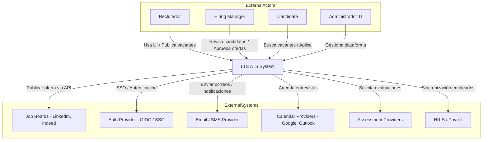
Notas rápidas: el diagrama muestra LTS como caja central y sus actores humanos + sistemas externos principales. Comunicaciones principales: UI ↔ LTS, LTS ↔ Job Boards, LTS ↔ Email/Calendar/Assessment/HRIS, LTS ↔ Auth Provider.

## Diagrama C4 — Nivel 2: Contenedores (Container Diagram)

```mermaid
graph TD
  subgraph ClientSide
    SPA[Web SPA<br>React]
    Mobile[Mobile App optional]
  end

  subgraph Edge
    APIGW[API Gateway<br>Nginx / Kong / AWS ALB]
    CDN[CDN]
  end

  subgraph Backend
    AuthSvc[Auth Service<br>Keycloak or Spring Security]
    JobSvc[Job Service<br>Spring Boot / Kotlin]
    CandidateSvc[Candidate Service<br>Spring Boot]
    ApplicationSvc[Application Service<br>Spring Boot]
    InterviewSvc[Interview Service<br>Spring Boot]
    NotificationSvc[Notification Service<br>Node.js or Spring Boot]
    AnalyticsSvc[Analytics Service<br>Python / Spark Jobs]
    ParserSvc[CV Parser Worker<br>Python/ML]
  end

  subgraph DataLayer
    Postgres[PostgreSQL]
    Redis[Redis - cache, locks]
    ES[Elasticsearch - search]
    S3[Object Storage - CVs and assets]
    Kafka[Kafka / RabbitMQ - event bus]
  end

  subgraph External
    JobBoards[Job Boards API]
    EmailProvider[Email / SMS Provider]
    CalendarAPI[Google / Microsoft Calendar]
    AssessmentAPI[Assessment Providers]
    HRIS[HRIS / Payroll]
    SSO[External Identity Provider]
  end

  %% client to edge
  SPA -->|HTTPS REST / GraphQL| APIGW
  Mobile -->|HTTPS REST / GraphQL| APIGW

  %% edge to backend
  APIGW -->|Auth / JWT| AuthSvc
  APIGW --> JobSvc
  APIGW --> CandidateSvc
  APIGW --> ApplicationSvc
  APIGW --> InterviewSvc
  APIGW --> NotificationSvc
  APIGW --> AnalyticsSvc

  %% backend internal sync
  JobSvc -->|events| Kafka
  CandidateSvc -->|events| Kafka
  ApplicationSvc -->|events| Kafka
  InterviewSvc -->|events| Kafka

  ParserSvc -->|push parsed data| CandidateSvc
  NotificationSvc -->|send emails| EmailProvider
  InterviewSvc -->|calendar calls| CalendarAPI
  JobSvc -->|publish via APIs| JobBoards
  AnalyticsSvc -->|read events| Kafka

  %% storage
  JobSvc --> Postgres
  CandidateSvc --> Postgres
  ApplicationSvc --> Postgres
  InterviewSvc --> Postgres

  CandidateSvc --> ES
  JobSvc --> ES
  CandidateSvc --> Redis
  NotificationSvc --> S3
  ParserSvc --> S3

  %% external integrations
  APIGW --> SSO
  JobSvc --> JobBoards
  NotificationSvc --> EmailProvider
  InterviewSvc --> CalendarAPI
  ApplicationSvc --> AssessmentAPI
  JobSvc --> HRIS
```
Tecnologías sugeridas
- Frontend: React (TypeScript), SPA.
- API Gateway: Kong / Nginx / AWS ALB.
- Backend: Spring Boot (Java/Kotlin) microservices (aligns con pila Java existente) o Node/TypeScript donde se prefiera.
- DB: PostgreSQL; Cache: Redis; Search: Elasticsearch; Messaging: Kafka; Object store: S3/MinIO.
- CI/CD: GitHub Actions / GitLab CI; Infra: Kubernetes/EKS.
- Escalado: Horizontal con Kubernetes, Vertical con JVM tuning.

## Diagrama C4 — Nivel 3: Componentes del Candidate Service

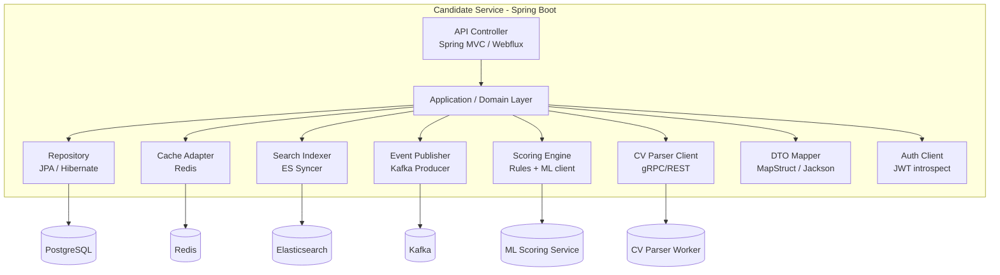

Component responsibilities
- API Controller: expone endpoints REST (CRUD candidate, upload CV, get profile). Valida JWT y aplica rate-limits.
- Application / Domain Layer: contiene la lógica de casos de uso (crear candidato, actualizar status, iniciar parseo).
- Repository: abstracción JPA para persistencia en Postgres.

- Cache Adapter: cachea perfiles calientes en Redis, también usado para locks y distributed rate limits.

- Search Indexer: mantiene índice en Elasticsearch para búsquedas por skills y full-text de CVs.

- CV Parser Client: invoca servicio asíncrono que extrae NER/skills; resulta en un evento que el servicio consume para enriquecer el candidato.

- Event Publisher: publica eventos de dominio a Kafka (candidate.created, candidate.updated).

- Scoring Engine: componente que aplica reglas + llamada a ML service para ranking/predictive score.

- DTO Mapper: transforma entidades <-> DTOs.

- Auth Client: verifica identidad / roles usando introspection JWT o token exchange.

Tecnologías por componente:
- API Controller: Spring Boot WebFlux / MVC

- Domain: Java/Kotlin, Spring Boot

- Repository: Spring Data JPA, Hibernate

- Cache: Redis (lettuce/jedis)

- SearchSync: Elastic Java client

- EventPublisher: spring-kafka

- CV Parser: Python microservice with spaCy / ML models (separate service)

- ScoringEngine: lightweight rules (Drools or custom) + external ML microservice (Python)

- Observability: OpenTelemetry traces, Prometheus metrics, Grafana dashboards

Consideraciones de seguridad y cumplimiento (breve):
- Autenticación central (OIDC) y autorización basada en roles (RBAC) y scopes.

- Protección de datos PII: encryption at rest (DB, S3) y in transit (TLS). Data retention configurable y GDPR flows (consent, erasure).

- Auditoría: logging de cambios críticos y audit trail en ApplicationStageHistory.

- Secrets management: Vault / K8s Secrets.

Operacional / DevOps (breve):

- Despliegue en Kubernetes con Helm charts.

- Pipeline CI/CD automático por microservicio.

- Health checks, liveness/readiness, circuit breakers (Resilience4j).

- Backups y recovery para Postgres + ES snapshots.