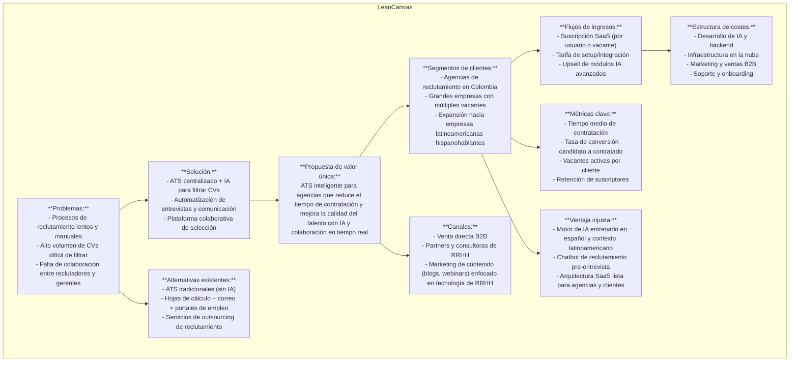
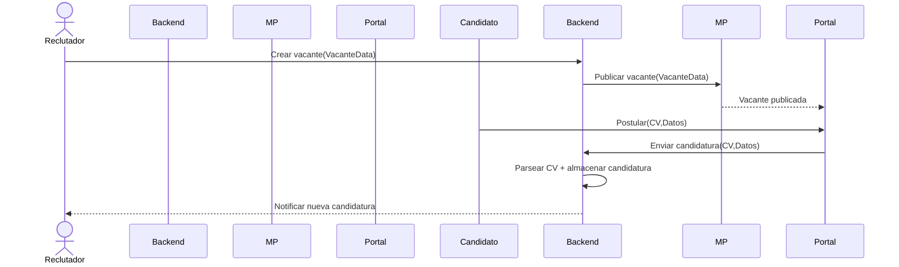
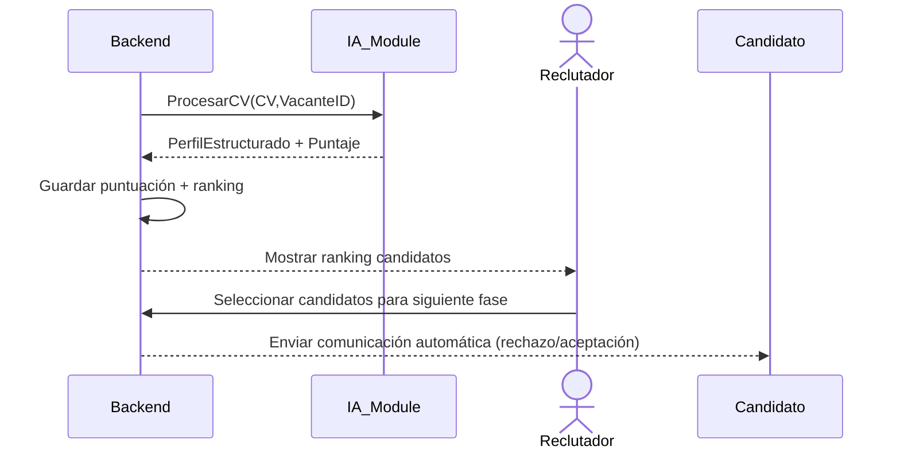
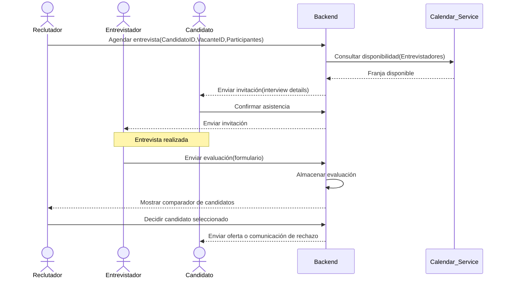
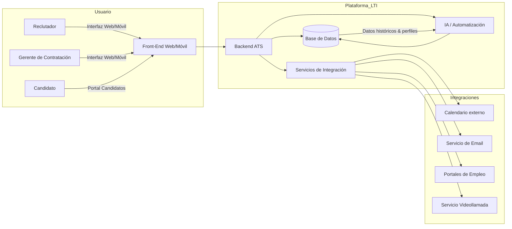
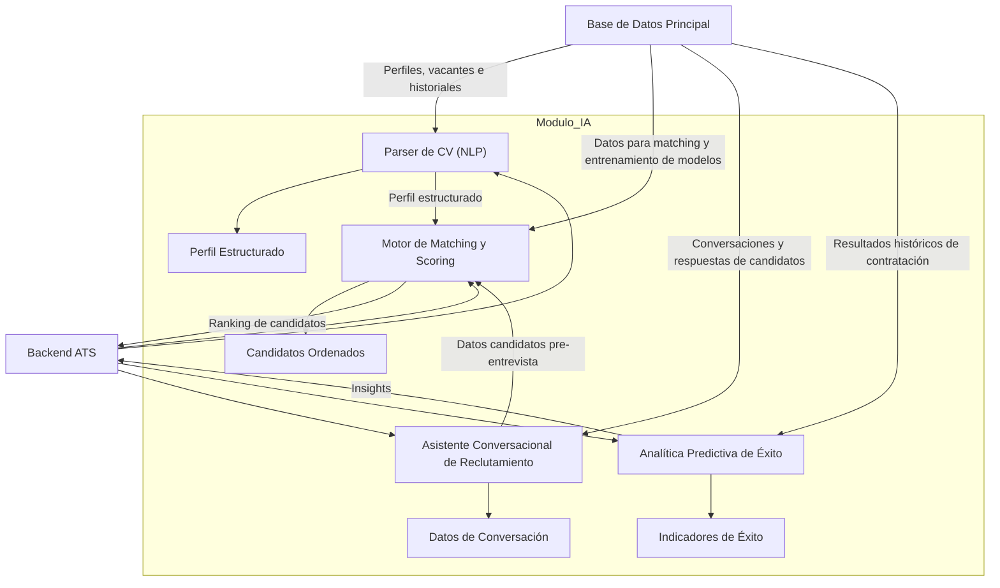

Aquí tienes el diseño para la primera versión del sistema de LTI ATS, estructurado como artefactos de producto: descripción, Lean Canvas, casos de uso, modelo de datos, arquitectura a alto nivel y un diagrama C4 profundo para el módulo de IA.

---

## 1. Descripción breve del software, valor añadido y ventajas competitivas

**Descripción**
LTI ATS es una plataforma SaaS para agencias de reclutamiento que operan en Colombia (y con ambición de expansión internacional) diseñada para digitalizar, acelerar y mejorar la calidad del proceso de atracción, selección y contratación de talento. La plataforma centraliza vacantes, candidaturas, entrevistas y decisiones, mientras incorpora automatizaciones e IA para tareas críticas.

**Valor añadido**

* Reducción significativa de *time-to-hire* y esfuerzo manual mediante automatización de publicaciones de vacantes, análisis de CV y programación de entrevistas.
* Mejora de la calidad de las contrataciones gracias a algoritmos de IA que hacen matching semántico, predicciones de adecuación y sugerencias inteligentes.
* Colaboración en tiempo real entre reclutadores, gerentes de contratación y candidatos: feedback unificado, historial centralizado, comunicación fluida.
* Experiencia mejorada para los candidatos (postulación rápida, comunicación automática, chatbot de orientación) lo que incrementa la marca empleadora de la agencia/empresa.
* Enfoque regional (mercado hispanohablante, Colombia) con adaptación de idioma, contexto y datos locales, lo que actúa como ventaja frente a soluciones globales poco adaptadas.

**Ventajas competitivas**

* Un “motor de IA” especializado que procesa CVs (en español, inglés), genera ranking de candidatos, predice compatibilidad de puesto y sugiere candidatos alternativos/internos.
* Módulo de **pre-entrevista automatizada via chatbot** que ya hace un primer cribado y libera carga del reclutador.
* Arquitectura SaaS multi-tenant desde inicio, integrada con calendarios, correo, bolsas de empleo y videollamadas, lo que reduce friction de adopción.
* Deducción de datos y métricas para la agencia: dashboards de eficiencia, canal de reclutamiento más efectivo, análisis de diversidad, etc.
* Tomando parte del proceso de valor que normalmente se hace vía hojas de cálculo, emails, múltiples plataformas, LTI lo centraliza y optimiza.

**Funciones principales (versión 1)**

* Gestión de vacantes (publicación, edición, estado) y multiposting automático de vacantes en portales.
* Portal de candidatos / postulación rápida con extracción automática de datos del CV.
* Análisis de CV + matching inteligente de candidatos a vacantes + ranking de candidatos.
* Programación automática de entrevistas (integración con calendarios, invitaciones, recordatorios).
* Feedback colaborativo en entrevistas, comparador de candidatos finalistas.
* Comunicaciones automáticas con candidatos en cada fase del proceso (acknowledge, invitación, rechazo).
* Dashboard de métricas clave de reclutamiento para la agencia (tiempo medio, fuente, tasa de conversión).
* Soporte inicial de configuración de roles de usuarios (reclutador, gerente, administrador) y multi-empresa (agencia/cliente).

---

## 2. Modelo de Negocio (Lean Canvas)

Aquí tienes el Lean Canvas representado en sintaxis Mermaid:

Este modelo permite al equipo entender de un vistazo cómo encaja todo: problemas que resolvemos, propuesta de valor diferenciadora, clientes objetivo, y cómo monetizaremos.

---

## 3. Descripción de los 3 casos de uso principales + diagramas

### Caso de Uso 1: Publicación de Vacante y Recepción de Candidaturas

**Descripción:**
El reclutador crea una vacante en LTI ATS, define los requisitos, publica la oferta en múltiples portales automáticamente, los candidatos postulan vía portal o enlace y su información (CV + datos) se recoge y centraliza dentro del sistema. El reclutador recibe alertas y visualiza la lista de nuevos candidatos.
**Flujo clave:** Reclutador → Crear vacante → Publicar → Candidato aplica → CV recibido y parseado → Reclutador notificado.

### Caso de Uso 2: Filtrado Inteligente y Preselección Automatizada

**Descripción:**
Una vez que llegan múltiples candidaturas para una vacante, el módulo de IA analiza cada CV, extrae datos estructurados, calcula un puntaje de adecuación para la vacante, genera un ranking de candidatos y presenta al reclutador la lista priorizada. Opcionalmente, envía comunicaciones automáticas de reconocimiento o rechazo a candidatos que no cumplen mínimos.
**Flujo clave:** candidatura llega → IA procesa → candidateScore → ranking mostrado al reclutador → reclutador revisa.

### Caso de Uso 3: Programación de Entrevistas y Colaboración en Decisión

**Descripción:**
El reclutador, tras preselección, agenda entrevistas para los candidatos seleccionados. El sistema consulta calendarios de entrevistadores, propone franjas, envía invitaciones al candidato, confirma asistencia. Durante la entrevista, los entrevistadores completan formularios de evaluación en la plataforma, notas quedan visibles para el equipo. Finalmente se compara a los finalistas en un tablero colaborativo y se toma la decisión de contratación.
**Flujo clave:** Reclutador selecciona candidatos → Sistema agenda entrevistas → Candidatos e entrevistadores reciben invitación → Entrevista → Evaluaciones de entrevistadores → Comparador → Decisión final.

---

## 4. Modelo de datos (Entidades, atributos y relaciones)

Aquí la versión inicial del modelo con las entidades principales, sus atributos y relaciones:

**Entidades y atributos (tipo de dato simplificado):**

* Empresa

  * id (UUID)
  * nombre (String)
  * industria (String)
  * tamañoEmpleado (Integer)
  * fechaCreación (Date)
* Usuario

  * id (UUID)
  * empresaId (UUID) → FK Empresa.id
  * nombre (String)
  * email (String)
  * rol (Enum: RECLUTADOR, GERENTE, ADMIN)
  * fechaRegistro (DateTime)
* Vacante

  * id (UUID)
  * empresaId (UUID) → FK Empresa.id
  * titulo (String)
  * descripcion (Text)
  * departamento (String)
  * ubicacion (String)
  * fechaPublicacion (Date)
  * estado (Enum: ABIERTA, CERRADA, ENProceso)
  * requisitosObligatorios (Text)
* Candidato

  * id (UUID)
  * nombre (String)
  * email (String)
  * telefono (String)
  * perfilEstructurado (JSON)  // extraído por IA
  * fechaAplicacion (DateTime)
* Aplicacion (Postulación)

  * id (UUID)
  * vacanteId (UUID) → FK Vacante.id
  * candidatoId (UUID) → FK Candidato.id
  * fecha (DateTime)
  * estado (Enum: RECIBIDA, PRESELECCIONADA, ENTREVISTA, RECHAZADA, CONTRATADA)
  * puntajeIA (Float)
  * historialEtapas (JSON)
* Entrevista

  * id (UUID)
  * aplicacionId (UUID) → FK Aplicacion.id
  * fechaHora (DateTime)
  * tipo (Enum: TELEFONO, VIRTUAL, PRESENCIAL)
  * participantes (JSON)  // lista de usuarioIds de entrevistadores
  * enlaceVideollamada (String)
  * estado (Enum: PROGRAMADA, REALIZADA, CANCELADA)
* Evaluacion

  * id (UUID)
  * entrevistaId (UUID) → FK Entrevista.id
  * entrevistadorId (UUID) → FK Usuario.id
  * competencias (JSON)  // e.g. {“comunicacion”:4, “trabajoEquipo”:5}
  * comentario (Text)
  * fechaEvaluacion (DateTime)

**Relaciones clave:**

* Una Empresa tiene muchos Usuarios.
* Una Empresa tiene muchas Vacantes.
* Un Usuario (reclutador) crea Vacantes para su Empresa.
* Un Candidato puede tener muchas Aplicaciones.
* Una Vacante puede tener muchas Aplicaciones.
* Una Aplicación pertenece a un Candidato + una Vacante.
* Una Aplicación puede tener muchas Entrevistas.
* Una Entrevista corresponde a una Aplicación y tiene varios Usuarios como entrevistadores.
* Una Entrevista puede tener muchas Evaluaciones (una por entrevistador).

Este modelo permitirá soportar los flujos de los casos de uso descritos y dar base a los diagramas del sistema.

---

## 5. Diseño del sistema a alto nivel (explicación + diagrama)

**Explicación del diseño**
El sistema se plantea como una solución SaaS en la nube, con arquitectura modular que permita evolutivamente escalar e integrar nuevas funcionalidades de IA. Los principales módulos son: interfaz de usuario (front-end web/móvil), backend de negocio, base de datos, módulo de IA/automatización, y servicios de integración (correo, calendarios, portales de empleo, videollamadas).

* La **UI Web/Móvil** es la capa que usa el reclutador, gerente o candidato para interactuar: crear vacantes, visualizar candidatos, agendar entrevistas, recibir notificaciones.
* El **Backend ATS** gestiona la lógica del negocio: crea vacantes, gestiona postulaciones, invoca el módulo de IA, maneja estados de aplicaciones, envía invitaciones, etc.
* La **Base de Datos** almacena las entidades descritas, tanto datos transaccionales como históricos. Puede combinarse con motor de búsqueda/texto para indexar CVs.
* El **Módulo de IA y Automatización** se encarga del parsing de CVs, matching, ranking, chatbot de reclutamiento, analítica predictiva. Este módulo puede estar desplegado como microservicio o conjunto de microservicios independientes, consumiendo datos del backend y devolviendo resultados a éste.
* Los **Servicios de Integración Externa** permiten interacción con calendarios (Google, Outlook), correo electrónico/SMTP, portales de empleo para publicación, servicios de videoconferencia para entrevistas virtuales, firma electrónica para ofertas (en fases futuras).

La arquitectura deberá garantizar separación multi-tenant (cada cliente/empresa tiene sus datos aislados), control de roles/seguridad, escalabilidad de IA (por volumen de CVs), alta disponibilidad y monitorización.

**Diagrama a alto nivel usando Mermaid:**

Este diagrama muestra cómo los diferentes actores acceden a la plataforma, cómo el backend central coordina los módulos internos y cómo se integran los servicios externos clave. La integración del módulo de IA dentro de la plataforma es clave para la diferenciación de LTI.

---

## 6. Diagrama C4 (profundización) para el módulo de IA

Para el componente crítico “Módulo de IA / Automatización” se presenta un diagrama de arquitectura tipo C4 que describe sus sub-componentes, relaciones, entradas y salidas.

**Explicación del diagrama:**

* El *Parser de CV* recibe archivos CV del candidato, aplica técnicas de NLP para extraer campos estructurados (habilidades, años de experiencia, formación, idiomas) y almacena estos perfiles en la base de datos.
* El *Motor de Matching & Scoring* toma los perfiles estructurados junto con las vacantes definidas (y sus requisitos) y produce un ranking de candidatos con puntaje de adecuación. El backend muestra esos resultados al reclutador.
* El *Chatbot de Reclutamiento* actúa como interfaz de pre-entrevista automatizada: conversa con el candidato, hace preguntas de filtrado, recopila respuestas y alimenta los datos al sistema para que el motor de matching los considere.
* La *Analítica Predictiva de Éxito* utiliza datos históricos de contrataciones, perfiles, evaluaciones de entrevistas, retención, etc., y produce indicadores o alertas para ayudar al reclutador/gerente a estimar la probabilidad de éxito de un candidato.
* Todas estas sub-partes interactúan con la base de datos principal para leer y escribir datos y con el backend ATS para orquestación.

Este detalle permite al equipo de desarrollo comprender internamente los componentes de IA, sus responsabilidades, sus dependencias y cómo se integran con el resto del sistema.

---

### Conclusión

Con estos artefactos tienes un **marco completo** para la primera versión de LTI ATS: la propuesta de valor, el modelo de negocio, los casos de uso prioritarios, el modelo de datos de arranque, la arquitectura general y la profundización del componente de IA que constituye el diferenciador clave. El siguiente paso será definir **historias de usuario**, priorizar el *MVP*, seleccionar tecnologías y preparar el roadmap de desarrollo.

Si lo deseas, puedo generar un **roadmap de lanzamiento** (MVP + versiones posteriores) y un conjunto de **historias de usuario épicas** para esas tres funcionalidades clave. ¿Te lo preparo?
