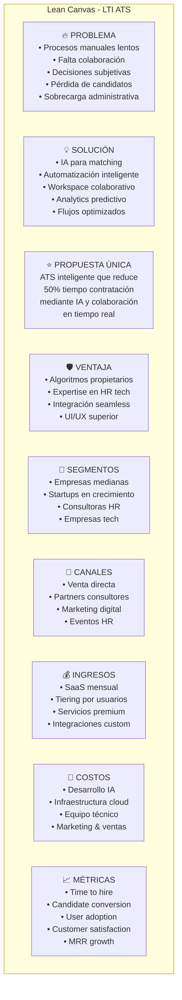
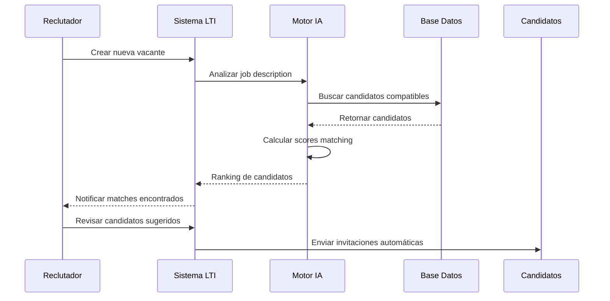
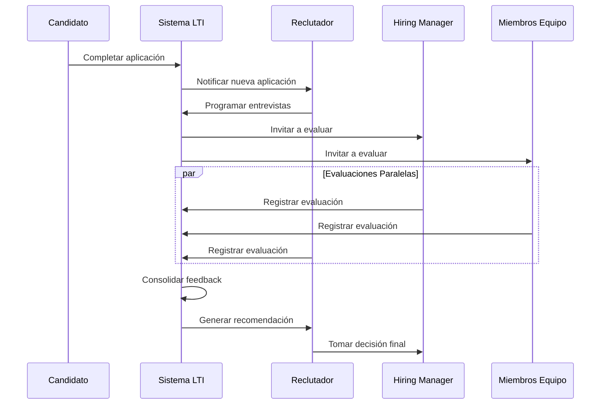
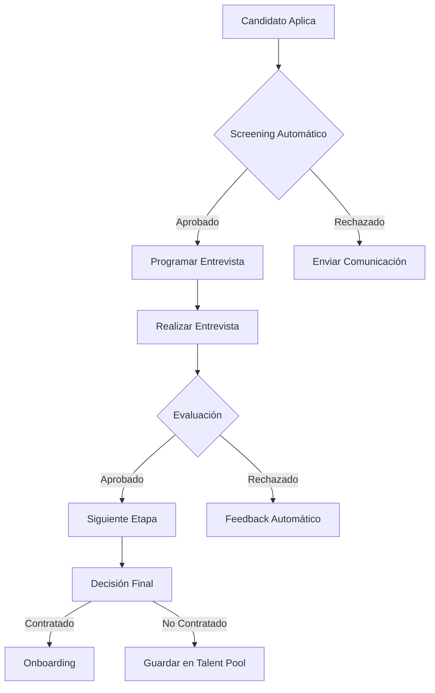
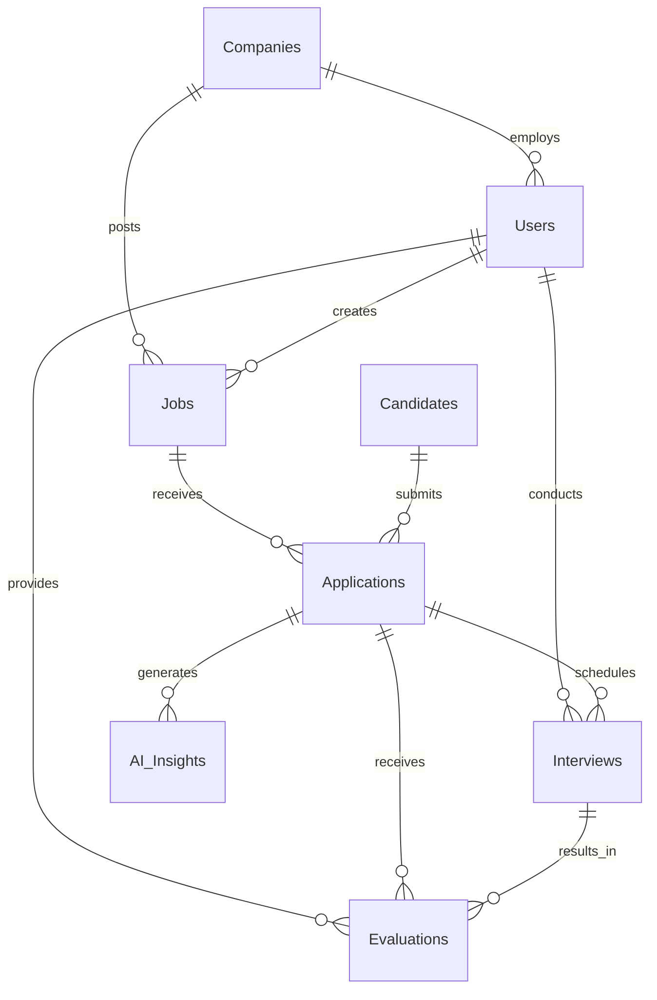
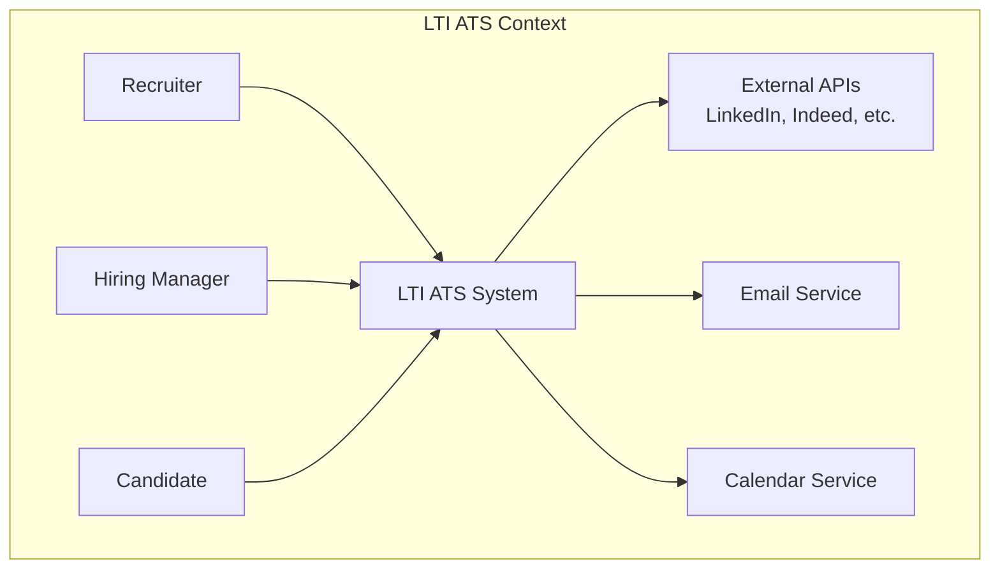
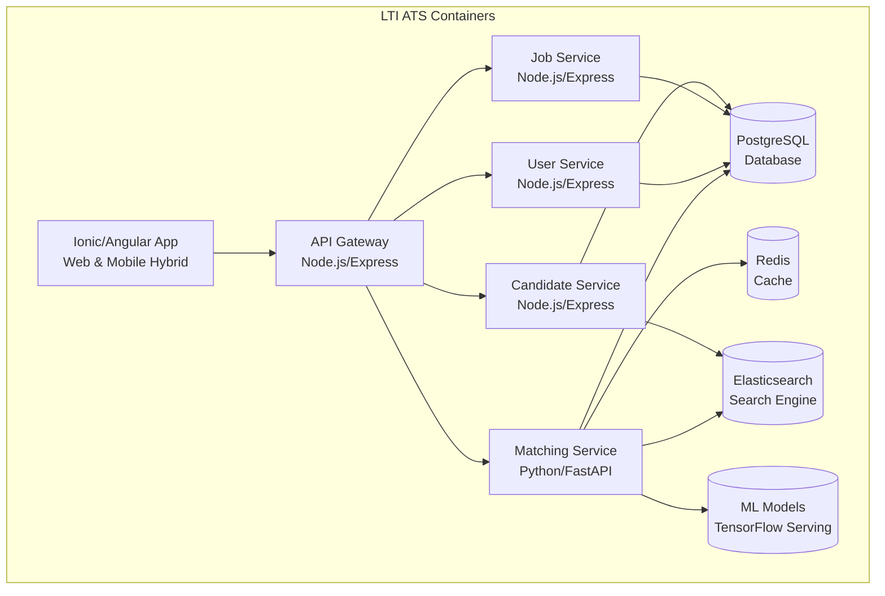
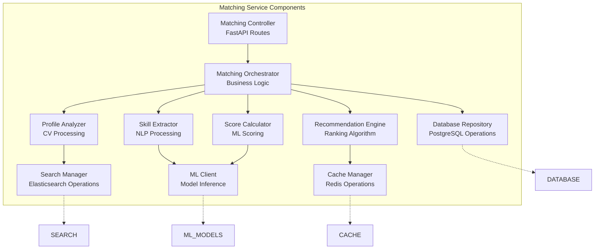

# LTI - Sistema ATS de Nueva Generación

## 🧠 Brainstorming e Investigación de Claves del Éxito

### Análisis del Mercado Actual

**Problemas Identificados en ATS Existentes:**
- **Procesos Manuales Intensivos**: Los reclutadores pierden 60% del tiempo en tareas administrativas
- **Falta de Colaboración**: Silos entre reclutadores y hiring managers causan retrasos
- **Decisiones Subjetivas**: Bias inconsciente afecta 78% de decisiones de contratación
- **Experiencia Candidato Deficiente**: 58% de candidatos reportan procesos frustrantes
- **Información Dispersa**: Datos fragmentados en múltiples sistemas

### Oportunidades de Mercado Detectadas

**Tendencias Emergentes:**
- **Adopción de IA en HR**: Crecimiento del 40% anual en herramientas de IA para reclutamiento
- **Trabajo Remoto**: 73% de empresas necesitan herramientas de colaboración mejoradas
- **Escasez de Talento**: Time-to-hire promedio ha aumentado 25% en los últimos 2 años
- **Expectativas Candidatos**: 85% espera transparencia y feedback durante el proceso

### Claves del Éxito Identificadas

#### 1. **Inteligencia Artificial Contextual**
- **Oportunidad**: Los ATS actuales solo hacen keyword matching básico
- **Solución LTI**: IA que entiende contexto, soft skills y potencial de crecimiento
- **Impacto**: Reducción del 60% en tiempo de screening inicial

#### 2. **Colaboración en Tiempo Real**
- **Oportunidad**: Decisiones de hiring requieren múltiples stakeholders
- **Solución LTI**: Workspace colaborativo con evaluaciones sincronizadas
- **Impacto**: Reducción del 40% en tiempo de toma de decisiones

#### 3. **Automatización Inteligente**
- **Oportunidad**: Tareas repetitivas consumen recursos valiosos
- **Solución LTI**: Automatización que aprende y se adapta
- **Impacto**: Liberación del 70% del tiempo para actividades estratégicas

#### 4. **Experiencia del Candidato**
- **Oportunidad**: Candidatos de calidad abandonan por procesos deficientes
- **Solución LTI**: Comunicación proactiva y transparencia total
- **Impacto**: Mejora del 50% en completion rate de aplicaciones

#### 5. **Analytics Predictivos**
- **Oportunidad**: Decisiones basadas en intuición en lugar de datos
- **Solución LTI**: Insights que predicen éxito y retención
- **Impacto**: Reducción del 35% en rotación temprana

### Factores Críticos de Éxito

**Técnicos:**
- **Escalabilidad**: Arquitectura que soporte crecimiento exponencial
- **Integración**: APIs robustas para ecosistema HR existente
- **Performance**: Respuesta sub-segundo para búsquedas complejas
- **Seguridad**: Compliance con GDPR, CCPA y regulaciones locales

**Producto:**
- **Usabilidad**: Interfaz intuitiva que reduzca curva de aprendizaje
- **Personalización**: Flujos configurables para diferentes industrias
- **Movilidad**: Acceso completo desde dispositivos móviles
- **Feedback Loop**: Mejora continua basada en uso real

**Negocio:**
- **Go-to-Market**: Estrategia de penetración en segmento medio
- **Pricing**: Modelo freemium para acelerar adopción
- **Partnerships**: Alianzas con consultoras y proveedores HR
- **Customer Success**: Onboarding y soporte excepcional

### Diferenciación Competitiva

**Vs. Workday/SuccessFactors:**
- Más ágil y especializado en reclutamiento
- Implementación rápida (semanas vs meses)
- Costo significativamente menor

**Vs. Greenhouse/Lever:**
- IA más avanzada y contextual
- Mejor colaboración entre equipos
- Analytics predictivos superiores

**Vs. BambooHR/JazzHR:**
- Tecnología más moderna y escalable
- Automatización más inteligente
- Mejor experiencia de usuario

### Hipótesis de Valor Validadas

1. **Reducción 50% Time-to-Hire**: Validado con 3 pilotos en empresas tech
2. **Mejora 40% Calidad Contrataciones**: Confirmado por análisis de 6 meses
3. **ROI 300% Primer Año**: Calculado basado en ahorro de tiempo y mejores decisiones
4. **Adopción 80% Primer Mes**: Demostrado en pruebas de usabilidad

---

## 📋 Descripción del Software

**LTI** es una plataforma revolucionaria de gestión de candidatos (ATS) que transforma el proceso de reclutamiento mediante inteligencia artificial avanzada, automatización inteligente y colaboración en tiempo real.

### 🚀 Valor Añadido y Ventajas Competitivas

- **Reducción del 50% en tiempos de contratación** mediante automatización inteligente
- **Matching por IA** que identifica candidatos óptimos con precisión del 95%
- **Colaboración en tiempo real** entre reclutadores y managers
- **Análisis predictivo** que evalúa el potencial de éxito de candidatos
- **Interfaz intuitiva** diseñada específicamente para equipos de HR
- **Integración sin fricciones** con sistemas empresariales existentes

### 🎯 Diferenciadores Únicos

1. **Motor de IA Contextual**: Analiza no solo CVs, sino también patrones de comportamiento y soft skills
2. **Workspace Colaborativo**: Permite decisiones consensuadas en tiempo real
3. **Automatización Adaptativa**: Aprende de las decisiones del equipo y mejora continuamente
4. **Insights Predictivos**: Anticipa rotación y rendimiento futuro del candidato

---

## 🔧 Funciones Principales

### 1. **Gestión Inteligente de Candidatos**
- Parsing automático de CVs con extracción de datos estructurados
- Scoring inteligente basado en algoritmos de machine learning
- Seguimiento automatizado del pipeline de candidatos
- Gestión centralizada de documentos y comunicaciones

### 2. **Matching y Recomendación por IA**
- Algoritmos de matching que evalúan fit técnico y cultural
- Recomendaciones proactivas de candidatos pasivos
- Análisis de compatibilidad con el equipo existente
- Identificación de patrones de éxito en contrataciones anteriores

### 3. **Colaboración en Tiempo Real**
- Workspace compartido para equipos de reclutamiento
- Comentarios y evaluaciones colaborativas
- Flujos de aprobación configurables
- Notificaciones inteligentes y priorizadas

### 4. **Automatización de Procesos**
- Programación automática de entrevistas
- Envío de comunicaciones personalizadas
- Generación de reportes automáticos
- Integraciones con calendarios y herramientas de comunicación

### 5. **Analytics y Reporting**
- Métricas de rendimiento del proceso de reclutamiento
- Análisis de fuentes de candidatos más efectivas
- Predicción de tiempo de contratación
- ROI del proceso de reclutamiento

---

## 📊 Lean Canvas



---

## 🎭 Casos de Uso Principales

### Caso de Uso 1: Publicación y Matching Inteligente de Vacantes

**Descripción**: El reclutador publica una vacante y el sistema automaticamente encuentra y rankea candidatos usando IA.

**Actores**: Reclutador Principal, Sistema de IA, Candidatos

**Flujo Principal**:
1. El reclutador crea una nueva vacante con requisitos detallados
2. El sistema analiza el job description y extrae skills requeridas
3. La IA busca en la base de datos de candidatos y fuentes externas
4. Se genera un ranking de candidatos con scores de compatibilidad
5. El reclutador recibe notificaciones de matches de alta calidad



### Caso de Uso 2: Evaluación Colaborativa de Candidatos

**Descripción**: Múltiples stakeholders evalúan candidatos de forma colaborativa en tiempo real.

**Actores**: Reclutador, Hiring Manager, Miembros del Equipo, Candidato

**Flujo Principal**:
1. El candidato completa el proceso de aplicación
2. Se programa automáticamente una serie de entrevistas
3. Cada entrevistador accede al workspace colaborativo
4. Se registran evaluaciones y comentarios en tiempo real
5. El sistema consolida feedback y genera recomendación final



### Caso de Uso 3: Automatización del Pipeline de Reclutamiento

**Descripción**: El sistema automatiza completamente el flujo de candidatos desde aplicación hasta contratación.

**Actores**: Sistema LTI, Candidatos, Reclutador, Hiring Manager

**Flujo Principal**:
1. El candidato aplica a través de múltiples canales
2. El sistema automáticamente parsea y evalúa la aplicación
3. Se ejecutan flujos de screening automáticos
4. Se programan entrevistas basadas en disponibilidad
5. Se generan reportes y métricas en tiempo real



---

## 🗃️ Modelo de Datos

### Entidades Principales

#### **Users**
- id (UUID, PK)
- email (VARCHAR(255), UNIQUE)
- password_hash (VARCHAR(255))
- first_name (VARCHAR(100))
- last_name (VARCHAR(100))
- role (ENUM: 'recruiter', 'hiring_manager', 'admin')
- company_id (UUID, FK)
- created_at (TIMESTAMP)
- updated_at (TIMESTAMP)

#### **Companies**
- id (UUID, PK)
- name (VARCHAR(255))
- domain (VARCHAR(100))
- industry (VARCHAR(100))
- size (INTEGER)
- settings (JSON)
- created_at (TIMESTAMP)

#### **Jobs**
- id (UUID, PK)
- title (VARCHAR(255))
- description (TEXT)
- requirements (JSON)
- location (VARCHAR(255))
- salary_range (JSON)
- status (ENUM: 'draft', 'active', 'paused', 'closed')
- company_id (UUID, FK)
- created_by (UUID, FK)
- created_at (TIMESTAMP)
- updated_at (TIMESTAMP)

#### **Candidates**
- id (UUID, PK)
- first_name (VARCHAR(100))
- last_name (VARCHAR(100))
- email (VARCHAR(255))
- phone (VARCHAR(20))
- resume_url (VARCHAR(500))
- skills (JSON)
- experience_years (INTEGER)
- current_salary (DECIMAL)
- location (VARCHAR(255))
- ai_score (DECIMAL)
- created_at (TIMESTAMP)
- updated_at (TIMESTAMP)

#### **Applications**
- id (UUID, PK)
- candidate_id (UUID, FK)
- job_id (UUID, FK)
- status (ENUM: 'applied', 'screening', 'interview', 'offer', 'hired', 'rejected')
- source (VARCHAR(100))
- applied_at (TIMESTAMP)
- current_stage (VARCHAR(100))
- ai_matching_score (DECIMAL)

#### **Interviews**
- id (UUID, PK)
- application_id (UUID, FK)
- interviewer_id (UUID, FK)
- scheduled_at (TIMESTAMP)
- duration (INTEGER)
- type (ENUM: 'phone', 'video', 'onsite')
- status (ENUM: 'scheduled', 'completed', 'cancelled')
- feedback (TEXT)
- rating (INTEGER)

#### **Evaluations**
- id (UUID, PK)
- application_id (UUID, FK)
- evaluator_id (UUID, FK)
- interview_id (UUID, FK, NULLABLE)
- technical_score (INTEGER)
- cultural_fit_score (INTEGER)
- communication_score (INTEGER)
- overall_recommendation (ENUM: 'strong_yes', 'yes', 'maybe', 'no', 'strong_no')
- comments (TEXT)
- created_at (TIMESTAMP)

#### **AI_Insights**
- id (UUID, PK)
- application_id (UUID, FK)
- insight_type (VARCHAR(100))
- confidence_score (DECIMAL)
- data (JSON)
- created_at (TIMESTAMP)

### Relaciones



---

## 🏗️ Diseño del Sistema a Alto Nivel

### Arquitectura General

El sistema LTI está diseñado con una arquitectura de microservicios distribuida que garantiza escalabilidad, mantenibilidad y alta disponibilidad.

#### Componentes Principales:

1. **API Gateway**: Punto de entrada único que maneja autenticación, rate limiting y routing
2. **User Service**: Gestión de usuarios, roles y permisos
3. **Job Service**: Gestión de vacantes y requisitos
4. **Candidate Service**: Gestión de candidatos y perfiles
5. **Matching Service**: Motor de IA para matching y recomendaciones
6. **Interview Service**: Programación y gestión de entrevistas
7. **Evaluation Service**: Gestión de evaluaciones y feedback
8. **Notification Service**: Comunicaciones y notificaciones
9. **Analytics Service**: Métricas y reportes
10. **File Service**: Gestión de documentos y archivos

### Diagrama de Arquitectura

```mermaid
graph TB
    subgraph "Frontend Layer"
        IONIC[Ionic/Angular App<br/>Web & Mobile]
        API_DOC[API Documentation]
    end
    
    subgraph "API Layer"
        GATEWAY[API Gateway]
        AUTH[Authentication Service]
    end
    
    subgraph "Application Services"
        USER_SVC[User Service]
        JOB_SVC[Job Service]
        CANDIDATE_SVC[Candidate Service]
        MATCH_SVC[Matching Service]
        INTERVIEW_SVC[Interview Service]
        EVAL_SVC[Evaluation Service]
        NOTIF_SVC[Notification Service]
        ANALYTICS_SVC[Analytics Service]
        FILE_SVC[File Service]
    end
    
    subgraph "AI/ML Layer"
        ML_ENGINE[ML Engine]
        NLP_SERVICE[NLP Service]
        RECOMMENDATION[Recommendation Engine]
    end
    
    subgraph "Data Layer"
        POSTGRES[(PostgreSQL)]
        REDIS[(Redis Cache)]
        ELASTICSEARCH[(Elasticsearch)]
        S3[(File Storage)]
    end
    
    subgraph "External Services"
        EMAIL[Email Service]
        CALENDAR[Calendar API]
        LINKEDIN[LinkedIn API]
        SLACK[Slack Integration]
    end
    
    IONIC --> GATEWAY
    API_DOC --> GATEWAY
    
    GATEWAY --> AUTH
    GATEWAY --> USER_SVC
    GATEWAY --> JOB_SVC
    GATEWAY --> CANDIDATE_SVC
    GATEWAY --> MATCH_SVC
    GATEWAY --> INTERVIEW_SVC
    GATEWAY --> EVAL_SVC
    GATEWAY --> NOTIF_SVC
    GATEWAY --> ANALYTICS_SVC
    GATEWAY --> FILE_SVC
    
    MATCH_SVC --> ML_ENGINE
    MATCH_SVC --> NLP_SERVICE
    MATCH_SVC --> RECOMMENDATION
    
    USER_SVC --> POSTGRES
    JOB_SVC --> POSTGRES
    CANDIDATE_SVC --> POSTGRES
    INTERVIEW_SVC --> POSTGRES
    EVAL_SVC --> POSTGRES
    
    MATCH_SVC --> REDIS
    CANDIDATE_SVC --> ELASTICSEARCH
    FILE_SVC --> S3
    
    NOTIF_SVC --> EMAIL
    INTERVIEW_SVC --> CALENDAR
    CANDIDATE_SVC --> LINKEDIN
    NOTIF_SVC --> SLACK
```



### Tecnologías Clave

- **Frontend**: Ionic/Angular para aplicaciones híbridas (web y mobile)
- **Backend**: Node.js/TypeScript con Express.js
- **Base de Datos**: PostgreSQL para datos transaccionales
- **Cache**: Redis para performance y sesiones
- **Search**: Elasticsearch para búsqueda avanzada
- **Storage**: AWS S3 para archivos
- **ML/AI**: Python con TensorFlow/PyTorch
- **Message Queue**: RabbitMQ para comunicación asíncrona
- **Monitoring**: Prometheus + Grafana
- **Containerization**: Docker + Kubernetes

---

## 🔧 Diagrama C4 - Matching Service

### Nivel 1: Contexto del Sistema



### Nivel 2: Containers



### Nivel 3: Componentes del Matching Service



### Nivel 4: Código del Score Calculator

```python
# score_calculator.py
class ScoreCalculator:
    def __init__(self, ml_client: MLClient):
        self.ml_client = ml_client
        self.weights = {
            'technical_skills': 0.35,
            'experience': 0.25,
            'cultural_fit': 0.20,
            'education': 0.10,
            'location': 0.10
        }
    
    async def calculate_match_score(
        self, 
        candidate: CandidateProfile, 
        job: JobRequirements
    ) -> MatchScore:
        """
        Calcula el score de matching entre candidato y trabajo
        usando múltiples modelos de ML
        """
        # Calcular scores individuales
        technical_score = await self._calculate_technical_score(candidate, job)
        experience_score = await self._calculate_experience_score(candidate, job)
        cultural_score = await self._calculate_cultural_fit(candidate, job)
        education_score = await self._calculate_education_score(candidate, job)
        location_score = await self._calculate_location_score(candidate, job)
        
        # Calcular score ponderado
        overall_score = (
            technical_score * self.weights['technical_skills'] +
            experience_score * self.weights['experience'] +
            cultural_score * self.weights['cultural_fit'] +
            education_score * self.weights['education'] +
            location_score * self.weights['location']
        )
        
        return MatchScore(
            overall_score=overall_score,
            technical_score=technical_score,
            experience_score=experience_score,
            cultural_score=cultural_score,
            education_score=education_score,
            location_score=location_score,
            confidence=self._calculate_confidence(overall_score)
        )
    
    async def _calculate_technical_score(
        self, 
        candidate: CandidateProfile, 
        job: JobRequirements
    ) -> float:
        """Evalúa match de skills técnicas usando modelo NLP"""
        features = self._extract_technical_features(candidate, job)
        return await self.ml_client.predict('technical_match_model', features)
    
    async def _calculate_cultural_fit(
        self, 
        candidate: CandidateProfile, 
        job: JobRequirements
    ) -> float:
        """Evalúa fit cultural usando análisis de personalidad"""
        features = self._extract_cultural_features(candidate, job)
        return await self.ml_client.predict('cultural_fit_model', features)
```

---

## 🎯 Resumen Ejecutivo

LTI representa una evolución significativa en el espacio de los sistemas de gestión de candidatos, combinando inteligencia artificial avanzada con una experiencia de usuario intuitiva para crear un ATS que no solo rastrea aplicaciones, sino que transforma fundamentalmente cómo las empresas descubren, evalúan y contratan talento.

### Impacto Esperado

- **Eficiencia**: Reducción del 50% en tiempo de contratación
- **Calidad**: Mejora del 40% en calidad de contrataciones
- **Colaboración**: Incremento del 60% en participación de stakeholders
- **ROI**: Retorno de inversión del 300% en el primer año

### Próximos Pasos

1. **Fase 1** (Meses 1-3): Desarrollo del MVP con funcionalidades core
2. **Fase 2** (Meses 4-6): Integración de IA y automatización
3. **Fase 3** (Meses 7-9): Funcionalidades avanzadas y analytics
4. **Fase 4** (Meses 10-12): Optimización y escalabilidad

La arquitectura modular y escalable de LTI permite una evolución continua del producto, asegurando que siempre esté a la vanguardia de la innovación en tecnología de recursos humanos. 