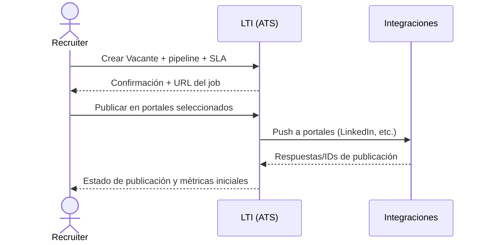
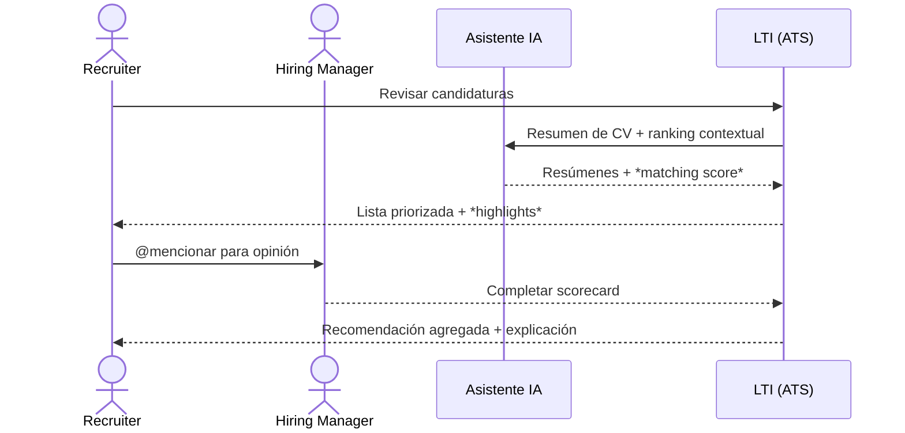
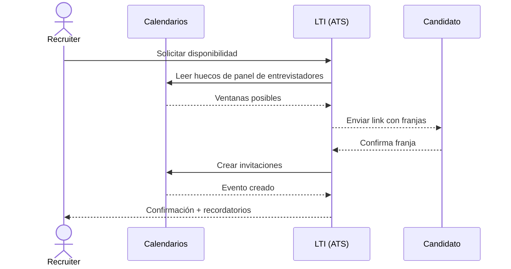
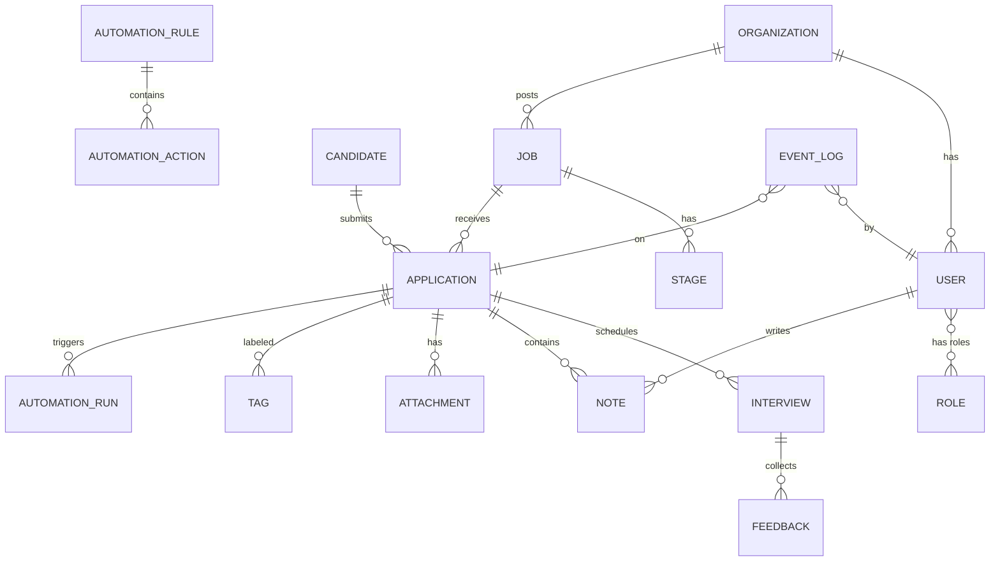
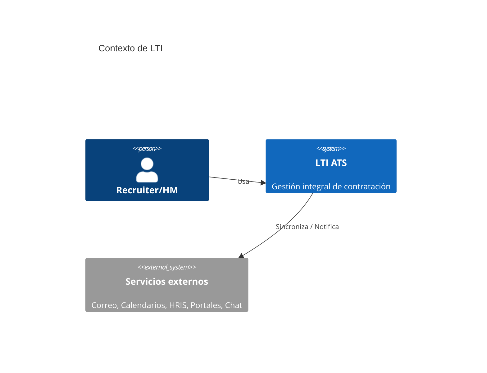
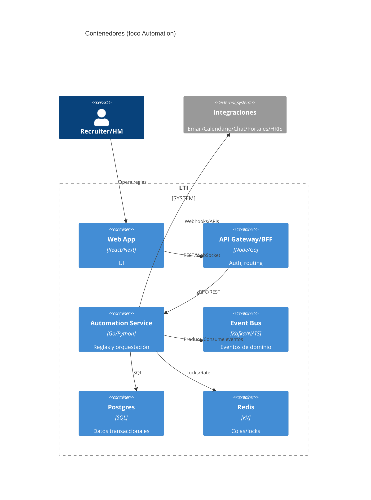
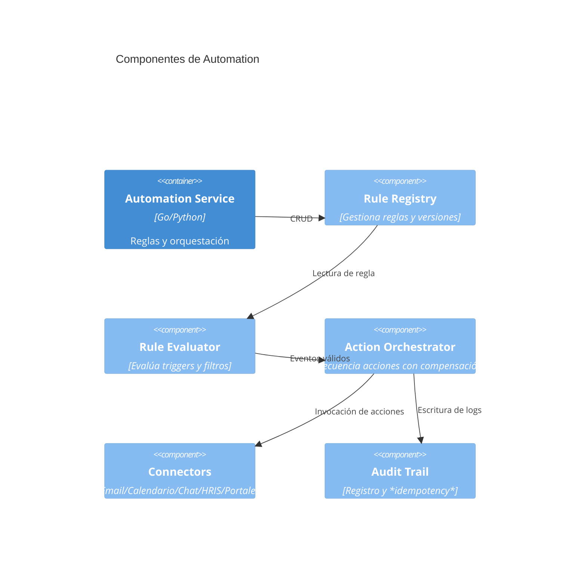

# LTI — ATS de próxima generación (v1)
**Autor:** Samuel Salas  
**Fecha:** 02/11/2025

## 1) Descripción breve, valor añadido y ventajas competitivas
**LTI** es un Applicant Tracking System (ATS) diseñado para aumentar la eficiencia de HR, mejorar la colaboración en tiempo real entre reclutadores y hiring managers, automatizar el trabajo repetitivo y ofrecer asistencia de IA en todo el ciclo de selección.  
**Valor añadido:** menos tiempo operativo, decisiones más rápidas y justas, experiencia de candidato superior.  
**Ventajas competitivas:**
- **Colaboración en vivo:** feedback simultáneo, mencciones, asignaciones y SLAs visibles por rol.
- **Automatizaciones low‑code/no‑code:** disparadores y acciones encadenadas (p. ej., “cuando un candidato pase a *Phone Screen*, enviar email + crear tarea + proponer huecos de agenda”).
- **IA responsable:** redacción de JD, *sourcing* asistido, *screening* guiado, resúmenes de entrevistas y detección de sesgos con explicabilidad y *human‑in‑the‑loop*.
- **Integraciones out‑of‑the‑box:** correo y calendario, LinkedIn/portales, HRIS/Payroll, Slack/Teams, SSO.
- **Cumplimiento & privacidad (by‑design):** GDPR, minimización de datos, retención configurable y *audit trail*.

## 2) Funciones principales
1. **Gestión de vacantes y panel Kanban de procesos** (etapas configurables, SLAs, *pipeline health*).
2. **Portal del candidato** (aplicación rápida, estado en tiempo real, GDPR).
3. **Automatizaciones** (reglas por evento/filtro → acciones multicanal).
4. **IA de apoyo**
    - Redacción de Job Descriptions y *email drafts*; resúmenes de CV; *matching* Candidato‑Puesto; preguntas *screening*; resúmenes de entrevista.
5. **Colaboración** (comentarios, *mentions*, aprobaciones, plantillas de feedback estructurado).
6. **Entrevistas** (planificación automática, *interview kits*, *scorecards*).
7. **Informes & analítica** (tiempo a contratación, *drop‑offs*, diversidad, carga operativa).
8. **Integraciones** (Gmail/Outlook/Calendario, Slack/Teams, HRIS, portales empleo).
9. **Seguridad, roles y auditoría** (SSO, RBAC, registros de actividad).

## 3) Lean Canvas (resumen)
| Bloque | Contenido |
|---|---|
| Problemas | Procesos manuales, mala coordinación, tiempos largos, poca trazabilidad, sesgos. |
| Segmentos de clientes | Departamentos de HR/Talent en pymes y *scale‑ups* (50–2.000 empleados). |
| Propuesta de valor | Contratación más rápida, colaborativa y justa con IA responsable y automatizaciones. |
| Solución | ATS colaborativo + motor de reglas + asistente IA + integraciones. |
| Métricas clave | *Time‑to‑hire*, *time‑to‑fill*, tasa de conversión por etapa, NPS del candidato, % automatizado. |
| Ventaja injusta | Data network effects (plantillas y benchmarks), UX y flujos *opinionated*, integraciones nativas. |
| Canales | Marketing B2B, partners HRIS, *product‑led* (trial), comunidad de *recruiters*. |
| Estructura de costes | Infra, IA, integraciones, soporte, ventas. |
| Flujo de ingresos | Suscripción por asiento + *add‑ons* IA + *usage* de automatizaciones. |

## 4) Casos de uso principales (con diagramas)
### UC‑1: Publicar una vacante y abrir proceso
**Actores:** Recruiter (primario), Hiring Manager, Sistema de Integraciones.  
**Resumen:** crear puesto, definir etapas/kits, publicar en portales y activar automatizaciones.



### UC‑2: *Screening* asistido y colaboración
**Actores:** Recruiter, Hiring Manager, IA.  
**Resumen:** llegada de candidaturas, priorización, *shortlist*, *mentions* y *scorecards*.



### UC‑3: Programar entrevistas automáticamente
**Actores:** Recruiter, Entrevistadores, Calendario, Candidato.  
**Resumen:** propuesta de franjas, confirmación, recordatorios.



## 5) Modelo de datos (entidades, atributos, relaciones)


**Entidades (clave: `*` obligatoria):**
- **Organization**(`id*`:UUID, `name`:String, `domain`:String, `plan`:Enum, `created_at`:DateTime)
- **User**(`id*`:UUID, `org_id*`:UUID, `email*`:Email, `name`:String, `status`:Enum, `timezone`:String, `created_at`:DateTime)
- **Role**(`id*`:UUID, `code*`:Enum[Admin, Recruiter, HM, Interviewer], `description`:String)
- **Job**(`id*`:UUID, `org_id*`:UUID, `title*`:String, `department`:String, `location`:String, `employment_type`:Enum, `status`:Enum, `created_at`:DateTime)
- **Stage**(`id*`:UUID, `job_id*`:UUID, `name*`:String, `order*`:Int, `sla_hours`:Int, `kit_id`:UUID)
- **Candidate**(`id*`:UUID, `org_id*`:UUID, `full_name*`:String, `email`:Email, `phone`:String, `location`:String, `consent_gdpr*`:Bool, `created_at`:DateTime)
- **Application**(`id*`:UUID, `job_id*`:UUID, `candidate_id*`:UUID, `source`:Enum, `status*`:Enum, `current_stage_id`:UUID, `score`:Float, `created_at`:DateTime)
- **Interview**(`id*`:UUID, `application_id*`:UUID, `panel`:JSON, `start_at`:DateTime, `end_at`:DateTime, `conference_link`:String, `status`:Enum)
- **Feedback**(`id*`:UUID, `interview_id*`:UUID, `reviewer_id*`:UUID, `scores`:JSON, `notes`:Text, `recommendation`:Enum, `submitted_at`:DateTime)
- **Note**(`id*`:UUID, `application_id*`:UUID, `author_id*`:UUID, `text`:Text, `visibility`:Enum, `created_at`:DateTime)
- **Attachment**(`id*`:UUID, `application_id*`:UUID, `type`:Enum, `url`:String, `hash`:String, `uploaded_at`:DateTime)
- **Tag**(`id*`:UUID, `name*`:String, `color`:String)
- **AutomationRule**(`id*`:UUID, `org_id*`:UUID, `name*`:String, `trigger*`:Enum, `filter`:JSON, `status*`:Enum, `created_by`:UUID, `created_at`:DateTime)
- **AutomationAction**(`id*`:UUID, `rule_id*`:UUID, `type*`:Enum[send_email, add_tag, move_stage, create_task, post_slack, propose_slots], `params*`:JSON, `order*`:Int)
- **AutomationRun**(`id*`:UUID, `rule_id*`:UUID, `application_id*`:UUID, `status*`:Enum, `result`:JSON, `ran_at`:DateTime)
- **EventLog**(`id*`:UUID, `org_id*`:UUID, `entity*`:String, `entity_id*`:UUID, `actor_id`:UUID, `action*`:String, `payload`:JSON, `created_at*`:DateTime)

## 6) Diseño del sistema a alto nivel
**Principios:** *domain‑driven*, eventos asíncronos, *zero‑trust*, *API‑first*.  
**Componentes:**
- **Frontend Web** (React/Next): paneles, Kanban, colaboración en tiempo real (WebSocket).
- **BFF/API Gateway**: *routing*, autenticación, *Rate Limit*, *facades* por *feature*.
- **Servicios de dominio**: *Jobs*, *Applications*, *Interviewing*, *Automation*, *Search/Ranking* (IA), *Reporting*.
- **Motor de Automatizaciones**: orquesta reglas (triggers → filtros → acciones).
- **Asistente IA**: *prompt/response orchestration*, *guardrails*, *feature flags*.
- **Integraciones**: correo/calendario, portales, Slack/Teams, HRIS.
- **Data**: Postgres (OLTP), S3/Blob para CVs, Redis (colas/cache), Warehouse (BigQuery/Snowflake).
- **Observabilidad y seguridad**: OpenTelemetry, SIEM, auditoría.

```mermaid
flowchart LR
  subgraph UI[Frontend Web]
    W[App React]
  end
  subgraph Edge[API Gateway / BFF]
    G[Auth / Routing / Throttling]
  end
  subgraph Core[Servicios de Dominio]
    J[Jobs]
    A[Applications]
    I[Interviewing]
    AU[Automation]
    SR[Search & Ranking (IA)]
    RPT[Reporting]
  end
  subgraph Data[Datos]
    PG[(Postgres)]
    B[(Blob / S3)]
    RD[(Redis)]
    WH[(Warehouse)]
    BUS[(Event Bus)]
  end
  subgraph Ext[Integraciones]
    CAL[Calendarios]
    MAIL[Email]
    HRIS[HRIS]
    PORT[Portales empleo]
    CHAT[Slack/Teams]
  end
  W --> G --> J & A & I & AU & SR & RPT
  J & A & I & AU & SR & RPT --> PG
  A & I --> B
  AU & SR & RPT --> BUS
  BUS --> AU & RPT
  AU --> CHAT & MAIL & CAL & PORT & HRIS
  RD --- G
```

## 7) Diagrama C4 (en profundidad del componente “Automation”)
### C4‑Contexto


### C4‑Contenedores (foco en Automation)


### C4‑Componentes del *Automation Service*


---

## 8) Consideraciones de privacidad y cumplimiento
- Consentimiento explícito, minimización de datos, periodos de retención y derecho al olvido.
- Aislamiento por organización (*row‑level security*), cifrado en tránsito y en reposo.
- *Bias monitoring* en *matching* y *scorecards* (métricas de equidad + explicabilidad).

## 9) Roadmap v1 → v1.1 (8–12 semanas)
- **v1**: Gestión de vacantes, pipeline Kanban, aplicaciones, entrevistas básicas, puntuaciones, integraciones de email/calendario, primeras automatizaciones, asistente IA para JD y resúmenes de CV.
- **v1.1**: *Interview kits*, programación avanzada, reportes, marketplace de integraciones, reglas compuestas y plantillas compartidas.

## 10) Criterios de éxito
- Reducir *time‑to‑hire* ≥ 25%, automatizar ≥ 40% de tareas repetitivas, NPS candidato ≥ 50.
