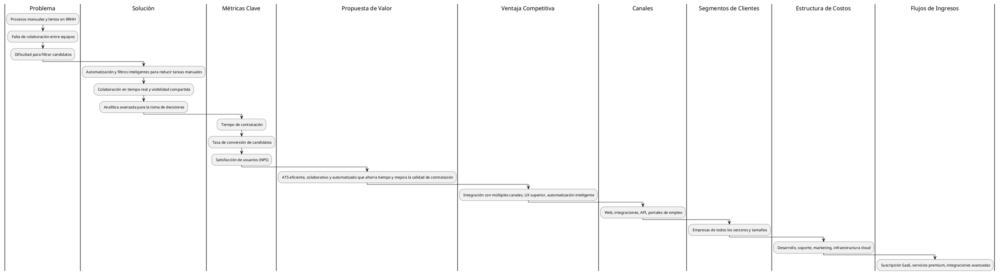
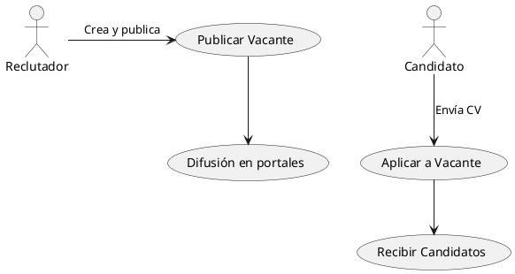
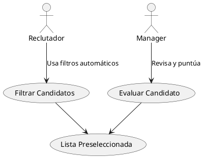
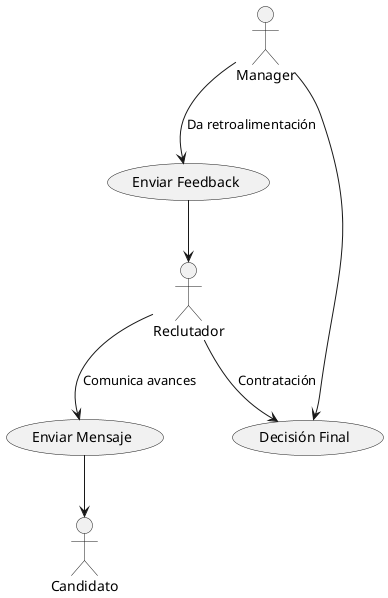
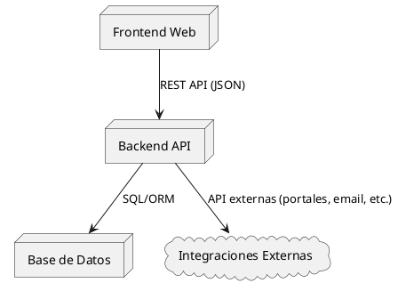
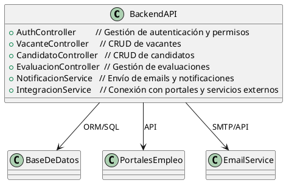

# LTI - Applicant Tracking System (ATS) Generalista

## 1. Descripción breve, valor añadido y ventajas competitivas

LTI es un sistema ATS (Applicant Tracking System) generalista, diseñado para digitalizar y optimizar el proceso de reclutamiento en empresas de cualquier sector y tamaño. Su objetivo es centralizar todas las etapas del ciclo de vida de una vacante, desde la publicación hasta la contratación, permitiendo a los equipos de RRHH y managers trabajar de forma más eficiente y colaborativa.

**Valor añadido y ventajas competitivas:**
- **Automatización avanzada:** LTI automatiza tareas repetitivas como el filtrado de CVs, envío de notificaciones y recordatorios, y programación de entrevistas, permitiendo a los equipos centrarse en tareas estratégicas.
- **Colaboración en tiempo real:** Permite que reclutadores y managers puedan comentar, evaluar y tomar decisiones de forma conjunta y transparente sobre los candidatos, todo en una misma plataforma.
- **Integración con portales y redes:** LTI se conecta con portales de empleo, LinkedIn y otros canales, centralizando la recepción de candidatos y facilitando la publicación de vacantes.
- **Analítica avanzada:** Ofrece dashboards y reportes personalizables para medir la eficiencia del proceso, identificar cuellos de botella y mejorar la toma de decisiones.
- **Experiencia de usuario superior:** Interfaz intuitiva, adaptable a distintos roles y dispositivos, con flujos guiados y personalizables.

**Funciones principales:**
- **Publicación y gestión de vacantes:** Crear, editar y publicar vacantes en múltiples portales desde un solo lugar.
- **Recepción y filtrado automático de candidatos:** Los candidatos se centralizan y se filtran automáticamente según criterios definidos (palabras clave, experiencia, etc.).
- **Gestión colaborativa de entrevistas y evaluaciones:** Permite agendar entrevistas, asignar evaluadores y registrar feedback de manera estructurada.
- **Comunicación automatizada:** Envío de emails y notificaciones automáticas a candidatos en cada etapa del proceso.
- **Panel de control y métricas:** Visualización de KPIs como tiempo de contratación, tasa de conversión, fuentes de candidatos, etc.

### Lean Canvas (PlantUML)

## 2. Casos de uso principales

A continuación se describen los tres casos de uso más relevantes del sistema, con su diagrama asociado:

### Caso de Uso 1: Publicar Vacante y Recibir Candidatos
**Descripción:** El reclutador crea y publica una vacante en el sistema, que automáticamente la distribuye en portales de empleo y redes sociales. Los candidatos pueden postularse desde cualquier canal y sus datos llegan centralizados al sistema.

### Caso de Uso 2: Evaluar y Filtrar Candidatos
**Descripción:** El reclutador utiliza filtros automáticos para preseleccionar candidatos. Los managers pueden acceder a los perfiles, evaluarlos y dejar comentarios o puntuaciones. El proceso es colaborativo y transparente.

### Caso de Uso 3: Comunicación y Decisión Colaborativa
**Descripción:** Reclutadores y managers pueden comunicarse entre sí y con los candidatos desde la plataforma, enviar mensajes, feedback y notificaciones automáticas. La decisión final de contratación se toma de forma colaborativa y queda registrada.

## 3. Modelo de datos

El modelo de datos define las entidades principales, sus atributos y relaciones:

| Entidad      | Atributos (nombre: tipo)                                  | Descripción |
|--------------|----------------------------------------------------------|-------------|
| Usuario      | id: UUID, nombre: string, email: string, rol: string      | Usuarios del sistema (reclutadores, managers, admin) |
| Vacante      | id: UUID, titulo: string, descripcion: string, estado: string, fecha_publicacion: date, usuario_id: UUID | Oferta de empleo publicada |
| Candidato    | id: UUID, nombre: string, email: string, cv_url: string, estado: string | Persona que aplica a una vacante |
| Aplicación   | id: UUID, candidato_id: UUID, vacante_id: UUID, fecha: date, estado: string | Relación entre candidato y vacante (postulación) |
| Evaluación   | id: UUID, aplicacion_id: UUID, usuario_id: UUID, puntaje: int, comentarios: string | Evaluaciones realizadas por usuarios a las aplicaciones |

**Relaciones:**
- Un **Usuario** puede crear muchas **Vacantes** (1:N).
- Un **Candidato** puede aplicar a muchas **Vacantes** y una **Vacante** puede recibir muchas **Aplicaciones** (N:M vía Aplicación).
- Una **Aplicación** puede tener muchas **Evaluaciones** (por diferentes usuarios).

## 4. Diseño de alto nivel

El sistema LTI está compuesto por los siguientes módulos principales:
- **Frontend web:** Interfaz de usuario desarrollada en React o Vue, accesible desde cualquier navegador y dispositivo.
- **Backend API:** Lógica de negocio y servicios, desarrollada en Node.js o Python, expone endpoints REST para el frontend y para integraciones.
- **Base de datos relacional:** PostgreSQL almacena toda la información estructurada (usuarios, vacantes, candidatos, evaluaciones, etc.).
- **Integraciones externas:** Conexión con portales de empleo, servicios de email, calendarios y otras APIs externas.

**Flujo general:**
1. El usuario interactúa con el frontend web.
2. El frontend consume la API del backend para todas las operaciones.
3. El backend gestiona la lógica, accede a la base de datos y a servicios externos.
4. Las integraciones permiten automatizar la publicación de vacantes y la comunicación.

## 5. Diagrama C4 (Nivel de Componente: Backend API)

A continuación se detalla la arquitectura interna del Backend API, mostrando los principales controladores y servicios:

Cada componente está desacoplado para facilitar la escalabilidad y el mantenimiento. Los servicios de integración y notificación permiten automatizar procesos clave y mejorar la experiencia tanto de usuarios internos como de candidatos.
