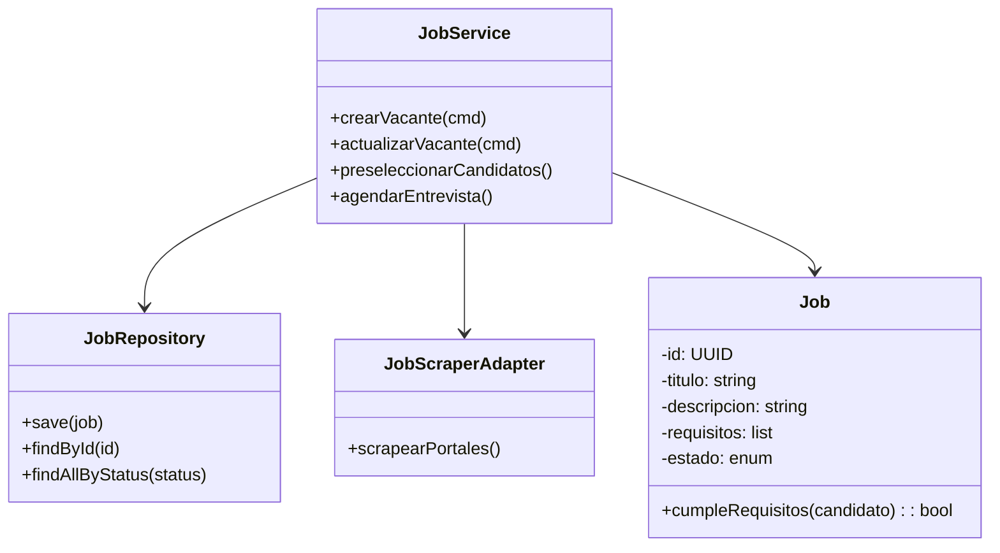

# Arquitectura C4 del Sistema LTI (ATS con IA)

## 1. Diagrama de Contexto

```mermaid
C4Context
    title Sistema LTI - Diagrama de Contexto
    Person(recruiter, "Reclutador", "Usuario principal que gestiona vacantes y candidatos")
    Person(hr_manager, "Gerente RH", "Supervisa procesos y toma decisiones")
    Person(candidate, "Candidato", "Persona que aplica a vacantes")
    System_Boundary(s1, "LTI ATS") {
      System(web, "Web App LTI", "Interfaz principal para reclutadores y gerentes")
      System(mobile, "Mobile App LTI", "Interfaz móvil para reclutadores")
      System(api, "API LTI", "API REST/GraphQL para integración y lógica de negocio")
      System(ai, "Módulo IA/ML", "Procesamiento de matching y análisis de CVs")
      System(scraper, "Web Scraping Service", "Extracción automática de candidatos")
      System(calendar, "Agenda/Calendario", "Gestión de entrevistas")
      System(analytics, "Analytics/Reportes", "Dashboards y reportes predictivos")
    }
    System_Ext(email, "Gmail/Office365", "Plataformas de correo y calendario")
    System_Ext(drive, "Google Drive", "Gestión documental")
    System_Ext(jobboards, "Portales de Empleo", "LinkedIn, Indeed, Glassdoor, etc.")
    recruiter -> web : Usa
    hr_manager -> web : Supervisa
    candidate -> web : Aplica
    web -> api : Solicitudes y respuestas
    mobile -> api : Solicitudes y respuestas
    api -> ai : Matching, análisis
    api -> scraper : Extracción de candidatos
    api -> calendar : Gestión de entrevistas
    api -> analytics : Métricas y reportes
    api -> email : Notificaciones, agenda
    api -> drive : Documentos
    scraper -> jobboards : Web scraping
    email <-> calendar : Sincronización
```

## 2. Diagrama de Contenedores

```mermaid
C4Container
    title Sistema LTI - Diagrama de Contenedores
    System_Boundary(s1, "LTI ATS") {
      Container(web, "Web App", "React/Next.js", "Interfaz de usuario para reclutadores y gerentes")
      Container(mobile, "Mobile App", "React Native", "Interfaz móvil para reclutadores")
      Container(api, "API Gateway", "Node.js/Express/GraphQL", "Punto de entrada para apps y servicios externos")
      Container(service_core, "Core Service", "Node.js", "Lógica de negocio, DDD, hexagonal")
      Container(ai, "AI/ML Service", "Python/FastAPI", "Procesamiento de matching y análisis de CVs")
      Container(scraper, "Scraping Service", "Python/Jina/Firecrawl", "Extracción de candidatos de portales")
      Container(db, "DB Principal", "PostgreSQL", "Persistencia de datos de negocio")
      Container(cache, "Cache", "Redis", "Caché de sesiones y consultas frecuentes")
      Container(search, "Buscador", "Elasticsearch", "Búsqueda avanzada de candidatos y vacantes")
      Container(storage, "Almacenamiento", "MinIO/S3", "CVs y documentos")
    }
    web -> api : REST/GraphQL
    mobile -> api : REST/GraphQL
    api -> service_core : Llamadas internas (hexagonal)
    service_core -> ai : Matching, análisis
    service_core -> scraper : Web scraping
    service_core -> db : CRUD entidades
    service_core -> cache : Lectura/escritura
    service_core -> search : Indexación y búsqueda
    service_core -> storage : Documentos
```

## 3. Diagrama de Componentes (Core Service)

```mermaid
C4Component
    title Core Service - Componentes (Hexagonal + DDD)
    Container_Boundary(api, "Core Service") {
      Component(app_service, "Application Service", "Orquesta casos de uso, lógica de negocio")
      Component(domain, "Domain Model", "Entidades, agregados, lógica de dominio (DDD)")
      Component(port_in, "Ports In", "Interfaces de entrada (REST, GraphQL, eventos)")
      Component(port_out, "Ports Out", "Interfaces de salida (repositorios, servicios externos)")
      Component(repo, "Repositorio", "Persistencia de entidades (PostgreSQL)")
      Component(adapter_scraper, "Adapter Scraper", "Adaptador a servicio de scraping")
      Component(adapter_ai, "Adapter AI", "Adaptador a servicio de IA/ML")
      Component(adapter_email, "Adapter Email", "Adaptador a Gmail/Office365")
    }
    port_in -> app_service : Invoca casos de uso
    app_service -> domain : Ejecuta lógica de dominio
    app_service -> port_out : Solicita persistencia o servicios externos
    port_out -> repo : CRUD entidades
    port_out -> adapter_scraper : Web scraping
    port_out -> adapter_ai : Matching, análisis
    port_out -> adapter_email : Notificaciones
```

## 4. Diagrama de Código (Ejemplo: Módulo de Vacantes)



---

## Enfoque Hexagonal, DDD y TDD

- **Hexagonal**: Separación clara entre lógica de negocio (núcleo) y adaptadores (entrada/salida). Los puertos definen interfaces, los adaptadores implementan la integración.
- **DDD**: El dominio (entidades, agregados, servicios de dominio) es el centro. Casos de uso orquestados por Application Services.
- **TDD**: Cada componente y caso de uso se desarrolla con pruebas automatizadas desde el inicio. Se priorizan tests de dominio y de integración de puertos/adaptadores.

---

*Este documento describe la arquitectura C4 del sistema LTI, integrando prácticas modernas de diseño y calidad de software.* 