# 🚀 LTI-AF: ATS de Próxima Generación

## 📑 Tabla de Contenidos

1. [Resumen Ejecutivo (LTI)](#resumen-ejecutivo-lti)
2. [Funciones Principales](#funciones-principales)
3. [Lean Canvas](#lean-canvas)
4. [Top 3 Casos de Uso](#top-3-casos-de-uso)
5. [Modelo de Datos (ERD)](#modelo-de-datos-erd)
6. [Diseño de Sistema a Alto Nivel](#diseño-de-sistema-a-alto-nivel)
7. [Diagrama C4](#diagrama-c4)
8. [Mapa de Bounded Contexts](#mapa-de-bounded-contexts)
9. [Contratos y Eventos](#contratos-y-eventos)
10. [Seguridad y Cumplimiento](#seguridad-y-cumplimiento)
11. [KPIs & Analytics](#kpis--analytics)
12. [Roadmap por Etapas](#roadmap-por-etapas)
13. [Checklist de Verificación](#checklist-de-verificación)

---

## 📊 Resumen Ejecutivo (LTI)

**LTI-AF** es un sistema de seguimiento de candidatos (ATS) de próxima generación diseñado con arquitectura limpia y patrones DDD. Ofrece ventajas competitivas únicas:

### 🎯 **Valor Añadido y Ventajas Competitivas**
- **🤖 IA para Ranking de CV**: Algoritmos de machine learning para evaluación automática
- **🔍 Búsqueda Semántica**: Matching inteligente entre candidatos y posiciones
- **📅 Scheduling Inteligente**: Coordinación automática de entrevistas
- **📊 Trazabilidad Completa**: Auditoría end-to-end del proceso de reclutamiento
- **🏢 Multi-tenant**: Solución escalable para múltiples empresas
- **🌐 Marketplace de Job Boards**: Integración con múltiples plataformas
- **🔌 API-First**: Arquitectura extensible y integrable

---

## ⚡ Funciones Principales

### 🎯 **Gestión de Ofertas**
- Crear y editar ofertas de trabajo
- Publicar automáticamente a múltiples job boards
- Gestión de estado del ciclo de vida de ofertas

### 📋 **Gestión de Candidatos**
- Recepción automática de aplicaciones
- Screening automatizado con IA
- Ranking y evaluación de candidatos

### 🧪 **Proceso de Selección**
- Tests online personalizables
- Programación inteligente de entrevistas
- Gestión de feedback de entrevistadores

### 💼 **Contratación**
- Generación de ofertas laborales
- Proceso de aprobación y firma digital
- Handover a sistemas HRIS

### 📊 **Analytics y Reportes**
- KPIs en tiempo real
- Dashboards personalizables
- Análisis de efectividad del proceso

---

## 🎯 Lean Canvas

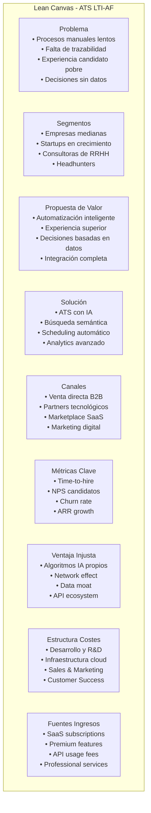

---

## 🔄 Top 3 Casos de Uso

### **CU1: Crear y Publicar una Oferta**

#### 📝 **Especificaciones**
- **Objetivo**: Permitir a un reclutador crear y publicar una oferta de trabajo
- **Actores**: Recruiter, Sistema ATS, Job Boards externos
- **Precondiciones**: Usuario autenticado con permisos de reclutador
- **Postcondiciones**: Oferta creada y publicada en canales seleccionados

#### 🔄 **Flujo Principal**
1. Recruiter accede al módulo de creación de ofertas
2. Completa información básica (título, descripción, ubicación)
3. Define criterios de selección y skills requeridos
4. Selecciona job boards para publicación
5. Sistema valida datos y crea la oferta
6. Sistema publica automáticamente en canales externos
7. Confirmación de publicación exitosa

#### ⚠️ **Variantes y Errores**
- Error de validación de datos
- Fallo en publicación externa
- Límite de ofertas activas alcanzado

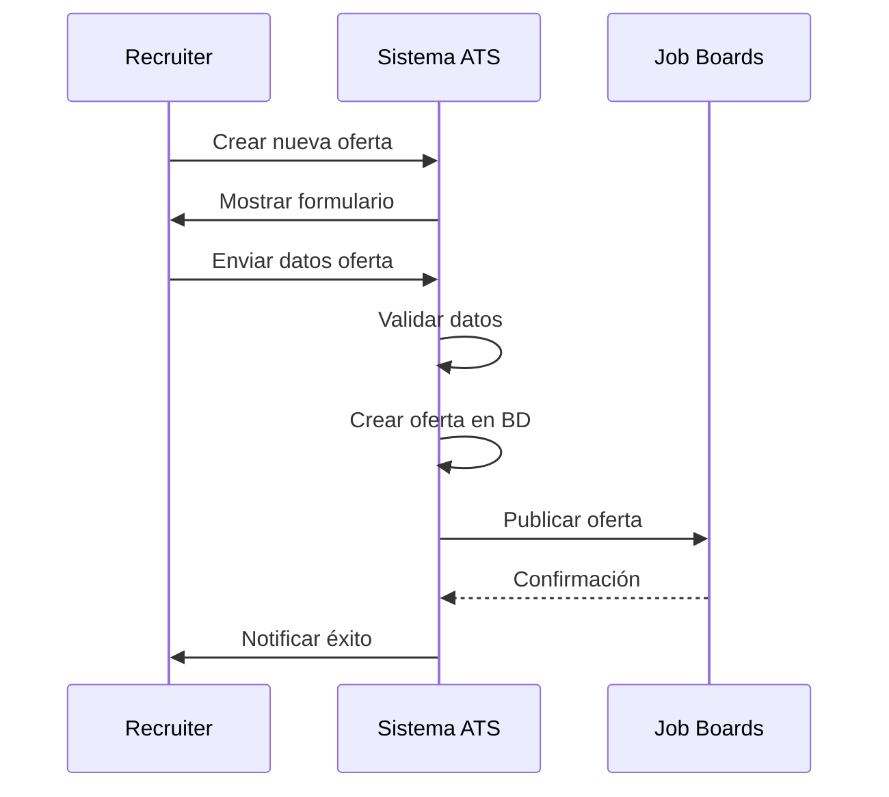

### **CU2: Recibir, Evaluar y Pre-rankear Candidatos**

#### 📝 **Especificaciones**
- **Objetivo**: Procesar automáticamente aplicaciones y generar ranking
- **Actores**: Sistema ATS, Candidatos, IA Engine
- **Precondiciones**: Oferta activa publicada
- **Postcondiciones**: Candidatos rankeados y notificados

#### 🔄 **Flujo Principal**
1. Candidato aplica desde job board o portal
2. Sistema recibe aplicación y CV
3. IA Engine procesa y extrae información
4. Sistema ejecuta screening automático
5. Genera score y ranking del candidato
6. Notifica a recruiter sobre nueva aplicación
7. Actualiza dashboard con métricas

#### ⚠️ **Variantes y Errores**
- CV en formato no soportado
- Aplicación duplicada
- Error en procesamiento de IA

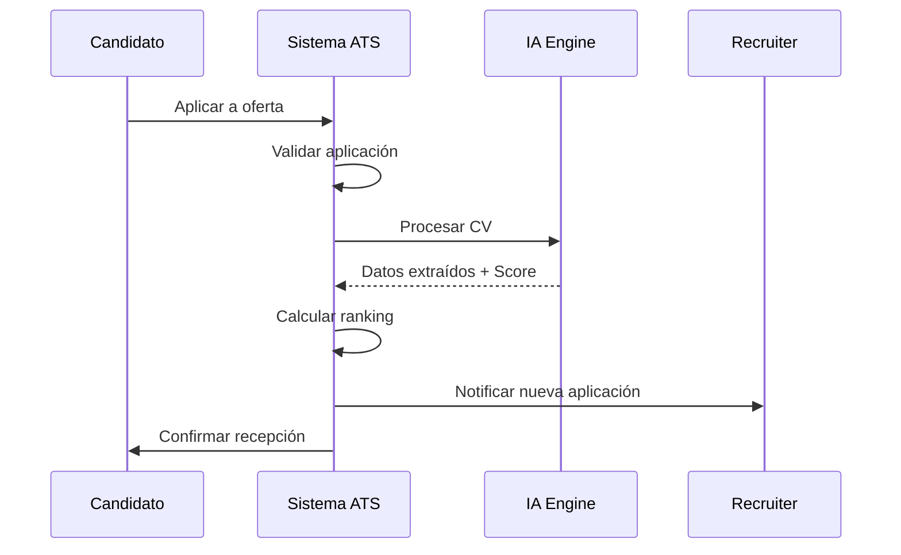

### **CU3: Programar Entrevistas y Contratar Seleccionado**

#### 📝 **Especificaciones**
- **Objetivo**: Coordinar entrevistas y gestionar proceso de contratación
- **Actores**: Hiring Manager, Candidato, Sistema ATS
- **Precondiciones**: Candidato pre-seleccionado
- **Postcondiciones**: Entrevista programada o oferta enviada

#### 🔄 **Flujo Principal**
1. Hiring Manager selecciona candidatos para entrevista
2. Sistema propone slots disponibles
3. Se envía invitación al candidato
4. Candidato confirma disponibilidad
5. Sistema agenda entrevista y envía recordatorios
6. Post-entrevista: captura feedback
7. Si aprobado: genera oferta laboral

#### ⚠️ **Variantes y Errores**
- Conflictos de agenda
- Candidato no responde
- Rechazo de oferta

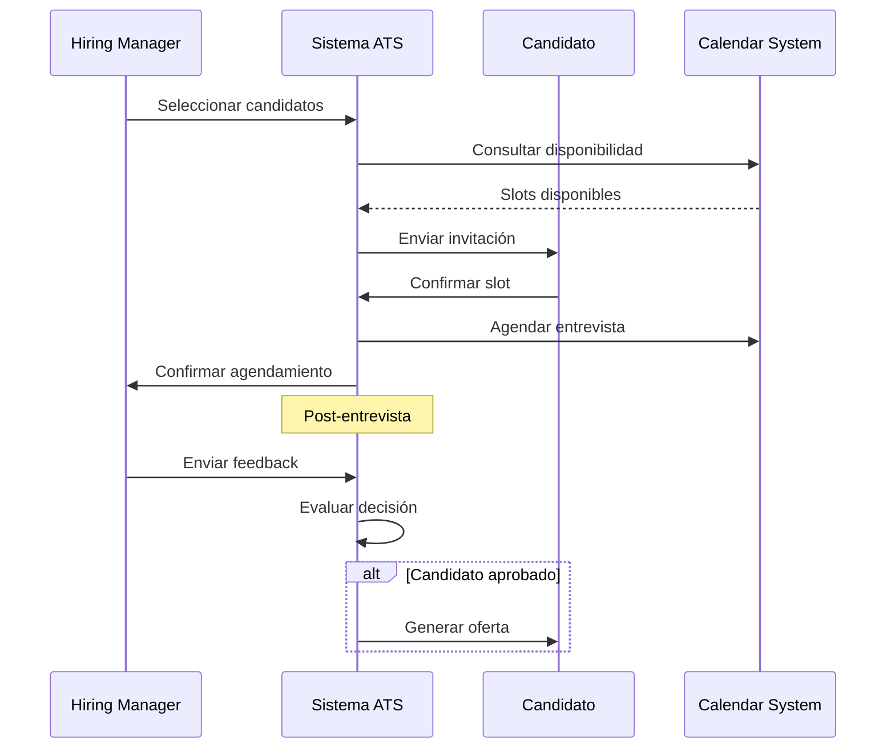

---

## 🗃️ Modelo de Datos (ERD)

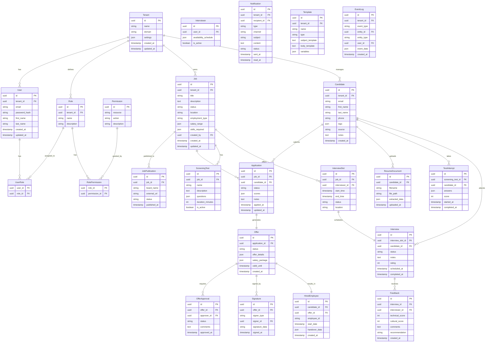

---

## 🏛️ Diseño de Sistema a Alto Nivel

### 🏗️ **Arquitectura de Contenedores**

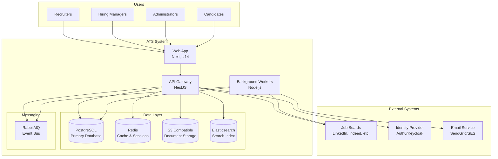

### 🎯 **Comunicación entre Capas**

#### **Capa Presentación (Next.js)**
- **Responsabilidad**: UI/UX, routing, estado del cliente
- **Comunicación**: HTTP/tRPC con API, WebSockets para real-time

#### **Capa Aplicación (NestJS API)**
- **Responsabilidad**: Lógica de aplicación, CQRS, validación
- **Comunicación**: Ports/Adapters hacia dominio e infraestructura

#### **Capa Dominio**
- **Responsabilidad**: Lógica de negocio, entidades, value objects
- **Comunicación**: Interfaces (puertos) hacia infraestructura

#### **Capa Infraestructura**
- **Responsabilidad**: Persistencia, integraciones externas, eventos
- **Comunicación**: Implementa puertos del dominio

---

## 🏗️ Diagrama C4

### **C4 Level 1: Context**

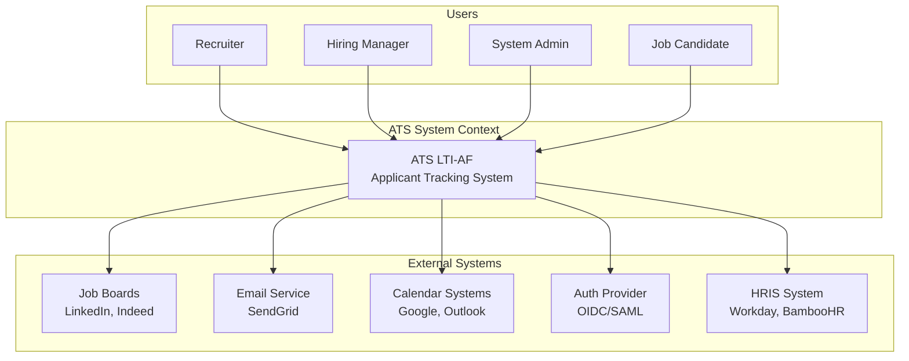

### **C4 Level 2: Container**

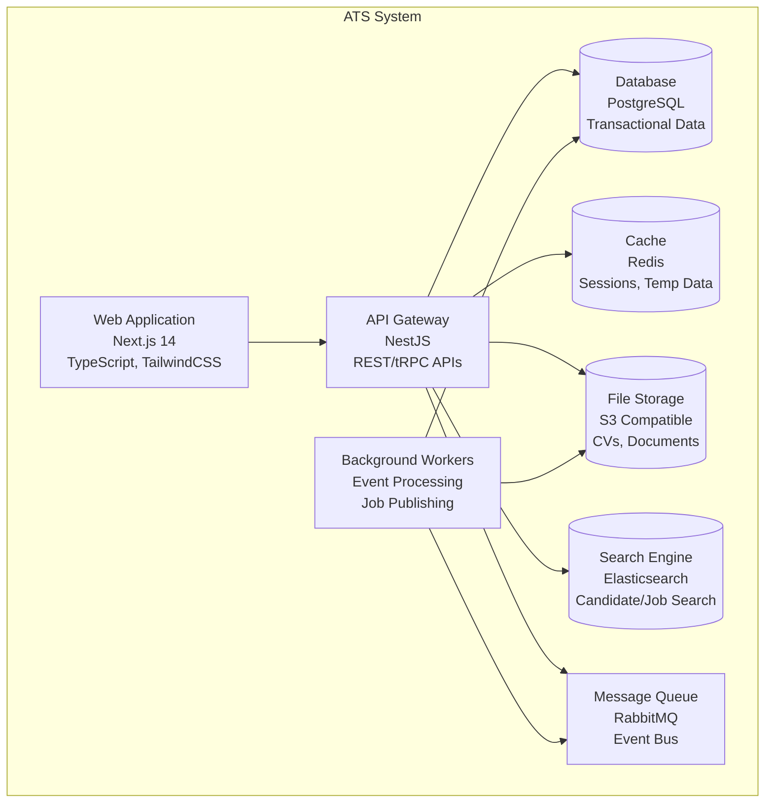

### **C4 Level 3: Component (Interviews Context)**

```mermaid
graph TB
    subgraph "Interviews Context"
        subgraph "Application Layer"
            ScheduleUC[Schedule Interview<br/>Use Case]
            FeedbackUC[Capture Feedback<br/>Use Case]
            AvailabilityUC[Check Availability<br/>Use Case]
            
            InterviewDTO[Interview DTOs]
            ValidationSvc[Validation Service]
        end
        
        subgraph "Domain Layer"
            InterviewEntity[Interview<br/>Aggregate Root]
            InterviewSlot[Interview Slot<br/>Entity]
            FeedbackVO[Feedback<br/>Value Object]
            
            InterviewDomSvc[Interview<br/>Domain Service]
            ConflictPolicy[Conflict Detection<br/>Policy]
        end
        
        subgraph "Infrastructure Layer"
            InterviewRepo[Interview<br/>Repository]
            CalendarAdapter[Calendar<br/>Adapter]
            NotificationAdapter[Notification<br/>Adapter]
            EventPublisher[Event<br/>Publisher]
        end
        
        subgraph "Ports"
            IInterviewRepo[IInterviewRepository<br/>Port]
            ICalendarSvc[ICalendarService<br/>Port]
            INotificationSvc[INotificationService<br/>Port]
        end
    end
    
    %% Use Case Dependencies
    ScheduleUC --> InterviewDomSvc
    ScheduleUC --> IInterviewRepo
    ScheduleUC --> ICalendarSvc
    
    FeedbackUC --> InterviewEntity
    FeedbackUC --> IInterviewRepo
    
    %% Domain Dependencies
    InterviewEntity --> FeedbackVO
    InterviewDomSvc --> ConflictPolicy
    
    %% Infrastructure Implementations
    InterviewRepo -.implements.-> IInterviewRepo
    CalendarAdapter -.implements.-> ICalendarSvc
    NotificationAdapter -.implements.-> INotificationSvc
    
    %% External Communications
    CalendarAdapter --> ExternalCalendar[External Calendar APIs]
    NotificationAdapter --> EmailService[Email Service]
    EventPublisher --> MessageQueue[Message Queue]
```

---

## 🗺️ Mapa de Bounded Contexts

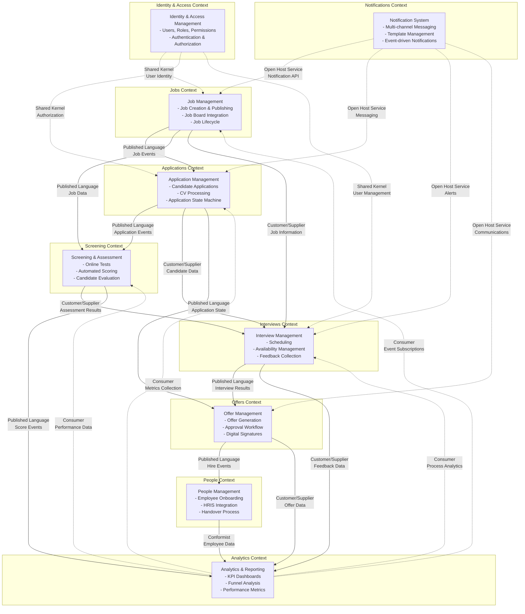

### **Relaciones entre Contextos**

#### **🔄 Shared Kernel**
- **Identity & Access ↔ Otros contextos**: Identidad de usuario compartida

#### **📢 Published Language**
- **Jobs → Applications**: Eventos de publicación de ofertas
- **Applications → Screening**: Estado de aplicaciones y candidatos
- **Interviews → Offers**: Resultados de entrevistas

#### **👥 Customer/Supplier**
- **Applications ↔ Interviews**: Datos de candidatos
- **Interviews → Analytics**: Métricas de rendimiento

#### **🌐 Open Host Service**
- **Notifications**: API abierta para todos los contextos
- **Analytics**: Servicio de métricas para reporting

#### **🔄 Conformist**
- **People → Analytics**: Adapta a formato de HRIS externo

---

## 📋 Contratos y Eventos

### **📤 Eventos de Dominio**

#### **CandidateApplied**
```typescript
interface CandidateApplied {
  eventId: string;
  eventType: 'CandidateApplied';
  aggregateId: string; // applicationId
  tenantId: string;
  timestamp: Date;
  version: number;
  data: {
    candidateId: string;
    jobId: string;
    applicationId: string;
    candidateEmail: string;
    applicationSource: 'direct' | 'job_board' | 'referral';
    resumeDocumentId?: string;
    appliedAt: Date;
  };
  metadata: {
    correlationId: string;
    causationId?: string;
    userId?: string;
  };
}
```

#### **InterviewScheduled**
```typescript
interface InterviewScheduled {
  eventId: string;
  eventType: 'InterviewScheduled';
  aggregateId: string; // interviewId
  tenantId: string;
  timestamp: Date;
  version: number;
  data: {
    interviewId: string;
    candidateId: string;
    jobId: string;
    interviewerId: string;
    scheduledDateTime: Date;
    duration: number; // minutes
    location: 'remote' | 'onsite' | 'phone';
    meetingLink?: string;
    interviewType: 'technical' | 'cultural' | 'hr' | 'final';
  };
  metadata: {
    correlationId: string;
    causationId?: string;
    scheduledBy: string;
  };
}
```

#### **OfferAccepted**
```typescript
interface OfferAccepted {
  eventId: string;
  eventType: 'OfferAccepted';
  aggregateId: string; // offerId
  tenantId: string;
  timestamp: Date;
  version: number;
  data: {
    offerId: string;
    candidateId: string;
    applicationId: string;
    acceptedAt: Date;
    startDate: Date;
    salaryPackage: {
      baseSalary: number;
      currency: string;
      benefits: string[];
      equityPackage?: {
        shares: number;
        vestingSchedule: string;
      };
    };
    signatureData: {
      candidateSignature: string;
      companySignature: string;
      signedAt: Date;
    };
  };
  metadata: {
    correlationId: string;
    causationId?: string;
    acceptedBy: string;
  };
}
```

#### **ApplicantHired**
```typescript
interface ApplicantHired {
  eventId: string;
  eventType: 'ApplicantHired';
  aggregateId: string; // hiredEmployeeId
  tenantId: string;
  timestamp: Date;
  version: number;
  data: {
    hiredEmployeeId: string;
    candidateId: string;
    offerId: string;
    employeeId: string; // Nuevo ID de empleado
    startDate: Date;
    department: string;
    position: string;
    reportingManager: string;
    onboardingPlan: {
      tasks: Array<{
        taskId: string;
        description: string;
        dueDate: Date;
        assignedTo: string;
      }>;
    };
    hrisIntegration: {
      exported: boolean;
      externalEmployeeId?: string;
      exportedAt?: Date;
    };
  };
  metadata: {
    correlationId: string;
    causationId?: string;
    processedBy: string;
  };
}
```

### **🔄 Políticas de Idempotencia**

#### **Outbox Pattern Implementation**
```typescript
interface OutboxEvent {
  id: string;
  aggregateId: string;
  eventType: string;
  eventData: object;
  tenantId: string;
  createdAt: Date;
  processedAt?: Date;
  version: number;
  retryCount: number;
  status: 'pending' | 'processed' | 'failed' | 'dead_letter';
}

// Transactional Outbox Service
class OutboxService {
  async publishEvent<T>(event: DomainEvent<T>): Promise<void> {
    // 1. Guardar evento en outbox dentro de la misma transacción
    await this.saveToOutbox(event);
    
    // 2. Background processor lee outbox y publica eventos
    // 3. Marca como procesado solo después de confirmación
  }
  
  async processOutboxEvents(): Promise<void> {
    const pendingEvents = await this.getPendingEvents();
    
    for (const event of pendingEvents) {
      try {
        await this.messageQueue.publish(event);
        await this.markAsProcessed(event.id);
      } catch (error) {
        await this.handleRetry(event);
      }
    }
  }
}
```

#### **Idempotency Keys**
```typescript
interface IdempotentRequest {
  idempotencyKey: string; // UUID generado por cliente
  requestHash: string;    // Hash del payload
  response?: any;
  status: 'processing' | 'completed' | 'failed';
  expiresAt: Date;
}

// Middleware de idempotencia
async function idempotencyMiddleware(req: Request, res: Response, next: NextFunction) {
  const key = req.headers['idempotency-key'] as string;
  
  if (key) {
    const existing = await IdempotencyStore.get(key);
    
    if (existing?.status === 'completed') {
      return res.status(200).json(existing.response);
    }
    
    if (existing?.status === 'processing') {
      return res.status(409).json({ error: 'Request already processing' });
    }
  }
  
  next();
}
```

---

## 🔒 Seguridad y Cumplimiento

### **🛡️ Protección de PII (Personally Identifiable Information)**

#### **Cifrado de Datos**
```typescript
// Configuración de cifrado para campos sensibles
interface EncryptedField {
  algorithm: 'AES-256-GCM';
  keyId: string;
  encryptedData: string;
  iv: string;
  tag: string;
}

// Campos que requieren cifrado
const PII_FIELDS = [
  'email', 'phone', 'address', 
  'social_security_number', 'passport_number'
];

class PIIEncryption {
  async encrypt(data: string, fieldType: string): Promise<EncryptedField> {
    const key = await this.getEncryptionKey(fieldType);
    const cipher = crypto.createCipher('aes-256-gcm', key);
    // ... implementación de cifrado
  }
  
  async decrypt(encryptedField: EncryptedField): Promise<string> {
    // ... implementación de descifrado
  }
}
```

#### **Enmascaramiento de Datos**
```typescript
class DataMasking {
  maskEmail(email: string): string {
    const [local, domain] = email.split('@');
    const maskedLocal = local.substring(0, 2) + '*'.repeat(local.length - 2);
    return `${maskedLocal}@${domain}`;
  }
  
  maskPhone(phone: string): string {
    return phone.replace(/\d(?=\d{4})/g, '*');
  }
}
```

### **🌍 Cumplimiento GDPR**

#### **Consentimiento y Propósito**
```typescript
interface ConsentRecord {
  candidateId: string;
  consentType: 'processing' | 'marketing' | 'profiling';
  purpose: string;
  legalBasis: 'consent' | 'legitimate_interest' | 'contract';
  givenAt: Date;
  withdrawnAt?: Date;
  ipAddress: string;
  userAgent: string;
}

class GDPRCompliance {
  async recordConsent(consent: ConsentRecord): Promise<void> {
    await this.consentRepository.save(consent);
    await this.auditLog.record('consent_given', consent);
  }
  
  async withdrawConsent(candidateId: string, consentType: string): Promise<void> {
    await this.consentRepository.withdraw(candidateId, consentType);
    await this.triggerDataDeletion(candidateId, consentType);
  }
}
```

#### **Derecho al Olvido**
```typescript
class DataDeletionService {
  async processErasureRequest(candidateId: string): Promise<void> {
    // 1. Verificar si hay obligaciones legales de retención
    const retentionCheck = await this.checkRetentionRequirements(candidateId);
    
    if (retentionCheck.canDelete) {
      // 2. Eliminar o anonimizar datos
      await this.anonymizeCandidate(candidateId);
      
      // 3. Eliminar documentos asociados
      await this.deleteDocuments(candidateId);
      
      // 4. Notificar a sistemas downstream
      await this.notifyErasure(candidateId);
    }
  }
}
```

### **🔐 Control de Acceso RBAC**

#### **Definición de Roles**
```typescript
const ROLES = {
  ADMIN: {
    name: 'System Administrator',
    permissions: ['*'] // Acceso total
  },
  RECRUITER: {
    name: 'Recruiter',
    permissions: [
      'jobs:create', 'jobs:read', 'jobs:update',
      'applications:read', 'applications:update',
      'candidates:read', 'candidates:create',
      'interviews:schedule', 'interviews:read'
    ]
  },
  HIRING_MANAGER: {
    name: 'Hiring Manager',
    permissions: [
      'jobs:read', 'applications:read',
      'interviews:conduct', 'interviews:feedback',
      'offers:approve', 'offers:read'
    ]
  },
  CANDIDATE: {
    name: 'Job Candidate',
    permissions: [
      'applications:own_read', 'applications:create',
      'interviews:own_read', 'profile:update'
    ]
  }
};
```

#### **Middleware de Autorización**
```typescript
function authorize(permission: string) {
  return (req: Request, res: Response, next: NextFunction) => {
    const user = req.user;
    const tenantId = req.params.tenantId || req.user.tenantId;
    
    if (hasPermission(user, permission, tenantId)) {
      next();
    } else {
      res.status(403).json({ error: 'Insufficient permissions' });
    }
  };
}

// Uso en rutas
app.get('/api/jobs', authorize('jobs:read'), jobController.list);
app.post('/api/jobs', authorize('jobs:create'), jobController.create);
```

### **📊 Auditoría**

#### **Event Sourcing para Auditoría**
```typescript
interface AuditEvent {
  eventId: string;
  tenantId: string;
  userId: string;
  action: string;
  resource: string;
  resourceId: string;
  changes?: {
    before: any;
    after: any;
  };
  ipAddress: string;
  userAgent: string;
  timestamp: Date;
  metadata?: Record<string, any>;
}

class AuditService {
  async logAction(event: AuditEvent): Promise<void> {
    // Guardar en sistema de auditoría inmutable
    await this.auditRepository.append(event);
    
    // Indexar para búsquedas rápidas
    await this.searchIndex.index(event);
  }
  
  async generateComplianceReport(tenantId: string, period: DateRange): Promise<ComplianceReport> {
    const events = await this.auditRepository.getByPeriod(tenantId, period);
    
    return {
      totalActions: events.length,
      userActions: this.groupByUser(events),
      sensitiveDataAccess: this.filterSensitiveAccess(events),
      dataRetentionCompliance: await this.checkRetentionCompliance(tenantId)
    };
  }
}
```

---

## 📈 KPIs & Analytics

### **📊 Métricas Clave de Rendimiento**

#### **Time-to-Hire**
```typescript
interface TimeToHireMetric {
  averageDays: number;
  medianDays: number;
  percentile90: number;
  byDepartment: Record<string, number>;
  byJobLevel: Record<string, number>;
  trend: Array<{
    period: string;
    value: number;
  }>;
}

// Cálculo de Time-to-Hire
class TimeToHireAnalytics {
  async calculateTimeToHire(filters: AnalyticsFilters): Promise<TimeToHireMetric> {
    const hiredCandidates = await this.getHiredCandidates(filters);
    
    const durations = hiredCandidates.map(candidate => {
      const appliedAt = new Date(candidate.appliedAt);
      const hiredAt = new Date(candidate.hiredAt);
      return (hiredAt.getTime() - appliedAt.getTime()) / (1000 * 60 * 60 * 24);
    });
    
    return {
      averageDays: this.calculateMean(durations),
      medianDays: this.calculateMedian(durations),
      percentile90: this.calculatePercentile(durations, 90),
      byDepartment: this.groupByDepartment(hiredCandidates, durations),
      byJobLevel: this.groupByJobLevel(hiredCandidates, durations),
      trend: await this.calculateTrend(filters)
    };
  }
}
```

#### **Offer Acceptance Rate**
```typescript
interface OfferAcceptanceMetric {
  overallRate: number;
  byJobLevel: Record<string, number>;
  byDepartment: Record<string, number>;
  bySalaryRange: Record<string, number>;
  declineReasons: Array<{
    reason: string;
    count: number;
    percentage: number;
  }>;
}
```

#### **Source Effectiveness**
```typescript
interface SourceEffectivenessMetric {
  sources: Array<{
    name: string;
    applicationsCount: number;
    hiredCount: number;
    conversionRate: number;
    averageTimeToHire: number;
    costPerHire: number;
    qualityScore: number;
  }>;
}
```

### **🎯 Funnel de Conversión**

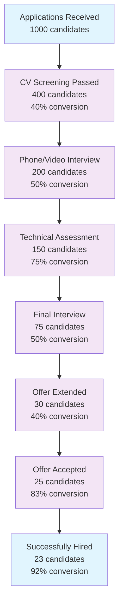

### **📊 Dashboard de Analytics**

#### **Real-time KPI Dashboard**
```typescript
interface DashboardMetrics {
  summary: {
    activeJobs: number;
    totalApplications: number;
    pendingInterviews: number;
    openOffers: number;
  };
  
  conversionFunnel: {
    stage: string;
    count: number;
    conversionRate: number;
  }[];
  
  timeToHire: {
    current: number;
    target: number;
    trend: 'up' | 'down' | 'stable';
  };
  
  sourcePerformance: SourceEffectivenessMetric;
  
  upcomingDeadlines: Array<{
    type: 'interview' | 'offer_expiry' | 'start_date';
    candidate: string;
    deadline: Date;
    urgency: 'high' | 'medium' | 'low';
  }>;
}

class AnalyticsDashboard {
  async getDashboardMetrics(tenantId: string, filters: DashboardFilters): Promise<DashboardMetrics> {
    // Agregación paralela de métricas
    const [summary, funnel, timeToHire, sources, deadlines] = await Promise.all([
      this.getSummaryMetrics(tenantId, filters),
      this.getConversionFunnel(tenantId, filters),
      this.getTimeToHireMetrics(tenantId, filters),
      this.getSourcePerformance(tenantId, filters),
      this.getUpcomingDeadlines(tenantId, filters)
    ]);
    
    return {
      summary,
      conversionFunnel: funnel,
      timeToHire,
      sourcePerformance: sources,
      upcomingDeadlines: deadlines
    };
  }
}
```

### **📈 Reportes Avanzados**

#### **Cohort Analysis**
```typescript
interface CohortAnalysis {
  cohorts: Array<{
    cohortName: string; // Mes de aplicación
    totalCandidates: number;
    hiredInMonth1: number;
    hiredInMonth2: number;
    hiredInMonth3: number;
    retentionRate: {
      month6: number;
      month12: number;
    };
  }>;
}
```

#### **Predictive Analytics**
```typescript
interface PredictiveInsights {
  candidateSuccess: {
    candidateId: string;
    probabilityOfHire: number;
    probabilityOfAcceptance: number;
    expectedTimeToDecision: number;
    riskFactors: string[];
  }[];
  
  demandForecasting: {
    department: string;
    predictedOpenings: number;
    confidenceInterval: [number, number];
    seasonalityFactors: Record<string, number>;
  }[];
}
```

---

## 🛣️ Roadmap por Etapas

### **📋 Entrega Incremental por Contexto**

#### **🎯 Fase 1: Foundation & Jobs (Mes 1-2)**

**Objetivos:**
- Establecer base arquitectónica
- Implementar gestión básica de ofertas
- Configurar infraestructura core

**Entregables:**
- [ ] Configuración de monorepo con Nx/Lerna
- [ ] Setup de Next.js 14 + NestJS
- [ ] Configuración de PostgreSQL + Prisma
- [ ] Contexto Jobs completo
- [ ] Autenticación básica
- [ ] Deploy en ambiente de desarrollo

**Definition of Done:**
- ✅ Tests unitarios > 80% coverage
- ✅ API documentada con OpenAPI
- ✅ CI/CD pipeline configurado
- ✅ Crear y publicar ofertas funcionando
- ✅ Integración con al menos 2 job boards

#### **🎯 Fase 2: Applications & Screening (Mes 3-4)**

**Objetivos:**
- Recepción y procesamiento de aplicaciones
- Sistema de screening automatizado
- IA para ranking de candidatos

**Entregables:**
- [ ] Contexto Applications completo
- [ ] Contexto Screening básico
- [ ] Motor de IA para CV processing
- [ ] Sistema de scoring automático
- [ ] Dashboard de candidatos

**Definition of Done:**
- ✅ Procesamiento automático de CVs
- ✅ Ranking de candidatos funcional
- ✅ Tests de integración completos
- ✅ Performance < 2s para processing
- ✅ Notificaciones automáticas

#### **🎯 Fase 3: Interviews & Collaboration (Mes 5-6)**

**Objetivos:**
- Sistema de agendamiento inteligente
- Gestión de entrevistas y feedback
- Colaboración entre stakeholders

**Entregables:**
- [ ] Contexto Interviews completo
- [ ] Integración con calendarios externos
- [ ] Sistema de feedback estructurado
- [ ] Notificaciones en tiempo real
- [ ] Mobile-responsive design

**Definition of Done:**
- ✅ Scheduling automático funcional
- ✅ Integración Google/Outlook calendar
- ✅ Feedback capture con validación
- ✅ Real-time updates con WebSockets
- ✅ Responsive design implementado

#### **🎯 Fase 4: Offers & Hiring (Mes 7-8)**

**Objetivos:**
- Generación y gestión de ofertas
- Workflow de aprobaciones
- Proceso de contratación digital

**Entregables:**
- [ ] Contexto Offers completo
- [ ] Workflow de aprobaciones
- [ ] Firma digital de contratos
- [ ] Integración con HRIS básica
- [ ] Contexto People foundation

**Definition of Done:**
- ✅ Generación automática de ofertas
- ✅ Approval workflow configurable
- ✅ E-signature integration
- ✅ HRIS handover funcional
- ✅ Compliance audit trail

#### **🎯 Fase 5: Analytics & Optimization (Mes 9-10)**

**Objetivos:**
- Sistema completo de analytics
- KPIs y reportes avanzados
- Optimización de rendimiento

**Entregables:**
- [ ] Contexto Analytics completo
- [ ] Dashboard ejecutivo
- [ ] Reportes automatizados
- [ ] Predictive analytics básico
- [ ] Performance optimization

**Definition of Done:**
- ✅ Real-time KPI dashboard
- ✅ Reportes programados
- ✅ Data warehouse funcional
- ✅ API response < 200ms
- ✅ 99.9% uptime alcanzado

#### **🎯 Fase 6: Advanced Features & Scale (Mes 11-12)**

**Objetivos:**
- Features avanzadas de IA
- Escalabilidad y optimización
- Marketplace de integraciones

**Entregables:**
- [ ] ML avanzado para matching
- [ ] Búsqueda semántica completa
- [ ] API marketplace
- [ ] Advanced analytics
- [ ] Multi-region deployment

**Definition of Done:**
- ✅ Semantic search funcional
- ✅ ML model accuracy > 85%
- ✅ Public API documentation
- ✅ Load testing passed
- ✅ Security audit completed

### **📊 Métricas de Progreso por Fase**

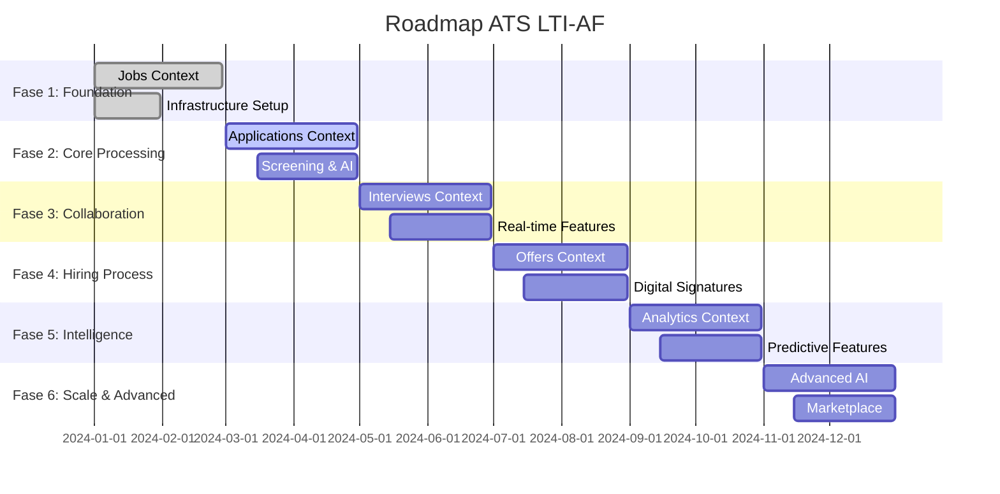

---

## ✅ Checklist de Verificación

### **📋 Estructura y Organización**
- [x] **Carpeta creada**: `lti/LTI-AF/` con archivo `LTI-AF.md`
- [x] **Tabla de contenidos**: TOC completa con enlaces internos
- [x] **Navegación**: Anclas y enlaces funcionando
- [x] **Formato**: Markdown bien estructurado con jerarquías

### **📊 Contenido Obligatorio**
- [x] **Resumen ejecutivo**: Descripción completa del ATS LTI-AF
- [x] **Funciones principales**: Lista detallada de capacidades
- [x] **Lean Canvas**: Diagrama Mermaid completo
- [x] **Top 3 Casos de Uso**: Especificaciones detalladas + diagramas
- [x] **Modelo de datos**: ERD con entidades, atributos y relaciones
- [x] **Diseño de sistema**: Arquitectura de alto nivel explicada
- [x] **Diagramas C4**: Context, Container, y Component (interviews)
- [x] **Bounded contexts**: Mapa completo con relaciones DDD
- [x] **Contratos y eventos**: Payloads JSON + políticas
- [x] **Seguridad**: PII, GDPR, RBAC, auditoría
- [x] **KPIs & Analytics**: Métricas, funnel, dashboards
- [x] **Roadmap**: Entregas incrementales con DoD

### **🎨 Diagramas Mermaid**
- [x] **1 Lean Canvas**: Representación completa del modelo de negocio
- [x] **3 Diagramas de secuencia**: Uno por cada caso de uso principal
- [x] **1 ERD**: Modelo de datos completo con relaciones
- [x] **1 C4 Context**: Visión del sistema y actores
- [x] **1 C4 Container**: Componentes de alto nivel
- [x] **1 C4 Component**: Deep dive en contexto interviews
- [x] **1 Context Map**: Mapa de bounded contexts DDD
- [x] **Diagramas adicionales**: Arquitectura, funnel, gantt

### **💻 Ejemplos de Código**
- [x] **TypeScript interfaces**: Eventos de dominio
- [x] **DTOs y contratos**: Ejemplos de payloads JSON
- [x] **Patrones implementados**: Outbox, idempotencia
- [x] **Configuraciones**: Seguridad, roles, permisos

### **🌐 Idioma y Calidad**
- [x] **Español neutro**: Todo el contenido en español
- [x] **Estructura clara**: Secciones bien organizadas
- [x] **Enlaces internos**: Navegación fluida
- [x] **Formato consistente**: Estilo unificado

### **🏗️ Arquitectura y Patrones**
- [x] **DDD implementado**: Bounded contexts definidos
- [x] **Clean Architecture**: Capas y separación de responsabilidades
- [x] **Event-Driven**: Eventos de dominio especificados
- [x] **CQRS patterns**: Separación comando/consulta
- [x] **Hexagonal**: Ports & adapters explicados

### **📈 Métricas y Validación**
- [x] **KPIs definidos**: Time-to-hire, conversion rates, etc.
- [x] **Funnel de conversión**: Etapas y métricas claras
- [x] **Analytics dashboard**: Especificación completa
- [x] **Roadmap detallado**: Fases con criterios DoD

---

## 🔧 Información del Proyecto

**Archivo:** `LTI-AF.md`  
**Ubicación:** `lti/LTI-AF/`  
**Iniciales:** AF (Alejandro Flamerich)  
**Versión:** 1.0  
**Fecha:** Noviembre 2025  

---

*Este documento representa la especificación completa del ATS LTI-AF, diseñado con arquitectura limpia, patrones DDD y tecnologías modernas para ofrecer una solución de reclutamiento de próxima generación.*